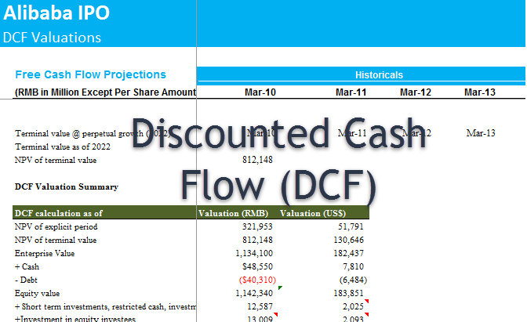

The financial landscape is shaped by various players, among which the Federal Reserve (Fed) plays an instrumental role. As the central bank of the United States, it exerts significant influence over the economy by leveraging tools such as the discount rate to guide economic policy. The Federal Reserve's discount rate is pivotal in regulating liquidity and maintaining the stability of the financial system, affecting the cost of borrowing for commercial banks and, subsequently, influencing broader economic conditions.

Understanding the dynamics of the discount rate provides critical insights into how various financial components interact within the economy. In particular, the rate plays a key role in cash-flow analysis and algorithmic trading, two essential elements of modern financial practice. Cash-flow analysis relies on accurate assessment of the present value of expected future cash flows, where the discount rate is a crucial factor. In contrast, algorithmic trading uses sophisticated models to execute trades, where interest rates, such as the discount rate, are significant inputs influencing trading strategies.



By examining the intricate connections between the Federal Reserve's discount rate, cash-flow analysis, and algorithmic trading, we can gain valuable insights into their simultaneous impact on investment strategies and market behavior. Recognizing these elements' relationships is crucial for optimizing investment decisions and adapting to the rapidly evolving financial environment. The integration of these components within the financial ecosystem highlights their influence on market dynamics and the necessity for continuous adaptation and strategic planning.

## Table of Contents

## Understanding the Federal Reserve Discount Rate

The discount rate is a fundamental instrument utilized by the Federal Reserve, primarily serving as the interest rate for short-term loans it offers to commercial banks via the discount window. This mechanism is essential in the Fed’s toolkit for managing monetary policy, aimed at controlling the money supply and maintaining liquidity within the banking system. By adjusting the discount rate, the Federal Reserve can influence borrowing costs for banks, which in turn affects the broader economy.

When the Federal Reserve alters the discount rate, it sends strong signals through the financial system, encouraging or discouraging banks from procuring loans from the Fed. An increased discount rate typically makes borrowing more expensive for banks, often leading to tightened credit conditions and a slowdown in economic activities. Conversely, a reduced discount rate lowers the cost of borrowing, potentially stimulating economic expansion by encouraging lending and investment.

The importance of the Federal Reserve's ability to manipulate the discount rate was especially evident during economic downturns, such as the financial crisis of 2007-2008. During this period, the Fed took decisive actions to lower the discount rate, among other measures, to provide liquidity to struggling financial institutions and to restore confidence in the market. The proactive adjustment of the rate was crucial in stabilizing financial markets and aiding economic recovery during such crises.

In essence, the discount rate is more than just an [interest rate](/wiki/interest-rate-trading-strategies); it is a vital lever through which the Federal Reserve exerts influence over economic conditions. By adjusting the discount rate, the Fed aims to balance the dual mandates of promoting maximum employment and maintaining price stability, illustrating its central role within the US financial ecosystem.

## The Role of Discount Rate in Cash-Flow Analysis

The discount rate is a fundamental component of discounted cash-flow (DCF) analysis, playing a critical role in determining the present value of future cash flows. DCF analysis is an essential technique that aids both investors and businesses in evaluating the financial viability of projects or investments by incorporating the time value of money concept. The basic premise is that a dollar today is worth more than a dollar in the future due to potential [earning](/wiki/earning-announcement) capacity.

Mathematically, DCF analysis involves the following formula for calculating the present value (PV) of future cash flows:

$$

PV = \sum_{t=1}^{n} \frac{CF_t}{(1 + r)^t}
$$

where $CF_t$ represents the cash flow at time $t$, $r$ is the discount rate, and $n$ is the total number of periods. The selection of an appropriate discount rate is crucial, as it directly influences the present value and thus the perceived profitability of the investment.

A key consideration in selecting the discount rate for DCF models is the risk-free rate, typically represented by government bond yields, due to their perceived low risk. For more precise analysis, the weighted average cost of capital (WACC) can be utilized to account for the cost of equity and debt, providing a holistic view of the investment's financing aspects.

Using an inappropriate discount rate can lead to misleading results: overestimating project values if the rate is too low, or missing lucrative opportunities if too high. Therefore, accurately assessing and applying the discount rate allows businesses and investors to make informed decisions, balancing risk and potential rewards effectively. In essence, mastery of discount rate selection is pivotal for navigating financial opportunities and avoiding potential pitfalls.

## Algorithmic Trading and Discount Rate Influences

Algorithmic trading employs complex mathematical models and computational algorithms to automate trading decisions and execution in financial markets. These algorithms analyze vast datasets, rapidly assessing market conditions and executing trades at speeds unattainable by human traders.

A critical element influencing [algorithmic trading](/wiki/algorithmic-trading) is the Federal Reserve's discount rate. This interest rate directly affects the cost of borrowing for banks and, consequently, influences broader economic and market dynamics. Algorithmic traders integrate data on the discount rate into their models, as changes can lead to significant market behavior adjustments. For instance, a decrease in the discount rate generally signals an increase in market [liquidity](/wiki/liquidity-risk-premium), encouraging borrowing and, thus, potentially driving up asset prices. Conversely, an increase in the rate might signal tightening liquidity, which may depress asset prices.

Given the direct impact of the discount rate on interest rates and liquidity conditions, algorithmic strategies must adapt swiftly to these changes to maintain optimal portfolio performance. The dependency on such macroeconomic indicators means that algorithm developers continuously refine their models to incorporate and respond to monetary policy shifts. For example, should the Fed announce a rate change, algorithms might recalibrate their parameters in real-time to adjust the portfolios' risk and return profiles.

The relationship between algorithmic trading and discount rates highlights the necessity of agility and data-driven decision-making. In modern financial markets, where rapid execution and precision are paramount, leveraging insights from economic indicators like the Fed's discount rate enables sophisticated trading strategies that can capitalize on emerging trends. To illustrate, an algorithm might use a rule-based system to evaluate interest rate data and forecast potential price moves. The following Python pseudocode provides a simplified demonstration of how such an algorithmic strategy might operate:

```python
import numpy as np

def algo_trading_strategy(latest_discount_rate, market_data):
    # Example parameters
    liquidity_threshold = 0.05  # Hypothetical threshold for liquidity changes

    # Signal generation based on discount rate changes
    if latest_discount_rate < market_data['previous_rate']:
        signal = 'buy'
        impact_factor = 1 + liquidity_threshold
    elif latest_discount_rate > market_data['previous_rate']:
        signal = 'sell'
        impact_factor = 1 - liquidity_threshold
    else:
        signal = 'hold'
        impact_factor = 1

    # Calculate predicted market impact
    market_impact = market_data['current_price'] * impact_factor

    # Execute trading decision
    execute_trade(signal, market_impact)

def execute_trade(signal, target_price):
    if signal == 'buy':
        print(f"Buying assets to target price: {target_price}")
    elif signal == 'sell':
        print(f"Selling assets to target price: {target_price}")
    else:
        print("Holding position")

# Example usage with dummy market data
market_data = {
    'previous_rate': 0.02,
    'current_price': 100
}
latest_discount_rate = 0.015  # New Fed discount rate

algo_trading_strategy(latest_discount_rate, market_data)
```

This pseudocode demonstrates the integration of macroeconomic data into algorithmic trading strategies, highlighting the sophistication and adaptability required to navigate today's complex financial ecosystems.

## Conclusion

The Federal Reserve's discount rate plays a critical role as a dynamic element in the financial system, influencing both cash-flow analysis and trading strategies. Its impact is evident across multiple financial activities, emphasizing the necessity for businesses and investors to fully grasp its implications. A keen understanding of the discount rate allows for enhanced decision-making processes, enabling both optimization of investment strategies and adaptive responses to economic fluctuations.

The rise of algorithmic trading highlights the increasing sophistication in financial markets. Traders employ advanced models to anticipate market movements, often considering the discount rate as a key variable. This integration of economic indicators ensures that trading strategies are not only reactive but also predictive, allowing for swift adaptation to market shifts prompted by changes in the Federal Reserve's policies.

In a rapidly changing economic landscape, staying informed about these dynamics is crucial for stakeholders. As financial environments continue to evolve, the interplay between these elements will undoubtedly shape future investment decisions. This awareness ensures that businesses and investors remain agile and well-prepared to navigate the complexities of modern finance.

## References & Further Reading

[1]: Friedman, M. (1990). ["Monetary Policy for the 1980s."](https://fraser.stlouisfed.org/files/docs/historical/frbchi/workingpapers/frbchi_workingpaper_1990-11.pdf) Journal of Economic Literature, 28(1), 333-381.

[2]: Bernanke, B. S., & Mihov, I. (1998). ["Measuring Monetary Policy."](https://www.jstor.org/stable/2586876) The Quarterly Journal of Economics, 113(3), 869-902.

[3]: ["Algorithmic Trading: Winning Strategies and Their Rationale"](https://www.amazon.com/Algorithmic-Trading-Winning-Strategies-Rationale-ebook/dp/B00CY5HC0U) by Ernest P. Chan

[4]: ["Principles of Quantitative Equity Investing: A Complete Guide to Creating, Evaluating, and Implementing Trading Strategies"](https://ptgmedia.pearsoncmg.com/images/9780134192796/samplepages/9780134192796.pdf) by Sugata Ray

[5]: Taylor, J. B. (1993). ["Discretion versus Policy Rules in Practice."](https://web.stanford.edu/~johntayl/Onlinepaperscombinedbyyear/1993/Discretion_versus_Policy_Rules_in_Practice.pdf) Carnegie-Rochester Conference Series on Public Policy, 39, 195-214.