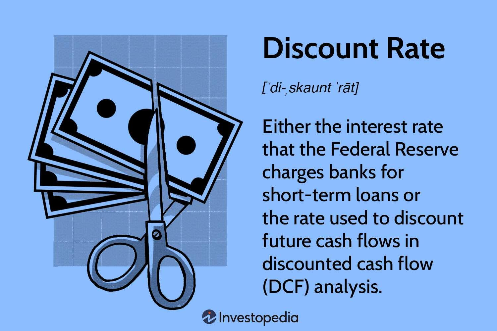

## Table of Contents

## What is the discount rate?

The discount rate is the interest rate that a central bank charges commercial banks for loans. It's an important tool used by central banks to control the money supply and influence economic activity. When the discount rate is high, it becomes more expensive for banks to borrow money, which can slow down economic growth. On the other hand, a lower discount rate makes borrowing cheaper, encouraging banks to lend more and stimulate the economy.

Central banks adjust the discount rate based on their economic goals. For example, if inflation is too high, a central bank might raise the discount rate to cool down the economy. Conversely, during a recession, the central bank might lower the discount rate to encourage borrowing and spending, helping to boost economic activity. The discount rate is just one of many tools central banks use to manage the economy, but it plays a crucial role in monetary policy.

## How does the Federal Reserve use the discount rate?

The Federal Reserve uses the discount rate to help control the economy. It's like a price tag on the money that banks borrow from the Fed. When the Fed wants to slow down the economy, it raises the discount rate. This makes it more expensive for banks to borrow money, so they lend less to people and businesses. This can help stop prices from going up too fast, which is called inflation.

On the other hand, if the economy is not doing well, the Fed might lower the discount rate. This makes it cheaper for banks to borrow money, so they can lend more to people and businesses. This can help the economy grow by encouraging spending and investment. The Federal Reserve carefully watches the economy and changes the discount rate to keep things balanced.

## What is the difference between the discount rate and the federal funds rate?

The discount rate and the federal funds rate are both important tools used by the Federal Reserve, but they serve different purposes. The discount rate is the [interest rate](/wiki/interest-rate-trading-strategies) that the Federal Reserve charges banks when they borrow money directly from the Fed. It's like a price tag on the money that banks need to borrow when they're short on cash. The Federal Reserve uses the discount rate to help manage the economy. If the Fed wants to slow down the economy, it might raise the discount rate to make borrowing more expensive. If it wants to help the economy grow, it might lower the discount rate to make borrowing cheaper.

The federal funds rate, on the other hand, is the interest rate that banks charge each other when they lend money to each other overnight. This rate is important because it influences how much it costs for banks to get the money they need to meet their daily needs. The Federal Reserve sets a target for the federal funds rate and uses tools like open market operations to keep the rate close to that target. While the discount rate is set directly by the Fed, the federal funds rate is influenced by the Fed but determined by the market. Both rates play a role in the Fed's efforts to manage the economy, but they work in slightly different ways.

## How does a change in the discount rate affect the economy?

When the Federal Reserve changes the discount rate, it can have a big impact on the economy. If the Fed raises the discount rate, it means banks have to pay more to borrow money from the Fed. This makes borrowing more expensive for everyone, so banks might lend less money to people and businesses. When people and businesses can't borrow as easily, they might spend less, which can slow down the economy. This is often done to help control inflation, which is when prices go up too fast.

On the other hand, if the Fed lowers the discount rate, it makes borrowing cheaper for banks. This can encourage banks to lend more money to people and businesses. When borrowing is easier and cheaper, people and businesses might spend more, which can help the economy grow. The Federal Reserve might lower the discount rate during times when the economy is not doing well, like during a recession, to help boost economic activity. By changing the discount rate, the Fed tries to keep the economy balanced and healthy.

## What are the primary credit, secondary credit, and seasonal credit programs offered by the Federal Reserve?

The Federal Reserve has three main types of credit programs to help banks when they need money: primary credit, secondary credit, and seasonal credit. Primary credit is for banks that are in good financial health. They can borrow money from the Fed at the discount rate, which is usually lower than other rates. This helps banks manage their daily needs and supports the overall economy.

Secondary credit is for banks that are not in such good financial shape. The interest rate for secondary credit is higher than the discount rate, which makes it more expensive for these banks to borrow. It's a way for the Fed to help these banks but also to encourage them to improve their financial health. Seasonal credit is for smaller banks that see changes in their need for money throughout the year, like banks in areas with big tourist seasons. They can borrow at a rate close to the federal funds rate to help them through these times. All these programs help keep the banking system stable and support economic growth.

## How do banks use the discount window?

Banks use the discount window when they need to borrow money from the Federal Reserve. It's like a safety net for banks. If a bank runs out of money at the end of the day, it can go to the discount window and borrow what it needs. The bank pays back the loan with interest, and the interest rate is called the discount rate. Banks usually use the discount window for short-term loans, like overnight, to make sure they have enough money to meet their daily needs.

There are different types of loans at the discount window. Primary credit is for banks that are doing well financially. They can borrow at the discount rate, which is usually lower than other rates. Secondary credit is for banks that are not doing so well. They have to pay a higher rate, which encourages them to get their finances in better shape. Seasonal credit is for smaller banks that need extra money during certain times of the year, like during tourist seasons. By using the discount window, banks can keep their operations running smoothly and help keep the economy stable.

## What is the impact of the discount rate on bank lending?

When the Federal Reserve changes the discount rate, it can affect how much banks lend to people and businesses. If the Fed raises the discount rate, it makes borrowing money from the Fed more expensive for banks. This means banks might decide to lend less money because they have to pay more to get the money they need. When banks lend less, people and businesses might not be able to borrow as much, which can slow down spending and economic growth. The Fed might raise the discount rate when it wants to cool down the economy and stop prices from going up too fast, which is called inflation.

On the other hand, if the Fed lowers the discount rate, it makes borrowing money from the Fed cheaper for banks. This can encourage banks to lend more money because it costs them less to get the money they need. When banks lend more, people and businesses can borrow more easily, which can help them spend more and boost the economy. The Fed might lower the discount rate during times when the economy is not doing well, like during a recession, to help get things moving again. By changing the discount rate, the Fed tries to keep the economy balanced and healthy.

## How can businesses use the discount rate in cash-flow analysis?

Businesses can use the discount rate in cash-flow analysis to figure out how much money they will have in the future. The discount rate helps them understand the value of money over time. For example, if a business expects to receive $100 in a year, they need to know how much that $100 is worth today. By using the discount rate, they can calculate the present value of future cash flows. This helps them make better decisions about investments, like whether to buy new equipment or start a new project.

When businesses use the discount rate in their cash-flow analysis, they can see if their investments will make them money in the long run. If the discount rate is high, it means future money is worth less today, so businesses might be more careful about spending money now. If the discount rate is low, future money is worth more today, which might encourage them to invest more. By understanding how the discount rate affects their cash flows, businesses can plan better and make smarter financial choices.

## What are the implications of the discount rate for investment decisions?

The discount rate plays a big role in how businesses make investment decisions. It's like a tool that helps them figure out if spending money now will be worth it in the future. When businesses look at possible investments, like buying new machines or starting a new project, they use the discount rate to see how much the money they expect to make later is worth today. If the discount rate is high, it means future money is worth less now, so businesses might be more cautious about spending money on new investments. They might decide to wait or choose smaller projects that don't need as much money upfront.

On the other hand, if the discount rate is low, future money is worth more today. This can encourage businesses to go ahead with their investment plans because the money they expect to make later will be worth more now. For example, a low discount rate might make a business more likely to invest in a new factory or expand their operations. By understanding how the discount rate affects the value of future cash flows, businesses can make smarter choices about where to put their money, helping them grow and succeed over time.

## How does the discount rate influence the valuation of future cash flows?

The discount rate is like a magic tool that helps businesses figure out how much money they will have in the future is worth today. When a business expects to get money later, like from selling products or finishing a project, they use the discount rate to see how much that future money is worth right now. If the discount rate is high, it means that money you get in the future is worth less today. So, if a business thinks they will get $100 in a year, but the discount rate is high, that $100 might only be worth $90 or less today. This makes businesses think carefully about spending money now because the future money won't be as valuable.

On the other hand, if the discount rate is low, it means that money you get in the future is worth more today. Using the same example, if a business expects to get $100 in a year and the discount rate is low, that $100 might be worth almost as much as $100 today. This can make businesses feel more confident about spending money now on new projects or investments because the money they expect to make later will be worth a lot today. By understanding how the discount rate affects the value of future cash flows, businesses can make better decisions about where to put their money to grow and succeed.

## What historical trends can be observed in the Federal Reserve's use of the discount rate?

Over the years, the Federal Reserve has changed the discount rate many times to help manage the economy. When the economy was growing too fast and prices were going up too much, the Fed would often raise the discount rate. This made it more expensive for banks to borrow money, which slowed down how much they lent to people and businesses. For example, in the late 1970s and early 1980s, the Fed raised the discount rate to fight high inflation. During this time, the discount rate went up to over 14%, which was very high compared to other times.

On the other hand, when the economy was not doing well, like during recessions, the Fed would lower the discount rate to help things get better. By making it cheaper for banks to borrow money, the Fed encouraged them to lend more, which helped people and businesses spend more and boosted the economy. A good example of this was during the Great Recession in 2008, when the Fed lowered the discount rate to almost zero to help the economy recover. These changes show how the Fed uses the discount rate as a tool to keep the economy balanced and healthy.

## How do international monetary policies affect the Federal Reserve's decisions on the discount rate?

International monetary policies can have a big impact on what the Federal Reserve does with the discount rate. When other countries change their interest rates, it can affect the value of the U.S. dollar compared to other currencies. If a big country like Japan or the European Union raises their interest rates, their currency might get stronger, which could make the U.S. dollar weaker. To keep the dollar strong and stable, the Fed might decide to change the discount rate. For example, if other countries are raising their rates, the Fed might do the same to keep the U.S. economy competitive and prevent money from flowing out of the country.

Also, when the global economy is doing well or not doing well, it can influence the Fed's decisions. If there's a big economic crisis happening in another part of the world, the Fed might lower the discount rate to help protect the U.S. economy from the fallout. On the other hand, if other countries are growing too fast and causing inflation to rise globally, the Fed might raise the discount rate to keep U.S. prices from going up too much. By watching what's happening around the world, the Federal Reserve tries to make smart choices about the discount rate to keep the U.S. economy strong and stable.

## What is the role of the discount rate in cash-flow analysis?

The discount rate is a fundamental component of discounted cash-flow (DCF) analysis, playing a critical role in determining the present value of future cash flows. DCF analysis is an essential technique that aids both investors and businesses in evaluating the financial viability of projects or investments by incorporating the time value of money concept. The basic premise is that a dollar today is worth more than a dollar in the future due to potential [earning](/wiki/earning-announcement) capacity.

Mathematically, DCF analysis involves the following formula for calculating the present value (PV) of future cash flows:

$$

PV = \sum_{t=1}^{n} \frac{CF_t}{(1 + r)^t}
$$

where $CF_t$ represents the cash flow at time $t$, $r$ is the discount rate, and $n$ is the total number of periods. The selection of an appropriate discount rate is crucial, as it directly influences the present value and thus the perceived profitability of the investment.

A key consideration in selecting the discount rate for DCF models is the risk-free rate, typically represented by government bond yields, due to their perceived low risk. For more precise analysis, the weighted average cost of capital (WACC) can be utilized to account for the cost of equity and debt, providing a holistic view of the investment's financing aspects.

Using an inappropriate discount rate can lead to misleading results: overestimating project values if the rate is too low, or missing lucrative opportunities if too high. Therefore, accurately assessing and applying the discount rate allows businesses and investors to make informed decisions, balancing risk and potential rewards effectively. In essence, mastery of discount rate selection is pivotal for navigating financial opportunities and avoiding potential pitfalls.

## References & Further Reading

[1]: Friedman, M. (1990). ["Monetary Policy for the 1980s."](https://fraser.stlouisfed.org/files/docs/historical/frbchi/workingpapers/frbchi_workingpaper_1990-11.pdf) Journal of Economic Literature, 28(1), 333-381.

[2]: Bernanke, B. S., & Mihov, I. (1998). ["Measuring Monetary Policy."](https://www.jstor.org/stable/2586876) The Quarterly Journal of Economics, 113(3), 869-902.

[3]: ["Algorithmic Trading: Winning Strategies and Their Rationale"](https://www.amazon.com/Algorithmic-Trading-Winning-Strategies-Rationale-ebook/dp/B00CY5HC0U) by Ernest P. Chan

[4]: ["Principles of Quantitative Equity Investing: A Complete Guide to Creating, Evaluating, and Implementing Trading Strategies"](https://ptgmedia.pearsoncmg.com/images/9780134192796/samplepages/9780134192796.pdf) by Sugata Ray

[5]: Taylor, J. B. (1993). ["Discretion versus Policy Rules in Practice."](https://web.stanford.edu/~johntayl/Onlinepaperscombinedbyyear/1993/Discretion_versus_Policy_Rules_in_Practice.pdf) Carnegie-Rochester Conference Series on Public Policy, 39, 195-214.