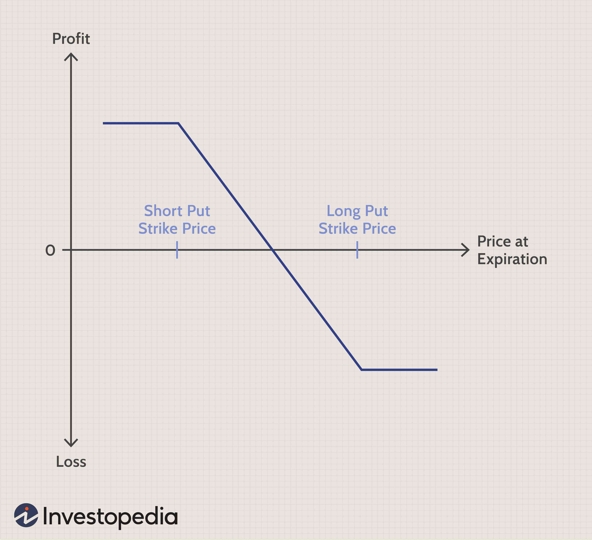

## Table of Contents

## What is a discount spread?

A discount spread is a type of financial strategy used in trading. It involves buying and selling different securities at the same time to take advantage of price differences. Traders use this method to make a profit from the difference in prices between two similar securities. For example, if one bond is selling for less than another similar bond, a trader might buy the cheaper bond and sell the more expensive one, hoping to make money from the price difference.

This strategy can be risky because the prices of the securities can change quickly. If the price of the cheaper security goes down even more, or if the price of the more expensive security goes up, the trader could lose money. However, if done correctly, a discount spread can be a good way to make money in the financial markets. It requires careful watching of the market and a good understanding of how different securities are priced.

## How does a discount spread work?

A discount spread works by taking advantage of the price difference between two similar securities. Imagine you see two similar toys in a store. One toy costs $10 and the other costs $12. If you buy the $10 toy and sell it for $12, you make a $2 profit. In the same way, a trader can buy a security that is cheaper and sell a similar security that is more expensive, hoping to make money from the price difference.

This strategy can be tricky because prices can change fast. If the price of the cheaper security drops even more after you buy it, or if the price of the more expensive security goes up after you sell it, you could lose money. To make a discount spread work, traders need to watch the market closely and understand how prices of different securities move. If they do it right, they can make a profit, but it's not always easy.

## What are the key components of a discount spread?

A discount spread involves two main parts: buying a security that is cheaper and selling a similar security that is more expensive. The goal is to make money from the difference in their prices. For example, if you see one bond selling for $95 and another similar bond selling for $100, you might buy the $95 bond and sell the $100 bond. If everything goes well, you could make a $5 profit from the price difference.

However, this strategy can be risky because the prices of securities can change quickly. If the price of the cheaper security drops even more after you buy it, or if the price of the more expensive security goes up after you sell it, you could end up losing money. To make a discount spread work, you need to watch the market closely and understand how prices move. It's like trying to catch a moving target, and it takes skill and attention to do it successfully.

## Can you explain the difference between a discount spread and a yield spread?

A discount spread and a yield spread are two different ways to make money in the financial markets. A discount spread involves buying a security that is cheaper and selling a similar security that is more expensive. The goal is to make money from the difference in their prices. For example, if you buy a bond for $95 and sell a similar bond for $100, you could make a $5 profit. This strategy can be risky because prices can change quickly, and you need to watch the market closely to do it successfully.

On the other hand, a yield spread is about the difference in interest rates or yields between two securities. It's not about buying and selling at different prices, but about the income you can get from holding the securities. For example, if one bond pays 3% interest and another similar bond pays 5% interest, the yield spread is 2%. Investors use yield spreads to compare how much money they can make from different investments. Both strategies can help you make money, but they work in different ways and require different kinds of attention to the market.

## What are the common uses of discount spreads in financial markets?

Discount spreads are often used by traders in financial markets to make money from the difference in prices between two similar securities. For example, a trader might buy a bond that is selling for less and sell a similar bond that is selling for more. If the price difference is big enough, the trader can make a profit. This strategy is popular in markets where there are many similar securities, like the bond market or the stock market.

However, using discount spreads can be risky. The prices of securities can change quickly, and if the cheaper security drops in price even more after you buy it, or if the more expensive security goes up in price after you sell it, you could lose money. Traders need to watch the market closely and understand how prices move to use discount spreads successfully. It's like trying to catch a moving target, and it takes skill and attention to do it right.

## How do discount spreads affect bond pricing?

Discount spreads can affect bond pricing by creating more demand for cheaper bonds and more supply for more expensive bonds. When traders use discount spreads, they buy the cheaper bonds and sell the more expensive ones. This buying and selling can push the price of the cheaper bonds up and the price of the more expensive bonds down. As a result, the prices of bonds can move closer together, making the market more efficient.

However, this can also make the bond market more volatile. If many traders are using discount spreads, the prices of bonds can change quickly. If the cheaper bond drops in price even more after traders buy it, or if the more expensive bond goes up in price after they sell it, the traders could lose money. This can lead to more ups and downs in bond prices, making it harder for investors to predict what will happen next.

## What factors influence the size of a discount spread?

The size of a discount spread is influenced by how different the prices of the two securities are. If one security is a lot cheaper than another similar one, the discount spread will be bigger. This can happen because of things like how much people want to buy the security, how much of it is available, and what people think will happen to its price in the future. For example, if a lot of people want to buy a certain bond and there aren't many of them to buy, its price might go up, making the discount spread bigger if there's a similar bond that's cheaper.

Another thing that can affect the size of a discount spread is how risky the securities are. If one security is seen as riskier than another, it might have a lower price, which can make the discount spread bigger. Also, things like interest rates and the overall health of the economy can play a role. If interest rates go up, the prices of bonds might go down, which can change the size of the discount spread. Traders need to keep an eye on all these factors to figure out if a discount spread is a good opportunity or not.

## How can investors use discount spreads to assess investment opportunities?

Investors can use discount spreads to find good deals in the market. By looking at the difference in prices between two similar securities, investors can see if one is cheaper than it should be. For example, if two bonds are almost the same but one is selling for less, an investor might decide to buy the cheaper bond. This way, they can make money if the price of the cheaper bond goes up or if they can sell it for more than they paid for it. It's like shopping for a bargain, but with securities instead of clothes or toys.

However, using discount spreads to find investment opportunities can be tricky. Investors need to understand why one security is cheaper than another. It might be because it's riskier or because fewer people want to buy it. They also need to watch the market closely because prices can change quickly. If the price of the cheaper security drops even more after they buy it, they could lose money. So, while discount spreads can help investors find good deals, it takes skill and attention to use them successfully.

## What are the risks associated with trading discount spreads?

Trading discount spreads can be risky because the prices of securities can change quickly. If you buy a security that you think is a good deal, but its price goes down even more after you buy it, you could lose money. The same thing can happen if you sell a security that you think is too expensive, but its price goes up after you sell it. This means you need to watch the market closely and be ready to act fast if prices start to move against you.

Another risk is that the securities might not be as similar as you think. If the cheaper security is riskier or less popular, it might stay cheap for a reason. This can make it hard to sell it for a profit later. Also, using discount spreads can make the market more volatile, which means prices can go up and down a lot. This can make it harder to predict what will happen next, and it can lead to bigger losses if you're not careful.

## How do changes in interest rates impact discount spreads?

Changes in interest rates can have a big effect on discount spreads. When interest rates go up, the prices of bonds usually go down. This is because new bonds will be issued with higher interest rates, making older bonds with lower rates less attractive. If you're using a discount spread and the price of the cheaper bond you bought goes down because of higher interest rates, your profit could shrink or you could even lose money. On the other hand, if interest rates go down, the prices of bonds usually go up, which could make your discount spread more profitable if you bought the cheaper bond at the right time.

It's not just about the prices of bonds, though. Changes in interest rates can also affect how much people want to buy or sell bonds. If interest rates are expected to go up, people might sell their bonds now to avoid losing money later, which can make the discount spread bigger if the cheaper bond becomes even cheaper. But if interest rates are expected to go down, people might hold onto their bonds or buy more, hoping to sell them for a higher price later, which can make the discount spread smaller. So, keeping an eye on interest rates is important when you're trading discount spreads.

## Can you discuss a real-world example where discount spreads played a crucial role?

In 2008, during the financial crisis, discount spreads became very important in the bond market. Many banks and financial institutions were selling their bonds at big discounts because they needed cash quickly. This created big differences in the prices of similar bonds. Smart traders saw these discount spreads as a chance to make money. They bought the cheaper bonds and sold the more expensive ones, hoping to make a profit from the price difference. This helped some traders make a lot of money, but it also made the bond market very unpredictable and risky.

One real example was with mortgage-backed securities (MBS). These are bonds that are backed by home loans. During the crisis, some MBS were selling for much less than others, even though they were very similar. Traders who understood the market well used these discount spreads to their advantage. They bought the cheaper MBS and sold the more expensive ones, trying to make money from the price difference. However, it was a risky move because the prices of these securities were changing a lot, and it was hard to know what would happen next.

## What advanced strategies can be employed to optimize returns using discount spreads?

To optimize returns using discount spreads, traders can use a strategy called pairs trading. This involves finding two securities that usually move together in price, but one is currently cheaper than the other. The trader buys the cheaper security and sells the more expensive one, betting that the prices will come back together. For example, if two similar stocks have a big price difference, the trader might buy the cheaper stock and sell the more expensive one. If the prices do come back together, the trader can make a profit from the difference.

Another advanced strategy is to use leverage. This means borrowing money to buy more of the cheaper security than you could with your own money. If the price of the cheaper security goes up, your profit could be bigger because you bought more of it. But this is also riskier because if the price goes down, your losses could be bigger too. Traders need to be careful and watch the market closely when using leverage. Both pairs trading and using leverage can help traders make more money from discount spreads, but they need to understand the risks and be ready to act quickly if things don't go as planned.

## What is Understanding Discount Spreads?

Discount spreads occur when the forward points deducted from the spot rate produce a negative forward spread. This phenomenon typically appears in currency markets, often influenced by interest rate differentials between two currencies. The concept of a discount spread becomes apparent when the bid price exceeds the offer price, signifying an anticipated decline in the price.

In currency markets, [interest rate](/wiki/interest-rate-trading-strategies) differentials play a crucial role in the emergence of discount spreads. For example, let's consider two currencies: Currency A and Currency B. If the interest rate for Currency A is higher than that for Currency B, the forward rate for Currency A against Currency B might be at a discount compared to the spot rate. This situation arises because investors seek to capitalize on higher interest rates, leading to selling pressures in the forward market for Currency A.

Understanding the mechanics of discount spreads requires an analysis of the carrying costs associated with holding positions over time. Carrying costs include interest differential effects as well as other costs such as storage fees, insurance, and any opportunity costs of capital. For instance, consider the formula for the forward rate in the foreign exchange market:

$$
F = S \times \left(1 + i_d\right) / \left(1 + i_f\right)
$$

where $F$ is the forward rate, $S$ is the spot rate, $i_d$ is the domestic interest rate, and $i_f$ is the foreign interest rate. When the domestic interest rate $i_d$ is higher than the foreign interest rate $i_f$, the forward rate $F$ may be lower than the spot rate $S$, resulting in a discount spread.

Monitoring these carrying costs over time is essential for traders, as changes can directly impact the profitability of trades involving discount spreads. Successful trading in scenarios involving discount spreads requires not only an understanding of interest rate dynamics but also a keen awareness of timing and market conditions.

Overall, grasping the intricacies of discount spreads allows traders to navigate the complexities of interest rate movements and optimize their trading strategies effectively. Through a comprehensive understanding of factors generating discount spreads, traders can mitigate risks and leverage market opportunities.

## References & Further Reading

[1]: Bergstra, J., Bardenet, R., Bengio, Y., & Kégl, B. (2011). ["Algorithms for Hyper-Parameter Optimization."](https://dl.acm.org/doi/10.5555/2986459.2986743) Advances in Neural Information Processing Systems 24.

[2]: ["Advances in Financial Machine Learning"](https://www.amazon.com/Advances-Financial-Machine-Learning-Marcos/dp/1119482089) by Marcos Lopez de Prado

[3]: ["Evidence-Based Technical Analysis: Applying the Scientific Method and Statistical Inference to Trading Signals"](https://www.amazon.com/Evidence-Based-Technical-Analysis-Scientific-Statistical/dp/0470008741) by David Aronson

[4]: ["Machine Learning for Algorithmic Trading"](https://github.com/stefan-jansen/machine-learning-for-trading) by Stefan Jansen

[5]: ["Quantitative Trading: How to Build Your Own Algorithmic Trading Business"](https://www.amazon.com/Quantitative-Trading-Build-Algorithmic-Business/dp/1119800064) by Ernest P. Chan