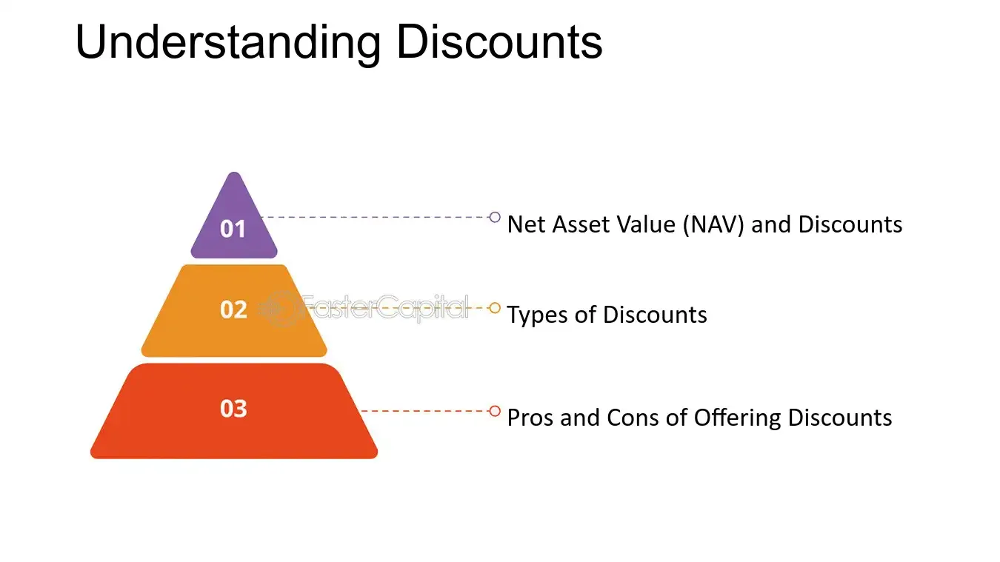

## Table of Contents

## What is the Net Asset Value (NAV) of a company?

The Net Asset Value (NAV) of a company is the total value of its assets minus its liabilities. It's like figuring out how much the company would be worth if it sold everything it owns and paid off all its debts. This number is important because it gives investors an idea of the company's true value, separate from how the stock market values its shares.

NAV is often used to value investment funds, like mutual funds or ETFs, where it represents the per-share value of the fund's assets minus its liabilities. For these funds, NAV is calculated daily by dividing the total value of the fund's assets by the number of shares outstanding. This helps investors understand what each share is actually worth, which can be useful when deciding whether to buy or sell.

## How is the Discount to Net Asset Value calculated?

The Discount to Net Asset Value is a way to see if a company's stock price is lower than what its assets are worth. You find it by taking the stock's market price and subtracting the Net Asset Value (NAV) per share. Then, you divide that difference by the NAV per share. If the result is a negative number, it means the stock is trading at a discount to its NAV.

For example, if a company's NAV per share is $10 and its stock is trading at $8, the discount to NAV would be calculated like this: ($8 - $10) / $10 = -0.2 or -20%. This means the stock is trading at a 20% discount to its NAV. Investors might see this as a good buying opportunity, thinking the stock is undervalued compared to the company's actual assets.

## Why might a company's stock trade at a discount to its NAV?

A company's stock might trade at a discount to its Net Asset Value (NAV) for several reasons. One big reason is that investors might not think the company is doing a good job with its assets. They might worry that the company's management isn't making smart choices or that the company's future doesn't look bright. When people are worried, they might not want to pay as much for the stock, which can make the stock price go down and trade below the NAV.

Another reason could be that the market thinks the value of the company's assets is less than what's on the [books](/wiki/algo-trading-books). Sometimes, the value of things like buildings, equipment, or inventory can go down over time, but the company's financial statements might not show that yet. If investors think the assets are worth less than the company says, they won't want to pay as much for the stock. This can also lead to the stock trading at a discount to its NAV.

## Can you provide an example of a company trading at a discount to its NAV?

Imagine a company called "GreenBuild Inc." that makes eco-friendly building materials. They own a lot of land and factories, which are worth a lot of money. But lately, people have been worried about GreenBuild Inc. because they've been losing money and their sales have been going down. Even though their land and factories are still valuable, investors are not sure if GreenBuild Inc. can turn things around. Because of this worry, the stock price of GreenBuild Inc. has dropped to $15 per share, while their Net Asset Value (NAV) per share is $20. This means GreenBuild Inc. is trading at a 25% discount to its NAV.

Investors might see this as a chance to buy the stock at a lower price. They think that if GreenBuild Inc. can fix its problems and start making money again, the stock price could go up. But if the company keeps struggling, the stock might stay low or even drop more. So, it's a bit of a gamble, but some investors might be willing to take that risk if they believe in the long-term value of GreenBuild Inc.'s assets.

## What are the implications of a high discount to NAV for investors?

When a company's stock trades at a high discount to its Net Asset Value (NAV), it means the market price of the stock is much lower than the value of the company's assets. For investors, this could be a sign that the stock is undervalued. They might see it as a good chance to buy the stock at a lower price, hoping that if the company improves its performance or if the market recognizes the true value of its assets, the stock price will go up. This could lead to a good return on their investment if things turn around.

However, a high discount to NAV can also be a warning sign. It might mean that investors are worried about the company's future. They might think the company is not using its assets well or that it's facing big problems that could make its situation worse. If the company can't fix these issues, the stock price might stay low or even drop more, which could lead to losses for investors. So, while a high discount to NAV can be an opportunity, it also comes with risks that investors need to think about carefully.

## How does the discount to NAV affect the valuation of a company?

When a company's stock trades at a discount to its Net Asset Value (NAV), it means the market price of the stock is less than what the company's assets are worth. This can make the company look cheaper than it really is. Investors might see this as a good chance to buy the stock at a lower price. They think that if the company can use its assets better or if people start to see the real value of those assets, the stock price could go up. This could mean a good return for the investors if things get better.

But a big discount to NAV can also be a warning sign. It might mean that investors are worried about the company's future. They might think the company is not doing a good job with its assets or that it's facing big problems. If the company can't fix these issues, the stock price might stay low or even drop more. So, while a high discount to NAV can be an opportunity, it also comes with risks that investors need to think about carefully.

## What factors contribute to changes in the discount to NAV over time?

Changes in the discount to NAV can happen because of many different things. One big reason is how well the company is doing. If the company starts making more money or using its assets better, people might start to think the stock is worth more. This could make the stock price go up and the discount to NAV get smaller. On the other hand, if the company is doing worse or people think its assets are worth less, the stock price might go down and the discount to NAV could get bigger.

Another thing that can change the discount to NAV is what's happening in the market and the world. If the whole economy is doing well, people might be more willing to pay more for stocks, which could make the discount to NAV smaller. But if there's a lot of worry or uncertainty, like during a recession or a big event, people might want to pay less for stocks. This could make the discount to NAV bigger. Also, changes in interest rates or new laws can affect how much people are willing to pay for a company's stock, which can change the discount to NAV too.

## How can investors use the discount to NAV as part of their investment strategy?

Investors can use the discount to NAV to find stocks that might be a good deal. If a company's stock is trading at a big discount to its NAV, it means the stock price is lower than what the company's assets are worth. This could be a chance for investors to buy the stock at a lower price, hoping that if the company does better or if people start to see the real value of its assets, the stock price will go up. They might think this could lead to a good return on their investment.

But investors need to be careful too. A big discount to NAV can also mean that people are worried about the company's future. They might think the company is not doing a good job with its assets or that it's facing big problems. If the company can't fix these issues, the stock price might stay low or even drop more. So, while a high discount to NAV can be a good opportunity, it also comes with risks. Investors need to look at the whole picture and think about whether the company can turn things around before they decide to buy the stock.

## What are the potential risks of investing in companies with a high discount to NAV?

When a company's stock has a high discount to its Net Asset Value (NAV), it might look like a good deal. The stock price is lower than what the company's assets are worth, so investors might think they can buy it cheap and make money later if things get better. But there are risks too. The big discount might mean that other investors are worried about the company. They might think the company is not using its assets well or that it's facing big problems that could make things worse. If the company can't fix these issues, the stock price might stay low or even drop more, which could mean losses for investors.

Another risk is that the market might be right about the company's problems. If the company's assets are not as valuable as the books say, or if the company keeps losing money, the stock price might not go up even if the discount to NAV is high. Investors need to do their homework and understand why the stock is trading at a discount. If they don't, they might end up buying a stock that keeps going down instead of up. So, while a high discount to NAV can be a chance to make money, it's also a risky move that needs careful thinking.

## How do different industries typically exhibit varying discounts to NAV?

Different industries can show different discounts to NAV because of how they work and what people think about them. For example, in industries like real estate or natural resources, the value of the company's assets, like land or minerals, is really important. If people think these assets are worth a lot, the stock might not be at a big discount to NAV. But if there's worry about falling prices or if it's hard to sell these assets, the stock might trade at a bigger discount.

In tech or biotech industries, the discount to NAV can be different because these companies often have a lot of their value in things you can't see, like new ideas or research. If investors believe in the company's future and its ability to turn those ideas into money, the stock might not have a big discount to NAV. But if there's doubt about the company's new products or if it's losing money, the stock could trade at a bigger discount. So, understanding what's normal for each industry can help investors make better choices.

## What role does market sentiment play in the discount to NAV?

Market sentiment is really important when it comes to the discount to NAV. It's all about how people feel about a company and its future. If investors are feeling good and think the company will do well, they might be willing to pay more for the stock. This can make the discount to NAV smaller because the stock price gets closer to what the company's assets are worth. On the other hand, if people are worried or unsure about the company, they might not want to pay as much for the stock. This can make the discount to NAV bigger because the stock price stays lower than the value of the company's assets.

But market sentiment can change fast. Things like news, economic reports, or even rumors can make people feel different about a company. If there's good news, like a new product or better earnings, people might get more excited and the discount to NAV could get smaller. But if there's bad news, like a lawsuit or falling sales, people might get scared and the discount to NAV could get bigger. So, understanding how people feel about a company can help investors guess what might happen to the discount to NAV.

## How can advanced financial models be used to predict changes in the discount to NAV?

Advanced financial models can help investors guess what might happen to the discount to NAV by looking at a lot of different things at once. These models use math and data to see how things like the company's earnings, the value of its assets, and what's happening in the market could change the discount to NAV. For example, if the model sees that the company's earnings are going up and the economy is doing well, it might predict that the discount to NAV will get smaller because people will be willing to pay more for the stock. On the other hand, if the model sees that the company is losing money or the market is worried, it might predict a bigger discount to NAV because people will want to pay less for the stock.

These models can also look at how different parts of the company affect each other. For instance, if a company has a lot of debt, the model can see how paying off that debt might change the value of the company's assets and the discount to NAV. By using a lot of data and running different scenarios, these models can give investors a better idea of what might happen in the future. But it's important to remember that these are just guesses, and real life can be different. So, while these models can be really helpful, investors should also use their own thinking and look at other information before making choices.

## References & Further Reading

[1]: Bergstra, J., Bardenet, R., Bengio, Y., & Kégl, B. (2011). ["Algorithms for Hyper-Parameter Optimization."](https://papers.nips.cc/paper/4443-algorithms-for-hyper-parameter-optimization) Advances in Neural Information Processing Systems 24.

[2]: ["Advances in Financial Machine Learning"](https://www.amazon.com/Advances-Financial-Machine-Learning-Marcos/dp/1119482089) by Marcos Lopez de Prado

[3]: ["Evidence-Based Technical Analysis: Applying the Scientific Method and Statistical Inference to Trading Signals"](https://www.amazon.com/Evidence-Based-Technical-Analysis-Scientific-Statistical/dp/0470008741) by David Aronson

[4]: ["Machine Learning for Algorithmic Trading"](https://github.com/stefan-jansen/machine-learning-for-trading) by Stefan Jansen

[5]: ["Quantitative Trading: How to Build Your Own Algorithmic Trading Business"](https://www.amazon.com/Quantitative-Trading-Build-Algorithmic-Business/dp/1119800064) by Ernest P. Chan