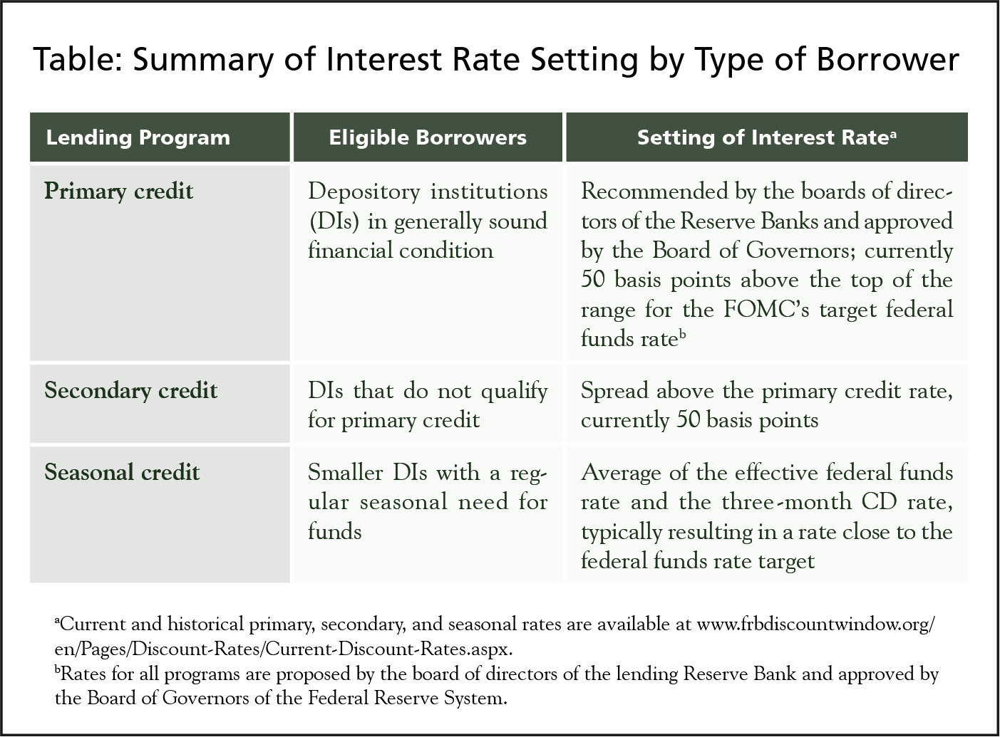

## Table of Contents

## What is the discount window in banking?

The discount window is a tool used by central banks, like the Federal Reserve in the United States, to help banks manage their short-term liquidity needs. When a bank needs money quickly, it can borrow from the central bank through the discount window. This borrowing helps banks meet their immediate cash requirements, ensuring they can continue to operate smoothly and meet their customers' needs.

The interest rate charged on these loans is called the discount rate. By adjusting this rate, the central bank can influence the overall money supply in the economy. A lower discount rate encourages banks to borrow more, increasing the money supply, while a higher rate does the opposite. This tool is important for maintaining stability in the financial system, as it provides a safety net for banks facing temporary cash shortages.

## Who can use the discount window?

The discount window is mainly for banks and other financial institutions that are part of the central bank's system. In the U.S., this means banks that are members of the Federal Reserve can use it. These banks can borrow money when they need it quickly to meet their short-term needs.

Using the discount window is not just for emergencies. Banks might use it for regular business too. But it's important because it helps keep the financial system stable. If a bank is in trouble, it can borrow money to stay afloat and keep serving its customers.

## Why do banks use the discount window?

Banks use the discount window to borrow money when they need it quickly. This can happen if they don't have enough cash on hand to meet their daily needs, like when customers want to withdraw money or when they need to make payments. The discount window is like a safety net that helps banks manage these short-term cash shortages.

Sometimes banks use the discount window not just in emergencies, but as part of their regular business. It's a way for them to get funds when they need them without having to sell assets quickly, which might not be good for them. By using the discount window, banks can keep running smoothly and make sure they can always meet their customers' needs.

## How does the discount window work?

The discount window is like a special loan service that the central bank, like the Federal Reserve, offers to banks. When a bank needs money quickly, it can go to the discount window and borrow from the central bank. The bank has to pay back the money with interest, and the [interest rate](/wiki/interest-rate-trading-strategies) they pay is called the discount rate. This rate can change, and when it's lower, it's easier for banks to borrow money.

Banks might use the discount window if they run out of cash for a short time. Maybe a lot of their customers want to take out money all at once, or they need to make payments but don't have enough funds right now. The discount window helps them get the money they need without having to sell things quickly, which could be bad for them. It's a way to keep the bank running smoothly and make sure they can always help their customers.

## What are the different types of credit available at the discount window?

The discount window offers different types of credit to help banks in different situations. The first type is called primary credit. This is for banks that are in good financial health. They can borrow money from the discount window easily, but they have to pay it back quickly, usually within a few days. The interest rate for primary credit is usually a bit higher than other rates, which makes banks think twice before using it too much.

The second type of credit is secondary credit. This is for banks that are not doing so well financially. They can still borrow money, but the interest rate is higher than for primary credit. Secondary credit is meant to help these banks stay afloat until they can fix their problems. It's not as easy to get as primary credit, and the central bank watches these banks more closely.

There's also a third type called seasonal credit. This is for smaller banks that see big changes in how much money they need at different times of the year. For example, a bank in a farming area might need more money during planting or harvest time. Seasonal credit helps these banks manage their money better during busy times. The interest rate for seasonal credit is usually lower than for primary or secondary credit.

## How is the interest rate determined at the discount window?

The interest rate at the discount window, called the discount rate, is set by the central bank, like the Federal Reserve in the U.S. The central bank looks at many things when deciding the rate. They think about how the economy is doing, what other interest rates are like, and what they want to happen with the money supply. If the economy needs more money to grow, the central bank might lower the discount rate to make it easier for banks to borrow. If they want to slow down the economy, they might raise the rate to make borrowing more expensive.

The discount rate is different for each type of credit at the discount window. Primary credit, which is for healthy banks, usually has a rate that's a bit higher than the federal funds rate, which is the rate banks charge each other for short-term loans. Secondary credit, for banks that are not doing so well, has a higher rate than primary credit. This makes it more expensive for struggling banks to borrow, encouraging them to fix their problems quickly. Seasonal credit, for smaller banks with changing needs, has a lower rate to help them manage their money during busy times.

## What are the eligibility criteria for banks to access the discount window?

Banks need to meet certain rules to use the discount window. They have to be part of the central bank's system. In the U.S., this means they must be members of the Federal Reserve. Banks also need to have enough good assets to use as collateral when they borrow money. This means they have to show the central bank that they own things that are worth enough to cover the loan if they can't pay it back.

The type of credit a bank can get also depends on how well it's doing financially. For primary credit, banks need to be in good shape. They should be able to pay back the loan quickly. Secondary credit is for banks that are not doing so well. They can still borrow, but it's harder and more expensive. Seasonal credit is for smaller banks that have different needs at different times of the year. They need to show that their business changes with the seasons and that they need extra help during busy times.

## How does the use of the discount window affect the overall economy?

When banks use the discount window, it can help keep the economy stable. If a bank is running low on cash, it can borrow from the central bank to keep paying its bills and serving its customers. This stops the bank from having to sell things quickly, which could hurt it. By giving banks this safety net, the discount window helps make sure they can keep doing business, which is good for everyone who uses the bank.

The discount rate, which is the interest rate banks pay to borrow from the discount window, also affects the economy. If the central bank lowers the discount rate, it becomes easier and cheaper for banks to borrow money. This can lead to more money flowing into the economy, which can help it grow. On the other hand, if the central bank raises the discount rate, borrowing becomes more expensive. This can slow down the economy by making banks more careful about lending money. So, the discount window is a powerful tool that the central bank uses to help control how fast the economy is growing.

## What are the potential risks for banks using the discount window?

When banks use the discount window, they face a few risks. One big risk is that other people might think the bank is in trouble. If people see a bank borrowing from the discount window a lot, they might worry that the bank is not doing well. This can make customers want to take their money out of the bank, which can cause even bigger problems.

Another risk is the cost of borrowing. Even though the discount window can help banks in a pinch, the interest rate they have to pay can be high, especially for secondary credit. If a bank borrows a lot and can't pay it back quickly, the costs can add up. This can hurt the bank's profits and make it harder for them to stay healthy in the long run.

## How has the usage of the discount window evolved over time?

The way banks use the discount window has changed a lot over the years. In the past, banks didn't like to use it much because people thought it meant a bank was in trouble. If a bank borrowed from the discount window, others might think it was not doing well, and customers might want to take their money out. This made banks careful about using it, and they only did it when they really had to. But the central bank, like the Federal Reserve, started to change how people saw the discount window. They made it clear that it's okay for banks to use it as part of their normal business, not just in emergencies.

Over time, the discount window has become more important for keeping the economy stable. During big financial problems, like the 2008 financial crisis, the discount window was used a lot more. Banks borrowed a lot of money to stay afloat when things got tough. The central bank also made it easier for banks to use the discount window during these times, to help stop bigger problems from happening. Now, the discount window is seen as a useful tool that helps banks manage their money and keep the economy running smoothly.

## What are the differences in discount window policies between major central banks?

Different central banks around the world have their own ways of using the discount window. In the United States, the Federal Reserve has three types of credit at the discount window: primary credit for healthy banks, secondary credit for banks that are struggling, and seasonal credit for smaller banks with changing needs. The Federal Reserve sets the discount rate, which can change to help control how much money is in the economy. Banks can borrow from the discount window if they are members of the Federal Reserve and have enough good assets to use as collateral.

In Europe, the European Central Bank (ECB) also has a similar tool, but they call it the marginal lending facility. Banks can borrow from the ECB overnight at the marginal lending rate, which is usually higher than other rates to discourage banks from using it too much. The ECB also has a deposit facility where banks can park extra money and earn interest. This is different from the Federal Reserve's approach, which focuses more on different types of credit. Each central bank adjusts its policies to fit the needs of its economy, but they all use these tools to help keep banks and the economy stable.

## How do banks manage their liquidity using the discount window alongside other tools?

Banks use the discount window to manage their [liquidity](/wiki/liquidity-risk-premium), which means making sure they have enough cash to handle their day-to-day needs. When a bank is short on cash, it can borrow money from the central bank through the discount window. This helps the bank keep paying its bills and serving its customers without having to sell assets quickly, which might not be good for them. The discount window is like a safety net that banks can use when they need money fast, but it's not the only tool they have.

Alongside the discount window, banks also use other tools to manage their liquidity. One important tool is the interbank market, where banks can borrow money from each other. The interest rate in this market, called the federal funds rate in the U.S., can be lower than the discount rate, so banks might prefer to borrow from each other when they can. Banks also keep reserves, which are like savings accounts they have with the central bank. They can use these reserves to meet their needs or lend them out to other banks. By using a mix of the discount window, the interbank market, and reserves, banks can make sure they always have enough cash to keep running smoothly.

## References & Further Reading

[1]: ["The Federal Reserve Discount Window"](https://www.frbdiscountwindow.org/) - Federal Reserve Board

[2]: Mehrling, P. (2010). "The New Lombard Street: How the Fed Became the Dealer of Last Resort." Princeton University Press.

[3]: Hull, J.C. (2018). "Options, Futures, and Other Derivatives." Pearson.

[4]: Aldridge, I. (2013). ["High-Frequency Trading: A Practical Guide to Algorithmic Strategies and Trading Systems."](https://books.google.com/books/about/High_Frequency_Trading.html?id=8QpIsVUMhmEC) Wiley.

[5]: Vayanos, D., & Woroch, G. (2012). "Market Liquidity—Theory and Empirical Evidence." National Bureau of Economic Research Working Paper No. 18251.

[6]: Treleaven, P., Galas, M., & Lalchand, V. (2013). "Algorithmic Trading Review." Communications of the ACM, 56(11), 76-85.

[7]: ["Algorithmic Trading and Direct Market Access (DMA): An Overview"](https://corporatefinanceinstitute.com/resources/career-map/sell-side/capital-markets/direct-market-access-dma/) - CFA Institute Research Foundation.