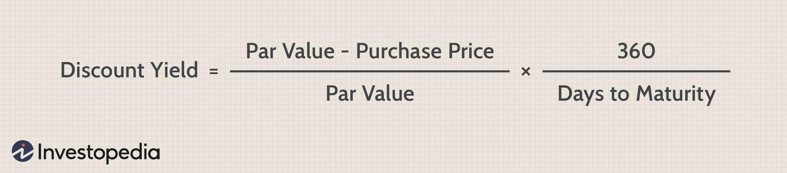

## Table of Contents

## What is discount yield?

Discount yield is a way to measure the return on investment for certain types of securities, like Treasury bills, that are sold at a discount from their face value. When you buy these securities, you pay less than what you will get back when they mature. The difference between the purchase price and the face value is your profit. The discount yield tells you how much you earn on your investment, expressed as an annual percentage rate.

To calculate the discount yield, you take the difference between the face value and the purchase price, divide it by the face value, and then multiply by 360 divided by the number of days until the security matures. This formula helps investors compare the returns of different securities easily. It's important because it gives a clear picture of the investment's profitability, helping investors make informed decisions.

## How is discount yield different from other yield measures?

Discount yield is different from other yield measures because it focuses on the discount at which a security is bought, rather than the interest it earns over time. For example, when you buy a Treasury bill, you pay less than its face value. The profit you make is the difference between what you paid and the face value you get back at maturity. This profit is what the discount yield measures, expressed as an annual percentage rate. Other yield measures, like the coupon yield, look at the interest payments a bond makes over time, not just the difference between purchase and face value.

Another key difference is how discount yield is calculated and used. Discount yield uses a 360-day year in its formula, which can make it different from other yields that might use a 365-day year. This means that when comparing discount yield to other yield measures, like yield to maturity or current yield, the numbers might not line up exactly due to this difference in calculation. Additionally, discount yield is mainly used for short-term securities like Treasury bills, while other yields can apply to a wider range of investments, including long-term bonds. Understanding these differences helps investors choose the right measure for their investment needs.

## What are the basic components needed to calculate discount yield?

To calculate discount yield, you need three basic pieces of information: the face value of the security, the purchase price, and the number of days until the security matures. The face value is the amount you will get back when the security matures. The purchase price is what you pay to buy the security, which is less than the face value. The number of days until maturity tells you how long you have to wait before you get the face value back.

With these pieces of information, you can figure out the discount yield. First, you find the difference between the face value and the purchase price. Then, you divide that difference by the face value. After that, you multiply the result by 360 divided by the number of days until maturity. This gives you the discount yield as an annual percentage rate. It's a simple way to see how much you earn from buying a security at a discount.

## Can you explain the formula used to calculate discount yield?

The formula to calculate discount yield is easy to understand. It helps you figure out how much money you make from buying a security, like a Treasury bill, at a discount. You start by finding the difference between the face value of the security (the amount you get back when it matures) and the price you paid for it. Then, you divide that difference by the face value. This gives you the basic rate of return for the time you held the security.

Next, to turn that rate into an annual percentage, you need to know how many days you held the security before it matured. You take the rate you just calculated and multiply it by 360 (which is used as the number of days in a year for this calculation) divided by the actual number of days until maturity. The formula looks like this: Discount Yield = [(Face Value - Purchase Price) / Face Value] × (360 / Days to Maturity). This gives you the discount yield as an annual percentage rate, helping you compare different investments easily.

## What is an example of calculating discount yield for a T-bill?

Let's say you want to buy a Treasury bill (T-bill) that has a face value of $1,000 and matures in 90 days. You can buy this T-bill for $980. To find out the discount yield, you first figure out the difference between the face value and the purchase price, which is $1,000 - $980 = $20. Then, you divide that difference by the face value: $20 / $1,000 = 0.02.

Next, you need to turn that rate into an annual percentage. You do this by multiplying 0.02 by 360 (the number of days used in the formula) divided by the number of days until the T-bill matures, which is 90 days. So, you calculate 0.02 × (360 / 90) = 0.02 × 4 = 0.08. This means the discount yield for this T-bill is 8%. It's a simple way to see how much you earn from buying the T-bill at a discount.

## How does the face value of a security affect the discount yield?

The face value of a security is important when you're figuring out the discount yield. It's the amount you get back when the security matures. When you buy a security, you pay less than the face value. The difference between what you paid and the face value is your profit. To find the discount yield, you take this difference and divide it by the face value. So, the face value directly affects how big or small your discount yield will be. A bigger face value means a bigger number in the denominator of your calculation, which can make the discount yield smaller if the discount amount stays the same.

For example, if you buy a T-bill with a face value of $1,000 for $980, the discount is $20. When you calculate the discount yield, you divide $20 by $1,000. If the face value was $2,000 instead, but you still paid $1,960, the discount would still be $40. However, dividing $40 by $2,000 gives you a smaller rate than dividing $20 by $1,000. So, the face value can make a big difference in how the discount yield looks, even if the actual dollar amount of the discount stays the same.

## What are common mistakes to avoid when calculating discount yield?

One common mistake when calculating discount yield is mixing up the face value and the purchase price. The face value is what you get back when the security matures, and the purchase price is what you pay to buy it. If you get these mixed up, your calculation will be wrong. Another mistake is using the wrong number of days until the security matures. You need to use the exact number of days from when you buy the security until it matures, or your discount yield will be off.

Also, some people forget to use 360 days in the formula instead of 365. The discount yield formula uses 360 days to make it easier to compare different securities. If you use 365 days by mistake, your discount yield will be different and not comparable to other yields calculated the same way. So, always remember to use 360 days in your calculation to get the right discount yield.

## How does the time to maturity influence the discount yield?

The time to maturity plays a big role in figuring out the discount yield. It's the number of days you have to wait before the security, like a Treasury bill, reaches its maturity date and you get the face value back. When you calculate the discount yield, you use this number of days to turn the basic rate of return into an annual percentage rate. If the time to maturity is shorter, the annual percentage rate will be higher because you're getting the same amount of profit in less time. On the other hand, if the time to maturity is longer, the annual percentage rate will be lower because the profit is spread out over more days.

For example, if you buy a T-bill that matures in 30 days instead of 90 days, and you get the same discount, the discount yield will be higher for the 30-day T-bill. This is because the formula for discount yield divides 360 days by the number of days to maturity. So, a shorter time to maturity means a bigger number when you do this division, which makes the final discount yield bigger. It's important to understand this because it helps you see how the time you wait can change how much you earn on your investment.

## Can discount yield be used for securities other than T-bills?

Yes, discount yield can be used for securities other than T-bills, as long as those securities are bought at a discount and have a fixed maturity date. For example, some types of commercial paper or short-term municipal bonds can be bought at a price lower than their face value, and the discount yield can be calculated to see the return on investment. The formula works the same way: you find the difference between the face value and the purchase price, divide it by the face value, and then multiply by 360 divided by the number of days until maturity.

However, discount yield is most commonly used for short-term securities because it's designed to help compare returns over short periods. For longer-term securities like bonds that pay interest over time, other yield measures like yield to maturity or current yield might be more appropriate. These other measures take into account the interest payments, which discount yield does not. So, while discount yield can be used for other securities, it's best suited for those similar to T-bills in terms of how they're bought and sold.

## What are the limitations of using discount yield as a measure of return?

Discount yield is a helpful way to see how much you earn from buying securities like Treasury bills at a discount, but it has some limits. One big limit is that it doesn't include interest payments. Some securities, like bonds, pay you interest over time, but discount yield only looks at the difference between what you pay and what you get back at the end. If you want to know the total return on a bond, you need to use a different measure that includes those interest payments.

Another limit is that discount yield uses a 360-day year in its formula, which can make it different from other yield measures that use a 365-day year. This difference can make it hard to compare discount yield to other yields directly. Also, discount yield is mainly used for short-term securities. If you're looking at long-term investments, discount yield might not give you the full picture of what you could earn over time. So, while it's good for certain types of securities, it might not be the best choice for all kinds of investments.

## How do changes in interest rates impact the discount yield?

When interest rates go up, the prices of securities like Treasury bills usually go down. This means you might be able to buy a T-bill at a bigger discount than before. Since discount yield looks at the difference between the price you pay and the face value of the T-bill, a bigger discount can lead to a higher discount yield. So, when interest rates rise, the discount yield on new T-bills can also go up because you're getting more profit from the same face value.

On the other hand, when interest rates go down, the prices of T-bills usually go up. This means you might have to pay more to buy a T-bill, which results in a smaller discount. A smaller discount means the discount yield will be lower because the profit you make from the difference between the purchase price and the face value is less. So, changes in interest rates can directly affect the discount yield by changing how much of a discount you get when you buy a security.

## What advanced strategies can investors use involving discount yield?

Investors can use discount yield to compare different short-term securities and find the best deals. For example, if you're choosing between two Treasury bills with the same maturity date, you can look at their discount yields to see which one gives you a better return. By buying securities with higher discount yields, you can make more money on your investments. Another strategy is to use discount yield to time your investments. If you think interest rates are going to go up, you might want to buy T-bills now because their discount yields could increase, giving you a higher return when you sell them later.

Another advanced strategy involves using discount yield to manage risk. If you're worried about interest rate changes, you can look at the discount yields of securities with different maturity dates. Shorter-term securities usually have less risk because you get your money back sooner, but they might have lower discount yields. By balancing your investments between short-term and slightly longer-term securities, you can aim for higher discount yields while still managing risk. This way, you can try to get the best return on your money while keeping your investments safe.

## What is Understanding Discount Yield?

Discount yield is a key metric in evaluating the return on investment for certain fixed-income securities, particularly those sold below their face or par value, such as Treasury bills and zero-coupon bonds. Unlike yield to maturity or coupon yield, which consider periodic interest payments, discount yield is focused on the gain from purchasing a security at a discount and holding it to maturity.

This yield is calculated as an annualized percentage, which standardizes the return across various short-term financial instruments. This standardization allows investors to easily compare the returns of different investment opportunities, providing clarity and aiding in investment decision-making.

In cases of short-duration securities like Treasury bills and zero-coupon bonds, which do not offer periodic interest payments, discount yield becomes especially relevant. For example, zero-coupon bonds, which are issued at a substantial discount and redeemed at face value at maturity, rely solely on price appreciation to generate returns. The discount yield formula helps investors understand the annualized return on these investments, accounting for their discount nature and typically shorter duration.

The formula for calculating discount yield is expressed as:

$$
\text{Discount Yield} = \left( \frac{\text{Face Value} - \text{Purchase Price}}{\text{Face Value}} \right) \times \left( \frac{360}{\text{Days to Maturity}} \right)
$$

This formula takes into account the difference between the face value and purchase price of the security, annualizes the yield using a 360-day year, which is a common convention in money markets, and factors in the days to maturity. This calculation provides a straightforward approach to assess the profitability of the investment over the specified period until maturity.

Discount yield proves to be a valuable measure for investors focusing on short-term, zero-coupon securities where other yield calculations might not apply effectively due to the lack of interim cash flows. Understanding this concept allows investors to make informed comparisons among various short-term instruments, optimizing their investment strategies in aligned with market conditions.

## How do you calculate discount yield?

Discount yield is an annualized return metric used to evaluate debt instruments like Treasury bills and zero-coupon bonds, which are sold at a discount to their face value. To calculate discount yield, the following formula is used:

$$
\text{Discount Yield} = \left(\frac{\text{Face Value} - \text{Purchase Price}}{\text{Face Value}}\right) \times \left(\frac{360}{\text{Days to Maturity}}\right)
$$

The formula breaks down the calculation into determining the difference between the face value and the purchase price, which represents the interest earned. This interest is then normalized by the face value to provide a yield figure. The [factor](/wiki/factor-investing) $\frac{360}{\text{Days to Maturity}}$ annualizes the yield for easier comparability across various short-term financial products.

Investors and traders find this calculation particularly valuable as it allows precise benchmarking of short-duration investments, aiding in financial decision-making. The standard assumption of a 360-day year, derived from money market conventions, simplifies daily interest calculations and ensures greater consistency when comparing yields.

For instance, using Python to automate the calculation can streamline this process for large datasets:

```python
def calculate_discount_yield(face_value, purchase_price, days_to_maturity):
    return ((face_value - purchase_price) / face_value) * (360 / days_to_maturity)

# Example calculation for a Treasury bill
face_value = 10000
purchase_price = 9800
days_to_maturity = 180

discount_yield = calculate_discount_yield(face_value, purchase_price, days_to_maturity)
print(f"The discount yield is {discount_yield:.2%}")
```

This simple Python function can be used to calculate the discount yield for any given bond or bill, assisting financial professionals in making informed judgments about the profitability of their investments. Understanding this calculation is crucial for effectively navigating modern financial markets and optimizing investment strategies.

## What are Practical Examples of Discount Yield?

Consider a practical example to illustrate the concept of discount yield. Suppose an investor purchases a Treasury bill with a face value of $10,000 for $9,800, and the bill matures in 180 days. To calculate the discount yield, the following formula is used:

$$
\text{Discount Yield} = \left(\frac{\text{Face Value} - \text{Purchase Price}}{\text{Face Value}}\right) \times \left(\frac{360}{\text{Days to Maturity}}\right)
$$

Plugging in the values:

$$
\text{Discount Yield} = \left(\frac{10,000 - 9,800}{10,000}\right) \times \left(\frac{360}{180}\right)
$$

$$
\text{Discount Yield} = \left(\frac{200}{10,000}\right) \times 2
$$

$$
\text{Discount Yield} = 0.02 \times 2 = 0.04 \text{ or } 4\%
$$

This 4% yield represents the annualized return on the investment, enabling comparisons with other short-term financial products. Such examples demonstrate the impact of purchasing securities at a discount and retaining them until maturity, offering insights into potential profitability.

Investors can leverage these calculations to assess the viability of various investment opportunities. By understanding discount yield, investors can make informed decisions by assessing the return on their investments relative to similar options in the market. This process also aids in identifying opportunities that offer a higher yield, optimizing their investment strategy in short-term instruments.

## What is Discount Yield in Algorithmic Trading?

Algorithmic trading employs discount yield data to enhance decision-making speed and precision in financial markets. By analyzing yield metrics, trading algorithms can evaluate the profitability of short-term debt instruments like Treasury bills and zero-coupon bonds, which are commonly sold at a discount. This precision allows for more effective investment strategies, as it aligns trade executions with prevailing market conditions.

Discount yield data is crucial in optimizing algorithms to react swiftly to market changes. For example, algorithmic systems can use yield metrics to identify [arbitrage](/wiki/arbitrage) opportunities or discrepancies in bond pricing. These systems are equipped to continuously monitor market data and execute trades almost instantaneously, optimizing the timing and pricing of transactions to maximize returns.

When integrating discount yield into [algorithmic trading](/wiki/algorithmic-trading), the mathematical formula for calculating discount yield becomes fundamental:

$$
\text{Discount Yield} = \left( \frac{\text{Face Value} - \text{Purchase Price}}{\text{Face Value}} \right) \times \left( \frac{360}{\text{Days to Maturity}} \right)
$$

This formula allows algorithms to assess expected returns and make informed trading decisions rapidly. Furthermore, real-time data feeds into algorithms that continuously adjust strategies based on minute shifts in the market, thus enhancing the agility and effectiveness of trading operations.

For instance, Python, a widely used programming language in finance, can be utilized to calculate discount yield and automate the trading process. A simple Python script using libraries like NumPy or Pandas can efficiently compute the yield and help in automating decision-making processes. Here is a basic example of how such a calculation might look in Python:

```python
def calculate_discount_yield(face_value, purchase_price, days_to_maturity):
    yield_value = ((face_value - purchase_price) / face_value) * (360 / days_to_maturity)
    return yield_value

# Example
face_value = 10000
purchase_price = 9800
days_to_maturity = 180

discount_yield = calculate_discount_yield(face_value, purchase_price, days_to_maturity)
print(f"The discount yield is {discount_yield:.2%}")
```

Implementing such calculations in algorithmic strategies allows traders to optimize trade executions strategically, ensuring they align with real-time market dynamics. This technology-driven approach to trading not only boosts efficiency but also significantly improves the potential for achieving higher returns in the competitive landscape of financial markets.

## What are the tools and techniques for yield calculation?

Financial professionals employ a variety of tools and techniques to calculate yield efficiently. Excel is a widely used tool due to its accessibility and powerful data manipulation capabilities. Users can leverage functions and formulas to calculate complex financial metrics like discount yield. For instance, Excel's powerful 'YIELD' function can compute the yield on a security that pays periodic interest. Additionally, custom formulas can be scripted to tailor specific calculations, such as discount yield, which is calculated using the formula: 

$$
\text{Discount Yield} = \left(\frac{\text{Face Value} - \text{Purchase Price}}{\text{Face Value}}\right) \times \left(\frac{360}{\text{Days to Maturity}}\right)
$$

For more advanced financial analysis, Python libraries such as NumPy and Pandas have become indispensable. These libraries offer efficient data manipulation and financial computation capabilities. For instance, NumPy can handle large arrays and matrices, which are essential for performing large-scale financial calculations. Pandas, on the other hand, excels at data manipulation and analysis, making it an ideal choice for handling financial data. Here is an example of how Python can be used to calculate discount yield:

```python
def calculate_discount_yield(face_value, purchase_price, days_to_maturity):
    return ((face_value - purchase_price) / face_value) * (360 / days_to_maturity)

# Example usage
face_value = 10000
purchase_price = 9800
days_to_maturity = 180
yield_value = calculate_discount_yield(face_value, purchase_price, days_to_maturity)
print(f"The discount yield is: {yield_value:.2%}")
```

Moreover, Bloomberg Terminal is a prominent professional service that provides a comprehensive suite of tools for financial analysis. It offers real-time data analytics and computational capabilities that support intricate yield analysis, facilitating precise financial evaluations and investment decisions. With its sophisticated analytics platform, Bloomberg allows for an in-depth exploration of yield metrics, making it a critical tool for modern finance professionals.

These computational tools not only enhance the accuracy of yield calculations but also support efficient decision-making processes. By automating and refining the analysis of financial data, professionals can make informed decisions swiftly, which is crucial in the fast-paced world of finance. Thus, mastering these tools is essential for finance professionals aiming to optimize their investment strategies and maintain a competitive edge in the market.

## References & Further Reading

[1]: Fabozzi, F. J. (2007). ["Fixed Income Analysis."](https://books.google.com/books/about/Fixed_Income_Analysis.html?id=lujLawVLS3YC) John Wiley & Sons.

[2]: Mishkin, F. S. (2018). ["The Economics of Money, Banking, and Financial Markets."](https://www.pearsonhighered.com/assets/preface/0/1/3/4/0134855388.pdf) Pearson.

[3]: ["Fixed Income Securities: Tools for Today's Markets"](https://www.amazon.com/Fixed-Income-Securities-Markets-Finance/dp/1119835550) by Bruce Tuckman and Angel Serrat

[4]: Jorion, P. (2007). ["Value at Risk: The New Benchmark for Managing Financial Risk."](https://link.springer.com/article/10.1007/s11408-007-0057-3) McGraw-Hill.  

[5]: ["Algorithmic and High-Frequency Trading"](https://www.amazon.com/Algorithmic-High-Frequency-Trading-Mathematics-Finance/dp/1107091144) by Álvaro Cartea, Sebastian Jaimungal, and José Penalva

[6]: Sivaprasad, S. (2017). ["Python for Finance: Analyze Big Financial Data."](https://www.amazon.com/Python-Finance-Analyze-Financial-Data/dp/1491945281) O'Reilly Media.