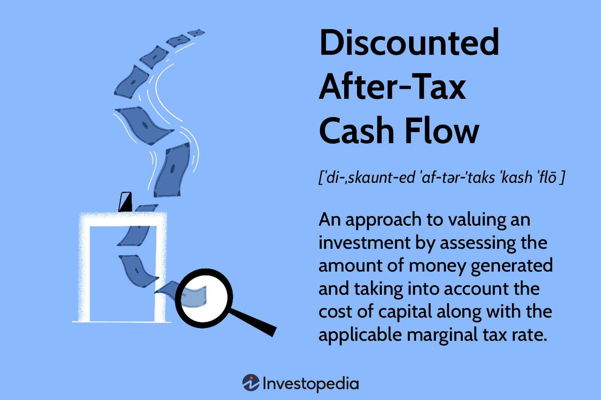

## Table of Contents

## What is Discounted After-Tax Cash Flow?

Discounted After-Tax Cash Flow is a way to figure out how much money a project or investment will make after paying taxes and adjusting for the time value of money. It helps people see if an investment is worth it by looking at the cash that comes in and goes out, but only after taxes are taken out. Then, this after-tax cash is discounted, which means it's adjusted to today's value because money now is worth more than the same amount of money in the future.

To calculate it, you first find out the cash flows for each year of the project, then subtract the taxes you'll have to pay on those cash flows. After that, you use a discount rate to bring all those future cash flows back to what they're worth right now. If the total of these discounted after-tax cash flows is more than what you put into the project at the start, then the investment is considered good because it will make more money than it costs.

## Why is Discounted After-Tax Cash Flow important in financial analysis?

Discounted After-Tax Cash Flow is important in financial analysis because it helps people make better decisions about where to put their money. It shows the real value of an investment after taxes are taken out and the money is adjusted for time. This is helpful because it gives a clear picture of how much money you'll actually get back from an investment over time, not just what it looks like on paper before taxes.

By using Discounted After-Tax Cash Flow, investors can compare different projects or investments more fairly. It takes into account that money today is worth more than money in the future and that taxes can eat into profits. This method helps to see if an investment will be profitable after all costs, including taxes, are considered. It's a key tool for making smart financial choices and planning for the future.

## How do you calculate Discounted After-Tax Cash Flow?

To calculate Discounted After-Tax Cash Flow, you first need to figure out the cash flows for each year of the project or investment. This means you look at all the money coming in and going out. After you have these numbers, you subtract the taxes you'll need to pay on those cash flows. This gives you the after-tax cash flow for each year. So, if you have $100 coming in and you need to pay $25 in taxes, your after-tax cash flow for that year is $75.

Once you have the after-tax cash flows, you need to discount them. This means you adjust the future money to today's value using a discount rate. The discount rate is like an [interest rate](/wiki/interest-rate-trading-strategies) that shows how much you value money now compared to money later. You take each year's after-tax cash flow and divide it by (1 + discount rate) raised to the power of the number of years into the future. For example, if your discount rate is 5% and you're looking at next year's after-tax cash flow of $75, you'd divide $75 by 1.05 to get about $71.43. You do this for each year's cash flow and then add them all up. If the total of these discounted after-tax cash flows is more than what you put into the project at the start, the investment is considered good.

## What are the key components needed to calculate Discounted After-Tax Cash Flow?

To calculate Discounted After-Tax Cash Flow, you need to know the cash flows for each year of your project or investment. This means figuring out all the money coming in and going out. Once you have these numbers, you need to find out how much tax you'll have to pay on those cash flows. You subtract the taxes from the cash flows to get the after-tax cash flow for each year. For example, if you earn $100 in a year and pay $25 in taxes, your after-tax cash flow for that year is $75.

After you have the after-tax cash flows, you need a discount rate. This rate helps you adjust future money to today's value because money now is worth more than money later. You take each year's after-tax cash flow and divide it by (1 + discount rate) raised to the power of the number of years into the future. If your discount rate is 5% and you're looking at next year's after-tax cash flow of $75, you'd divide $75 by 1.05 to get about $71.43. You do this for each year's cash flow and then add them all up. If the total of these discounted after-tax cash flows is more than what you put into the project at the start, the investment is worth it.

## Can you explain the concept of discounting in the context of Discounted After-Tax Cash Flow?

Discounting is a way to figure out what money you'll get in the future is worth right now. In the context of Discounted After-Tax Cash Flow, we take the money we expect to get after taxes and adjust it to see what it's worth today. This is important because money today is worth more than the same amount of money in the future. You might have heard the saying "a bird in the hand is worth two in the bush." It's the same idea; having money now is better than waiting for it later.

To do this, we use a discount rate, which is kind of like an interest rate. It shows how much more valuable money is to us now compared to later. If you're going to get $100 next year, and the discount rate is 5%, you divide that $100 by 1.05 to find out what it's worth today, which would be about $95.24. By doing this for all the future cash flows after taxes, we can add them up to see if the investment is worth it. If the total of all these discounted after-tax cash flows is more than what you put into the project at the start, then it's a good investment.

## How does tax impact the calculation of Discounted After-Tax Cash Flow?

Taxes have a big impact on the calculation of Discounted After-Tax Cash Flow because they reduce the amount of money you actually get to keep from your investment. When you figure out the cash flows for each year of your project, you need to subtract the taxes you'll have to pay on those cash flows. This means if you earn $100 in a year but have to pay $25 in taxes, you only get to keep $75. This after-tax amount is what you use to calculate the Discounted After-Tax Cash Flow, not the full $100 before taxes.

After you have the after-tax cash flows, you then discount them to find out what they're worth today. The discounting process doesn't change because of taxes, but the numbers you're working with are smaller because of the taxes you've already subtracted. So, if your after-tax cash flow for next year is $75 and you use a 5% discount rate, you'd divide $75 by 1.05 to get about $71.43. This shows that taxes lower the value of your future cash flows, which can make a big difference in deciding if an investment is worth it.

## What is the difference between pre-tax and after-tax cash flows in discounting?

When you look at pre-tax and after-tax cash flows in discounting, the big difference is how much money you're actually working with. Pre-tax cash flow is the total amount of money you expect to get from your investment before you pay any taxes. It's like looking at your whole paycheck before the government takes out taxes. When you discount pre-tax cash flows, you're figuring out what that full amount is worth today, but it doesn't give you a clear picture of what you'll really get to keep.

After-tax cash flow, on the other hand, is the money you have left after you've paid your taxes. It's like the take-home pay from your paycheck. When you discount after-tax cash flows, you're working with the actual money you'll have in your pocket. This makes a big difference because the numbers you're discounting are smaller due to taxes, which can change whether an investment looks good or not. Using after-tax cash flows gives you a more accurate idea of the real value of your investment over time.

## How do changes in tax rates affect Discounted After-Tax Cash Flow?

Changes in tax rates can make a big difference in how much money you actually get from your investment. If tax rates go up, you'll have to pay more in taxes, which means less money left over after taxes. This smaller amount of after-tax cash flow will be worth less when you discount it to today's value. So, if tax rates increase, the Discounted After-Tax Cash Flow for your investment will go down, making the investment seem less attractive because you'll end up with less money than you thought.

On the other hand, if tax rates go down, you get to keep more of your money after taxes. This means your after-tax cash flows will be bigger, and when you discount them to today's value, the total will be higher. Lower tax rates can make an investment look better because the Discounted After-Tax Cash Flow will be higher, showing that you'll get more money back from your investment than before.

## What are common mistakes to avoid when calculating Discounted After-Tax Cash Flow?

One common mistake people make when calculating Discounted After-Tax Cash Flow is forgetting to take taxes out of the cash flows. It's easy to look at the money coming in and forget that you have to pay taxes on it. If you don't subtract the taxes, your numbers will be too high, and you might think an investment is better than it really is. Always remember to figure out how much you'll owe in taxes and take that away from your cash flows before you start discounting.

Another mistake is using the wrong discount rate. The discount rate is important because it shows how much you value money now compared to money later. If you use a rate that's too high or too low, you'll end up with numbers that don't show the real value of your investment. Make sure you pick a discount rate that makes sense for your situation, like what you could earn if you put your money somewhere else instead.

Lastly, some people mess up by not considering all the cash flows. It's not just about the money coming in; you also need to think about money going out, like costs and expenses. If you only look at the income and forget about the costs, your Discounted After-Tax Cash Flow will be off. Make sure you include all the cash flows, both in and out, and adjust them for taxes before you start discounting.

## How can Discounted After-Tax Cash Flow be used in investment decision-making?

Discounted After-Tax Cash Flow helps people decide if an investment is a good idea. It does this by looking at the money you'll get from the investment after you pay taxes, and then figuring out what that money is worth right now. If the total of all these discounted after-tax cash flows is more than what you have to spend to start the investment, then it's probably a good choice. This way, you can see if you'll make more money from the investment than you put in, even after paying taxes.

It's also a great tool for comparing different investments. By using Discounted After-Tax Cash Flow, you can look at the real value of different projects side by side. This helps you pick the one that will give you the most money after all costs, including taxes, are taken out. It's like having a clear map that shows you which path will lead to the best financial outcome, making it easier to make smart choices about where to put your money.

## What advanced techniques can be applied to enhance the accuracy of Discounted After-Tax Cash Flow calculations?

To make Discounted After-Tax Cash Flow calculations more accurate, you can use something called sensitivity analysis. This means you try out different numbers for things like tax rates, discount rates, and cash flows to see how much they affect your results. By changing these numbers a little bit and seeing how the final number changes, you can understand which parts of your investment are most important. This helps you be ready for changes and make better decisions.

Another way to improve your calculations is by using scenario analysis. This is when you look at different stories or situations that could happen with your investment. For example, you might look at what would happen if the economy does really well, or if it does badly. By figuring out the Discounted After-Tax Cash Flow for each of these stories, you can see how your investment might do in different situations. This can help you plan better and be ready for whatever might happen.

## How do macroeconomic factors influence Discounted After-Tax Cash Flow projections?

Macroeconomic factors like interest rates, inflation, and economic growth can really change how much money you expect to get from an investment after taxes. If interest rates go up, the discount rate you use might also go up because money today becomes even more valuable than money in the future. This makes the future cash flows worth less when you bring them back to today's value. Also, if inflation goes up, the money you get in the future won't be worth as much as you thought, so your after-tax cash flows will be lower in real terms. And if the economy grows a lot, your investment might do better than expected, leading to higher cash flows.

On the other hand, if the economy goes into a recession, your investment might not do as well, and your cash flows could be lower. This means you'll have less money after taxes, and when you discount those smaller amounts back to today's value, the overall value of your investment goes down. Keeping an eye on these macroeconomic factors helps you make better guesses about how much money your investment will really bring in after taxes, and how that money will be worth today.

## What is Understanding After-Tax Cash Flow?

After-tax cash flow is an essential metric for businesses and investors, reflecting the net cash generated after accounting for taxes. It serves as a critical measure for evaluating the actual profitability of a business or investment, providing insights into its financial health and sustainability. By accurately calculating after-tax cash flow, stakeholders can determine whether an entity is generating sufficient returns to justify the investment, taking into consideration the impact of tax liabilities.

To understand after-tax cash flow, it is vital to consider several influencing factors:

1. **Corporate Tax Rates**: The tax rate applicable to a corporation significantly affects its after-tax cash flow. Higher tax rates reduce the net cash available, while lower rates can enhance cash flow. The formula for calculating after-tax cash flow is generally expressed as:
$$
   \text{After-Tax Cash Flow} = \text{Pre-Tax Cash Flow} \times (1 - \text{Tax Rate})

$$

   where the pre-tax cash flow includes revenue minus expenses, not accounting for taxes.

2. **Depreciation**: Depreciation is a non-cash accounting expense that provides tax shields by reducing taxable income. It can positively influence after-tax cash flow by lowering the tax liability. For instance, using the straight-line or accelerated depreciation methods can impact the computation of taxable income, thereby affecting after-tax cash flows.

3. **Operational Expenses**: These are costs incurred in the course of regular business activities. Efficient management of operational expenses can enhance after-tax cash flow. Businesses must monitor and control these expenses to ensure that they do not erode profitability.

Investors often depend on after-tax cash flow as a decisive [factor](/wiki/factor-investing) when analyzing potential investments. By evaluating this metric, investors can compare the net profitability of different investment opportunities, accounting for tax implications. It aids in making better-informed decisions, particularly important when identifying investments that promise sustainable returns or when formulating strategies that optimize tax efficiency.

Moreover, understanding after-tax cash flow is crucial for internal financial planning and management. It not only helps assess current performance but also forecasts future cash positions, ensuring that a business remains solvent and capable of meeting its obligations. This capability is essential for businesses seeking to maintain competitive advantage and long-term viability in a dynamic market environment.

## What is the Importance of Discounted Cash Flow?

Discounted cash flow (DCF) is a fundamental valuation method instrumental in determining the value of an investment by analyzing its expected future cash flows. By converting these expected future cash flows into their present value, DCF provides invaluable insights into the potential returns of an investment. This approach allows investors to account for the time value of money, offering a realistic assessment of an investment's worth. The present value calculation in DCF is crucial as it adjusts anticipated cash flows for factors such as inflation and risk, thereby facilitating more informed investment decisions.

To compute DCF, the formula typically used is:

$$
\text{DCF} = \sum_{t=1}^{n} \frac{CF_t}{(1 + r)^t}
$$

where $CF_t$ represents the cash flow in period $t$, $r$ is the discount rate, and $n$ is the number of periods considered in the analysis. Each cash flow is divided by a discount factor, which is essentially a reflection of the investor's required rate of return. This rate not only incorporates the cost of capital but also risks specific to the investment.

Key components of the DCF method include projected cash flows, which are estimates of the money expected to flow into or out of a project or company. Determining these cash flows involves detailed forecasting of revenue, expenses, taxes, and changes in working capital. The discount rate is another critical element, as it affects the present value of future cash flows. It often mirrors the weighted average cost of capital (WACC) or the investor's target rate of return, which considers both risk-free rates and market risks. Lastly, the investment horizon denotes the period over which the cash flows are projected and discounted.

The importance of DCF lies in its precision and ability to support long-term investment decisions. By evaluating an investment's intrinsic value, investors are better equipped to make decisions devoid of market fluctuations. This is particularly significant in corporate valuation, where understanding the true economic value of projects or the company itself offers strategic direction.

In conclusion, understanding DCF equips investors with the analytical tools necessary for assessing investment opportunities objectively. As financial markets become increasingly complex, mastering DCF and its components remains essential for sound financial decision-making and corporate valuation.

## References & Further Reading

[1]: ["Valuation: Measuring and Managing the Value of Companies"](https://www.amazon.com/Valuation-Measuring-Managing-Companies-Finance/dp/1119610885) by McKinsey & Company Inc., Tim Koller, Marc Goedhart, and David Wessels

[2]: ["Discounted Cash Flow Valuation"](https://www.investopedia.com/terms/d/dcf.asp) by Aswath Damodaran

[3]: Pardo, Robert (2011). ["The Evaluation and Optimization of Trading Strategies, Second Edition."](https://download.e-bookshelf.de/download/0000/5709/82/L-G-0000570982-0002382554.pdf) John Wiley & Sons.

[4]: ["Algorithmic and High-Frequency Trading"](https://www.cambridge.org/us/universitypress/subjects/mathematics/mathematical-finance/algorithmic-and-high-frequency-trading) by Álvaro Cartea, Sebastián Jaimungal, and José Penalva

[5]: ["Value Investing: From Graham to Buffett and Beyond"](https://www.amazon.com/Value-Investing-Graham-Buffett-Beyond/dp/0471463396) by Bruce C. Greenwald, Judd Kahn, Paul D. Sonkin, Michael van Biema

[6]: ["Python for Finance: Analyze Big Financial Data"](https://books.google.com/books/about/Python_for_Finance.html?id=E93SBQAAQBAJ) by Yves Hilpisch