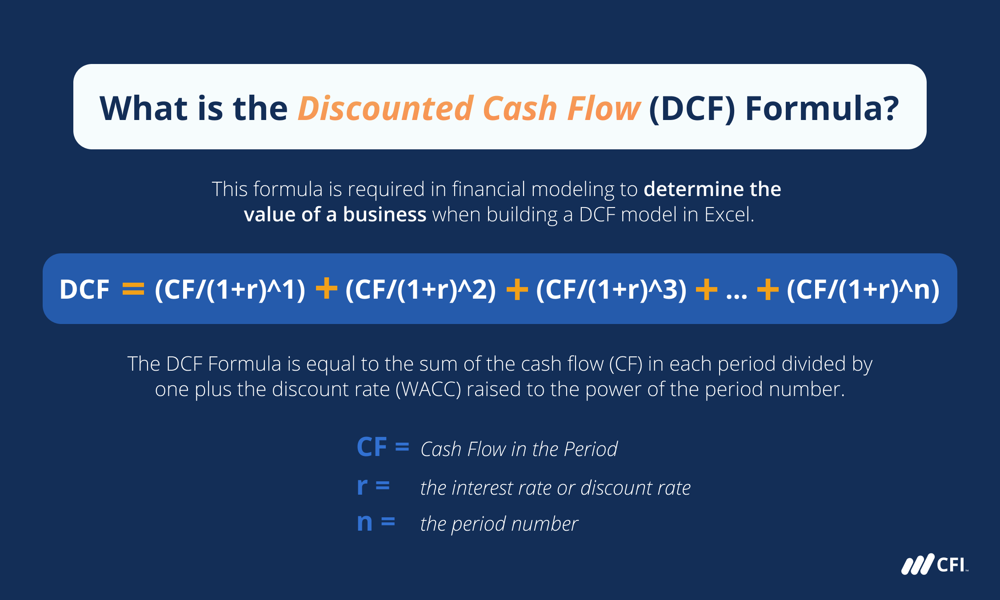

## Table of Contents

## What is Discounted Cash Flow (DCF)?

Discounted Cash Flow (DCF) is a way to figure out how much an investment or a company is worth. It does this by looking at the money the investment will make in the future and then figuring out what that money is worth right now. This is important because money today is worth more than the same amount of money in the future. To do a DCF, you need to guess how much money the investment will make each year and then use a discount rate to bring those future amounts back to today's value.

The discount rate is like an interest rate that shows how risky the investment is. If the investment is very risky, you use a higher discount rate, which makes the future money worth less today. Once you have all the future cash flows discounted back to today, you add them up to get the total value of the investment. If this total value is higher than what you would pay for the investment, it might be a good deal. DCF is used a lot in business and finance to help make smart decisions about buying or selling companies and other investments.

## Why is DCF important in financial analysis?

DCF is really important in financial analysis because it helps people figure out if an investment is worth making. It does this by taking all the money an investment is expected to make in the future and figuring out what that money is worth right now. This is useful because it gives a clear number that you can compare to the cost of the investment. If the DCF value is higher than the cost, the investment might be a good choice.

Another reason DCF is important is that it makes you think about the future and the risks involved. When you do a DCF, you have to guess how much money the investment will make each year, and you also have to decide on a discount rate that shows how risky the investment is. This process helps you understand the investment better and make smarter decisions. DCF is used by lots of people in finance, like investors, bankers, and business owners, to help them decide where to put their money.

## What is the basic formula for calculating DCF?

The basic formula for calculating Discounted Cash Flow (DCF) is to add up all the future cash flows after they've been discounted back to today's value. You do this by taking each year's expected cash flow and dividing it by (1 + the discount rate) raised to the power of the year you're looking at. So, if you're looking at cash flows for the next three years, you'd take the cash flow for year one and divide it by (1 + discount rate), the cash flow for year two and divide it by (1 + discount rate)^2, and the cash flow for year three and divide it by (1 + discount rate)^3. Then, you add up all these discounted cash flows to get the total DCF value.

The discount rate is really important because it shows how risky the investment is. If the investment is very risky, you use a higher discount rate, which makes the future cash flows worth less today. If the investment is less risky, you use a lower discount rate, which makes the future cash flows worth more today. By using this formula, you can see if the total DCF value is more than what you would pay for the investment. If it is, the investment might be a good choice.

## How do you determine the discount rate for DCF?

The discount rate for DCF is like an [interest rate](/wiki/interest-rate-trading-strategies) that shows how risky an investment is. To figure out the right discount rate, you need to think about how safe or risky the investment is. If the investment is very safe, like a government bond, you might use a lower discount rate. But if the investment is very risky, like a new startup, you would use a higher discount rate. The discount rate also depends on what other investments you could make instead. If you could get a good return from another investment, you might want a higher discount rate for the one you're looking at.

One common way to find the discount rate is to use the Weighted Average Cost of Capital (WACC). WACC is a mix of the cost of borrowing money (like interest on a loan) and the cost of using money from investors (like the return they expect). To calculate WACC, you need to know how much of the company's money comes from loans and how much comes from investors, and then you figure out the cost of each part. Another way to find the discount rate is to look at what similar investments are earning. If other investments in the same industry are getting a certain return, you might use that as your discount rate. By using these methods, you can pick a discount rate that makes sense for your DCF calculation.

## What are the key components of cash flow in a DCF model?

The key components of cash flow in a DCF model are the money that comes in and goes out of a business. The money coming in is called revenue, which is what the business makes from selling its products or services. The money going out includes costs like paying employees, buying materials, and other expenses needed to run the business. The difference between the money coming in and the money going out is called operating cash flow. This is important because it shows how much money the business is making from its main activities.

Another important part of cash flow is capital expenditures, which are the costs of buying or upgrading things like buildings, machines, or computers. These are big investments that help the business grow or keep running smoothly. You also need to think about changes in working capital, which is the money tied up in day-to-day operations, like inventory and accounts receivable. By looking at all these parts together, you can figure out the total cash flow for each year, which you then use in the DCF model to see what the business is worth today.

## Can you explain the concept of terminal value in DCF?

Terminal value in DCF is a way to figure out what all the money a business will make after a certain point in the future is worth today. When you do a DCF, you usually guess the cash flows for a few years into the future, like 5 or 10 years. But a business doesn't stop making money after that, so you need a way to add up all the money it will make forever after those years. That's what terminal value is for. It's like saying, "After these first few years, the business will keep going and making money, and this is what all that future money is worth right now."

To find the terminal value, you can use one of two main ways. The first way is called the perpetuity growth method, where you guess that the business will keep growing at a small, steady rate forever. You take the last year's cash flow, guess the growth rate, and then use a formula to figure out what all that future money is worth today. The second way is the [exit](/wiki/exit-strategy) multiple method, where you guess what someone might pay for the business at the end of your forecast period, based on what similar businesses have sold for. Both methods help you add up all the future money the business will make after your detailed forecast years, and then you discount that back to today's value to include it in your DCF.

## How do you forecast future cash flows for a DCF analysis?

To forecast future cash flows for a DCF analysis, you start by looking at the company's past financial performance. You look at things like how much money the company made in the past, how much it spent, and how these numbers have changed over time. This helps you see patterns and make guesses about what might happen in the future. You might also look at what's happening in the company's industry and the economy to help you make better guesses. For example, if the company is in a growing industry, you might guess that its cash flows will grow too.

Once you have a good understanding of the past and the current situation, you can start making your guesses about the future. You need to guess how much money the company will make each year for the next few years, usually 5 to 10 years. You do this by thinking about things like how fast the company might grow, how much it might have to spend, and any big changes that might happen. You write down these guesses as numbers for each year. These numbers are your forecasted cash flows, and you use them in your DCF analysis to figure out what the company is worth today.

## What are common pitfalls to avoid when using DCF?

When using DCF, one common pitfall is making too many guesses about the future. You have to guess how much money the company will make each year, what the discount rate should be, and what the company will be worth at the end of your forecast period. If these guesses are way off, your DCF calculation won't be very accurate. For example, if you guess that the company will grow really fast but it doesn't, your DCF value will be too high. It's important to be careful and realistic with your guesses.

Another pitfall is not thinking about how risky the investment is. The discount rate you use should show how risky the investment is, but sometimes people use a rate that's too low or too high. If the discount rate is too low, it makes the future money worth more than it should be, and if it's too high, it makes the future money worth less than it should be. Both mistakes can make your DCF value wrong. It's important to pick a discount rate that really shows the risk of the investment.

## How does the choice of growth rate affect DCF valuation?

The choice of growth rate in a DCF valuation is really important because it decides how much money the company will make in the future. If you guess a high growth rate, you're saying that the company will make a lot more money each year. This makes the DCF value go up because you're adding up bigger and bigger amounts of money. But if you guess a low growth rate, you're saying the company won't grow as fast, so the DCF value will be lower because you're adding up smaller amounts of money.

It's important to be careful when [picking](/wiki/asset-class-picking) a growth rate because if you guess wrong, your DCF value will be wrong too. If you think the company will grow really fast but it doesn't, your DCF value will be too high, and you might pay too much for the investment. On the other hand, if you think the company won't grow much but it actually does, your DCF value will be too low, and you might miss out on a good investment. So, you need to look at the company's past growth, what's happening in its industry, and the economy to pick a growth rate that makes sense.

## Can you provide a simple example of DCF calculation?

Let's say you want to figure out how much a small business is worth using DCF. The business makes $100,000 in cash each year, and you think it will keep making that much for the next three years. You decide to use a discount rate of 10% because the business is a bit risky. For the first year, you take the $100,000 and divide it by 1.10 (which is 1 plus the discount rate), and you get about $90,909. For the second year, you take the $100,000 and divide it by 1.10 squared (which is 1.21), and you get about $82,645. For the third year, you take the $100,000 and divide it by 1.10 cubed (which is 1.331), and you get about $75,131.

Now, you add up all these discounted cash flows to get the total DCF value. So, you add $90,909 from the first year, $82,645 from the second year, and $75,131 from the third year, and you get a total of about $248,685. This number is what you think the business is worth today, based on the money it will make in the next three years. If someone is selling the business for less than $248,685, it might be a good deal. But remember, this is a simple example, and real DCF calculations can be more complicated with things like changing cash flows and terminal value.

## How do sensitivity analyses enhance DCF models?

Sensitivity analyses make DCF models better by showing how changes in your guesses can change the final value of the business. When you do a DCF, you have to guess things like how fast the business will grow and what discount rate to use. But these guesses might not be perfect. Sensitivity analysis lets you see what happens if your guesses are a little different. For example, if you guess the growth rate is 5%, you can use sensitivity analysis to see what the business would be worth if the growth rate was 4% or 6%. This helps you understand how sensitive your DCF value is to these guesses.

By doing sensitivity analyses, you can make smarter decisions about buying or selling a business. It helps you see the range of possible values the business could have, instead of just one number. This is important because it shows you the risks involved. If small changes in your guesses make big changes in the DCF value, the investment might be very risky. But if the DCF value doesn't change much even when your guesses change, the investment might be safer. So, sensitivity analyses help you see the whole picture and make choices based on a better understanding of what could happen.

## What advanced techniques can be applied to improve the accuracy of DCF models?

To make DCF models more accurate, you can use something called scenario analysis. This means you don't just guess one set of numbers for the future, but you make different guesses for different situations that might happen. For example, you might make one guess for if the economy grows a lot, another guess for if it stays the same, and another guess for if it gets worse. By looking at these different scenarios, you can see a range of possible values for the business, which helps you understand how risky the investment might be. This way, you're not just relying on one guess, but you're thinking about what could happen in different situations.

Another advanced technique is to use Monte Carlo simulations. This sounds fancy, but it's really just a way to make a lot of guesses at once and see what happens. Instead of picking one number for things like growth rates or discount rates, you let the computer pick a lot of different numbers based on what you think is likely. The computer then runs the DCF model many times with all these different numbers and shows you a range of possible values for the business. This helps you see how likely it is that the business will be worth more or less than what you're thinking about paying. By using Monte Carlo simulations, you can get a better idea of the risks and make a more informed decision.

## How does DCF work?

Discounted Cash Flow (DCF) analysis is pivotal in financial analysis by estimating the present value of an investment’s expected future cash flows. This valuation method accommodates the time value of money, a core financial principle that acknowledges a dollar today is worth more than a dollar in the future due to its potential [earning](/wiki/earning-announcement) capacity.

The process of DCF begins with predicting future cash flows, which involves rigorous analysis of historical financial data, market trends, and economic factors. These projections could span several years into the future, depending on the investment timeline. Once forecasted, these cash flows are subject to a discount rate which accounts for risk and opportunity cost. The discount rate often reflects the investor's required rate of return or the weighted average cost of capital (WACC) for corporations.

The primary aim is to ascertain the present value (PV) of these forecasted cash flows. The present value is calculated using the DCF formula:

$$

PV = \sum_{t=1}^{n} \frac{CF_t}{(1 + r)^t} 
$$

where $CF_t$ represents the cash flow in year $t$, $r$ is the discount rate, and $n$ is the total number of periods.

Determining the present value aids in deciding the viability of the investment. If the present value of all future cash flows surpasses the initial investment cost, the opportunity is deemed worthwhile. 

It is crucial to select an appropriate discount rate, as it directly influences the DCF valuation. A higher discount rate may drastically reduce the present value, deterring investment, while a lower rate might inflate it, making investments appear more lucrative.

DCF analysis is extensively applied across various industries like real estate, capital budgeting, and mergers and acquisitions, providing a tactical advantage by precisely evaluating potential investments’ profitability and risks. This meticulous approach ensures informed decision-making in planning capital spending, acquisitions, or strategic investments.

## What is the DCF Formula?

The Discounted Cash Flow (DCF) formula serves as the foundational framework for evaluating the present value of an investment's expected cash flows over time. The formula is articulated as follows:

$$
DCF = \frac{CF_1}{(1+r)^1} + \frac{CF_2}{(1+r)^2} + \cdots + \frac{CF_n}{(1+r)^n}
$$

In this equation, $CF$ stands for the expected cash flows for each year, $r$ is the discount rate, and $n$ denotes the number of periods over which the cash flows are expected. The objective of employing the DCF formula is to determine whether the future cash flows from an investment are worth the initial expenditure, adjusted for time and introduced risks.

### Definitions:
1. **Cash Flows (CF):** These represent the net cash a project or investment is expected to generate during each period. Estimating these accurately is crucial as they fundamentally influence the valuation derived from the DCF.

2. **Discount Rate (r):** This rate reflects the time value of money and the investment risk. It adjusts future cash flows back to present value terms, enabling comparability with initial outlays or other financial opportunities. The choice of an appropriate discount rate is vital; it often varies based on market conditions, the risk profile of the investment, and the cost of capital. Typically, the Weighted Average Cost of Capital (WACC) serves as a common proxy for $r$.

3. **Periods (n):** These usually correspond to the years over which the cash flows are projected. This provides a time frame for the analysis, inherently affecting how cash flow projections are valued presently.

### Importance of Choosing an Appropriate Discount Rate:
The selection of the discount rate is a pivotal step in the DCF analysis as it directly impacts the present value of future cash flows. An incorrect discount rate can either undervalue or overstate an investment's true worth. If the rate is set too high, it may lead to the rejection of potentially profitable investments by undervaluing cash flows. Conversely, a rate that is too low might result in poor investment decisions due to overvaluation.

The discount rate reflects the risk associated with the cash flows and the opportunity cost of capital. Therefore, it is essential to thoroughly assess the risk factors and economic circumstances surrounding the investment to ascertain an appropriate discount rate. This may involve evaluating risk-free rates, risk premiums, market [volatility](/wiki/volatility-trading-strategies), and specific investment risks.

In practice, tools like the Capital Asset Pricing Model (CAPM) and empirical estimates of the cost of equity and debt are often employed to derive a suitable discount rate. By accurately setting this rate, one can ensure that the DCF analysis yields a reliable valuation, ultimately facilitating more informed investment decisions.

## What is the Role of DCF in Algorithmic Trading?

Discounted Cash Flow (DCF) analysis, traditionally employed for valuation purposes, can play a pivotal role in [algorithmic trading](/wiki/algorithmic-trading) by providing a framework for assessing the intrinsic value of a company's securities. This integration allows traders to make informed automated trading decisions based on intrinsic valuations rather than purely market sentiment or technical patterns.

**Integrating DCF in Algorithmic Trading Strategies**

The integration of DCF into algorithmic trading involves incorporating the methodology to evaluate securities and make data-driven decisions. While traditional trading algorithms often rely on technical analysis indicators like moving averages or [momentum](/wiki/momentum) oscillators, a DCF-based approach evaluates stocks based on the company's expected future cash flows. This process allows algorithms to [factor](/wiki/factor-investing) in the fundamental underlying value, providing a longer-term perspective compared to short-term price trends.

The steps to integrate DCF in algorithmic trading typically include:

1. **Estimating Future Cash Flows**: Automated scripts can extract historical financial data from databases or APIs to predict future cash flows using machine learning models. Variables like revenue growth, operating margins, and tax rates can be auto-calibrated over time.

2. **Calculating Present Value**: The core of DCF lies in the present value calculation. For algorithms, determining a suitable discount rate is crucial. It could be dynamically adjusted based on market conditions using variables such as the risk-free rate, beta of the security, and expected market return.
$$
   PV = \sum_{t=1}^{N} \frac{CF_t}{(1 + r)^t}

$$

   Where $PV$ is the present value, $CF_t$ is the cash flow in year $t$, $r$ is the discount rate, and $N$ is the number of periods.

3. **Decision-Making Framework**: Once the intrinsic value is calculated, algorithms can compare it to the current market price. Securities priced below this intrinsic value could be flagged for potential buying opportunities, whereas securities priced above may be marked for selling or short positions.

**Enhancing Automated Trading Decisions**

Incorporating DCF into automated trading requires enhancing algorithms with modules that handle complex financial modeling and decision-making processes. Python, due to its robust libraries such as pandas for data manipulation and numpy for numerical operations, serves as an efficient language for such tasks.

Below is a simplified Python snippet illustrating the DCF calculation and decision-making process:

```python
import numpy as np

def calculate_dcf(cash_flows, discount_rate):
    # Calculate DCF based on projected cash flows and discount rate
    return np.sum([cf / (1 + discount_rate) ** (i + 1) for i, cf in enumerate(cash_flows)])

# Example cash flows and discount rate
projected_cash_flows = [1000, 1500, 2000, 2500, 3000]  # Projected future cash flows
current_discount_rate = 0.08  # Example discount rate of 8%

# Calculate intrinsic value using DCF
intrinsic_value = calculate_dcf(projected_cash_flows, current_discount_rate)

# Market price for comparison
current_market_price = 12000  # Example market price

# Decision based on intrinsic value
if intrinsic_value > current_market_price:
    decision = "Buy"
else:
    decision = "Sell or Hold"

print(f"Intrinsic Value: {intrinsic_value}, Decision: {decision}")
```

Through systematic valuation and financial analysis, DCF can significantly enhance the robustness and depth of algorithmic trading strategies, ensuring that decisions are backed by quantitative financial assessments. This not only aids in risk management but also aligns trading strategies more closely with fundamental investment principles.

## References & Further Reading

[1]: Damodaran, A. (2012). ["Investment Valuation: Tools and Techniques for Determining the Value of Any Asset, University Edition,"](https://books.google.com/books/about/Investment_Valuation.html?id=5SRHAAAAQBAJ) John Wiley & Sons.

[2]: Penman, S. H. (2013). ["Financial Statement Analysis and Security Valuation,"](https://www.mheducation.com/highered/product/financial-statement-analysis-security-valuation-penman/M9780078025310.html) McGraw-Hill Education.

[3]: ["Valuation: Measuring and Managing the Value of Companies,"](https://www.amazon.com/Valuation-Measuring-Managing-Companies-Finance/dp/1119610885) by McKinsey & Company Inc., Tim Koller, Marc Goedhart, and David Wessels.

[4]: Lo, A. W., & MacKinlay, A. C. (1997). ["The Econometrics of Financial Markets,"](https://www.jstor.org/stable/1344712) Princeton University Press.

[5]: Bodie, Z., Kane, A., & Marcus, A. J. (2014). ["Investments,"](https://www.mheducation.com/highered/product/investments-bodie-kane/M9781264412662.html) McGraw-Hill Education.