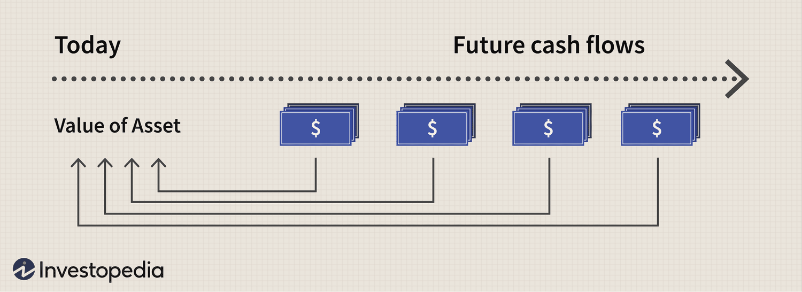

Valuation methods are fundamental tools for financial analysts, providing a structured approach to determining a company's worth. Among the many techniques available, Discounted Cash Flows (DCF), Comparable Company Analysis (CCA), and algorithmic trading have emerged as pivotal components of the investment landscape. Each method offers unique strengths and weaknesses, enabling a tailored assessment to guide investment decisions.

Discounted Cash Flows (DCF) valuation serves as a cornerstone in financial analysis, estimating a company's value based on the present value of expected future cash flows. This calculation accounts for the time value of money, creating a detailed framework that emphasizes specific future earning potentials. When applied correctly, DCF can offer a robust evaluation, particularly for mature companies with predictable revenue streams.



Comparable Company Analysis (CCA), often referred to as "comps," takes a different approach by estimating a company's value relative to similar firms using market-derived metrics such as Price-to-Earnings (P/E) ratios and Enterprise Value-to-EBITDA (EV/EBITDA). This method reflects the current market sentiment and is generally less reliant on complex assumptions than DCF, making it an accessible tool for various market participants.

In the context of modern financial markets, algorithmic trading represents an advanced approach that integrates computing power to execute trades based on pre-defined criteria. By amalgamating DCF and CCA with algorithmic strategies, traders can enhance the timing and precision of their investment decisions. Algorithms are designed to analyze large sets of data rapidly, offering real-time valuation adjustments and adaptations to market changes.

The exploration of these methods in this article will focus on the strengths and weaknesses of DCF and CCA and how their integration with algorithmic trading can enhance investment strategies. Such a comprehensive understanding empowers investors to navigate complex financial environments effectively, equipping them with the necessary tools to make informed, strategic decisions.

## Table of Contents

## Understanding Discounted Cash Flows (DCF) Valuation

The Discounted Cash Flows (DCF) valuation method is a financial analysis technique used to estimate the intrinsic value of a company by calculating the present value of its projected future cash flows. This approach is rooted in the principle that the value of an asset is determined by its ability to generate cash over time, with an adjustment for the time value of money. In this context, the time value of money reflects the concept that a sum of money today is worth more than the same sum in the future due to its potential earning capacity.

### Key Inputs in DCF Valuation

The DCF model relies on several critical inputs to derive a valuation:

1. **Expected Future Cash Flows**: These are estimates of the cash that a company is projected to generate in the future. They include cash inflows and outflows, and typically take into account revenue forecasts, operating and capital expenditures, taxes, and changes in net working capital.

2. **Growth Rates**: These projections reflect how the company’s cash flows are expected to grow over time. Growth rates can be derived from historical performance, industry trends, and management guidance.

3. **Discount Rate**: This is a crucial component in DCF analysis, as it is used to convert future cash flows into present value. The discount rate typically reflects the company’s weighted average cost of capital (WACC) or required rate of return. Mathematically, for a future cash flow $CF_t$, the present value (PV) is calculated as:
$$
   PV = \frac{CF_t}{(1 + r)^t}

$$
   where $r$ is the discount rate and $t$ represents the time period.

### Suitability of DCF

The strength of the DCF method lies in its focus on intrinsic value, making it particularly suitable for mature companies with stable and predictable revenue streams. These companies tend to have historical data that can be reliably used to forecast future performance, resulting in more accurate DCF valuations.

By concentrating on cash flow generation potential, DCF analysis can identify the true financial health and prospects of a company beyond accounting profits, which may be subject to various non-cash items and short-term market fluctuations.

Furthermore, DCF is robust because it provides a comprehensive view of a company's financial viability by considering both the current operational performance and future growth potential. This makes it an indispensable tool for investors looking to understand a company's long-term value and make informed investment decisions.

## Advantages and Limitations of DCF

The Discounted Cash Flow (DCF) method emerges as a cornerstone in financial valuation by emphasizing a company's intrinsic value. This approach prioritizes cash flows as the basis for equity valuation, circumventing issues tied to accounting figures that are often subject to manipulation through subjective assumptions or external factors. By focusing on cash flows, DCF provides an objective foundation for assessing a firm's true economic potential.

**Advantages of DCF**

The central advantage of DCF lies in its emphasis on intrinsic value. This approach directs attention to the essential drivers of value—future cash flows—and considers the time value of money, providing a realistic assessment of worth over various investment horizons. By converting future cash flows into present value using an appropriate discount rate, DCF helps clarify the fundamental worth, offering investors a metric that reflects the genuine [earning](/wiki/earning-announcement) potential.

DCF is particularly robust for evaluating mature businesses with stable, predictable revenue streams. These companies typically exhibit a strong historical performance, reliable cash flow patterns, and moderate [volatility](/wiki/volatility-trading-strategies), leading to greater accuracy in forecasting future financial outcomes.

**Limitations of DCF**

However, utilizing DCF involves several challenges due to the inherent reliance on numerous assumptions. Foremost, the model requires precise estimations of growth rates and discount rates. Slight deviations in these figures can lead to substantial valuation differences, particularly impacting companies in volatile or cyclical industries where predicting future conditions is complex.

Forecasting cash flows, another crucial component within the DCF framework, also poses challenges. Variables such as sales growth, profit margins, working capital, and capital expenditures are integral to accurate predictions yet are frequently influenced by market fluctuations, strategic decisions, and unexpected economic changes. The precision of these forecasts is essential, as inaccurate inputs can skew the entire valuation.

For example, the equation for calculating the present value (PV) of future cash flows is expressed as:

$$

PV = \sum_{t=1}^{n} \frac{CF_t}{(1 + r)^t} 
$$

Where:
- $CF_t$ represents the cash flow in year $t$,
- $r$ is the discount rate,
- $n$ is the total number of periods.

This formula illustrates the complexity of DCF; even minor adjustments in $r$ or $CF_t$ may result in significant changes in PV, underlining the model’s sensitivity to input accuracy.

While DCF provides a powerful means of valuation, it requires careful consideration of its limitations and assumptions. Analysts must ensure that inputs are plausible and aligned with historical performance and expected industry trends. Despite its challenges, DCF remains a fundamental tool in the investor's toolkit, offering a comprehensive approach to deducing a company's fair value when applied judiciously.

## Exploring Comparable Company Analysis (CCA)

Comparable Company Analysis (CCA), often referred to as 'comps,' is a popular valuation method that estimates a company's value by comparing it to similar companies. This approach relies on market-driven metrics, notably the price-to-earnings (P/E) ratio and enterprise value-to-EBITDA (EV/EBITDA) ratio, which reflect the composite value as perceived by the market participants at a given point in time.

The basic premise behind CCA is that similar companies, operating within the same industry and under similar economic conditions, should exhibit similar valuation multiples. Therefore, by analyzing these multiples of comparable companies, one can infer a valuation metric applicable to the target company. If the target company's operations, growth prospects, and risk profile are similar to those of the peer companies, the valuation multiples of the peers can provide a relative benchmark for the target company.

There are several key advantages associated with CCA. Firstly, it reflects the current market sentiment, offering a snapshot based on actual market transactions. This makes CCA particularly relevant in rapidly changing market environments where investor perceptions and external conditions significantly affect valuations. Secondly, the method involves less stringent forecasting assumptions compared to the Discounted Cash Flow (DCF) model. Instead of developing exhaustive financial projections, analysts focus on comparing existing market valuations, which can be a more straightforward process.

To conduct a CCA, an analyst typically follows several steps:

1. **Select a Peer Group**: Identify comparable companies that operate in the same industry, with similar business sizes, growth rates, profitability, and risk characteristics as the target company.

2. **Determine Market Multiples**: Calculate the relevant valuation multiples for each peer, such as P/E, EV/EBITDA, EV/Sales, among others. This involves gathering data on market capitalization, debt, and earnings.

3. **Adjust for Differences**: Adjust the multiples to account for differences between the target and the peers, such as size, growth potential, and operational risk.

4. **Apply to the Target Company**: Use the average or median of the adjusted multiples to estimate a value or range of values for the target company.

While practical and widely used, CCA faces limitations primarily in the selection of truly comparable firms. Differences in accounting policies or operational efficiency can lead to misleading comparisons. Additionally, it assumes that the peer group's valuation is fair, which might not always hold true if market anomalies or irrational investor behaviors distort the peer company's valuations. Thus, careful consideration and cautious interpretation of the data remain critical when applying CCA.

## Pros and Cons of CCA

Comparable Company Analysis (CCA), also known as “comps,” is a valuation method that is straightforward and widely understood due to its reliance on observable market data from similar companies. This simplicity stems from its use of ratios such as Price-to-Earnings (P/E) and Enterprise Value-to-EBITDA (EV/EBITDA), which are calculated using publicly available financial information. The ease of understanding and ability for quick execution make CCA a popular choice, especially when compared to more complex models like Discounted Cash Flow (DCF).

One significant advantage of CCA is that it involves fewer assumptions than other valuation methods. Instead of forecasting future cash flows or determining an appropriate discount rate, CCA grounds its analysis in current market trends and financial indicators of peer companies. This reliance on actual market data provides an up-to-date snapshot of a company’s value, reflecting prevailing investor sentiment.

However, CCA is not without its limitations. One primary challenge is identifying perfect comparables. Not all companies operate under identical conditions, and variations in size, market position, geographic location, or business model can affect their valuation. This challenge highlights the subjective nature of choosing comparable companies, which can introduce biases or errors into the valuation process.

Moreover, CCA presumes that the market efficiently and accurately values the peer group. This assumption may not always hold true, especially in times of market volatility or irrational exuberance, potentially leading to valuations that do not accurately reflect a company's intrinsic value. For instance, during market bubbles or crashes, the valuation metrics of peer companies may deviate significantly from their long-term averages, skewing the results of a CCA.

In conclusion, while CCA offers simplicity and a real-time view of market conditions, investors must be cautious of its limitations. Selecting comparables and assuming their market valuations are precise requires careful judgment and occasionally supplementary analysis to reinforce the final valuation outcome. In certain situations, complementing CCA with other methods, such as DCF, could provide a more holistic valuation.

## Integrating Algorithmic Trading with Valuation Methods

Algorithmic trading utilizes computer algorithms to execute trades based on predefined criteria, enabling rapid responses to market conditions. This automation is particularly beneficial when integrated with valuation methods such as Discounted Cash Flows (DCF) and Comparable Company Analysis (CCA), as it allows for precise and timely investment decisions. 

The integration of [algorithmic trading](/wiki/algorithmic-trading) with valuation methods offers several advantages. Firstly, algorithms are capable of processing large datasets with high efficiency, providing real-time adjustments to valuation models. For example, an algorithm can continuously update DCF valuations based on new financial data or macroeconomic indicators, ensuring that the intrinsic value calculations reflect the latest market conditions. This dynamic adjustment is critical for capturing value in fast-changing markets and can be implemented using Python with libraries such as Pandas and NumPy for data manipulation and Scipy for optimization.

By enhancing data analysis and strategy formulation, algorithms can refine CCA as well. Traditionally, CCA requires identifying peer companies with similar financial metrics, a process prone to subjectivity and the inaccuracies of manual selection. With algorithmic assistance, statistical methods such as cluster analysis can be employed to automatically select comparable firms, thus ensuring a more objective and accurate peer group evaluation. Python's Scikit-learn library can facilitate this process through its clustering techniques.

Moreover, algorithms enable back-testing of valuation-based strategies. Back-testing involves applying trading strategies based on DCF or CCA metrics to historical data to evaluate their past performance. This process helps in validating the effectiveness of these strategies before implementing them in real trading scenarios, potentially mitigating risks. Python, with its robust ecosystem of libraries, is well-suited for such tasks; libraries like Backtrader or PyAlgoTrade can be utilized to perform comprehensive back-testing with ease.

In conclusion, algorithmic trading, when combined with DCF and CCA methodologies, significantly enhances the precision and timing of investment strategies. By harnessing the computational power of algorithms to streamline data analysis, execute trades, and optimize strategies, investors can greatly improve their decision-making processes and achieve superior returns.

## Case Studies and Practical Applications

Several industries have successfully integrated Discounted Cash Flows (DCF) and Comparable Company Analysis (CCA) with algorithmic trading, yielding significant impacts on their trading strategies. This section examines case studies from the technology and utilities sectors, showcasing practical applications of these methods.

### Case Study in Technology

The technology sector, known for its rapid innovation and pronounced market shifts, provides a fertile ground for the application of DCF, CCA, and algorithmic trading. One notable example involves a tech company that integrated these valuation methods within its trading system to optimize its portfolio management. By using DCF, the company assessed its intrinsic value by forecasting future cash flows and discounting them to present value. Simultaneously, it applied CCA to gauge market sentiment and determine relative valuation metrics compared to peers.

Algorithmic trading played a crucial role in this setup by executing trades based on insights derived from both DCF and CCA. Algorithms processed real-time data, enabling swift adjustments to the company's valuation and trading strategies. For instance, Python scripts were employed to automate the recalibration of discount rates and growth assumptions within the DCF model. Here is a simplified Python code snippet illustrating how such automation may be implemented:

```python
import numpy as np

# Function to calculate DCF
def calculate_dcf(cash_flows, discount_rate):
    dcf_value = sum(cf / (1 + discount_rate)**t for t, cf in enumerate(cash_flows, 1))
    return dcf_value

# Sample cash flows and discount rate
cash_flows = [100, 150, 200, 250, 300]
discount_rate = 0.08

# Calculate DCF
dcf_value = calculate_dcf(cash_flows, discount_rate)
print(f"The DCF value is: {dcf_value}")
```

This automated approach allowed the tech company to respond dynamically to market changes, ensuring that investment strategies were both data-driven and forward-looking.

### Practical Application in Utilities

In the utilities sector, characterized by stable and predictable cash flows, DCF is particularly valuable for valuation. A prominent utility company leveraged this stability by employing a hybrid model that combined DCF and CCA with algorithmic trading strategies. The predictability of cash flows in this industry made DCF calculations more reliable, while CCA offered a market-relative perspective.

The integration with algorithmic trading facilitated immediate reactions to market developments such as regulatory changes or [interest rate](/wiki/interest-rate-trading-strategies) fluctuations, which are critical in the utilities sector. Algorithms provided real-time analysis and executed trade orders as soon as inputs from valuation models indicated advantageous moves. This setup exemplified how the utility company utilized technology to enhance the accuracy and timing of its investment decisions, benefiting from the structured and data-rich environment typical to the industry.

In summary, the successful deployment of DCF and CCA in conjunction with algorithmic trading in both technology and utilities showcases the enhanced precision and adaptability these methods bring to trading strategies. By automating complex calculations and executing data-driven trades, companies in these sectors have achieved greater investment success.

## Conclusion: Selecting the Appropriate Method

Choosing between Discounted Cash Flows (DCF) and Comparable Company Analysis (CCA) for valuation largely depends on specific factors related to the company and market conditions. For mature companies with stable revenues and predictable cash flows, DCF can be particularly effective due to its emphasis on intrinsic value derived from projected cash flows. In contrast, CCA may be ideal for sectors characterized by volatility or rapid growth, where market-driven metrics and comparables provide crucial insights.

Key considerations when choosing a method include industry maturity, data availability, and current market conditions. DCF requires detailed financial projections and reliable assumptions about growth and discount rates, which can be challenging in unpredictable industries. Conversely, CCA relies on the availability of suitable peer companies and assumes market efficiency, which may not always hold true.

A hybrid approach, integrating the strengths of both DCF and CCA, can offer comprehensive insights. By leveraging DCF for intrinsic value estimation and CCA for market sentiment, investors can obtain a balanced view of a company’s worth. Additionally, incorporating algorithmic trading can further enhance decision-making. Algorithms can efficiently process vast amounts of data, adjusting valuations and strategies in real-time to respond to market dynamics.

Understanding these methodologies allows investors to tailor their analyses to the specific investment landscape they face. Utilizing the appropriate valuation method or a hybrid approach makes it possible to achieve informed, strategic investment decisions that align with the investor’s goals and the market environment. This adaptability is crucial for navigating the complexities of modern financial markets effectively.

## References & Further Reading

[1]: Damodaran, A. (2012). ["Investment Valuation: Tools and Techniques for Determining the Value of Any Asset, University Edition."](https://books.google.com/books/about/Investment_Valuation.html?id=5SRHAAAAQBAJ) Wiley.

[2]: ["Discounted Cash Flow Analysis for Real Estate Investments"](https://www.investopedia.com/ask/answers/010715/how-do-you-use-dcf-real-estate-valuation.asp) by Laurence M. Hirsh, CCIM Institute.

[3]: ["Equity Asset Valuation"](https://www.amazon.com/Equity-Asset-Valuation-Institute-Investment/dp/1119628105) by Jerald E. Pinto, CFA Institute Investment Series.

[4]: Hwang, J., & Hsiao, C. (2011). ["Comparable Company Analysis,"](https://www.scirp.org/reference/referencespapers?referenceid=2229942) SSRN Electronic Journal.

[5]: Chan, E. P. (2009). ["Quantitative Trading: How to Build Your Own Algorithmic Trading Business."](https://github.com/ftvision/quant_trading_echan_book) Wiley Trading. 

[6]: Narang, R. K. (2013). ["Inside the Black Box: A Simple Guide to Quantitative and High-Frequency Trading."](https://onlinelibrary.wiley.com/doi/book/10.1002/9781118662717) Wiley. 

[7]: Lumby, S., & Jones, C. (2003). ["Corporate Finance: Theory & Practice."](https://archive.org/details/corporatefinance0000lumb_g5u0) Cengage Learning EMEA.