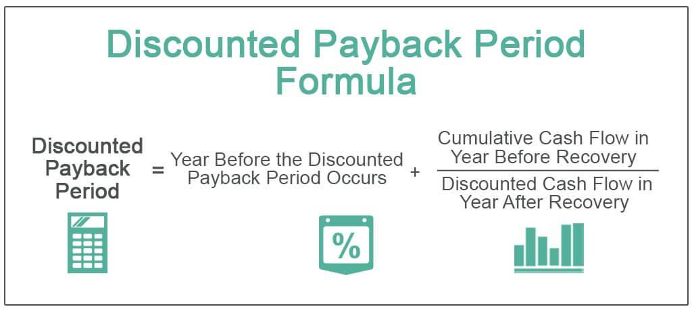

## Table of Contents

## What is the Discounted Payback Period (DPP)?

The Discounted Payback Period (DPP) is a financial tool used to figure out how long it will take for an investment to pay back its initial cost, considering the time value of money. This means that future cash flows are adjusted to reflect their present value, which is less than their future value due to inflation and other factors. By using DPP, investors can see when they will break even on their investment, taking into account that money received in the future is worth less than money received today.

To calculate the DPP, you first need to discount each of the future cash flows back to their present value using a discount rate. Then, you add up these discounted cash flows until the total equals the initial investment cost. The point at which this happens is the Discounted Payback Period. This method helps investors make better decisions by considering the reduced value of future earnings, providing a more realistic timeline for when an investment will start generating profit.

## How does the Discounted Payback Period differ from the regular Payback Period?

The Discounted Payback Period (DPP) and the regular Payback Period (PP) both help you figure out how long it takes to get your money back from an investment. But they do it in different ways. The regular Payback Period just adds up the cash you get back each year until it equals what you spent at the start. It's simple and doesn't worry about when you get the money, just how much.

On the other hand, the Discounted Payback Period takes into account that money you get in the future is not as valuable as money you get now. This is because of things like inflation. So, DPP adjusts the future cash you expect to get by making it worth less today. This means it usually takes longer to reach the break-even point with DPP than with the regular PP, because the future money is discounted.

In short, the main difference is that DPP considers the time value of money, making it a more accurate but also more complex way to see when you'll get your investment back. The regular PP is easier to calculate but doesn't give you the full picture because it treats all money the same, no matter when you get it.

## Why is the Discounted Payback Period important in investment analysis?

The Discounted Payback Period is important in investment analysis because it helps investors understand when they will get their money back, taking into account that money in the future is worth less than money today. This is useful because it gives a more realistic timeline for when an investment will start making a profit. By considering the time value of money, investors can make better decisions about whether an investment is worth the risk and how long they need to wait before they see any returns.

Using the Discounted Payback Period also helps investors compare different investment opportunities more accurately. Since it adjusts for the time value of money, it levels the playing field between projects that might have different cash flow patterns. This means investors can see which investments will pay back faster in real terms, helping them choose the ones that will bring them money back sooner and potentially be more profitable in the long run.

## What are the steps to calculate the Discounted Payback Period?

To calculate the Discounted Payback Period, you start by figuring out the present value of each cash flow the investment will bring in. You do this by using a discount rate, which is like an [interest rate](/wiki/interest-rate-trading-strategies) that shows how much less valuable money in the future is compared to money today. You take each year's expected cash flow and divide it by (1 + discount rate) raised to the power of the number of years into the future that cash flow is expected. For example, if you expect to get $100 in one year and the discount rate is 10%, you'd calculate $100 / (1 + 0.10)^1, which equals about $90.91. You do this for each year's cash flow to find the present value of all the money you expect to get back from the investment.

After you have the present value of each cash flow, you add them up year by year until the total equals the amount you initially invested. This is the Discounted Payback Period. Let's say you invested $1,000 and the first year's discounted cash flow is $90.91, the second year's is $82.64, and the third year's is $75.13. You add $90.91 and $82.64 to get $173.55, which is not enough to cover the $1,000 investment. Adding the third year's $75.13 brings the total to $248.68, still not enough. You keep adding until the total of the discounted cash flows reaches or exceeds $1,000. If the total after four years is $1,050, then the Discounted Payback Period is somewhere between three and four years. To find the exact point, you can use a formula to interpolate between the last year before you break even and the year you do break even.

## How do you determine the discount rate for DPP calculations?

Choosing the right discount rate for Discounted Payback Period calculations can be tricky, but it's really important. The discount rate is like an interest rate that shows how much less valuable money in the future is compared to money today. You can use different methods to figure out the right rate. One common way is to use the cost of capital for the company, which is the rate the company pays to get money for investments. This rate can be the interest rate on loans, the cost of equity, or a mix of both. Another way is to use a rate that matches the risk of the investment. If the investment is riskier, you might use a higher discount rate to show that future money from that investment is even less valuable.

Once you pick a discount rate, it's important to think about why you chose it. If you're using the cost of capital, you're saying the investment should at least make as much money as it costs the company to get the money in the first place. If you're using a risk-adjusted rate, you're saying the investment needs to make more money because it's riskier. The discount rate you choose can change the Discounted Payback Period a lot, so it's good to try different rates to see how they affect your calculations. This can help you understand how sensitive your investment decision is to the rate you choose.

## Can you provide a simple example of calculating the Discounted Payback Period?

Let's say you invested $1,000 in a project, and you expect to get $500 each year for the next three years. You decide to use a discount rate of 10% because that's what it costs your company to borrow money. To find the Discounted Payback Period, you need to figure out the present value of each year's $500. For the first year, you divide $500 by (1 + 0.10)^1, which is about $454.55. For the second year, you divide $500 by (1 + 0.10)^2, which is about $413.22. For the third year, you divide $500 by (1 + 0.10)^3, which is about $375.66.

Now, you add up these discounted cash flows until you reach or pass the $1,000 you invested. The first year's $454.55 isn't enough, so you add the second year's $413.22, which gives you a total of $867.77. That's still not enough, so you add the third year's $375.66, which brings the total to $1,243.43. Since the total after three years is more than $1,000, the Discounted Payback Period is between two and three years. To find the exact point, you can use a formula to figure out how much of the third year's cash flow you need to reach $1,000. In this case, you need about $132.23 more after the first two years, which is about 0.35 of the third year's $375.66. So, the Discounted Payback Period is about 2.35 years.

## What are the limitations of using the Discounted Payback Period as an investment criterion?

The Discounted Payback Period has some problems when you use it to decide on investments. One big issue is that it only looks at how long it takes to get your money back, not at what happens after that. So, if an investment keeps making money after you've gotten your initial investment back, the DPP won't show that. This means you might miss out on good investments that take a bit longer to pay back but then make a lot of money.

Another problem is that the DPP can be hard to figure out because you need to pick a discount rate. If you choose the wrong rate, your calculations could be way off. Also, the DPP doesn't tell you anything about how risky the investment is. Two investments might have the same DPP, but one could be much riskier than the other. So, you need to use other ways to look at investments too, not just the DPP.

## How does the choice of discount rate affect the Discounted Payback Period?

The discount rate you pick can change the Discounted Payback Period a lot. A higher discount rate means future money is worth less today, so it takes longer to get your money back. If you use a 10% discount rate instead of a 5% one, the present value of the money you expect to get in the future will be lower. This means you'll need more years of cash flows to add up to the amount you invested at the start.

On the other hand, a lower discount rate makes future money worth more today, so the Discounted Payback Period will be shorter. If you're not sure what discount rate to use, it's a good idea to try different rates and see how they change the DPP. This can help you understand how sensitive your investment decision is to the rate you choose.

## In what scenarios is the Discounted Payback Period most useful?

The Discounted Payback Period is most useful when you want to know how long it will take to get your money back from an investment, while also thinking about the fact that money in the future is worth less than money today. This makes it great for comparing different investments where the timing of when you get money back is important. For example, if you're deciding between two projects and one pays back faster after adjusting for the time value of money, the DPP can help you see that.

It's also really helpful when you're working with projects that have a lot of upfront costs and you need to see when you'll break even. This is common in industries like manufacturing or energy, where big investments in equipment or infrastructure are needed before you start making money. By using the DPP, you can figure out if the investment will pay off within a time frame that makes sense for your business, considering that future cash flows are discounted.

## How can the Discounted Payback Period be used alongside other investment appraisal techniques?

The Discounted Payback Period can be used with other ways to look at investments to get a fuller picture of whether an investment is a good idea. For example, you can use the DPP along with the Net Present Value (NPV) method. The DPP tells you how long it will take to get your money back, considering that money in the future is worth less than money today. The NPV, on the other hand, tells you the total value of the investment by adding up all the discounted cash flows and subtracting the initial cost. By using both, you can see not only when you'll break even but also how much profit the investment might make over time.

Another way to use the DPP is with the Internal Rate of Return (IRR). The IRR is the discount rate that makes the NPV of all cash flows from a project equal to zero. It helps you understand the rate of return you can expect from the investment. While the DPP focuses on the time it takes to recover your initial investment, the IRR gives you an idea of the investment's profitability. Together, these two methods can help you decide if an investment is worth it by looking at both the time to break even and the potential return on investment.

## What are some advanced considerations or adjustments that can be made to the DPP calculation?

When calculating the Discounted Payback Period, you might want to think about things like inflation and how it can change the value of money over time. Inflation means that the money you get back in the future won't be worth as much as it is today. To deal with this, you can adjust your discount rate to include an inflation rate. This makes your DPP calculation more accurate because it takes into account that the money you get back will be worth less due to inflation.

Another thing to consider is the risk of the investment. Different investments can be more or less risky, and this can affect how much you should discount future cash flows. If an investment is riskier, you might want to use a higher discount rate to show that the future money is even less valuable because there's a bigger chance you won't get it. By adjusting the discount rate based on the risk, you can make your DPP calculation more realistic and better reflect the true time it will take to get your money back.

## How does the Discounted Payback Period apply to different types of investments, such as renewable energy projects?

The Discounted Payback Period is really useful when you're looking at investments in renewable energy projects, like solar panels or wind farms. These projects often need a lot of money upfront to buy and set up the equipment. The DPP helps you figure out how long it will take to get that money back, while also thinking about the fact that money you get in the future is worth less than money today. For example, if you're thinking about putting solar panels on your house, the DPP can tell you how many years it will take for the savings on your electricity bill to add up to the cost of the panels, after adjusting for the time value of money.

In the case of renewable energy, the DPP is especially helpful because these projects usually have a long life and can keep saving or making money for many years after you get your initial investment back. By using the DPP, you can see if the investment will pay off within a time frame that makes sense for you, considering that future savings are discounted. This way, you can make a smarter decision about whether to go ahead with the project or look at other options.

## What is the Discounted Payback Period and how can it be understood?

The discounted payback period is a refined version of the traditional payback period, incorporating the concept of the time value of money. This adjustment acknowledges that a dollar received today is worth more than a dollar received in the future, due to its potential [earning](/wiki/earning-announcement) capacity. This metric provides investors with a clearer view of when they can expect to recover their initial investment, taking into account the present value of future cash flows.

The traditional payback period calculates the time required to recover the initial investment without considering the diminishing value of future cash inflows. This oversight can lead to misinformed investment decisions, particularly when assessing long-term projects with varied cash flow distributions. 

In contrast, the discounted payback period adds a layer of financial realism by discounting future cash flows back to their present value. This is achieved using a discount rate, which reflects the opportunity cost of capital or the risk-adjusted rate of return. The formula for calculating the present value (PV) of a future cash flow (CF) at time $t$ is:

$$
PV = \frac{CF}{(1 + r)^t}
$$

where $r$ is the discount rate.

The discounted payback period is determined by calculating the cumulative discounted cash flows until the initial investment is completely recovered. The process typically involves the following:

1. **Estimate Future Cash Flows**: Identify the expected cash inflows from the investment for each period.
2. **Select a Discount Rate**: Choose an appropriate rate based on market conditions and the specific risk associated with the investment.
3. **Discount Future Cash Flows**: Apply the discount rate to each of the future cash flows to calculate their present values.
4. **Calculate Cumulative Discounted Cash Flows**: Sum the present values of the cash flows sequentially until the initial investment amount is reached.

The choice of discount rate greatly influences the outcome of the discounted payback period. A higher rate will reduce the present value of future cash flows, potentially extending the payback period.

To illustrate the concept, consider an investment requiring an initial outlay of $10,000, with expected annual cash inflows of $3,000, $3,500, $4,000, and $4,500 over four years. Assuming a discount rate of 10%, the present values of the cash inflows are calculated for each year, and the cumulative discounted cash flows are tracked until the initial investment is recovered.

The discounted payback period improves upon its traditional counterpart by offering a more nuanced view of project feasibility. However, it has limitations, such as ignoring cash flows occurring after the payback period, which might affect the overall attractiveness of the investment. Additionally, the difficulty in accurately predicting future cash flows and the appropriate discount rate can pose significant challenges.

By understanding and applying the discounted payback period, investors can better evaluate potential investments, balancing the timing of cash recovery against the inherent time value of money.

## How is the Discounted Payback Period Calculated?

The discounted payback period is a crucial metric in investment analysis, as it considers the time value of money, offering a more accurate assessment than the traditional payback period. Here's a step-by-step guide on calculating the discounted payback period, using a discount rate, along with an illustrative example.

### Step-by-Step Guide on Calculation

1. **Identify Initial Investment and Cash Flows**: Determine the initial cost of investment and estimate the future cash flows expected from the investment over a predetermined time period.

2. **Determine the Discount Rate**: The discount rate is typically the company’s weighted average cost of capital (WACC), the required rate of return, or a rate that reflects the investment's risk.

3. **Discount Future Cash Flows**: Convert future cash flows to their present value using the formula:
$$
   PV = \frac{CF}{(1 + r)^n}

$$
   where $PV$ is the present value, $CF$ is the cash flow, $r$ is the discount rate, and $n$ is the time period.

4. **Calculate Cumulative Discounted Cash Flows**: Sum the discounted cash flows cumulatively until they equal the initial investment.

5. **Determine the Payback Period**: The discounted payback period is the time at which the cumulative discounted cash flows equal the initial investment.

### Illustrative Example

Consider an investment with an initial cost of $1,000. The expected cash flows for the next four years are $400, $400, $400, and $400. Assume a discount rate of 10%.

- **Year 1**: $PV = \frac{400}{(1 + 0.10)^1} = 363.64$
- **Year 2**: $PV = \frac{400}{(1 + 0.10)^2} = 330.58$
- **Year 3**: $PV = \frac{400}{(1 + 0.10)^3} = 300.53$
- **Year 4**: $PV = \frac{400}{(1 + 0.10)^4} = 273.55$

Cumulative discounted cash flows are calculated as:
- End of Year 1: 363.64
- End of Year 2: 694.22
- End of Year 3: 994.75
- End of Year 4: 1,268.30

Here, the discounted payback period falls between Year 3 and Year 4. The exact calculation requires a linear interpolation to determine the exact point where cumulative discounted cash flows equal the initial investment.

### Choosing the Discount Rate

The appropriate discount rate should reflect the opportunity cost of capital and the investment's specific risk attributes. Market conditions, such as interest rates and economic growth projections, also influence this decision. Riskier investments will require a higher discount rate to compensate for the potential [volatility](/wiki/volatility-trading-strategies).

### Limitations and Pitfalls

While the discounted payback period is more informative than the simple payback period, it has limitations. It ignores cash flows beyond the payback period, potentially overlooking long-term profitability. It also requires accurate cash flow forecasting, which can be challenging. The choice of discount rate heavily influences results, and variations in market conditions can significantly alter perceived investment feasibility.

In conclusion, while the discounted payback period provides valuable insights into investment recovery timelines, it should be used in conjunction with other metrics like Net Present Value (NPV) and Internal Rate of Return (IRR) for comprehensive investment appraisal.

## What is the importance of the Discounted Payback Period in Investment Analysis?

The discounted payback period is a favored metric in investment analysis due to its ability to incorporate the time value of money, which traditional payback periods often neglect. This characteristic provides a more realistic evaluation of an investment's break-even point, making it particularly advantageous in assessing projects with longer lifespans or variable cash flows. Investors and financial analysts prefer this metric as it offers a nuanced perspective of risk by considering the discounting of future cash inflows, thereby reflecting potential profitability more accurately.

Comparatively, other investment evaluation techniques like Net Present Value (NPV) and Internal Rate of Return (IRR) provide comprehensive insights into the viability of projects but may not emphasize the timing aspect of cash recovery as distinctly. NPV calculates the total value today of future cash flows minus initial investments, offering a straightforward indication of profitability. It is expressed as:

$$
NPV = \sum_{t=0}^{n} \frac{CF_t}{(1 + r)^t} - C_0
$$

where $CF_t$ is the cash flow at time $t$, $r$ is the discount rate, and $C_0$ is the initial investment.

IRR, on the other hand, is the discount rate that makes the NPV of an investment zero. Both NPV and IRR focus on the overall profitability or return potential, sometimes overlooking interim [liquidity](/wiki/liquidity-risk-premium) concerns, which are critical for investors with specific cash flow management requirements. The discounted payback period complements these methods by highlighting the time required to recoup the initial investment in present value terms, thus playing a crucial role in liquidity assessment.

Case studies demonstrate scenarios where the discounted payback period has provided enhanced insight into project feasibility. For instance, in capital-intensive projects such as infrastructure development, where cash inflows might take several years to scale, the discounted payback period can effectively convey whether the initial outlay will be recovered within an acceptable timeframe. This reassures stakeholders of a project's financial viability, often becoming a deciding [factor](/wiki/factor-investing) in project approval processes.

Real-world applications reveal the discounted payback period's utility in various sectors, prominently including renewable energy projects, where long-term sustainability is projected over immediate returns. In technology and R&D investments, despite potentially high long-run NPV or IRR values, a daunting discounted payback period may alert investors to reconsider cash flow timing risks.

In summary, the discounted payback period provides unique insights into investment analysis by focusing on cash flow timing and liquidity aspects. When integrated with other financial metrics, it enhances strategic decision-making, offering a holistic view of both risk and return.

## References & Further Reading

[1]: ["Principles of Corporate Finance"](https://www.mheducation.com/highered/product/principles-corporate-finance-brealey-myers/M9781264080946.html) by Richard A. Brealey, Stewart C. Myers, and Franklin Allen

[2]: ["Investment Valuation: Tools and Techniques for Determining the Value of Any Asset"](https://books.google.com/books/about/Investment_Valuation.html?id=5SRHAAAAQBAJ) by Aswath Damodaran

[3]: ["Valuation: Measuring and Managing the Value of Companies"](https://www.amazon.com/Valuation-Measuring-Managing-Companies-Finance/dp/1119610885) by McKinsey & Company Inc.

[4]: ["Financial Modeling and Valuation: A Practical Guide to Investment Banking and Private Equity"](https://www.wiley.com/en-us/Financial+Modeling+and+Valuation%3A+A+Practical+Guide+to+Investment+Banking+and+Private+Equity%2C+2nd+Edition-p-9781119808879) by Paul Pignataro

[5]: Sharpe, W. F. (1966). ["Mutual Fund Performance."](https://www.jstor.org/stable/pdf/2351448.pdf) Journal of Business, 39(1), 119-138.