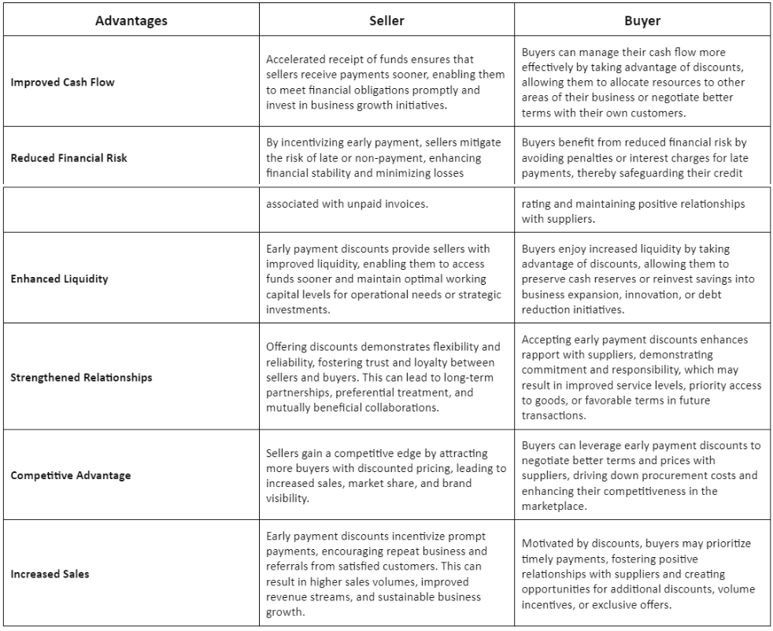

## Table of Contents

## What is a discounted payoff?

A discounted payoff is when someone owes money on a loan, like a mortgage, but they can't pay it all back. Instead of paying the full amount, they agree with the lender to pay a smaller amount to settle the debt. This smaller amount is called the discounted payoff because it's less than what was originally owed.

This can happen when someone is facing financial trouble and needs a way out. The lender might agree to a discounted payoff because getting some money back is better than getting none if the person can't pay at all. It helps both the borrower, who gets relief from the debt, and the lender, who recovers part of the loan.

## How does a discounted payoff work?

A discounted payoff happens when someone who owes money on a loan, like a house loan, can't pay it all back. They talk to the lender and agree to pay a smaller amount instead of the full amount they owe. This smaller amount is called the discounted payoff. It's a way to settle the debt without paying everything. People might do this if they're having money problems and need a way to get out of the debt.

The lender might agree to a discounted payoff because getting some money back is better than getting nothing at all. If the person can't pay the full amount, the lender might lose everything. By accepting a smaller amount, the lender can at least recover part of the loan. This helps the borrower because they don't have to pay the full amount, and it helps the lender because they get some money back. It's a solution that can work for both sides when someone is struggling to pay their debt.

## What are the basic steps to negotiate a discounted payoff?

To negotiate a discounted payoff, first, you need to talk to your lender. Explain your financial situation honestly and clearly. Tell them why you can't pay the full amount and why a discounted payoff is necessary. It's important to be open and show them any proof of your financial hardship, like bills or a letter from your employer.

Next, make an offer. Decide on a lower amount you can afford to pay and suggest it to the lender. Be ready to explain why this amount is fair and why it's better for them to accept it than to get nothing. The lender might say no at first, so be patient and ready to negotiate. They might counter with a different amount, so you'll need to discuss until you both agree on a number.

Once you and the lender agree on the discounted payoff amount, get everything in writing. Make sure the agreement says that paying this amount will settle your debt completely. After you both sign the agreement, pay the agreed amount. This way, you'll be free from the debt, and the lender will have gotten some money back.

## What are the advantages of a discounted payoff for a borrower?

A discounted payoff helps a borrower by letting them pay less than what they owe. If someone is having money problems and can't pay their full loan, this is a good way to get out of debt. Instead of struggling to pay everything, they can settle the debt with a smaller amount. This can stop them from worrying about the debt and help them move on with their life.

Another advantage is that it can stop the lender from taking legal action. If someone can't pay their loan, the lender might try to take them to court or take their property. A discounted payoff can prevent this from happening. By paying a smaller amount, the borrower can avoid these problems and keep their property or avoid legal trouble.

## What are the potential disadvantages of a discounted payoff for a borrower?

A discounted payoff might hurt the borrower's credit score. When someone agrees to pay less than what they owe, it shows up on their credit report. This can make it hard for them to get loans or credit cards in the future. Lenders might see the discounted payoff as a sign that the person had trouble paying their debts, which can make them less likely to lend money again.

Another problem is that the borrower might have to pay taxes on the forgiven debt. If the lender agrees to accept less money, the difference between what was owed and what was paid can be considered income by the tax authorities. This means the borrower might have to pay taxes on that amount, which could be a surprise and add to their money problems.

Sometimes, negotiating a discounted payoff can be hard and take a lot of time. The borrower has to talk to the lender, explain their situation, and try to reach an agreement. This can be stressful and might not work out. If the lender says no, the borrower might be back to square one, still owing the full amount.

## How does a discounted payoff affect a borrower's credit score?

A discounted payoff can make a borrower's credit score go down. When someone agrees to pay less than what they owe, it shows up on their credit report as a negative mark. This is because lenders see it as a sign that the person had trouble paying their debts. A lower credit score can make it harder for the borrower to get new loans or credit cards in the future. Lenders might think the person is a bigger risk and might not want to lend them money.

The effect on the credit score can last for a while. Usually, a discounted payoff stays on a credit report for seven years. During this time, it can keep the borrower's credit score low. This means they might have to wait a long time before their credit score goes back up. It's important for borrowers to think about this before agreeing to a discounted payoff, because it can affect their ability to borrow money for a long time.

## What are the tax implications of a discounted payoff?

When someone gets a discounted payoff, they might have to pay taxes on the amount of debt that was forgiven. If the lender agrees to accept less money than what was owed, the difference between the original debt and the discounted payoff can be seen as income by the tax authorities. This means the borrower might have to pay taxes on that forgiven amount. For example, if someone owed $10,000 but only paid $7,000, they might have to pay taxes on the $3,000 that was forgiven.

This can be a surprise for the borrower and might add to their money problems. They need to think about this before agreeing to a discounted payoff. It's a good idea to talk to a tax professional to understand how much they might have to pay in taxes and to plan for it. This way, they won't be caught off guard by a big tax bill after they thought they had settled their debt.

## How do lenders benefit from agreeing to a discounted payoff?

Lenders benefit from agreeing to a discounted payoff because it helps them get some money back when a borrower can't pay the full amount. If the lender doesn't agree to the discounted payoff, they might get nothing at all if the borrower goes bankrupt or can't pay. By accepting a smaller amount, the lender can at least recover part of the loan, which is better than losing everything.

Another way lenders benefit is by avoiding the costs and time of legal action. If a borrower can't pay, the lender might have to take them to court or try to take their property. This can be expensive and take a long time. A discounted payoff lets the lender settle the debt quickly and save money on legal fees. It's a simpler way to get some money back without the hassle of a long legal process.

## What are the risks for lenders in accepting a discounted payoff?

Lenders take a risk when they agree to a discounted payoff because they get less money than they loaned out. If they accept a smaller amount, they lose the difference between what was owed and what they got. This can hurt their profits, especially if they have given out a lot of loans with discounted payoffs. They need to be careful because too many discounted payoffs can make it hard for them to stay in business.

Another risk for lenders is that they might set a bad example. If they agree to a discounted payoff for one borrower, other borrowers might ask for the same deal. This can lead to more people wanting to pay less than they owe, which can cause more problems for the lender. They need to think about how agreeing to one discounted payoff might make other borrowers expect the same treatment.

## Can you provide a real-world example of a successful discounted payoff?

A family in California was struggling to pay their mortgage after the main breadwinner lost his job. They owed $250,000 on their house but could only afford to pay $150,000. They talked to their bank and explained their situation honestly. The bank saw that the family was in real trouble and agreed to a discounted payoff of $180,000. This was less than what the family owed, but more than they could pay at the time. By agreeing to this amount, the family could settle their debt and keep their home.

The bank benefited too because they got some money back instead of risking losing everything if the family couldn't pay at all. The family had to pay taxes on the $70,000 that was forgiven, but they worked with a tax professional to plan for it. In the end, the discounted payoff helped the family get out of a tough spot and gave the bank a way to recover part of their loan.

## How does the process of a discounted payoff differ between different types of loans (e.g., mortgage, personal loan)?

The process of a discounted payoff can be different depending on the type of loan. For a mortgage, the borrower might start by talking to their bank or the company that services their loan. They need to explain why they can't pay the full amount and show proof of their financial trouble. The bank might agree to a discounted payoff if they think it's better to get some money back than to go through a long foreclosure process. If they agree, the borrower pays the smaller amount, and the bank releases the mortgage. The borrower might have to pay taxes on the forgiven part of the loan, and it can affect their credit score.

For a personal loan, the process can be a bit simpler because there's no property involved. The borrower talks to the lender and explains their situation. They might offer to pay a smaller amount to settle the debt. If the lender agrees, the borrower pays the discounted amount, and the debt is cleared. Like with a mortgage, the forgiven amount might be taxable, and it can hurt the borrower's credit score. But since personal loans don't involve property, the lender might be more willing to negotiate a discounted payoff to avoid the cost and time of legal action.

## What advanced strategies can be used to maximize the benefits of a discounted payoff?

One advanced strategy to maximize the benefits of a discounted payoff is to work with a professional, like a financial advisor or a lawyer. They can help you talk to the lender and make a strong case for why you should get a discounted payoff. They know how to negotiate and can help you get the best deal possible. They can also help you understand the tax implications and plan for them, so you don't get a surprise tax bill later. Having a professional on your side can make the whole process easier and help you save more money.

Another strategy is to be very organized and prepared. Before you talk to the lender, gather all your financial documents, like bills, bank statements, and any letters explaining your situation. Show the lender that you've tried everything you can to pay the full amount, but you just can't. Be ready to make a fair offer and explain why it's better for the lender to accept it than to get nothing. If the lender says no at first, don't give up. Keep negotiating and be patient. The more prepared and persistent you are, the better chance you have of getting a good discounted payoff.

## What is the Understanding of Discounted Payoff in Investment Evaluation?

Discounted payoff is a pivotal concept within financial analysis, particularly relevant in scenarios involving distressed debts. Fundamentally, a discounted payoff occurs when a debtor negotiates the settlement of their repayment obligations for an amount less than the original principal balance. This concept is essential in understanding the dynamics of debt restructuring, insolvency proceedings, and strategic financial management, especially during periods of financial distress.

One of the primary applications of discounted payoff is during debt restructuring or settlement negotiations. When a borrower is unable to meet their original debt commitments, creditors may agree to accept a reduced amount. This transaction benefits both parties: the borrower can discharge their obligations without further financial strain, while the creditor at least recovers a portion of what is owed, which may have been otherwise lost in case of default or bankruptcy.

From an investment evaluation perspective, discounted payoffs can significantly influence decision-making processes. Investors considering distressed assets or companies that are potential candidates for turnaround strategies must assess the probability and potential size of discounted payoffs. This assessment can inform their evaluation of risk versus reward, influencing decisions on whether to invest in securities or assets associated with such distressed entities.

To evaluate investments more effectively, investors can employ financial models that incorporate the potential for discounted payoffs. This involves analyzing the expected cash flows from the investment, considering the likelihood and impact of any potential repayment adjustments. Calculating the net present value (NPV) of these cash flows, investors can gauge the overall attractiveness of the investment. The formula for NPV is:

$$

NPV = \sum \frac{C_t}{(1 + r)^t} 
$$

where $C_t$ is the cash flow at time $t$, $r$ is the discount rate, and $t$ is the time period.

Understanding the mechanics behind discounted payoffs enables investors to negotiate more advantageous terms in financial agreements. By being aware of the potential for discounted settlements, investors can better manage liabilities and improve their overall financial standing.

In summary, discounted payoff is not only a tool for navigating distressed financial scenarios but also a critical component in the broader landscape of investment evaluation. Mastery of this concept provides investors with valuable insights and strategy development capabilities, aiding in effective decision-making and financial management.

## What is the role of financial analysis in algorithmic trading?

Financial analysis plays a pivotal role in evaluating the potential success of investment opportunities and in formulating effective trading strategies. One of the more advanced applications of financial analysis is found in [algorithmic trading](/wiki/algorithmic-trading), which utilizes complex computations and models to automate trading decisions. In this context, financial analysis is used to extract actionable insights from market data, allowing for the development of sophisticated trading algorithms designed to capitalize on fleeting market conditions.

Key to the effectiveness of algorithmic trading is the integration of financial analysis into trading protocols. Traders employ a variety of financial metrics to guide their algorithmic interventions, with the aim of improving decision-making processes and enhancing overall trading performance. Among these metrics, the discounted payback period (DPP) is particularly noteworthy due to its ability to [factor](/wiki/factor-investing) in the time value of money, thus offering a nuanced perspective over traditional payback periods.

The discounted payback period is calculated by discounting the cash flows of an investment to their present value and identifying the time required for these discounted cash flows to recoup the initial investment:

$$
\text{DPP} = \sum_{t=0}^T \left( \frac{C_t}{(1 + r)^t} \right)
$$

where $C_t$ represents the cash flow at time $t$, $r$ the discount rate, and $T$ the time at which cumulative discounted cash flow equals the initial outlay. This metric is advantageous in algorithmic trading, as it provides a detailed timeline for achieving break-even status, accommodating the impact of varying market conditions and interest rates.

By embedding such financial analyses into algorithmic models, traders can more precisely align their strategies with current and projected market conditions, as well as investor expectations. This alignment is crucial, as it allows for the dynamic adjustment of trading strategies, thereby optimizing the execution of buy and sell orders to maximize returns and mitigate risks.

Moreover, algorithmic trading systems often leverage real-time data feeds and [machine learning](/wiki/machine-learning) techniques to enhance financial analyses further, enabling more predictive and adaptive trading responses. Algorithms can be programmed to react to financial metrics in real-time, automatically altering trading positions based on quantitative analyses such as the discounted payback period.

For example, a Python-based trading strategy might utilize the NumPy and pandas libraries to manage and compute discounted cash flows efficiently, thereby integrating financial metrics into real-time trading decisions:

```python
import numpy as np
import pandas as pd

# Sample cash flows and discount rate
cash_flows = np.array([1000, 1500, 2000, 2500])
discount_rate = 0.08

# Calculate discounted cash flows
discounted_flows = cash_flows / (1 + discount_rate) ** np.arange(1, len(cash_flows) + 1)

# Determine the payback period
cumulative_flows = np.cumsum(discounted_flows)
dpp_index = np.where(cumulative_flows >= cash_flows[0])[0][0]

print(f"Discounted Payback Period: {dpp_index+1} years")
```

In conclusion, by incorporating advanced financial metrics into algorithmic trading models, financial analysis enables algorithmic traders to devise strategies that are quantitatively robust and strategically aligned with their investment objectives. As these technologies continue to evolve, the integration of detailed financial analyses will remain central to enhancing the precision and efficacy of algorithmic trading strategies.

## What is the Discounted Payback Period and How is it Applied?

The discounted payback period (DPP) is a critical financial metric used to assess the viability of an investment by considering the time value of money. Unlike the simple payback period which only calculates the time necessary to recover the initial investment without accounting for the depreciation of cash flows over time, the DPP provides a more accurate evaluation by discounting future cash flows to their present value before determining the breakeven point.

### Steps for Calculating the Discounted Payback Period

1. **Identify Initial Investment and Cash Flows**: Begin by establishing the initial investment cost and estimate the expected annual cash flows from the investment.

2. **Determine Discount Rate**: Choose an appropriate discount rate. This rate typically reflects the investment's cost of capital or required rate of return.

3. **Calculate Present Value of Cash Flows**: For each future cash flow, apply the formula:
$$
   \text{PV} = \frac{\text{CF}_t}{(1 + r)^t}

$$
   where $\text{CF}_t$ is the cash flow at time $t$, $r$ is the discount rate, and $t$ is the time period.

4. **Accumulate Discounted Cash Flows**: Sum the present values of cash flows sequentially until the cumulative total equals the initial investment cost.

5. **Determine DPP**: The discounted payback period is the point at which the cumulative discounted cash flows equals the initial investment.

### Illustrative Example

Let's assume an investment requires an initial outlay of $10,000, with projected cash inflows of $3,000 annually over five years, and a discount rate of 10%.

Calculations are as follows:

- Year 1: $\text{PV} = \frac{3,000}{(1 + 0.1)^1} = 2,727.27$
- Year 2: $\text{PV} = \frac{3,000}{(1 + 0.1)^2} = 2,479.34$
- Year 3: $\text{PV} = \frac{3,000}{(1 + 0.1)^3} = 2,253.11$
- Year 4: $\text{PV} = \frac{3,000}{(1 + 0.1)^4} = 2,048.28$
- Year 5: $\text{PV} = \frac{3,000}{(1 + 0.1)^5} = 1,862.61$

By year 4, cumulative discounted cash flows are $9,508.00, still short of the initial $10,000 investment. In the fifth year, the cumulative total surpasses the initial outlay, thus situating the DPP slightly after four years.

### Significance of the Discounted Payback Period

The DPP is a valuable tool for investors as it incorporates the time value of money, offering a more reliable measure than the simple payback period. It assists in identifying the time it takes for an investment to recover its costs in present value terms, thus aiding in investment evaluations and financial planning.

### Limitations

The primary limitation of the DPP is that it does not account for cash flows occurring after the payback period, potentially ignoring the overall profitability of the project. Furthermore, assumptions made in estimating cash flows and choosing a discount rate can introduce uncertainty, necessitating caution.

By comprehending the discounted payback period, investors and traders can make better-informed decisions, enabling a more strategic approach to evaluating investment opportunities. This indicator helps in understanding the financial dynamics of an investment in terms of both [liquidity](/wiki/liquidity-risk-premium) risk and the timing of returns.

## References & Further Reading

[1]: ["Discounted Cash Flow Analysis: A Guide for Analysts and Investors"](https://corporatefinanceinstitute.com/resources/valuation/discounted-cash-flow-dcf/) by WallStreetMojo.

[2]: Damodaran, A. (2006). ["Valuation Approaches and Metrics: A Survey of the Theory and Evidence."](https://people.stern.nyu.edu/adamodar/pdfiles/papers/valuesurvey.pdf) SSRN Electronic Journal.

[3]: ["Algorithmic Trading and DMA: An Introduction to Direct Access Trading Strategies"](https://www.amazon.com/Algorithmic-Trading-DMA-introduction-strategies/dp/0956399207) by Barry Johnson.

[4]: ["Financial Analysis: A Short Note on the Distinction Between Financial Analysis and Investment Evaluation"](https://www.investopedia.com/terms/f/financial-analysis.asp) by the Corporate Finance Institute.

[5]: Fernandez, P. (2015). ["Valuation using multiples. How do analysts reach their conclusions?"](https://www.semanticscholar.org/paper/Valuation-Using-Multiples%3A-How-Do-Analysts-Reach-Fern%C3%A1ndez/0c7a0dcb22c4450ccb6bf3cc7c690a92d1002df9) Global Journal of Finance and Management.