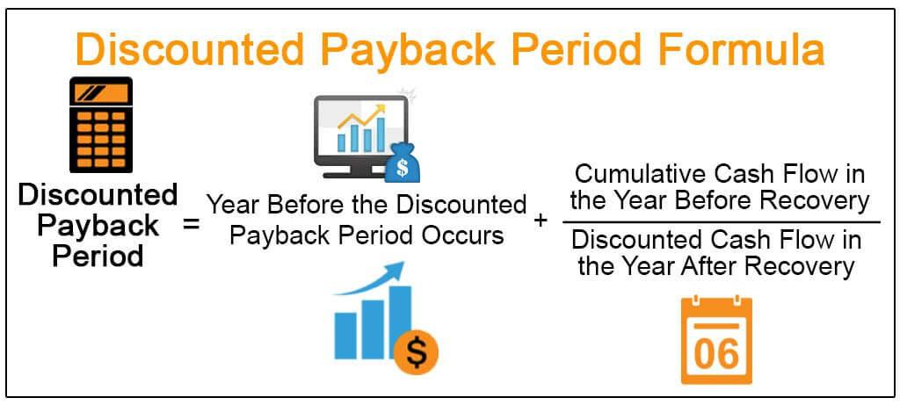

In the ever-evolving world of finance, the intricate interplay between discounted payoff, investment evaluation, financial analysis, and algorithmic trading has become increasingly significant. These concepts are at the forefront of modern financial management, offering frameworks and tools that enhance the precision and effectiveness of investment strategies. This article explores how these elements can be harnessed to optimize financial outcomes.

Discounted payoff is a fundamental principle in finance, particularly when assessing investment opportunities and managing liabilities. It revolves around the idea of the time value of money, where future cash flows are adjusted to reflect their present value. This adjustment is crucial for investment evaluation as it provides a clearer picture of whether the investment can meet desired financial objectives under realistically discounted scenarios.



Investment evaluation leverages the concept of discounted payoff to align with broader financial analysis practices. Financial analysis entails a systematic examination of financial data to gauge the viability of investment prospects and to understand the potential risks and returns they offer. In this light, methodologies like discounted cash flow analysis are not only crucial for assessing the intrinsic value of an investment but also for making informed decisions about capital allocation.

Algorithmic trading, on the other hand, employs advanced computational models and statistical techniques to automate trading decisions, often relying on financial indicators derived from comprehensive analyses. By integrating algorithmic trading with the principles of discounted payoff and financial analysis, traders are better equipped to respond flexibly to market fluctuations and to refine their strategies continuously. The use of algorithms helps streamline trading processes, exploit market efficiencies, and capitalize on arbitrage opportunities.

This article seeks to offer valuable insights into how these components contribute to effective financial investment strategies. By understanding and applying these interconnected concepts, investors can enhance their decision-making processes, adapt to market changes, and ultimately improve their financial performance.

## Table of Contents

## Understanding Discounted Payoff in Investment Evaluation

Discounted payoff is a pivotal concept within financial analysis, particularly relevant in scenarios involving distressed debts. Fundamentally, a discounted payoff occurs when a debtor negotiates the settlement of their repayment obligations for an amount less than the original principal balance. This concept is essential in understanding the dynamics of debt restructuring, insolvency proceedings, and strategic financial management, especially during periods of financial distress.

One of the primary applications of discounted payoff is during debt restructuring or settlement negotiations. When a borrower is unable to meet their original debt commitments, creditors may agree to accept a reduced amount. This transaction benefits both parties: the borrower can discharge their obligations without further financial strain, while the creditor at least recovers a portion of what is owed, which may have been otherwise lost in case of default or bankruptcy.

From an investment evaluation perspective, discounted payoffs can significantly influence decision-making processes. Investors considering distressed assets or companies that are potential candidates for turnaround strategies must assess the probability and potential size of discounted payoffs. This assessment can inform their evaluation of risk versus reward, influencing decisions on whether to invest in securities or assets associated with such distressed entities.

To evaluate investments more effectively, investors can employ financial models that incorporate the potential for discounted payoffs. This involves analyzing the expected cash flows from the investment, considering the likelihood and impact of any potential repayment adjustments. Calculating the net present value (NPV) of these cash flows, investors can gauge the overall attractiveness of the investment. The formula for NPV is:

$$

NPV = \sum \frac{C_t}{(1 + r)^t} 
$$

where $C_t$ is the cash flow at time $t$, $r$ is the discount rate, and $t$ is the time period.

Understanding the mechanics behind discounted payoffs enables investors to negotiate more advantageous terms in financial agreements. By being aware of the potential for discounted settlements, investors can better manage liabilities and improve their overall financial standing.

In summary, discounted payoff is not only a tool for navigating distressed financial scenarios but also a critical component in the broader landscape of investment evaluation. Mastery of this concept provides investors with valuable insights and strategy development capabilities, aiding in effective decision-making and financial management.

## Financial Analysis and its Role in Algorithmic Trading

Financial analysis plays a pivotal role in evaluating the potential success of investment opportunities and in formulating effective trading strategies. One of the more advanced applications of financial analysis is found in [algorithmic trading](/wiki/algorithmic-trading), which utilizes complex computations and models to automate trading decisions. In this context, financial analysis is used to extract actionable insights from market data, allowing for the development of sophisticated trading algorithms designed to capitalize on fleeting market conditions.

Key to the effectiveness of algorithmic trading is the integration of financial analysis into trading protocols. Traders employ a variety of financial metrics to guide their algorithmic interventions, with the aim of improving decision-making processes and enhancing overall trading performance. Among these metrics, the discounted payback period (DPP) is particularly noteworthy due to its ability to [factor](/wiki/factor-investing) in the time value of money, thus offering a nuanced perspective over traditional payback periods.

The discounted payback period is calculated by discounting the cash flows of an investment to their present value and identifying the time required for these discounted cash flows to recoup the initial investment:

$$
\text{DPP} = \sum_{t=0}^T \left( \frac{C_t}{(1 + r)^t} \right)
$$

where $C_t$ represents the cash flow at time $t$, $r$ the discount rate, and $T$ the time at which cumulative discounted cash flow equals the initial outlay. This metric is advantageous in algorithmic trading, as it provides a detailed timeline for achieving break-even status, accommodating the impact of varying market conditions and interest rates.

By embedding such financial analyses into algorithmic models, traders can more precisely align their strategies with current and projected market conditions, as well as investor expectations. This alignment is crucial, as it allows for the dynamic adjustment of trading strategies, thereby optimizing the execution of buy and sell orders to maximize returns and mitigate risks.

Moreover, algorithmic trading systems often leverage real-time data feeds and [machine learning](/wiki/machine-learning) techniques to enhance financial analyses further, enabling more predictive and adaptive trading responses. Algorithms can be programmed to react to financial metrics in real-time, automatically altering trading positions based on quantitative analyses such as the discounted payback period.

For example, a Python-based trading strategy might utilize the NumPy and pandas libraries to manage and compute discounted cash flows efficiently, thereby integrating financial metrics into real-time trading decisions:

```python
import numpy as np
import pandas as pd

# Sample cash flows and discount rate
cash_flows = np.array([1000, 1500, 2000, 2500])
discount_rate = 0.08

# Calculate discounted cash flows
discounted_flows = cash_flows / (1 + discount_rate) ** np.arange(1, len(cash_flows) + 1)

# Determine the payback period
cumulative_flows = np.cumsum(discounted_flows)
dpp_index = np.where(cumulative_flows >= cash_flows[0])[0][0]

print(f"Discounted Payback Period: {dpp_index+1} years")
```

In conclusion, by incorporating advanced financial metrics into algorithmic trading models, financial analysis enables algorithmic traders to devise strategies that are quantitatively robust and strategically aligned with their investment objectives. As these technologies continue to evolve, the integration of detailed financial analyses will remain central to enhancing the precision and efficacy of algorithmic trading strategies.

## The Discounted Payback Period and Its Application

The discounted payback period (DPP) is a critical financial metric used to assess the viability of an investment by considering the time value of money. Unlike the simple payback period which only calculates the time necessary to recover the initial investment without accounting for the depreciation of cash flows over time, the DPP provides a more accurate evaluation by discounting future cash flows to their present value before determining the breakeven point.

### Steps for Calculating the Discounted Payback Period

1. **Identify Initial Investment and Cash Flows**: Begin by establishing the initial investment cost and estimate the expected annual cash flows from the investment.

2. **Determine Discount Rate**: Choose an appropriate discount rate. This rate typically reflects the investment's cost of capital or required rate of return.

3. **Calculate Present Value of Cash Flows**: For each future cash flow, apply the formula:
$$
   \text{PV} = \frac{\text{CF}_t}{(1 + r)^t}

$$
   where $\text{CF}_t$ is the cash flow at time $t$, $r$ is the discount rate, and $t$ is the time period.

4. **Accumulate Discounted Cash Flows**: Sum the present values of cash flows sequentially until the cumulative total equals the initial investment cost.

5. **Determine DPP**: The discounted payback period is the point at which the cumulative discounted cash flows equals the initial investment.

### Illustrative Example

Let's assume an investment requires an initial outlay of $10,000, with projected cash inflows of $3,000 annually over five years, and a discount rate of 10%.

Calculations are as follows:

- Year 1: $\text{PV} = \frac{3,000}{(1 + 0.1)^1} = 2,727.27$
- Year 2: $\text{PV} = \frac{3,000}{(1 + 0.1)^2} = 2,479.34$
- Year 3: $\text{PV} = \frac{3,000}{(1 + 0.1)^3} = 2,253.11$
- Year 4: $\text{PV} = \frac{3,000}{(1 + 0.1)^4} = 2,048.28$
- Year 5: $\text{PV} = \frac{3,000}{(1 + 0.1)^5} = 1,862.61$

By year 4, cumulative discounted cash flows are $9,508.00, still short of the initial $10,000 investment. In the fifth year, the cumulative total surpasses the initial outlay, thus situating the DPP slightly after four years.

### Significance of the Discounted Payback Period

The DPP is a valuable tool for investors as it incorporates the time value of money, offering a more reliable measure than the simple payback period. It assists in identifying the time it takes for an investment to recover its costs in present value terms, thus aiding in investment evaluations and financial planning.

### Limitations

The primary limitation of the DPP is that it does not account for cash flows occurring after the payback period, potentially ignoring the overall profitability of the project. Furthermore, assumptions made in estimating cash flows and choosing a discount rate can introduce uncertainty, necessitating caution.

By comprehending the discounted payback period, investors and traders can make better-informed decisions, enabling a more strategic approach to evaluating investment opportunities. This indicator helps in understanding the financial dynamics of an investment in terms of both [liquidity](/wiki/liquidity-risk-premium) risk and the timing of returns.

## Incorporating Discounted Payoff into Algorithmic Trading Strategies

Incorporating discounted payoff analyses into algorithmic trading strategies can provide substantial benefits, with particular relevance in situations involving distressed debts. Discounted payoff, essentially settling debts for less than the principal, aligns well with algorithmic trading by offering a quantitative foundation for decision-making processes.

### Relevance of Discounted Payoff in Algorithmic Trading

The use of discounted payoff in algorithmic trading optimizes trading models by allowing algorithms to integrate complex financial calculations. These payoffs are critical when assessing the value and risk of distressed assets, which often feature prominently in trading strategies aiming to exploit market inefficiencies. By calculating expected cash flows and discounting them back to their present value, algorithms can make informed decisions, determining whether the market price justifies the underlying asset's risk level.

### Dynamic Strategy Adjustment

Traders leveraging discounted payoff analyses in their algorithmic strategies can adjust their actions dynamically in response to fluctuating market conditions. The integration of such data enables algorithms to continually reassess the risk-reward profile of particular trades. For instance, if a new payoff opportunity arises due to changing interest rates or credit spreads, algorithms equipped with discounted payoff models can factor in these changes to execute trades that align with predefined risk parameters and expected returns.

### Evaluating Risks and Rewards Using Payoff Graphs

Payoff graphs serve as a vital tool for algorithmic traders, providing a visual representation of various trading strategies' potential outcomes. These graphs plot potential profits or losses against different scenarios, incorporating variables like time decay and [volatility](/wiki/volatility-trading-strategies). By overlaying discounted payoff data, traders can visually assess the implications of different strategic choices, enhancing their ability to predict and respond to market movements. This visualization aids in strategic planning, ensuring that trades are only executed when the potential rewards adequately compensate for the associated risks.

### Scenario-Based Illustrations

To effectively integrate discounted payoff evaluations into their strategies, algorithmic traders often employ scenario-based analyses. For example, consider a distressed debt investment where the probability of a successful payoff is evaluated against scenarios like economic downturns or [interest rate](/wiki/interest-rate-trading-strategies) shifts. By simulating these scenarios, algorithms can calculate expected payoffs under varying conditions, determining the most advantageous times to enter or [exit](/wiki/exit-strategy) positions.

#### Python Illustration

A basic Python script could simulate such scenario evaluations:

```python
import numpy as np

def discounted_payoff(rate, periods, principal):
    return principal / (1 + rate)**periods

# Simulate potential interest rate changes
interest_rates = np.linspace(0.01, 0.1, num=10)  # From 1% to 10%

# Calculate discounted payoffs
for rate in interest_rates:
    payoff = discounted_payoff(rate, 5, 1000)  # 5 periods, $1000 principal
    print(f"Rate: {rate:.2%}, Discounted Payoff: ${payoff:.2f}")
```

Incorporating discounted payoff models through Python or other programming languages allows algorithmic traders to automate these processes efficiently, adapting in real-time to emerging data and thus executing trades that leverage time-sensitive opportunities effectively. As the finance sector continually evolves, the integration of discounted payoff into algorithmic trading strategies will likely become increasingly sophisticated, offering traders a robust framework for optimizing financial outcomes.

## Conclusion

The integration of discounted payoff, investment evaluation, financial analysis, and algorithmic trading creates a robust framework for effective financial management. These elements, when strategically blended, enable investors and traders to adeptly navigate complex market landscapes. By leveraging advanced financial metrics and algorithmic models, market participants can fine-tune their investment strategies, thereby enhancing their potential for achieving financial objectives.

The dynamic nature of financial markets necessitates a commitment to continual learning and adaptation. Investors must stay abreast of evolving techniques and methodologies to maintain their competitive edge. The growing trend toward deeper integration of discounted payoff analyses and algorithmic trading is likely to lead to the development of more sophisticated approaches to financial analysis and trading strategies.

This integration is not just a forward-thinking strategy but a necessity for those looking to capitalize on future market opportunities. As technological advancements continue to transform financial landscapes, the ability to synthesize these components will be crucial for sustained success in investment endeavors.

## References & Further Reading

[1]: ["Discounted Cash Flow Analysis: A Guide for Analysts and Investors"](https://corporatefinanceinstitute.com/resources/valuation/discounted-cash-flow-dcf/) by WallStreetMojo.

[2]: Damodaran, A. (2006). ["Valuation Approaches and Metrics: A Survey of the Theory and Evidence."](https://people.stern.nyu.edu/adamodar/pdfiles/papers/valuesurvey.pdf) SSRN Electronic Journal.

[3]: ["Algorithmic Trading and DMA: An Introduction to Direct Access Trading Strategies"](https://www.amazon.com/Algorithmic-Trading-DMA-introduction-strategies/dp/0956399207) by Barry Johnson.

[4]: ["Financial Analysis: A Short Note on the Distinction Between Financial Analysis and Investment Evaluation"](https://www.investopedia.com/terms/f/financial-analysis.asp) by the Corporate Finance Institute.

[5]: Fernandez, P. (2015). ["Valuation using multiples. How do analysts reach their conclusions?"](https://www.semanticscholar.org/paper/Valuation-Using-Multiples%3A-How-Do-Analysts-Reach-Fern%C3%A1ndez/0c7a0dcb22c4450ccb6bf3cc7c690a92d1002df9) Global Journal of Finance and Management.