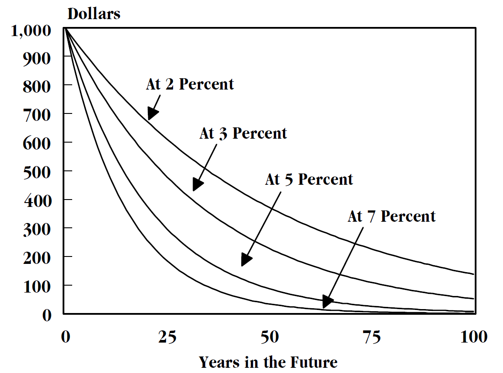

## Table of Contents

## What is discounting in finance?

Discounting in finance is a way to figure out how much money you'll have in the future is worth right now. It's like saying, "If I'm going to get $100 in a year, how much is that worth to me today?" This is important because money today is usually worth more than the same amount of money in the future. That's because you could invest the money you have now and earn more from it over time.

To do discounting, you use a rate called the discount rate. This rate helps you figure out the present value of future money. For example, if you expect to get $100 in a year and the discount rate is 5%, you'd calculate that $100 in the future is worth about $95.24 today. This helps people and businesses make better decisions about investments, loans, and other financial choices by understanding the true value of money over time.

## Why is discounting important in financial decision making?

Discounting is important in financial decision making because it helps people and businesses understand the value of money over time. When you know how much future money is worth today, you can make better choices about where to invest or how to plan for the future. For example, if you're thinking about starting a business, you might want to know if the money you'll make in the future is worth the cost of starting up now. Discounting helps you figure that out by showing you the present value of those future earnings.

Another reason discounting is key is that it takes into account the time value of money. This means that a dollar today is worth more than a dollar in the future because you can use that dollar now to make more money. For instance, if you have $1,000 today, you could invest it and maybe have more than $1,000 in a year. By using discounting, you can see if waiting for money in the future is a good idea or if you should use the money you have now to grow it. This helps in making smarter financial plans and investments.

## How does discounting affect the time value of money?

Discounting directly affects the time value of money by showing how much future money is worth today. It uses a discount rate to figure this out. For example, if you're going to get $100 in a year, and the discount rate is 5%, discounting tells you that $100 in the future is worth about $95.24 today. This is because you could take that $95.24 now and invest it to get more than $100 in a year. So, discounting helps you see that money now is usually worth more than the same amount of money later.

This idea is really important for making financial decisions. If you know how much future money is worth today, you can decide if it's better to spend money now or wait for money later. For instance, if you're thinking about buying a car, you might want to know if the money you'll save by not buying the car now is worth more than the cost of the car. Discounting helps you make these kinds of choices by showing the real value of money over time.

## What is the difference between discounting and compounding?

Discounting and compounding are two sides of the same coin when it comes to understanding the time value of money. Discounting is about figuring out how much money you'll get in the future is worth right now. It's like saying, "If I'm going to get $100 in a year, how much is that worth to me today?" You use a discount rate to make this calculation. For example, if the discount rate is 5%, that $100 in the future is worth about $95.24 today. This helps you decide if it's better to have money now or wait for it later.

Compounding, on the other hand, is about how money grows over time. It's like saying, "If I have $100 today and I can earn 5% every year, how much will I have in the future?" With compounding, you earn interest on the money you started with, and then you earn interest on that interest, too. So, if you leave $100 in an account that gives you 5% interest each year, after one year you'll have $105. The next year, you'll earn 5% on $105, which means you'll have a bit more than $110.25. Compounding helps you see how your money can grow if you leave it alone for a while.

## What is a discount rate and how is it determined?

A discount rate is a number that helps you figure out how much money you'll get in the future is worth right now. It's like a tool that tells you if it's better to have money today or wait for it later. For example, if you're going to get $100 in a year and the discount rate is 5%, that $100 in the future is worth about $95.24 today. The discount rate is important because it helps you make smart choices about money, like whether to invest now or save for later.

The discount rate is determined by looking at different things, like how risky an investment is, what other investments are paying, and what the economy is doing. If an investment is risky, you might use a higher discount rate because you want more money now to make up for the risk. If other investments are paying a lot, you might use a higher discount rate too, because you could be making more money somewhere else. The economy also matters; if things are going well, you might use a lower discount rate because money in the future seems safer. So, the discount rate is not just one number; it changes based on what's going on around you.

## Can you explain the present value formula and its use in discounting?

The present value formula is a way to figure out how much money you'll get in the future is worth right now. It's like saying, "If I'm going to get $100 in a year, how much is that worth to me today?" The formula is simple: Present Value = Future Value / (1 + Discount Rate)^Number of Periods. For example, if you're going to get $100 in a year and the discount rate is 5%, you'd calculate it like this: $100 / (1 + 0.05)^1, which comes out to about $95.24. This means that $100 in the future is worth $95.24 today.

This formula is really important for discounting because it helps you make smart choices about money. When you know how much future money is worth today, you can decide if it's better to spend money now or wait for money later. For instance, if you're thinking about buying a car, you might want to know if the money you'll save by not buying the car now is worth more than the cost of the car. By using the present value formula, you can see the real value of money over time and make better financial plans and investments.

## How do different discount rates impact investment decisions?

Different discount rates can really change how you make investment decisions. A higher discount rate means you value money now a lot more than money in the future. So, if the discount rate is high, you might decide not to invest in something that will pay off later because the money you get now seems more important. For example, if you have a chance to get $1,000 in five years, a high discount rate would make that future money worth a lot less today, and you might choose to spend the money on something else right now.

On the other hand, a lower discount rate means you think money in the future is almost as good as money now. So, with a low discount rate, you might be more willing to invest in things that will pay off later. For instance, if you're thinking about starting a business that will make money in a few years, a low discount rate would make that future money seem more valuable today, and you might decide to go ahead with the investment. The discount rate you use can make a big difference in whether you decide to invest in something now or wait for a better opportunity.

## What are the common applications of discounting in business and personal finance?

In business, discounting is used a lot to make decisions about investments and projects. For example, if a company is thinking about building a new factory, they might use discounting to figure out if the money they'll make from the factory in the future is worth the cost of building it now. They do this by using a discount rate to see how much the future money is worth today. This helps them decide if the investment is a good idea or if they should spend their money on something else. Discounting also helps businesses compare different projects and choose the ones that will bring the most value over time.

In personal finance, discounting helps people make choices about saving, investing, and spending. For instance, if you're thinking about buying a house, you might use discounting to see if the money you'll save on rent in the future is worth the cost of buying the house now. This can help you decide if it's better to keep renting or to buy. Discounting also comes into play when you're thinking about retirement. You might use it to figure out how much money you need to save now to have enough to live on later. By understanding the present value of future money, you can make smarter decisions about your financial future.

## How does risk influence the choice of discount rate?

Risk plays a big role in deciding what discount rate to use. If an investment is risky, you might choose a higher discount rate. This is because you want more money now to make up for the chance that you might not get all the money you're expecting later. For example, if you're thinking about investing in a new startup, it's pretty risky because the business might not do well. So, you'd use a higher discount rate to see if the money you might get in the future is worth the risk of investing now.

On the other hand, if an investment is safer, you might pick a lower discount rate. This means you think the money you'll get in the future is almost as good as money now. For instance, if you're investing in government bonds, they're usually pretty safe. So, you'd use a lower discount rate because you're more sure you'll get your money back. The discount rate helps you weigh the risk against the reward and make smarter choices about where to put your money.

## What are the limitations of using a single discount rate for all cash flows?

Using a single discount rate for all cash flows can be a problem because it doesn't take into account that different cash flows might have different levels of risk. For example, money you expect to get from a safe investment like a government bond is less risky than money from a new business venture. If you use the same discount rate for both, you might not see the real value of the money from the new business because it's riskier. This can lead to bad decisions, like thinking the new business is a better investment than it really is.

Another issue is that a single discount rate doesn't consider how the value of money can change over time. The economy can go up and down, and what's a good discount rate today might not be right in a few years. If you stick with one rate, you might miss out on better opportunities or make choices that don't fit with what's happening in the world. So, it's better to use different discount rates for different cash flows and to update them as things change.

## How can discounting be applied in more complex financial models like discounted cash flow (DCF) analysis?

Discounting is a key part of discounted cash flow (DCF) analysis, which is a way to figure out how much a company or an investment is worth. In DCF analysis, you look at all the money the company is expected to make in the future and then use discounting to see how much that money is worth today. You do this by choosing a discount rate that matches the risk of the investment. If the investment is risky, you use a higher discount rate, and if it's safe, you use a lower one. Then, you use the present value formula to turn each future cash flow into today's money. By adding up all these present values, you get the total value of the company or investment right now.

In more complex DCF models, you might have to deal with different kinds of cash flows that happen at different times and have different levels of risk. For example, a company might have cash flows from selling products, paying off debts, and investing in new projects. Each of these cash flows might need a different discount rate because they have different risks. You might use a higher discount rate for cash flows from a new project because it's riskier, and a lower rate for cash flows from selling products because they're more predictable. By using different discount rates for different cash flows, you can get a more accurate picture of the company's value. This helps you make better decisions about whether to invest in the company or not.

## What advanced techniques exist for adjusting discount rates over time in long-term projects?

In long-term projects, it's important to adjust discount rates over time because the risk and the value of money can change. One way to do this is by using a technique called the "term structure of discount rates." This means you use different discount rates for different periods in the future. For example, you might use a higher discount rate for the first few years when the project is riskier, and then lower it as the project becomes more stable. This helps you get a more accurate picture of the project's value over time.

Another technique is called "scenario analysis," where you look at different possible futures and use different discount rates for each one. For instance, if the economy might get better or worse, you'd use a lower discount rate for the good scenario and a higher one for the bad scenario. This way, you can see how the project's value might change depending on what happens. By adjusting the discount rates like this, you can make better decisions about long-term projects and understand how different risks might affect their value.

## What is Understanding Discounting in Finance?

Discounting in finance is the process of determining the present value of a future payment or series of payments. This calculation is founded on the principle of the 'time value of money', which asserts that a dollar available now is more valuable than the same dollar in the future due to its potential [earning](/wiki/earning-announcement) capacity. This foundational concept assumes that today's money can be invested to earn interest, leading to higher future value.

The present value $PV$ of a future amount $FV$ can be determined using the formula:

$$

PV = \frac{FV}{(1 + r)^n} 
$$

where $r$ is the discount rate and $n$ is the number of periods until the payment will be received. 

Discount rates are crucial in the discounting process as they incorporate interest rates and risk factors. The selection of an appropriate discount rate is vital, as it reflects the opportunity cost of capital, inflation expectations, and the risk associated with future cash flows. Higher discount rates are typically applied to riskier cash flows, which results in lower present values and vice versa.

Finance professionals employ discounting for various purposes including investment appraisal, bond pricing, and evaluating project valuations. For investments, the net present value (NPV) is calculated to determine whether an investment is expected to generate value above its cost. The NPV is the difference between the present value of cash inflows and outflows over a period of time.

For bond pricing, the present value of future coupon payments and the par value at maturity is calculated to assess the fair price of a bond. In project valuation, companies forecast future cash flows and discount them to determine the viability of projects and their potential contributions to shareholder wealth. 

The effectiveness of discounting lies in its ability to standardize future payments and cash flows to present value terms, providing a consistent framework for decision-makers in finance. Understanding how to accurately apply discounting is crucial for finance professionals tasked with assessing the potential profitability and risk of future cash flows.

## What is the relationship between Algorithmic Trading and the Role of Discounts?

Algorithmic trading automates the buying and selling of securities through pre-programmed algorithms that are designed to execute trades at speeds and frequencies that are impossible for human traders. Discounts play an essential role in shaping [algorithmic trading](/wiki/algorithmic-trading) strategies by influencing both cost and potential returns. Traders harness these discounts to refine transaction costs and bolster trade execution efficiency.

One significant aspect of trading involves time-based discounts, which involve adjusting future cash flows to their present value. The principle of time value of money underpins this strategy, allowing traders to account for opportunity costs linked to the holding period of a security. A formula central to this strategy is the present value formula:

$$
PV = \frac{FV}{(1 + r)^n}
$$

where $PV$ is the present value, $FV$ is the future value, $r$ is the discount rate, and $n$ is the number of periods until maturity. This methodology is crucial for accurately estimating the intrinsic value of trades and strategizing entry and exit points.

Volume-based discounts are another common strategy. These discounts provide cost reductions on larger trades, making it feasible to diminish transaction costs significantly. Exchanges and brokers often reward high-[volume](/wiki/volume-trading-strategy) traders with rebates or reduced fees, which can be incorporated into algorithmic systems to maximize returns on large-scale transactions.

Liquidity discounts involve pricing assets according to their market [liquidity](/wiki/liquidity-risk-premium). Assets with lower liquidity often experience higher [volatility](/wiki/volatility-trading-strategies) and risk, necessitating adjustments to the trade strategies. Traders consider the liquidity of an asset to forecast market impact and price changes, thereby fine-tuning their algorithms to either pursue or avoid particular trades based on liquidity conditions.

Algorithms might also incorporate counterparty discounts, focusing on the risks associated with trading partners. By adjusting risk factors based on the financial stability and behavior of counterparts, traders can mitigate risks associated with counterparty default or insufficient capital to complete transactions.

In summary, the integration of discount strategies within algorithmic trading enhances overall trading efficacy by meticulously calculating costs and potential profits through time-based, volume-based, and liquidity-focused adjustments. These discounts serve to refine algorithmic systems, thus optimizing the execution and financial outcome of trading strategies.

## What are the types of discounts in algorithmic trading?

Algorithmic trading relies on various discounting mechanisms to enhance the efficiency and efficacy of trade execution. Each type of discount responds to specific financial objectives and market conditions.

**Time-Based Discounts** are fundamental concepts in finance that involve adjusting future earnings to their present value. This is done by applying interest rates that reflect opportunity costs—essentially, the cost of forgoing alternative investments during the period. The present value (PV) can be computed using the formula:

$$

PV = \frac{FV}{(1 + r)^n} 
$$

where $FV$ is the future value of cash flows, $r$ is the discount rate, and $n$ is the number of periods. In algorithmic trading, time-based discounts help in accurately assessing the present worth of future returns, thus informing investment decisions by providing a realistic measure of profitability over time.

**Volume-Based Discounts** are used to reduce transaction costs by offering rebates or discounts on large trades. This type is akin to economies of scale, where the cost per unit decreases with an increase in the volume of transactions. In algorithmic trading frameworks, larger trade sizes often justify discounts from brokers or exchanges, as they guarantee higher liquidity and help in thinning the order book. Implementing these strategies effectively can lead to significant cost savings and more favorable trade execution.

**Liquidity Discounts** address the relationship between asset liquidity and pricing. Assets traded infrequently or with low volumes are subject to liquidity risk, precipitating price adjustments to compensate for the added risk of trading such assets. In essence, liquidity discounts reflect the spread between the bid and ask prices, providing a buffer against potential market impacts. Algorithms can be programmed to adjust offers dynamically based on real-time market liquidity data, thus optimizing trade positions for cost efficiency and risk management.

**Counterparty Discounts** deal with risks associated with trading partners. Different counterparties may present varying levels of risk due to their creditworthiness, trading history, or market behavior. Discounts are adjusted to reflect these risks, often quantified through counterparty scoring models. For example, trading with a counterparty with a high default risk might necessitate a higher discount to cushion against potential losses. Algorithmic trading platforms incorporate these factors into their risk management protocols, adjusting trade parameters to reflect the assessed risk levels of different counterparties.

Through these diverse discount strategies, algorithmic trading configurations optimize transaction efficiency, manage risk judiciously, and enhance profitability by taking into account immediate market conditions and potential future shifts.

## How is discounting applied in trading algorithms?

In algorithmic trading, discounting techniques play a pivotal role in enhancing the accuracy and effectiveness of trading strategies. Central to this application are valuation models, risk management strategies, and price prediction models, all of which leverage discounting principles.

### Valuation Models

Valuation models such as the Discounted Cash Flow (DCF) and the Dividend Discount Model (DDM) are fundamental in determining the worth of an asset's future income streams in today's terms. The DCF model calculates the present value of expected future cash flows. It uses the formula:

$$

PV = \sum \frac{CF_t}{(1 + r)^t} 
$$

where $PV$ represents the present value, $CF_t$ denotes the cash flow at time $t$, and $r$ is the discount rate. This discount rate reflects the opportunity cost of capital and any associated risks. Similarly, the DDM focuses on estimating the present value of expected future dividends, useful in valuing stocks.

### Risk Management

Risk management within trading algorithms is another critical application of discounting. By dynamically adjusting discount rates, traders can mitigate exposure to market volatility. This adaptability allows systems to account for changing market conditions and interest rates. Algorithms typically use historical volatility and [interest rate](/wiki/interest-rate-trading-strategies) data to determine appropriate discount rates, thus ensuring that the risk components of trading strategies remain aligned with their intended investment horizons.

### Price Prediction Models

Price prediction models incorporate discounting to refine forecasting accuracy. These models utilize historical pricing data, making adjustments for discounts to better anticipate future price movements. For example, a basic Python implementation for a time series prediction model might include evaluating discounted historical prices to predict future trends:

```python
import numpy as np

def discounted_price_prediction(prices, discount_rate):
    discounted_prices = []
    for t, price in enumerate(prices):
        discounted_price = price / ((1 + discount_rate) ** t)
        discounted_prices.append(discounted_price)
    return discounted_prices

# Example usage
historical_prices = [100, 105, 110, 115]
predicted_prices = discounted_price_prediction(historical_prices, 0.05)
```

In this Python function, prices are adjusted using a constant discount rate to update their values over time, offering a refined perspective on future pricing trends.

Through these models, discounting enables traders to make informed decisions by providing a more accurate measure of asset value, mitigating market risks, and enhancing predictive accuracy. As such, discounting remains an indispensable tool in developing robust algorithmic trading systems.

## References & Further Reading

[1]: Brealey, R. A., Myers, S. C., & Allen, F. (2017). ["Principles of Corporate Finance"](https://www.mheducation.com/highered/product/Principles-of-Corporate-Finance-Brealey.html). McGraw-Hill Education.

[2]: Hull, J. C. (2018). ["Options, Futures, and Other Derivatives"](https://www.semanticscholar.org/paper/Options%2C-Futures%2C-and-Other-Derivatives-Hull/89bdee500c8623864fc9eb7a471546aa713acc44). Pearson.

[3]: Lopez de Prado, M. (2018). ["Advances in Financial Machine Learning"](https://www.amazon.com/Advances-Financial-Machine-Learning-Marcos/dp/1119482089). Wiley.

[4]: Narang, R. K. (2013). ["Inside the Black Box: A Simple Guide to Quantitative and High-Frequency Trading"](https://onlinelibrary.wiley.com/doi/book/10.1002/9781118662717). Wiley.

[5]: Chan, E. P. (2008). ["Quantitative Trading: How to Build Your Own Algorithmic Trading Business"](https://github.com/ftvision/quant_trading_echan_book). Wiley.

[6]: Chincarini, L. B., & Kim, D. (2006). ["Quantitative Equity Portfolio Management: An Active Approach to Portfolio Construction and Management"](https://www.scirp.org/reference/referencespapers?referenceid=2212862). McGraw-Hill Education.