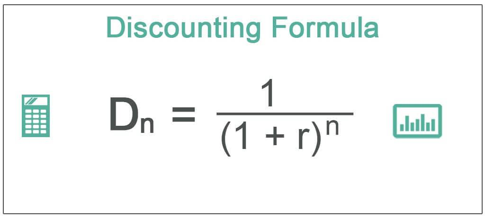

The financial market is a complex ecosystem where various instruments and techniques are employed to maximize profit. Among these techniques, discounting stands out as a fundamental method for determining the present value of future cash flows. The concept of discounting is crucial in understanding the 'time value of money,' which asserts that a dollar today holds more value than a dollar received in the future. This principle can be mathematically represented using the formula for present value (PV):

$$
PV = \frac{FV}{(1 + r)^n}
$$



Where $PV$ is the present value, $FV$ is the future value, $r$ is the discount rate, and $n$ is the number of periods.

Algorithmic trading, or algo trading, leverages this concept by using computer programs to execute trades at incredibly high speeds, often applying discounting principles to fine-tune trading strategies. These algorithms analyze market data to optimize the timing and pricing of trades, incorporating discount rates to assess the profitability of potential transactions effectively.

This article explores the intersection of discounting in finance with practical examples from algorithmic trading. We'll examine how discount rates are implemented, identify the types of discounts that traders consider, and provide real-world applications demonstrating their significance. Understanding the role of discounts in algorithmic trading can offer insights into optimized trading strategies and advanced market operations.

## Table of Contents

## Understanding Discounting in Finance

Discounting in finance is the process of determining the present value of a future payment or series of payments. This calculation is founded on the principle of the 'time value of money', which asserts that a dollar available now is more valuable than the same dollar in the future due to its potential [earning](/wiki/earning-announcement) capacity. This foundational concept assumes that today's money can be invested to earn interest, leading to higher future value.

The present value $PV$ of a future amount $FV$ can be determined using the formula:

$$

PV = \frac{FV}{(1 + r)^n} 
$$

where $r$ is the discount rate and $n$ is the number of periods until the payment will be received. 

Discount rates are crucial in the discounting process as they incorporate interest rates and risk factors. The selection of an appropriate discount rate is vital, as it reflects the opportunity cost of capital, inflation expectations, and the risk associated with future cash flows. Higher discount rates are typically applied to riskier cash flows, which results in lower present values and vice versa.

Finance professionals employ discounting for various purposes including investment appraisal, bond pricing, and evaluating project valuations. For investments, the net present value (NPV) is calculated to determine whether an investment is expected to generate value above its cost. The NPV is the difference between the present value of cash inflows and outflows over a period of time.

For bond pricing, the present value of future coupon payments and the par value at maturity is calculated to assess the fair price of a bond. In project valuation, companies forecast future cash flows and discount them to determine the viability of projects and their potential contributions to shareholder wealth. 

The effectiveness of discounting lies in its ability to standardize future payments and cash flows to present value terms, providing a consistent framework for decision-makers in finance. Understanding how to accurately apply discounting is crucial for finance professionals tasked with assessing the potential profitability and risk of future cash flows.

## Algorithmic Trading and the Role of Discounts

Algorithmic trading automates the buying and selling of securities through pre-programmed algorithms that are designed to execute trades at speeds and frequencies that are impossible for human traders. Discounts play an essential role in shaping [algorithmic trading](/wiki/algorithmic-trading) strategies by influencing both cost and potential returns. Traders harness these discounts to refine transaction costs and bolster trade execution efficiency.

One significant aspect of trading involves time-based discounts, which involve adjusting future cash flows to their present value. The principle of time value of money underpins this strategy, allowing traders to account for opportunity costs linked to the holding period of a security. A formula central to this strategy is the present value formula:

$$
PV = \frac{FV}{(1 + r)^n}
$$

where $PV$ is the present value, $FV$ is the future value, $r$ is the discount rate, and $n$ is the number of periods until maturity. This methodology is crucial for accurately estimating the intrinsic value of trades and strategizing entry and exit points.

Volume-based discounts are another common strategy. These discounts provide cost reductions on larger trades, making it feasible to diminish transaction costs significantly. Exchanges and brokers often reward high-[volume](/wiki/volume-trading-strategy) traders with rebates or reduced fees, which can be incorporated into algorithmic systems to maximize returns on large-scale transactions.

Liquidity discounts involve pricing assets according to their market [liquidity](/wiki/liquidity-risk-premium). Assets with lower liquidity often experience higher [volatility](/wiki/volatility-trading-strategies) and risk, necessitating adjustments to the trade strategies. Traders consider the liquidity of an asset to forecast market impact and price changes, thereby fine-tuning their algorithms to either pursue or avoid particular trades based on liquidity conditions.

Algorithms might also incorporate counterparty discounts, focusing on the risks associated with trading partners. By adjusting risk factors based on the financial stability and behavior of counterparts, traders can mitigate risks associated with counterparty default or insufficient capital to complete transactions.

In summary, the integration of discount strategies within algorithmic trading enhances overall trading efficacy by meticulously calculating costs and potential profits through time-based, volume-based, and liquidity-focused adjustments. These discounts serve to refine algorithmic systems, thus optimizing the execution and financial outcome of trading strategies.

## Types of Discounts in Algorithmic Trading

Algorithmic trading relies on various discounting mechanisms to enhance the efficiency and efficacy of trade execution. Each type of discount responds to specific financial objectives and market conditions.

**Time-Based Discounts** are fundamental concepts in finance that involve adjusting future earnings to their present value. This is done by applying interest rates that reflect opportunity costs—essentially, the cost of forgoing alternative investments during the period. The present value (PV) can be computed using the formula:

$$

PV = \frac{FV}{(1 + r)^n} 
$$

where $FV$ is the future value of cash flows, $r$ is the discount rate, and $n$ is the number of periods. In algorithmic trading, time-based discounts help in accurately assessing the present worth of future returns, thus informing investment decisions by providing a realistic measure of profitability over time.

**Volume-Based Discounts** are used to reduce transaction costs by offering rebates or discounts on large trades. This type is akin to economies of scale, where the cost per unit decreases with an increase in the volume of transactions. In algorithmic trading frameworks, larger trade sizes often justify discounts from brokers or exchanges, as they guarantee higher liquidity and help in thinning the order book. Implementing these strategies effectively can lead to significant cost savings and more favorable trade execution.

**Liquidity Discounts** address the relationship between asset liquidity and pricing. Assets traded infrequently or with low volumes are subject to liquidity risk, precipitating price adjustments to compensate for the added risk of trading such assets. In essence, liquidity discounts reflect the spread between the bid and ask prices, providing a buffer against potential market impacts. Algorithms can be programmed to adjust offers dynamically based on real-time market liquidity data, thus optimizing trade positions for cost efficiency and risk management.

**Counterparty Discounts** deal with risks associated with trading partners. Different counterparties may present varying levels of risk due to their creditworthiness, trading history, or market behavior. Discounts are adjusted to reflect these risks, often quantified through counterparty scoring models. For example, trading with a counterparty with a high default risk might necessitate a higher discount to cushion against potential losses. Algorithmic trading platforms incorporate these factors into their risk management protocols, adjusting trade parameters to reflect the assessed risk levels of different counterparties.

Through these diverse discount strategies, algorithmic trading configurations optimize transaction efficiency, manage risk judiciously, and enhance profitability by taking into account immediate market conditions and potential future shifts.

## Application of Discounting in Trading Algorithms

In algorithmic trading, discounting techniques play a pivotal role in enhancing the accuracy and effectiveness of trading strategies. Central to this application are valuation models, risk management strategies, and price prediction models, all of which leverage discounting principles.

### Valuation Models

Valuation models such as the Discounted Cash Flow (DCF) and the Dividend Discount Model (DDM) are fundamental in determining the worth of an asset's future income streams in today's terms. The DCF model calculates the present value of expected future cash flows. It uses the formula:

$$

PV = \sum \frac{CF_t}{(1 + r)^t} 
$$

where $PV$ represents the present value, $CF_t$ denotes the cash flow at time $t$, and $r$ is the discount rate. This discount rate reflects the opportunity cost of capital and any associated risks. Similarly, the DDM focuses on estimating the present value of expected future dividends, useful in valuing stocks.

### Risk Management

Risk management within trading algorithms is another critical application of discounting. By dynamically adjusting discount rates, traders can mitigate exposure to market volatility. This adaptability allows systems to account for changing market conditions and interest rates. Algorithms typically use historical volatility and [interest rate](/wiki/interest-rate-trading-strategies) data to determine appropriate discount rates, thus ensuring that the risk components of trading strategies remain aligned with their intended investment horizons.

### Price Prediction Models

Price prediction models incorporate discounting to refine forecasting accuracy. These models utilize historical pricing data, making adjustments for discounts to better anticipate future price movements. For example, a basic Python implementation for a time series prediction model might include evaluating discounted historical prices to predict future trends:

```python
import numpy as np

def discounted_price_prediction(prices, discount_rate):
    discounted_prices = []
    for t, price in enumerate(prices):
        discounted_price = price / ((1 + discount_rate) ** t)
        discounted_prices.append(discounted_price)
    return discounted_prices

# Example usage
historical_prices = [100, 105, 110, 115]
predicted_prices = discounted_price_prediction(historical_prices, 0.05)
```

In this Python function, prices are adjusted using a constant discount rate to update their values over time, offering a refined perspective on future pricing trends.

Through these models, discounting enables traders to make informed decisions by providing a more accurate measure of asset value, mitigating market risks, and enhancing predictive accuracy. As such, discounting remains an indispensable tool in developing robust algorithmic trading systems.

## Case Study: High-Frequency Trading Firms

High-Frequency Trading ([HFT](/wiki/high-frequency-trading-strategies)) firms, such as Virtu Financial, are at the forefront of the financial market innovation, harnessing advanced algorithmic strategies to execute transactions at breakneck speeds. One key aspect of their methodology is the use of sophisticated discounting strategies that optimize transaction costs and manage liquidity and risk — crucial factors in maintaining a competitive advantage in this fast-paced trading environment.

At the core, discounting in this context serves to align the present value of transaction costs with future market conditions. For instance, time-based discounts account for the opportunity cost of capital, ensuring that the rapid transactions yield maximum profitability by adjusting the rates at which trades are evaluated. In HFT, milliseconds matter, and a precise discounting mechanism aids in determining the most opportune moments to enter or [exit](/wiki/exit-strategy) positions based on real-time data analysis and predictive modeling.

Volume-based discounts further support HFT firms by incentivizing the execution of large trades. Exchanges and liquidity providers often offer such discounts as rebates, effectively reducing the commission costs associated with substantial transaction volumes. This directly impacts the profitability of HFT strategies, where even minuscule cost advantages can translate into significant returns over millions of transactions.

Liquidity discounts, on the other hand, are tailored to the specific characteristics of the traded asset. Market conditions can fluctuate rapidly, affecting asset liquidity. By dynamically adjusting pricing models to include liquidity discounts, HFT firms can mitigate the market impact of their trades. This is achieved through algorithms that assess liquidity conditions and adapt trading strategies to minimize the price movements caused by their own trades.

Moreover, risk management in HFT involves accounting for counterparty risks, where discounting is applied to [factor](/wiki/factor-investing) in the creditworthiness and reliability of trading partners. This is particularly relevant when engaging in cross-border trades or dealing with less liquid markets, where the counterparty default risk may be higher.

In summary, HFT firms rely on a matrix of discount strategies that encompass time, volume, and liquidity considerations, alongside counterparty risk assessments. These strategies are embedded within their algorithmic frameworks, enabling them to optimize operations, reduce costs, and adapt to the volatile nature of financial markets, thus maintaining a competitive edge in executing rapid transactions.

## Conclusion

Discounting is a pivotal technique in both finance and algorithmic trading, crucial for evaluating future cash flows in present terms. This practice leverages the concept of the time value of money to convert future cash flows into their present values, assisting in more informed investment decisions. In finance, discounting helps professionals assess the value of investments and projects by accounting for interest rates and risk factors. In algorithmic trading, discount rates influence trading strategies by affecting both cost estimates and anticipated returns. 

The dual application of discounting informs investment strategies and assists in optimizing trading operations by minimizing transaction costs and managing liquidity and risk effectively. For example, in high-frequency trading (HFT), firms like Virtu Financial utilize sophisticated discount mechanisms to execute trades at high speeds while maintaining cost efficiency. This reveals that discounting not only impacts the decision-making process but also shapes market behavior by influencing the trading strategies employed by firms.

As financial markets continue to evolve, the ability to understand and apply discounting techniques effectively remains a vital skill for finance professionals. Whether used in evaluating investment opportunities or refining the intricacies of algorithmic trading strategies, discounting maintains its essential role in shaping the financial landscape. The continuous development of sophisticated discount models and the integration of advanced analytical tools in trading are expected to enhance the precision and efficiency of financial decision-making, reinforcing the relevance of discounting in future financial endeavors.

## References & Further Reading

[1]: Brealey, R. A., Myers, S. C., & Allen, F. (2017). ["Principles of Corporate Finance"](https://www.mheducation.com/highered/product/Principles-of-Corporate-Finance-Brealey.html). McGraw-Hill Education.

[2]: Hull, J. C. (2018). ["Options, Futures, and Other Derivatives"](https://www.semanticscholar.org/paper/Options%2C-Futures%2C-and-Other-Derivatives-Hull/89bdee500c8623864fc9eb7a471546aa713acc44). Pearson.

[3]: Lopez de Prado, M. (2018). ["Advances in Financial Machine Learning"](https://www.amazon.com/Advances-Financial-Machine-Learning-Marcos/dp/1119482089). Wiley.

[4]: Narang, R. K. (2013). ["Inside the Black Box: A Simple Guide to Quantitative and High-Frequency Trading"](https://onlinelibrary.wiley.com/doi/book/10.1002/9781118662717). Wiley.

[5]: Chan, E. P. (2008). ["Quantitative Trading: How to Build Your Own Algorithmic Trading Business"](https://github.com/ftvision/quant_trading_echan_book). Wiley.

[6]: Chincarini, L. B., & Kim, D. (2006). ["Quantitative Equity Portfolio Management: An Active Approach to Portfolio Construction and Management"](https://www.scirp.org/reference/referencespapers?referenceid=2212862). McGraw-Hill Education.