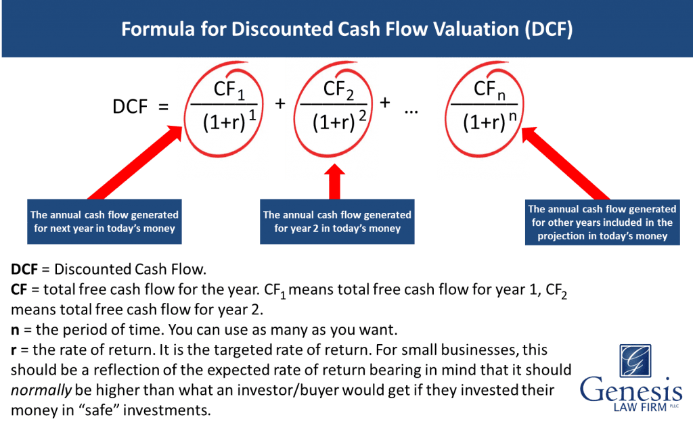

## Table of Contents

## What is Free Cash Flow to the Firm (FCFF)?

Free Cash Flow to the Firm (FCFF) is the money a company has left after paying for its operating costs and investments in assets like buildings or equipment. It's important because it shows how much cash a business can use for things like paying back loans, giving money back to shareholders, or growing the business. FCFF is different from other cash flow measures because it looks at the whole company, not just what's left for shareholders after interest payments.

To calculate FCFF, you start with the company's earnings before interest and taxes (EBIT), then add back any non-cash expenses like depreciation. After that, you subtract taxes that the company would have to pay if it had no debt, and then subtract the money spent on new investments in assets. The result is the cash flow available to everyone who has a stake in the company, including both debt and equity holders. This makes FCFF a useful tool for figuring out a company's value, especially when comparing different businesses.

## Why is discounting FCFF important in valuation?

Discounting Free Cash Flow to the Firm (FCFF) is important in valuation because it helps us understand what the future cash flows of a company are worth today. Imagine you have a choice between getting $100 now or $100 a year from now. Most people would choose the money now because they could use it or invest it right away. The same idea applies to a company's future cash flows. By discounting, we adjust the value of future cash flows to reflect the time value of money, meaning we figure out how much less those future dollars are worth today.

This process is crucial for making fair comparisons between different companies or investment opportunities. When we discount FCFF, we use a discount rate that reflects the risk of the company's cash flows. A riskier company will have a higher discount rate, which means its future cash flows are worth less today. By doing this, we can compare the present value of cash flows from different companies on an equal footing, helping investors decide where to put their money. It's like looking at different fruits and deciding which one is the sweetest by tasting them all at the same time, rather than at different times when their sweetness might vary.

## How do you calculate Free Cash Flow to the Firm?

To calculate Free Cash Flow to the Firm (FCFF), you start with the company's earnings before interest and taxes, or EBIT. From there, you add back any non-cash expenses like depreciation because these expenses don't actually use up cash. Next, you need to figure out how much tax the company would pay if it had no debt. This is called the tax on EBIT, and you subtract it from the total. After that, you need to consider the money the company spends on new investments in things like buildings or equipment. This is known as capital expenditures, or CAPEX, and you subtract it from the total as well. Finally, you add back any money the company gets from selling old assets. This gives you the FCFF, which is the cash flow available to everyone who has a stake in the company.

In simpler terms, FCFF is like figuring out how much money a company has left over after paying for its day-to-day operations and buying new stuff to keep the business running. It's a way to see how much cash the company can use to pay back loans, give money back to shareholders, or grow the business even more. By looking at FCFF, you get a clear picture of the company's financial health and its ability to generate cash for all its stakeholders.

## What is the formula for discounting FCFF?

To discount Free Cash Flow to the Firm (FCFF), you use a formula that takes the future cash flows and adjusts them to find out what they're worth today. The formula is: Present Value = FCFF / (1 + Discount Rate)^Number of Periods. This means you divide each year's FCFF by a number that gets bigger each year, based on the discount rate you choose. The discount rate is like a guess about how risky the company's cash flows are. A higher discount rate means the cash flows are riskier, so they're worth less today.

Let's say you want to value a company over the next five years. You'd take the FCFF for each of those years and discount them back to today. For example, if the FCFF in year one is $100 and your discount rate is 10%, the present value of that year's FCFF would be $100 / (1 + 0.10)^1, which equals about $90.91. You'd do the same for each year, adding up all the present values to get the total value of the company's future cash flows today. This helps investors see if the company is a good investment by comparing the total present value to the company's current market price.

## What are the key components needed to discount FCFF?

To discount Free Cash Flow to the Firm (FCFF), you need to know the FCFF for each year you're looking at, and a discount rate. The FCFF is the money the company has left after paying for its day-to-day operations and buying new stuff to keep the business running. You can figure out the FCFF by starting with the company's earnings before interest and taxes, adding back non-cash expenses like depreciation, subtracting taxes the company would pay if it had no debt, and then subtracting money spent on new investments and adding back any money from selling old assets.

The discount rate is like a guess about how risky the company's cash flows are. A higher discount rate means the cash flows are riskier, so they're worth less today. To discount the FCFF, you divide each year's FCFF by a number that gets bigger each year, based on the discount rate. This helps you find out what the future cash flows are worth today. By adding up all these discounted cash flows, you get the total value of the company's future cash flows, which helps investors decide if the company is a good investment by comparing it to the company's current market price.

## How do you determine the appropriate discount rate for FCFF?

Choosing the right discount rate for Free Cash Flow to the Firm (FCFF) is important because it helps figure out how much the company's future cash flows are worth today. The discount rate is like a guess about how risky the company's cash flows are. If the company is riskier, you use a higher discount rate, which means its future cash flows are worth less today. To find the right discount rate, you can use something called the Weighted Average Cost of Capital (WACC). WACC is a way to figure out the average cost of all the money the company uses, including both loans and money from shareholders.

To calculate WACC, you need to know the cost of debt, which is how much it costs the company to borrow money, and the cost of equity, which is how much it costs the company to get money from shareholders. You also need to know how much of the company's money comes from debt and how much comes from equity. Once you have these numbers, you can mix them together to find the WACC. This WACC then becomes your discount rate for FCFF. By using WACC as the discount rate, you're taking into account both the risk of the company's cash flows and the cost of the money the company uses, which helps you get a fair value for the company's future cash flows.

## What are the common methods to forecast future FCFF?

To forecast future Free Cash Flow to the Firm (FCFF), one common method is to start with the company's historical financial data. You look at past earnings before interest and taxes (EBIT), depreciation, taxes, and capital expenditures to see how the company has performed. Then, you make guesses about how these numbers might change in the future based on things like the company's growth plans, the economy, and industry trends. For example, if the company plans to expand, you might expect higher capital expenditures and possibly higher EBIT as well. This method is like looking at a map of where the company has been to guess where it might go next.

Another way to forecast FCFF is to use financial models, like the discounted cash flow (DCF) model. In this model, you create a detailed spreadsheet that projects future cash flows based on assumptions about sales growth, profit margins, and other financial metrics. You might also use different scenarios to see how the FCFF could change if things go better or worse than expected. For instance, you could have a "best case" scenario where sales grow quickly, and a "worst case" scenario where sales drop. This method helps you see a range of possible future outcomes for the company's cash flows, making it easier to plan and make decisions.

## How does the growth rate affect the valuation when discounting FCFF?

The growth rate is a big deal when you're trying to figure out what a company is worth by looking at its future cash flows. If you think the company's cash flows will grow fast, you'll guess a higher growth rate. This makes the future cash flows bigger, and when you add them all up after discounting them back to today, the company looks more valuable. But if you think the company won't grow much, you'll use a lower growth rate, which makes the future cash flows smaller, and the company ends up looking less valuable.

It's like planning a garden. If you think your plants will grow quickly, you'll expect a big harvest, and that makes your garden more valuable to you. But if you think they'll grow slowly, you'll expect a smaller harvest, and your garden won't seem as valuable. The growth rate is your guess about how fast the company's cash flows will grow, and it's a key part of figuring out if the company is a good investment or not.

## What are the challenges and limitations of using discounted FCFF for valuation?

Using discounted Free Cash Flow to the Firm (FCFF) for valuation can be tricky because it relies a lot on guesses about the future. You have to guess things like how fast the company will grow, what the discount rate should be, and how much the company will spend on new stuff. If your guesses are way off, your valuation can be way off too. It's like trying to predict the weather a year from now; even the best weather people can get it wrong sometimes. Also, it's hard to compare companies in different industries because what's a normal growth rate or discount rate for one might not be normal for another.

Another challenge is that FCFF doesn't tell you everything about a company. It focuses on cash flows, but a company's value can also come from things like its brand, its patents, or how happy its customers are. These things don't show up in the FCFF numbers, so you might miss out on important parts of the company's value. Plus, FCFF can be affected by how the company does its accounting. Different companies might count things differently, which can make it hard to compare them fairly. It's like trying to compare apples and oranges just by looking at their weight; you're missing out on a lot of other important stuff.

## How can sensitivity analysis improve the reliability of FCFF discounting?

Sensitivity analysis helps make FCFF discounting more reliable by showing how changes in key guesses affect the final valuation. When you do FCFF discounting, you're making guesses about things like growth rates, discount rates, and how much the company will spend on new stuff. If these guesses are off, your valuation can be way off too. Sensitivity analysis lets you see what happens if you change these guesses a little bit. For example, you can see how the company's value changes if the growth rate goes up or down by a few percent. This helps you understand which guesses are most important and how much they can affect your final number.

By doing sensitivity analysis, you get a better picture of the risks involved in your valuation. It's like checking the weather forecast for a big trip. If the forecast says it might rain, you pack an umbrella just in case. Similarly, sensitivity analysis shows you different possible outcomes for the company's value, so you can be ready for different scenarios. This makes your valuation more reliable because you're not just relying on one set of guesses. Instead, you're looking at a range of possibilities, which helps you make smarter decisions about whether the company is a good investment.

## What are the differences between discounting FCFF and Free Cash Flow to Equity (FCFE)?

Discounting Free Cash Flow to the Firm (FCFF) and Free Cash Flow to Equity (FCFE) are two ways to figure out what a company is worth, but they look at cash flows differently. FCFF looks at the cash the whole company makes after paying for its day-to-day stuff and buying new things, but before paying interest to people who loaned the company money. When you discount FCFF, you use a discount rate that thinks about the risk of the company's cash flows and the cost of all the money the company uses, including loans and money from shareholders. This gives you the value of the whole company, which can be useful if you want to see how much the company is worth to everyone who has a stake in it.

On the other hand, FCFE focuses on the cash that's left just for the shareholders after the company has paid for everything, including interest on loans. When you discount FCFE, you use a discount rate that only thinks about the risk to shareholders, which is usually higher than the rate used for FCFF. This gives you the value of the company from the shareholders' point of view, which is helpful if you're trying to decide if the company's stock is a good investment. So, while FCFF gives you the big picture of the company's value, FCFE zooms in on what's left for the people who own the company's stock.

## How do macroeconomic factors influence the discounting of FCFF?

Macroeconomic factors can really change how we discount Free Cash Flow to the Firm (FCFF) because they affect the guesses we make about the future. Things like interest rates, inflation, and how the economy is doing can make a big difference. For example, if interest rates go up, it costs more for the company to borrow money, which might mean a higher discount rate because the company's cash flows are riskier. On the other hand, if the economy is doing well, you might guess that the company's cash flows will grow faster, which would make the company look more valuable.

These factors also affect how we think about the future. If inflation is high, the money the company makes in the future won't be worth as much today, so we might use a higher discount rate to account for that. And if the economy is shaky, we might guess that the company's cash flows will be less predictable, which could also mean a higher discount rate. By paying attention to these big-picture things, we can make better guesses about the discount rate and growth rate, which helps us figure out a more accurate value for the company.

## What is Understanding Discounting Free Cash Flow (FCF)?

Free Cash Flow (FCF) represents the cash that a company generates from its operational activities after deducting capital expenditures necessary to maintain or expand its asset base. It is a critical measure of financial performance, as it indicates how much cash is available for distribution to investors, debt repayment, or reinvestment into the business.

### Calculation of FCF
FCF can be calculated using the following formula:

$$

\text{FCF} = \text{EBITDA} - \text{Taxes Paid} - \text{Changes in Working Capital} - \text{Capital Expenditures} 
$$

EBITDA stands for Earnings Before Interest, Taxes, Depreciation, and Amortization. This metric serves as a proxy for cash flow from operations as it accounts for core earnings while excluding non-cash expenses such as depreciation and amortization.

### Discounting FCF
Discounting FCF is a method used to determine the present value of projected cash flows. These cash flows are discounted to account for the time value of money, which reflects the principle that money available now is worth more than the same amount in the future due to its potential [earning](/wiki/earning-announcement) capacity. This is typically achieved using the Weighted Average Cost of Capital (WACC) as the discount rate. The formula to find the present value of FCF is:

$$

\text{PV(FCF)} = \sum_{t=1}^{n} \frac{\text{FCF}_t}{(1 + \text{WACC})^t} 
$$

In this formula, $\text{FCF}_t$ represents the free cash flow in each period $t$, and $\text{WACC}$ is the Weighted Average Cost of Capital.

### Importance of Discounting FCF
This method is pivotal in firm valuation, offering a clearer assessment of a company's financial health and growth prospects. By discounting future cash flows, analysts and investors can estimate the intrinsic value of a company. This valuation technique is not only useful for corporate finance decisions but also integral for mergers, acquisitions, and investment analysis. The accuracy of this method relies significantly on the precision of future cash flow forecasts and the correct determination of the discount rate.

## What is Corporate Finance and how is FCF Valuation conducted?

In corporate finance, free cash flow (FCF) valuation represents a critical method for evaluating a company's financial performance and long-term potential. This approach is instrumental in strategic corporate decisions, including mergers, acquisitions, and investment analysis. By focusing on the cash that a company can generate after accounting for capital expenditures, FCF provides a clear measure of a firm’s ability to pursue opportunities that enhance shareholder value.

Valuation using FCF allows companies and financial analysts to predict future financial stability and potential returns with substantial accuracy. This method involves forecasting the cash flows a company is expected to generate and then discounting these to their present value. The discount rate used here is often the Weighted Average Cost of Capital (WACC), a rate that accounts for the cost of both equity and debt financing.

The formula for calculating FCF often starts from earnings before interest, taxes, depreciation, and amortization (EBITDA). It accounts for changes in working capital, capital expenditures (CapEx), and taxes. The basic FCF formula is expressed as:

$$
\text{FCF} = \text{EBITDA} - \text{Taxes Paid} - \text{CapEx} - \Delta \text{Working Capital}
$$

The discounting process is critical because it accounts for the time value of money, acknowledging that a dollar today is worth more than a dollar in the future. This is achieved by applying WACC, which represents the average rate a company is expected to pay to finance its assets. An accurate WACC is crucial because it influences decision-making, guiding firms on optimal capital structuring and financial risk management.

The FCF valuation approach is favored for its ability to provide nuanced insights into a company’s economic viability without being swayed by accounting practices that might obscure financial realities. This makes FCF a reliable tool in assessing whether a company can create additional value, especially in decisions that involve substantial capital investments.

By employing FCF valuation, corporate finance professionals can make informed strategic decisions that align with their companies' objectives, maximize shareholder wealth, and ensure financial stability in the competitive market landscape.

## What is the role of algorithmic trading in FCF analysis?

Algorithmic trading, a cornerstone of modern financial markets, leverages quantitative strategies to enhance trading efficiency and accuracy. Within this domain, Free Cash Flow (FCF) valuations are integral, providing a basis for algorithmic decision-making that reflects the projected financial outcomes of firms. By incorporating FCF data into algorithms, traders can automate investment decisions, ensuring that trades are executed based on robust financial assessments rather than intuition alone.

The integration of FCF into [algorithmic trading](/wiki/algorithmic-trading) hinges on the adaptability and precision of advanced computational methods. Machine learning and big data analytics are pivotal in this context, enabling traders to simulate and analyze thousands of potential scenarios based on varying FCF inputs. These technologies allow algorithmic models to evaluate the impact of different economic conditions, operational changes, and market forces on a company's future cash flows.

At the heart of these processes lies the Weighted Average Cost of Capital (WACC), which serves as the discount rate for converting future cash flows to present value. This relationship is articulated in the Discounted Cash Flow (DCF) model:

$$
\text{DCF} = \sum_{t=1}^{n} \frac{FCF_t}{(1 + WACC)^t}
$$

Here, $FCF_t$ represents the free cash flow at time $t$, and $n$ is the number of periods. By programming such models into algorithmic frameworks, traders can swiftly adjust their strategies to align with real-time market data and evolving corporate financial conditions, optimizing portfolio strategies while mitigating risk.

Python, with its extensive libraries for data analysis and [machine learning](/wiki/machine-learning), offers a conducive platform for implementing such algorithms. Tools like NumPy for numerical computations, Pandas for data manipulation, and SciKit-learn for machine learning allow for building sophisticated trading models that incorporate FCF analysis.

```python
import numpy as np
from sklearn.linear_model import LinearRegression

# Example dataset of FCF and corresponding market conditions
fcf_data = np.array([[100, 1.5], [150, 1.8], [200, 2.0], [250, 2.5]])
market_conditions = np.array([120, 160, 210, 260])

# Linear regression model to predict FCF outcomes based on market conditions
model = LinearRegression().fit(fcf_data, market_conditions)

# Predict future FCF with altered market conditions
future_conditions = np.array([[300, 2.8]])
predicted_fcf = model.predict(future_conditions)

print("Predicted FCF:", predicted_fcf)
```

By combining traditional financial metrics with cutting-edge algorithmic technologies, algorithmic trading not only enhances the precision of FCF analysis but also supports the broader objective of adaptive and responsive financial strategies. This synergy of financial analytics and computational prowess continues to redefine the capabilities and horizons of modern trading ecosystems.

## References & Further Reading

[1]: Damodaran, A. (2012). ["Investment Valuation: Tools and Techniques for Determining the Value of Any Asset."](https://books.google.com/books/about/Investment_Valuation.html?id=5SRHAAAAQBAJ) John Wiley & Sons.

[2]: Brealey, R. A., Myers, S. C., & Allen, F. (2019). ["Principles of Corporate Finance."](https://www.mheducation.com/highered/product/Principles-of-Corporate-Finance-Brealey.html) McGraw-Hill Education.

[3]: Berk, J., & DeMarzo, P. (2019). ["Corporate Finance."](https://www.pearson.com/en-us/subject-catalog/p/corporate-finance/P200000005829/9780135635926) Pearson.

[4]: Fabozzi, F. J., & Drake, P. P. (2009). ["The Basics of Finance: An Introduction to Financial Markets, Business Finance, and Portfolio Management."](https://books.google.com/books/about/Finance.html?id=mUBsAwAAQBAJ) John Wiley & Sons.

[5]: Lopez de Prado, M. (2018). ["Advances in Financial Machine Learning."](https://www.amazon.com/Advances-Financial-Machine-Learning-Marcos/dp/1119482089) Wiley.