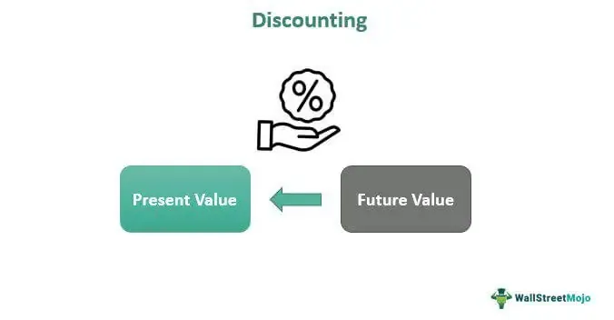

The convergence of discounting, economics, finance, and algorithmic trading has profoundly transformed the financial markets. Modern trading strategies are increasingly shaped by the interplay of these elements, which together drive advancements in decision-making processes and risk management techniques within financial institutions.

At the core of these advancements is the concept of discounting, essential for determining the present value of future cash flows. This is a cornerstone of finance and economics, built on the time value of money, which suggests that the value of a dollar today surpasses that of a dollar received in the future. In finance, discounting facilitates the valuation of investments, informing investors about the potential profitability and risk associated with different financial instruments. Discounting is fundamentally underpinned by formulas such as Net Present Value (NPV) and Discounted Cash Flow (DCF), both of which are vital in evaluating investment opportunities and corporate strategies.

On the frontier of technological innovation, algorithmic trading leverages complex algorithms to execute trades with precision and remarkable speed. This has been transformative for financial markets, where the speed of executing trades can significantly impact profitability. Discounting principles are integral to algorithmic trading, enhancing strategic financial modeling and risk assessment. The ability to swiftly analyze and incorporate discount rates into trading algorithms allows high-frequency trading firms to predict price movements and optimize trade execution in an automated environment.

Moreover, these frameworks extend their influence beyond individual financial strategies to broader economic theories and market efficiencies. The Efficient Market Hypothesis (EMH) suggests that markets are adept at incorporating all available information, thereby reflecting true asset values. Discounting mechanisms are deeply embedded within such theories, playing a crucial role in how markets absorb new economic data and forecast future economic trajectories, such as growth or recession. These integrated systems not only facilitate efficient trading but also contribute to the broader understanding of economic cycles and market behaviors.

Overall, the convergence of discounting, economics, finance, and algorithmic trading is reshaping the financial industry. These disciplines enhance one another, fostering advancements that increasingly define modern trading and economic strategies. Understanding these interconnections is vital for professionals navigating the evolving complexities of the financial markets.

## Table of Contents

## Understanding Discounting in Economics and Finance

Discounting is an integral concept in economics and finance, crucial for determining the present value of future cash flows. This principle is based on the time value of money, which postulates that a dollar received today holds more value than a dollar received in the future. This results from the potential [earning](/wiki/earning-announcement) capacity of money, where funds available in the present can be invested to generate additional income.

A central formula in discounting is the Net Present Value (NPV). The NPV of a project or investment is the sum of the present values of all expected cash flows, both incoming and outgoing, discounted at a specific rate. The mathematical representation of NPV is as follows:

$$

NPV = \sum_{t=1}^{n} \frac{C_t}{(1 + r)^t} - C_0 
$$

where:
- $C_t$ is the cash flow at time $t$,
- $r$ is the discount rate,
- $n$ is the total number of periods,
- $C_0$ is the initial investment cost.

Another pivotal tool in financial assessment is the Discounted Cash Flow (DCF) model. DCF assesses the value of an investment based on its expected future cash flows. The cash flows are adjusted for time value using a discount rate. The choice of the discount rate significantly affects the calculated present value, making it a critical component in investment appraisals.

Discount rates often encompass risk-free rates and the Weighted Average Cost of Capital (WACC). The risk-free rate typically refers to the yield on government bonds, which are considered safe investments. The WACC is the average rate a company is expected to pay to finance its assets, weighted by the proportion of equity and debt in its capital structure. It accounts for the cost of equity and debt, providing a comprehensive discount rate for evaluating corporate investments.

Case studies in corporate finance illustrate the application of discounting principles. For example, a company might use NPV analysis to decide whether to pursue a new project. By discounting forecasted cash flows and comparing them to the initial investment, the firm can determine the project's profitability. A positive NPV indicates that the anticipated earnings exceed the investment, while a negative NPV suggests the opposite.

Discounting enables businesses to make informed strategic financial decisions by accurately valuing future income streams. This ensures that companies allocate resources effectively, conduct robust financial forecasting, and optimize investment portfolios for maximum return.

## Algorithmic Trading and the Role of Discounting

Algorithmic trading, commonly known as algo-trading, systematically employs complex algorithms to execute trades with swift precision. These algorithms are designed to analyze historical data, predictive analytics, and market conditions to identify opportunities for buying or selling financial instruments. The implementation of discounting techniques in [algorithmic trading](/wiki/algorithmic-trading) is crucial as it influences strategy formulation, optimizing decision-making and risk management.

Discounting is integral to setting the present value of potential profits or losses from trading strategies. One significant application of discounting in algo-trading is the assessment of expected returns, where financial models such as Discounted Cash Flow (DCF) are utilized. In this context, discounting enables traders to assess the current worth of future proceeds, thereby supporting informed decision-making.

Time-based and [volume](/wiki/volume-trading-strategy)-based discounts are particularly relevant in high-frequency trading. Time-based discounts adjust the valuation of a trade based on the time at which it is executed. For instance, executing a trade earlier when signals indicate bullish trends could result in a better discounting valuation. Volume-based discounts, on the other hand, are applied when larger trade volumes result in reduced transaction costs, influencing the decision-making process in algorithms to prefer such opportunities.

Equilibrium modeling represents another method where discounting plays a significant role in algo-trading. Mathematical models that use equilibrium concepts and incorporate discount factors aid in predicting asset prices and managing risks. By considering the present value of future cash flows, algorithms can anticipate market movements more accurately and adjust trading strategies accordingly.

Real-world applications of these principles are evident in high-frequency trading ([HFT](/wiki/high-frequency-trading-strategies)) firms. These firms utilize complex algorithms capable of executing thousands of trades per second based on minute price differences and predictive models. For example, discounting helps HFT algorithms in assessing the net present value of anticipated trades, thus ensuring decisions are aligned with profitability expectations. Renowned HFT firms leverage the speed of algo-trading and discounting methods to achieve competitive advantages and substantial gains.

In summary, discounting in algorithmic trading serves as a foundational pillar for assessing returns, managing risk, and steering strategic decisions. Through the application of time-based and volume-based discounts, along with equilibrium modeling, algo-trading firms can optimize their operations and harness the potential of financial markets effectively.

## Interconnections between Market Efficiency, Discounting, and Economic Theories

The Efficient Market Hypothesis (EMH) is a foundational theory in economics and finance, positing that financial markets are efficient in processing and incorporating all available information. According to EMH, asset prices reflect their true intrinsic values, leaving no opportunity for investors to achieve consistently higher returns than the average market performance through [arbitrage](/wiki/arbitrage) or information asymmetry. This hypothesis aligns closely with the concept of discounting, which involves adjusting future cash flows to present values, thus playing a significant role in determining market prices.

Discounting mechanisms are crucial in understanding how financial markets respond to new economic data. When new information arises, market participants quickly integrate this into asset prices, discounting future cash flows based on the expected changes. This process influences stock prices, as they reflect the anticipated economic growth or recession. For instance, if a positive economic forecast arises, the expectation of higher future cash flows leads to an increase in present stock prices, as investors discount future values less heavily.

The dynamics of stock prices are further elucidated through the lens of discounting. The fundamental formula for present value, given by 
$$
PV = \frac{FV}{(1 + r)^n}
$$
where $PV$ is the present value, $FV$ is the future value, $r$ is the discount rate, and $n$ is the number of periods, demonstrates how critical discounting is in financial assessments. The selection of the appropriate discount rate, often a risk-adjusted measure, is essential to accurately capture market conditions and investor expectations.

Critics of the EMH and discounting principles highlight discrepancies observed during historical financial bubbles and crashes. These events, like the dot-com bubble of the late 1990s or the 2008 financial crisis, demonstrate scenarios where asset prices deviated significantly from intrinsic values. Critics argue these instances reveal inefficiencies and irrational behaviors not accounted for by EMH, challenging the reliability of discounting models during periods of market turbulence.

Insights from prominent economists contribute to the discourse on EMH and discounting. Behavioral economics, for instance, argues that cognitive biases and emotional responses often drive market prices away from true values. Furthermore, renowned economists like Robert J. Shiller argue that psychological factors and speculative irrationality frequently contradict the assumptions of market efficiency, leading to [volatility](/wiki/volatility-trading-strategies) beyond what traditional discounting frameworks can predict.

Despite these criticisms, the interplay between market efficiency, discounting, and economic theories continues to be a vital component of financial market analysis. While EMH provides a baseline for understanding market behavior, the inherent complexities and occasional anomalies underscore the importance of considering behavioral elements and external economic factors. These insights continually reshape the models and approaches used to assess market dynamics, ensuring they remain robust and applicable in ever-evolving economic conditions.

## Challenges and Future Trends in Discounting and Algorithmic Trading

While discounting and algorithmic trading (algo-trading) have significantly contributed to the evolution of financial markets, they also present distinct challenges. These challenges mainly stem from technological reliance, regulatory issues, and market dynamics.

**Technological Reliances and System Failures**

Algo-trading systems heavily depend on technological infrastructure. This reliance introduces risks such as system failures and execution errors. For example, if a trading algorithm malfunctions or the network experiences latency, significant financial losses might occur in milliseconds. Moreover, the dependence on data feeds and computational power means that any disruption can lead to delayed or incorrect trade executions. Such system failures can not only harm individual traders but also impact market-wide stability.

**Amplification of Volatility**

One major concern with the rapid actions of algorithmic systems is their potential to amplify market volatility. Algorithms programmed to react to certain market signals can exacerbate price movements by initiating a large number of trades at high speeds. This can lead to a feedback loop where price movements trigger further algorithmic trades, increasing volatility. The infamous "Flash Crash" of May 6, 2010, underscores this risk, when the U.S. stock market sharply fell and recovered within minutes, partly due to these automated systems.

**Evolving Technologies: AI and Machine Learning**

Emerging technologies such as [artificial intelligence](/wiki/ai-artificial-intelligence) (AI) and [machine learning](/wiki/machine-learning) are anticipated to refine discounting models and enhance the precision of algorithmic trading. These technologies can process large datasets and identify patterns that aid in more accurate risk assessment and prediction of market trends. AI-based models can continuously learn from new data, potentially improving decision-making processes over time. Python libraries like TensorFlow or PyTorch can be employed to develop such AI-enhanced algorithms, optimizing decisions based on historical financial data and prevailing market conditions.

**Regulatory Developments**

Regulatory bodies are focusing on creating frameworks to ensure markets are protected from the potential risks posed by algorithmic trading. Regulations may include requirements for the testing of algorithms, the implementation of speed limits on trades, and stricter guidelines on the capital requirements for algo-trading firms. Additionally, market surveillance is being enhanced to detect and mitigate manipulative practices that might arise from rapid algorithmic strategies. These developments aim to establish a balance between fostering innovation and maintaining market integrity.

**Future Investment Landscapes**

As discounting models and algo-trading evolve, they are expected to continue reshaping investment landscapes. Greater integration of AI and machine learning could lead to hyper-optimized trading environments, where the distinction between human and machine-driven strategies becomes increasingly blurred. Investors and firms will need to adapt to these changes, leveraging advanced techniques to maintain competitive advantages. Understanding and navigating the risks associated with technology and regulation will be crucial as the markets evolve. 

In conclusion, the future of discounting and algorithmic trading holds both promise and challenges. As technological and regulatory landscapes transform, market participants must remain agile and informed to capitalize on the opportunities these changes present.

## Conclusion

Discounting economics and algorithmic trading have consistently played pivotal roles in reshaping the financial industry, providing advanced techniques and strategies that enhance decision-making and risk management. These methods offer unprecedented precision and speed, allowing for the rapid execution of trades and precise valuation of future cash flows. However, the benefits they present must be carefully balanced against potential risks such as technological failures and market volatility. Regulatory frameworks are critical in this regard, ensuring that these powerful tools are used responsibly. As financial markets continue to evolve, an in-depth understanding of both discounting and algorithmic trading becomes increasingly important for professionals aiming to maximize their effectiveness.

The precision of discounting methods, such as calculating present values via formulas like Net Present Value (NPV) or Discounted Cash Flow (DCF), coupled with algorithmic strategies, offers significant opportunities for financial gains. For example, determining the present value $PV$ of a future cash flow $FV$ discounted at a rate $r$ over a period $t$ can be mathematically represented as:

$$
PV = \frac{FV}{(1 + r)^t}
$$

Such calculations form the backbone of investment appraisals and risk assessments in high-stakes financial environments.

Algorithmic trading systems rely heavily on these calculations to optimize transaction strategies and risk management protocols. Institutions aiming to stay at the forefront of financial innovation must continue embracing new technologies such as artificial intelligence and machine learning, which promise to further refine these processes and improve prediction algorithms' accuracy.

The article advocates for continuous dialogue and research, which are essential for navigating the potential pitfalls and maximizing the opportunities presented by these dynamics. Ongoing study and discussion will help ensure that the financial industry can leverage the benefits of discounting and algorithmic trading while mitigating inherent risks. As these fields grow ever more intertwined, a collaborative approach will yield the most robust solutions, fostering a future where financial innovations can be harnessed safely and effectively.

## References & Further Reading

[1]: Hull, J. C. (2015). ["Options, Futures, and Other Derivatives"](https://www.semanticscholar.org/paper/Options%2C-Futures%2C-and-Other-Derivatives-Hull/89bdee500c8623864fc9eb7a471546aa713acc44) (10th ed.). Pearson.

[2]: Fabozzi, F. J., & Markowitz, H. M. (Eds.). (2006). ["The Theory and Practice of Investment Management: Asset Allocation, Valuation, Portfolio Construction, and Strategies"](https://onlinelibrary.wiley.com/doi/book/10.1002/9781118267028). Wiley.

[3]: Shreve, S. E. (2004). ["Stochastic Calculus for Finance I: The Binomial Asset Pricing Model"](https://www.amazon.com/Stochastic-Calculus-Finance-Binomial-Springer/dp/0387249680). Springer.

[4]: Shiller, R. J. (2015). ["Irrational Exuberance"](https://link.springer.com/article/10.1007/s00712-015-0462-4) (3rd ed.). Princeton University Press.

[5]: Chordia, T., Roll, R., & Subrahmanyam, A. (2005). ["Evidence on the speed of convergence to market efficiency"](https://www.anderson.ucla.edu/documents/areas/fac/finance/17-01.pdf). The Review of Financial Studies, 18(2), 455-487.

[6]: Hendershott, T., Jones, C. M., & Menkveld, A. J. (2011). ["Does Algorithmic Trading Improve Liquidity?"](https://onlinelibrary.wiley.com/doi/full/10.1111/j.1540-6261.2010.01624.x). The Review of Financial Studies, 24(3), 705-740.

[7]: De Jong, F. (2002). ["Measures of the Risk-Free Rate."](https://4nations.org/papers/bongaertsdejongdriessen12.pdf) Financial Analysts Journal, 58(3), 38-47.