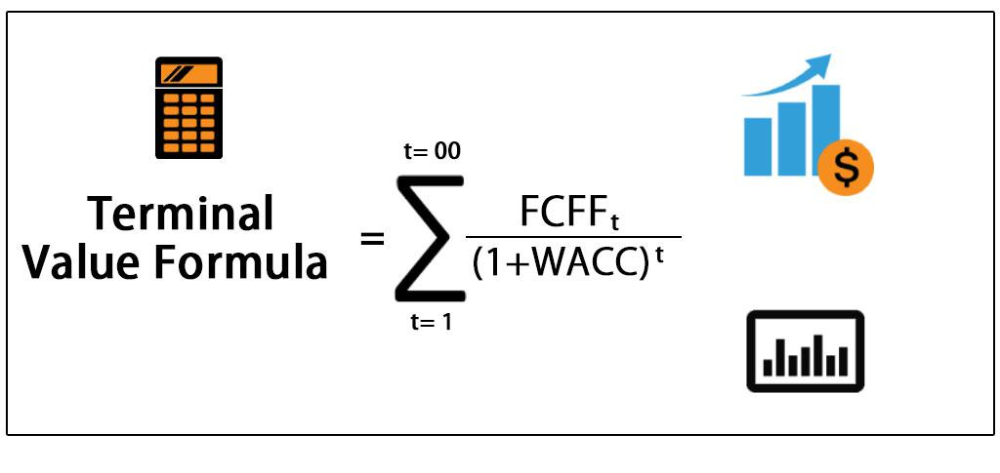

## Table of Contents

## What is terminal value in financial analysis?

Terminal value in financial analysis is a way to estimate what a business or investment will be worth in the future, after a certain period of time. It's like guessing the price of a toy you want to buy years from now. Analysts use terminal value to figure out if an investment is a good choice, by adding up all the money it might make in the future.

To find the terminal value, analysts often use a simple formula that looks at the money the business makes each year and guesses how much it will grow. They might think the business will keep growing at a steady rate forever, or they might think it will stop growing after a while. This helps them decide if the investment is worth the price they have to pay for it today.

## Why is discounting important in valuing terminal value?

Discounting is important in valuing terminal value because it helps us figure out what future money is worth today. Imagine you have a choice between getting $100 now or $100 in 10 years. Most people would choose the money now because they could use it right away or invest it to make more money. Discounting is like a tool that adjusts the value of future money to what it's worth today, considering things like inflation and the risk of not getting the money.

When we calculate the terminal value of a business or investment, we're trying to guess what it will be worth way into the future. But since we can't predict the future perfectly, we use discounting to make our guess more realistic. By discounting the terminal value, we're saying that a dollar far in the future isn't as valuable as a dollar today. This helps us make better decisions about whether an investment is worth the price we have to pay for it now.

## How do you calculate the terminal value of a company?

To calculate the terminal value of a company, you can use two main methods: the perpetuity growth model and the [exit](/wiki/exit-strategy) multiple method. The perpetuity growth model assumes that the company will keep growing at a steady rate forever. You take the last year's free cash flow, multiply it by one plus the growth rate, and then divide by the difference between the discount rate and the growth rate. This gives you an idea of what the company might be worth in the future if it keeps making money at that rate. The exit multiple method, on the other hand, uses a multiple of a financial metric like EBITDA (earnings before interest, taxes, depreciation, and amortization) to estimate the company's value at the end of a certain period. You multiply the expected EBITDA by an industry-standard multiple to get the terminal value.

Both methods have their own advantages and are used based on the specific situation of the company and the analyst's preference. The perpetuity growth model is good for companies that are expected to grow steadily over time, while the exit multiple method is often used when there's a clear idea of what similar companies have sold for in the past. No matter which method you use, the terminal value is a big part of the total value of a company because it represents all the future cash flows beyond the forecast period. By calculating the terminal value, you get a better picture of what the company might be worth in the long run, which helps in making smarter investment decisions.

## What are the common methods used to estimate terminal value?

There are two main ways to guess the terminal value of a company: the perpetuity growth model and the exit multiple method. The perpetuity growth model is like thinking the company will keep growing a little bit every year forever. You take the money the company makes in the last year of your forecast, add a bit for growth, and then use a special math formula to figure out what all that future money is worth today. The formula is pretty simple: you multiply the last year's free cash flow by one plus the growth rate, and then divide that by the difference between the discount rate and the growth rate.

The exit multiple method is different. It's like looking at what similar companies have sold for and using that to guess what your company might be worth in the future. You take a number like EBITDA, which is a way to measure a company's earnings, and multiply it by a number that's common in your industry. This gives you a rough idea of what your company might be worth at the end of your forecast period. Both methods help you figure out what the company might be worth way into the future, which is important for making good investment choices.

## What is the perpetuity growth method for terminal value?

The perpetuity growth method is a way to guess what a company will be worth way into the future. It's like thinking the company will keep making a little more money each year forever. To use this method, you take the money the company makes in the last year of your forecast and add a bit for growth. Then, you use a special math formula to figure out what all that future money is worth today. The formula is simple: you multiply the last year's free cash flow by one plus the growth rate, and then divide that by the difference between the discount rate and the growth rate.

This method is good for companies that are expected to keep growing steadily over time. The growth rate you use is usually small, like the rate of inflation or a bit more, because it's hard to believe a company can grow super fast forever. By using the perpetuity growth method, you can get a better idea of what the company might be worth in the long run, which helps in making smarter investment choices.

## How does the exit multiple method work for terminal value?

The exit multiple method is another way to guess what a company will be worth in the future. It's like looking at what similar companies have sold for and using that to figure out what your company might be worth. You take a number like EBITDA, which shows how much money a company makes before paying interest, taxes, and other expenses, and you multiply it by a number that's common in your industry. This number is called a multiple, and it helps you get a rough idea of what your company might be worth at the end of your forecast period.

This method is good when you have a clear idea of what other companies in your industry have sold for in the past. It's like comparing prices at a store to see if something is a good deal. By using the exit multiple method, you can estimate the terminal value of your company, which is important for deciding if an investment is worth making. It helps you see if the price you're paying for the company today is a good value based on what similar companies have sold for.

## What discount rate should be used when discounting terminal value?

When you're figuring out the terminal value of a company, you need to use a discount rate to make the future money worth today's money. The discount rate is like a guess of how much risk there is in the investment. It's often based on things like how safe or risky the company is, what other investments are paying, and what the economy is doing. A common way to pick a discount rate is to use the Weighted Average Cost of Capital (WACC), which is a mix of the cost of borrowing money and the cost of using money from investors.

The WACC is a good choice because it takes into account both the money the company borrows and the money it gets from shareholders. If the company is riskier, you might use a higher discount rate because there's a bigger chance things might not go as planned. On the other hand, if the company is safer, you might use a lower discount rate. The key is to pick a discount rate that matches the risk of the company and helps you make a fair guess about what the future money is worth today.

## How does the choice of discount rate affect the terminal value?

The discount rate you choose can make a big difference in the terminal value of a company. It's like a tool that helps you figure out what future money is worth today. If you use a high discount rate, it means you think the investment is risky, so you value the future money less. This makes the terminal value smaller because you're saying the money the company will make in the future isn't worth as much today. On the other hand, if you use a low discount rate, it means you think the investment is safer, so you value the future money more. This makes the terminal value bigger because you're saying the money the company will make in the future is worth more today.

Choosing the right discount rate is important because it can change how much you think a company is worth. If you pick a discount rate that's too high, you might think the company is worth less than it really is, and you might miss out on a good investment. If you pick a discount rate that's too low, you might think the company is worth more than it really is, and you might pay too much for it. So, it's a good idea to think carefully about the risk of the company and what other investments are paying when you pick your discount rate. This helps you make a fair guess about what the company might be worth in the future.

## What are the challenges and limitations of discounting terminal value?

Discounting terminal value can be tricky because it's hard to guess what will happen way into the future. The discount rate you choose is really important, but it's also hard to pick the right one. If you think the investment is risky, you might use a high discount rate, which makes the terminal value smaller. But if you think the investment is safe, you might use a low discount rate, which makes the terminal value bigger. The problem is, it's tough to know for sure how risky or safe the investment will be years from now. Plus, things like inflation and changes in the economy can mess with your guess, making it even harder to get it right.

Another challenge is that the terminal value is a big part of the total value of a company, sometimes even bigger than the money it makes in the near future. This means that small changes in the discount rate or the guesses you make about the future can make a big difference in what you think the company is worth. If you're wrong about the discount rate or the growth rate, you might end up thinking the company is worth a lot more or a lot less than it really is. This can lead to bad investment choices, like paying too much for a company or missing out on a good deal. So, it's important to be careful and think about all the different things that could affect the terminal value when you're making your guesses.

## How can sensitivity analysis be applied to terminal value discounting?

Sensitivity analysis is a way to see how changes in the numbers you use can affect the terminal value of a company. It's like playing with a toy to see what happens when you change different parts of it. When you do sensitivity analysis on terminal value discounting, you change the discount rate and the growth rate a little bit to see how much the terminal value goes up or down. This helps you understand which numbers are most important and how much they can change your guess about what the company is worth.

By doing sensitivity analysis, you can see how sensitive the terminal value is to changes in the discount rate and the growth rate. If small changes in these numbers make big changes in the terminal value, it means your guess is pretty sensitive and you need to be careful. This can help you make better decisions about whether an investment is worth it. You might decide to use different numbers or look for more information to make your guess more accurate. Sensitivity analysis is a good tool to use because it shows you how much room for error there is in your calculations.

## What are advanced techniques for refining terminal value estimates?

One advanced way to make your guess about a company's terminal value better is to use something called Monte Carlo simulation. This is like playing a game where you try out lots of different numbers to see what might happen. You change the discount rate and the growth rate many times and see how the terminal value changes each time. This helps you understand not just one guess, but a whole bunch of possible guesses. It's like looking at a bunch of different futures instead of just one, which can help you make a smarter decision about whether an investment is worth it.

Another way to refine your terminal value estimates is to use scenario analysis. This means you think about different stories about what might happen to the company in the future. You might think about a best-case scenario where everything goes great, a worst-case scenario where things go badly, and a middle-of-the-road scenario where things are okay. By looking at these different stories, you can see how the terminal value might change depending on what actually happens. This helps you be ready for different possibilities and make a more informed choice about the investment.

## How do different economic scenarios impact the discounting of terminal value?

Different economic scenarios can really change how you guess the terminal value of a company. When the economy is doing well, with low inflation and lots of growth, you might use a lower discount rate because the future looks bright and there's less risk. This makes the terminal value bigger because you're saying the money the company will make in the future is worth more today. But if the economy is struggling, with high inflation or a recession, you might use a higher discount rate because things are more uncertain and risky. This makes the terminal value smaller because you're saying the future money isn't worth as much today.

You can also think about different stories about what might happen to the economy in the future. For example, in a best-case scenario where the economy keeps growing and inflation stays low, you might use a lower discount rate and a higher growth rate for the company's earnings. This would make the terminal value much bigger. But in a worst-case scenario where the economy goes into a deep recession and inflation goes crazy, you might use a higher discount rate and a lower growth rate, which would make the terminal value much smaller. By looking at these different stories, you can see how the terminal value might change depending on what actually happens in the economy.

## What is Understanding Terminal Value?

Terminal value (TV) is a key component in the valuation of assets or businesses, especially when employing discounted cash flow (DCF) models. It represents the present value of all anticipated future cash flows of an asset or business entity beyond the projection period typically used in financial models. Since predicting cash flows accurately over an infinite horizon is impractical, terminal value provides a proxy for these cash flows from the end of the forecast period into perpetuity.

### Role in Valuation Models

Terminal value is crucial in DCF models because it often constitutes a significant portion of the total valuation. By integrating terminal value, investors and analysts can estimate the long-term worth of an asset or business more accurately. The goal is to capture the value of future business operations and growth once the detailed forecasting ends.

### Differentiation Among Valuation Approaches

There are three primary methods to estimate terminal value: liquidation value, multiples approach, and stable growth model.

1. **Liquidation Value**: This approach assumes that the business will cease operations at the end of the projection period, and all assets will be sold off. It typically undervalues ongoing concerns since it ignores potential for future cash generation.

2. **Multiples Approach**: This method estimates terminal value by applying an industry-standard or comparable company valuation multiple to a financial metric, such as earnings before interest, taxes, depreciation, and amortization (EBITDA) or earnings. The formula is:
$$
   \text{TV} = \text{Metric} \times \text{Multiple}

$$

   This approach assumes the business will be valued similarly to peer companies operating within the same industry environment as of the valuation date.

3. **Stable Growth Model**: Also known as the Gordon Growth Model, this approach calculates terminal value assuming a perpetual, constant growth rate beyond the last forecast period. It employs the formula:
$$
   \text{TV} = \frac{\text{FCF} \times (1 + g)}{r - g}

$$

   where FCF is the free cash flow in the final forecasted year, $g$ is the perpetual growth rate, and $r$ is the discount rate. This model is most effective when a company is expected to grow at a stable rate sustainably.

### Present Value of Future Cash Flows

Terminal value effectively represents the present value of future cash flows extending beyond the explicit forecast period. It is a vital element in ensuring comprehensive valuations, particularly when long-term growth prospects are promising. Selecting the appropriate terminal value estimation method is critical, as it impacts the resulting valuation. The chosen model must align with the expected long-term performance and strategic outlook of the company being valued.

Overall, terminal value is indispensable for investors and analysts as it addresses the limitations inherent in finite forecasting periods, providing a mechanism to capture the infinite lifespan of business operations, thereby offering a clearer picture of the asset's or business's intrinsic value.

## Question: Why is Terminal Value Discounted?

The concept of the time value of money is fundamental in finance and forms the basis for discounting terminal value. The time value of money posits that a dollar today is worth more than a dollar in the future due to its [earning](/wiki/earning-announcement) potential. This principle is integral to understanding why future cash flows, including terminal value, are discounted to present value. Without discounting, the estimated future cash flows would not reflect their true worth, making investment decisions less reliable.

Discounting terminal value is essential to account for inflation and risk over time. Inflation diminishes the purchasing power of future cash flows, while risk considerations arise from the uncertainty of future cash flows. Discounting effectively adjusts for these factors, tailoring the future values to their realistic present-day worth. The formula for discounting future cash flows is:

$$

PV = \frac{FV}{(1 + r)^n} 
$$

where $PV$ is the present value, $FV$ is the future value, $r$ is the discount rate, and $n$ is the number of periods until the cash flow occurs. This formula is crucial for translating terminal values into a form that aligns with current economic conditions.

In [algorithmic trading](/wiki/algorithmic-trading), the process of discounting terminal value is vital for maintaining a competitive edge. Algo trading systems rely heavily on precise data and forecasts to make split-second decisions. Accurately discounted terminal values ensure that algorithms are based on realistic appraisals of asset worth, taking into account inflation and risks. This realism helps refine algorithmic models, enhancing their predictive accuracy and overall performance. By incorporating discounted terminal values, trading algorithms can optimize short-term trading strategies while aligning them with long-term financial objectives. In this way, discounting terminal value not only refines model precision but also fortifies the strategic foundation of algorithmic trading.

## What are the methods for discounting terminal value?

Discounting terminal value is a vital component in valuing financial assets, particularly when determining the intrinsic value of a business or asset in algorithmic trading. The three primary methods used to discount terminal value are the Liquidation Value Model, Multiples Approach, and Stable Growth Model. Each method has distinct applications and limitations, crucial for constructing robust algorithmic trading strategies.

### Liquidation Value Model

The Liquidation Value Model calculates the amount a company would receive if all its assets were liquidated and liabilities settled at the end of the forecast period. This approach is often used when a business is expected to cease operations and entails the following application:

- **Application**: In algorithmic trading, particularly for distressed assets trading, this method estimates the residual value of a business on the assumption of cessation, helping algorithms identify undervalued stocks.

- **Limitations**: Liquidation values can be hard to accurately determine due to variability in asset marketability. In financial markets, this may lead to discrepancies in valuation, affecting asset pricing strategies.

### Multiples Approach

The Multiples Approach, also known as the relative valuation method, involves applying a valuation multiple from comparable companies, such as the Price-to-Earnings (P/E) ratio, to estimate terminal value. 

- **Application**: This method is useful in algorithmic trading for quick estimations. Trading bots often use multiples to assess whether a stock is overpriced or underpriced compared to its peers, facilitating rapid decision-making.

- **Limitations**: The challenge lies in choosing appropriate multiples from truly comparable companies, as industry variations can lead to misleading conclusions. Algorithmic models must, therefore, incorporate sophisticated filtering mechanisms to select relevant comparables.

```python
# Example Python code to calculate terminal value using the Multiples Approach
def calculate_terminal_value(ebitda, ev_ebitda_multiple):
    return ebitda * ev_ebitda_multiple

ebitda = 1000000  # Example EBITDA value
ev_ebitda_multiple = 10  # Example EV/EBITDA multiple
terminal_value = calculate_terminal_value(ebitda, ev_ebitda_multiple)
```

### Stable Growth Model

The Stable Growth Model, or Gordon Growth Model, assumes that a company's free cash flows grow at a constant rate indefinitely. The formula used is:

$$
\text{Terminal Value} = \frac{\text{FCF} \times (1 + g)}{r - g}
$$

where $\text{FCF}$ is the free cash flow of the last forecast period, $g$ is the growth rate, and $r$ is the discount rate.

- **Application**: Suitable for companies expected to grow steadily over time. In algorithmic trading, this model aids in valuating mature businesses where growth forecasts are stable, aligning with long-term investment strategies.

- **Limitations**: The assumption of perpetual growth at a constant rate can misrepresent more volatile or rapidly changing industries. Accurate discount and growth rates are critical, making it imperative for algorithms to employ robust sensitivity analysis.

In conclusion, selecting the appropriate method for discounting terminal value is crucial in algorithmic trading to enhance decision-making and maximize returns. Each method's application and the inherent challenges must be carefully considered to refine trading algorithms and achieve accurate asset valuations.

## References & Further Reading

[1]: ["Valuation: Measuring and Managing the Value of Companies"](https://www.amazon.com/Valuation-Measuring-Managing-Companies-Finance/dp/1119610885) by McKinsey & Company Inc.

[2]: Damodaran, A. (2002). ["Investment Valuation: Tools and Techniques for Determining the Value of Any Asset."](https://archive.org/details/investmentvaluat0000damo_n6k9) John Wiley & Sons.

[3]: ["Equity Asset Valuation"](https://www.amazon.com/Equity-Asset-Valuation-Institute-Investment/dp/1119628105) by Jerald E. Pinto, Elaine Henry, Thomas R. Robinson, and John D. Stowe

[4]: Penman, S. H. (2013). ["Financial Statement Analysis and Security Valuation."](https://vdoc.pub/documents/financial-statement-analysis-and-security-valuation-71q5td507pf0) McGraw-Hill Education.

[5]: ["Algorithmic Trading: Winning Strategies and Their Rationale"](https://www.wiley.com/en-us/Algorithmic+Trading%3A+Winning+Strategies+and+Their+Rationale-p-9781118460146) by Ernie Chan