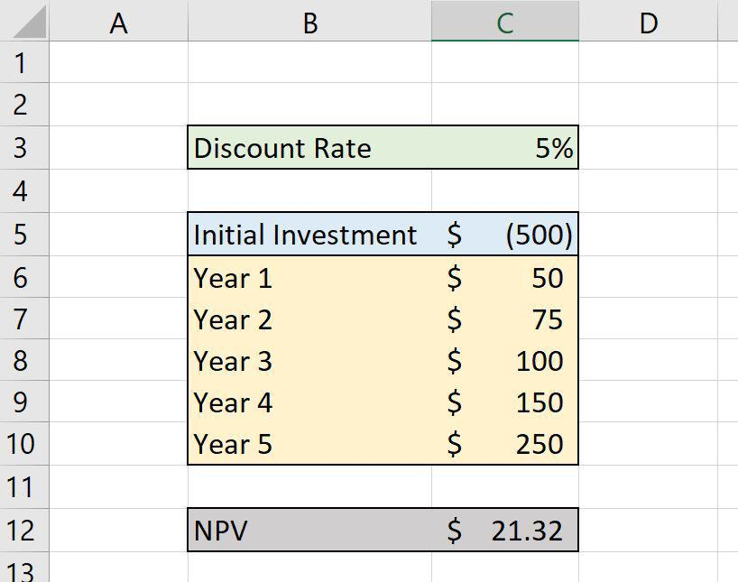

In the ever-evolving world of finance, professionals employ numerous methodologies and tools to maximize investment returns and manage risks. Financial markets have grown increasingly complex, necessitating a keen understanding of various principles and techniques to navigate them effectively. Among these, discounting, Net Present Value (NPV), working capital, and algorithmic trading stand out as pivotal elements in modern investment strategies.

Discounting and NPV form the backbone of financial assessment techniques, offering vital insights into investment viability. Discounting is the process of determining the present value of future cash flows, taking into account the time value of money—a foundational concept in finance. NPV, utilizing these discounted cash flows, allows for the evaluation of the profitability of potential investments. This metric considers both the magnitude and timing of expected cash flows, transforming abstract future earnings into tangible present values. Such a conversion is crucial for making informed investment decisions, as it aligns projected returns with current financial realities.



Working capital, representing a company's operational liquidity, significantly impacts NPV calculations and overall financial health. It reflects the efficiency with which a company manages its short-term assets and liabilities, often influencing investment outcomes by affecting cash flow. Effective management of working capital can both support investment initiatives and constrain them by tying up resources that could be better used elsewhere.

Algorithmic trading, which uses automated, quantitative models to execute trading strategies, incorporates these financial principles to optimize performance. The integration of NPV calculations within trading algorithms enables real-time assessment of potential investments, facilitating rapid and informed decision-making. By factoring in working capital considerations, algorithmic trading strategies can achieve greater precision and manage risks more effectively in volatile markets.

As we continue, readers will develop a framework for understanding how these elements—discounting, NPV, working capital, and algorithmic trading—intersect. This knowledge is essential for navigating financial markets, enhancing investment returns, and managing risks, all of which are critical in today's dynamic financial environment.

## Table of Contents

## Understanding Discounting and NPV

Discounting is a fundamental concept in finance that allows investors to assess the value of future cash flows in today’s terms. It is based on the principle of the time value of money, which asserts that a dollar today is worth more than a dollar in the future due to the potential [earning](/wiki/earning-announcement) capacity. The process of discounting involves applying a discount rate to the expected future cash flows to determine their present value. 

The Net Present Value (NPV) is a core financial metric specifically employed to evaluate the profitability and feasibility of investment projects. NPV is calculated by summing the present values of all expected cash inflows and outflows associated with the investment. The mathematical representation of NPV is as follows:

$$
\text{NPV} = \sum \left( \frac{C_t}{(1 + r)^t} \right) - C_0
$$

where $C_t$ represents the cash inflow or outflow at time $t$, $r$ is the discount rate, and $C_0$ is the initial investment cost. A positive NPV indicates that the projected earnings (discounted to present value terms) exceed the costs, thus making the investment potentially profitable.

Integrating discounting into NPV calculations is essential for accurate investment analysis. It ensures that both the magnitude and timing of cash flows are considered, providing a holistic view of the project's value. By discounting future cash flows, investors can adjust for uncertainties and risks associated with different time periods. This comprehensive approach allows for more informed decision-making, as it accounts not just for the total amount of forecasted returns, but also when these returns are expected to occur.

Overall, discounting and NPV are indispensable in modern finance, enabling investors to make strategic choices by quantitatively evaluating the potential of investments. Understanding and applying these concepts can significantly enhance investment decisions and outcomes.

## The Role of Working Capital in NPV Calculations

Working capital stands as a pivotal component in evaluating a company’s short-term financial status and viability, playing a crucial role in Net Present Value (NPV) calculations. Essentially, working capital represents the difference between a company's current assets and current liabilities, serving as a measure of its efficiency and short-term financial health. When assessing a project's NPV, the inclusion and careful handling of working capital is imperative.

Investing in working capital involves allocating resources to current assets such as inventory and accounts receivable. While this may initially tie up funds and impact [liquidity](/wiki/liquidity-risk-premium), these investments are often recoverable as projects reach maturity and begin generating returns. Thus, the effective management and forecasting of working capital needs are essential for ensuring that a firm's cash flow is sufficient to support ongoing operations without excessive overhead.

In the context of NPV analysis, changes in working capital must be incorporated to reflect their true impact on cash flows. As working capital investments are typically non-cash movements, they alter cash flow projections and, consequently, affect the calculated NPV. A project's cash flow statement, therefore, must account for any increases or decreases in working capital to provide a true representation of cash inflows and outflows. 

The formula to adjust NPV with changes in working capital is expressed as:

$$
NPV = \sum_{t=0}^{n} \frac{C_t - \Delta WC_t}{(1 + r)^t} - C_0
$$

where:
- $C_t$ is the cash inflow during period $t$,
- $\Delta WC_t$ is the change in working capital in period $t$,
- $r$ is the discount rate,
- $t$ is the time period,
- $C_0$ is the initial investment cost.

Effective management of working capital ensures that resources are available when needed and optimizes the project’s overall cash flow. Thus, accounting for changes in working capital through precise discounting is necessary to accurately measure the expected profitability and feasibility of an investment. Understanding these dynamics allows companies to improve strategic planning and execution, ultimately achieving better financial outcomes.

## Algorithmic Trading: Integrating NPV and Working Capital

Algorithmic trading utilizes quantitative models to automate trading strategies, making precise financial calculations essential. In this context, integrating Net Present Value (NPV) is a valuable approach. By including NPV in trading algorithms, traders can assess the viability of various investment options in real-time, thus optimizing their strategies.

NPV is a calculation used to determine the present value of a series of cash flows over time, accounting for both the magnitude and timing of these cash flows. In [algorithmic trading](/wiki/algorithmic-trading), this concept allows the model to evaluate the future potential of trades while factoring in fluctuations in interest rates, expected market conditions, and overall investment time horizons. For instance, a simplified Python function to compute NPV might look like this:

```python
def calculate_npv(cash_flows, discount_rate):
    npv = sum(cf / (1 + discount_rate)**i for i, cf in enumerate(cash_flows))
    return npv

# Example usage
cash_flows = [-1000, 200, 300, 400, 500]
discount_rate = 0.05
npv = calculate_npv(cash_flows, discount_rate)
print(f"NPV: {npv}")
```

This calculation enables traders to make real-time decisions based on financial data, enhancing the adaptive nature of their trading models.

Working capital, a measure of a company’s operational liquidity, also plays a significant role in these calculations. Evaluating working capital’s influence on cash flows enhances the precision of algorithmic trading decisions through comprehensive risk assessment. Changes in working capital can signal shifts in a firm’s short-term financial health, impacting its ability to sustain operations or leverage market opportunities effectively. The integration of working capital considerations within algorithmic models means traders can react to these shifts, adjusting their strategies accordingly to mitigate risks or capitalize on potential gains.

Together, NPV and working capital considerations provide a robust framework for enhancing the accuracy and efficacy of algorithmic trading strategies. By incorporating these financial metrics, trading algorithms can better navigate the complexities of modern financial markets, offering traders a strategic advantage.

## Case Study: High-Frequency Trading and Discounting

High-frequency trading ([HFT](/wiki/high-frequency-trading-strategies)) firms utilize advanced discounting techniques as an essential component of their trading strategies to remain competitive in rapidly changing markets. These firms operate on the principle of executing numerous trades within fractions of a second, exploiting short-term [arbitrage](/wiki/arbitrage) opportunities to profit from small price differentials. Central to this process is the sophisticated modeling of transaction costs and liquidity management.

Firms such as Virtu Financial are at the forefront of deploying these advanced techniques. Their algorithms are designed to efficiently handle vast amounts of data, dynamically adjusting for transaction costs, and managing liquidity. The precision of these models directly influences the profitability of trades, where even minute errors in cost estimation or liquidity assessment can lead to significant financial discrepancies.

A critical aspect of these models is the practice of discounting projected cash flows accurately. By applying discounting methods to the anticipation of future revenues and expenses, HFT firms are able to present value future cash flows based on prevailing interest rates and expected market [volatility](/wiki/volatility-trading-strategies). The present value $\text{PV}$ of a cash flow that will be received in the future can be calculated using the formula:

$$
\text{PV} = \frac{\text{FV}}{(1 + r)^n}
$$

where $\text{FV}$ represents the future value of the cash flow, $r$ is the discount rate, and $n$ is the number of periods until the cash flow is received. By incorporating this discounted cash flow analysis, HFT entities can adjust their trading strategies in real-time to account for the cost of capital and the time value of money, ensuring that their rapid decision-making processes are grounded in robust financial evaluation.

In volatile markets, the ability to accurately discount projected cash flows allows HFT firms to manage their risks effectively. By understanding the temporal value of cash flows, these firms can make informed decisions on pricing, liquidity provision, and market entry and [exit](/wiki/exit-strategy) points, ultimately maximizing potential profits while minimizing exposure to adverse market movements. This precision in financial evaluation helps maintain their edge in the competitive landscape of high-frequency trading.

## Conclusion

Understanding the interconnectedness of discounting, Net Present Value (NPV), working capital, and algorithmic trading is crucial for financial professionals. Each of these elements contributes significantly to the modern financial landscape, offering different lenses through which investment opportunities and risks can be assessed. Mastery of these interconnected principles can lead to improved strategic decision-making, ultimately enhancing investment returns and risk management.

Discounting and NPV serve as foundational tools in evaluating the profitability and viability of investments. By bringing future cash flows into present terms, these calculations respect the time value of money, ensuring that financial projections account for both timing and scale of cash inflows and outflows. The incorporation of working capital into NPV calculations provides a holistic view of a company's short-term financial health, affecting the overall valuation of a project or investment decision.

Algorithmic trading represents the intersection of technology and finance, where the accuracy of NPV calculations becomes crucial for real-time decision-making. Integrating these financial assessments into trading algorithms allows for a dynamic and responsive approach to market changes, optimizing investment strategies through quantitative models. The consideration of working capital's influence on cash flows further refines these strategies, enhancing risk assessment and ensuring capital is deployed efficiently.

As financial markets become more complex and technology continues to evolve, mastering these techniques remains essential for investors and traders aspiring to thrive in an increasingly dynamic environment. Employing a comprehensive understanding of discounting, NPV, working capital, and algorithmic trading will enable financial professionals to navigate complexities with more assurance, maximizing returns while minimizing uncertainties.

## References & Further Reading

[1]: ["Principles of Corporate Finance"](https://en.wikipedia.org/wiki/Principles_of_Corporate_Finance) by Richard A. Brealey, Stewart C. Myers, and Franklin Allen.

[2]: ["Valuation: Measuring and Managing the Value of Companies"](https://www.amazon.com/Valuation-Measuring-Managing-Companies-Finance/dp/1119610885) by McKinsey & Company Inc.

[3]: Damodaran, A. (2002). ["Investment Valuation: Tools and Techniques for Determining the Value of Any Asset"](https://archive.org/details/investmentvaluat0000damo_n6k9). John Wiley & Sons.

[4]: Aldridge, I. (2010). ["High-Frequency Trading: A Practical Guide to Algorithmic Strategies and Trading Systems"](https://www.ahmetbeyefendi.com/wp-content/uploads/2020/07/High-Frequency-Trading-Irene-Aldridge.pdf). John Wiley & Sons.

[5]: Pyles, M. K. (2014). ["Applied Corporate Finance: Questions, Problems and Making Decisions in the Real World"](https://archive.org/details/appliedcorporate0000pyle). Routledge.