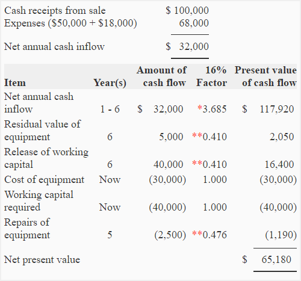

## Table of Contents

## What is working capital and why is it important for businesses?

Working capital is the money a business has available to use for its daily operations. It is calculated by subtracting a company's current liabilities from its current assets. This includes things like cash, inventory, and accounts receivable minus what the business owes in the short term, like bills and debts.

Having enough working capital is important because it helps a business run smoothly. If a company has good working capital, it can pay its bills on time, buy inventory when needed, and handle unexpected expenses. Without enough working capital, a business might struggle to keep operating, which can lead to bigger problems like not being able to pay employees or suppliers.

## How does working capital affect a company's cash flow?

Working capital directly impacts a company's cash flow because it shows how much money the company has to work with every day. If a company has a lot of working capital, it means they have more cash coming in than going out. This makes it easier for them to pay for things like supplies, employee salaries, and other bills without worrying about running out of money.

On the other hand, if a company doesn't have enough working capital, it can lead to cash flow problems. This means they might not have enough money to cover their daily costs, which can cause delays in paying suppliers or employees. Over time, this can harm the business because it might lose the trust of people it works with and struggle to keep operating smoothly.

## What is Net Present Value (NPV) and how is it calculated?

Net Present Value (NPV) is a way to figure out how much money a project or investment will be worth in today's dollars. It helps you decide if an investment is a good idea by comparing the money you expect to make in the future to what you would have if you invested that money now. If the NPV is more than zero, it usually means the investment is worth doing because you'll end up with more money than you started with.

To calculate NPV, you start by guessing how much money you'll get from the investment in the future. Then, you need to figure out what that future money is worth today. You do this by using a discount rate, which is kind of like an interest rate that shows how much value money loses over time. You take each future cash flow, divide it by one plus the discount rate raised to the power of the number of time periods until you get that cash flow, and then add up all those values. If the total is positive, the investment is likely a good choice.

## Why is it important to consider working capital in NPV calculations?

Working capital is really important when figuring out the Net Present Value (NPV) of a project. It's all about making sure you have enough money to keep your business running day to day. When you're planning a new project, you need to think about how it will change the amount of money you have to work with. If a project needs a lot of money upfront for things like buying more inventory or paying for new employees, it can make your working capital go down. This might make it harder to pay your bills on time, and you need to account for that when you're calculating the NPV.

Including working capital in NPV calculations helps you see the full picture of how a project will affect your business. If you don't think about working capital, you might think a project looks good on paper because it brings in a lot of money in the future. But if it leaves you short on cash in the short term, it could cause problems. By adding working capital changes into your NPV, you can make better decisions about whether a project is really worth doing, making sure it won't mess up your day-to-day money needs.

## What are the components of working capital that should be included in NPV analysis?

When figuring out the Net Present Value (NPV) of a project, you need to think about how it will change your working capital. Working capital is the money you use to run your business every day. The main parts of working capital that you should include in your NPV analysis are cash, inventory, accounts receivable, and accounts payable. Cash is the money you have on hand. Inventory is the stuff you have to sell or use in your business. Accounts receivable is the money that customers owe you, and accounts payable is the money you owe to others.

These parts of working capital can change a lot when you start a new project. For example, if you need to buy more inventory to get ready for the project, that uses up some of your cash. If the project means you'll sell more and get more money from customers, your accounts receivable might go up. And if you need to pay suppliers more often because of the project, your accounts payable will change too. All these changes can affect how much money you have to work with day to day, so you need to include them in your NPV calculations to get a true picture of how the project will impact your business's money situation.

## How do you estimate the future working capital needs of a project?

Estimating the future working capital needs of a project involves looking at how the project will change your day-to-day money situation. You start by thinking about how much more cash, inventory, and accounts receivable you might need. If the project means you'll need to buy more stuff to sell or use, you'll need more cash to pay for it. If it means you'll sell more and customers will owe you more money, your accounts receivable will go up. You also need to think about how much more you'll need to pay suppliers, which affects your accounts payable. By adding up these changes, you can get an idea of how much extra working capital you'll need.

To make a good estimate, you can use past data from similar projects your business has done before. Look at how much working capital those projects used and think about if this new project will be bigger or smaller. You can also talk to people in your business who know about the project's details to get a better idea of what you'll need. By combining this information, you can come up with a good guess about the working capital needs for the project. This helps you plan better and make sure you have enough money to keep your business running smoothly while you work on the project.

## What are the common methods for discounting working capital in NPV?

When you're figuring out the Net Present Value (NPV) of a project, you need to think about how much working capital the project will use and how to count that in today's money. One common way to do this is by using a discount rate. The discount rate is like an interest rate that shows how much value money loses over time. You take the changes in working capital that you expect to happen in the future and divide them by one plus the discount rate raised to the power of the number of time periods until that change happens. This way, you can see how much those future changes in working capital are worth right now.

Another method is to treat changes in working capital as cash flows in the NPV calculation. If the project needs more working capital, you see that as a negative cash flow at the start. If the project frees up working capital when it's done, that's a positive cash flow at the end. You use the same discount rate to figure out what these cash flows are worth today. By doing this, you can make sure you're counting the working capital needs of the project in your NPV, which helps you see if the project is really worth doing.

## How does the timing of cash flows related to working capital impact NPV?

The timing of cash flows related to working capital can really change the Net Present Value (NPV) of a project. When you're figuring out NPV, you need to think about when the money comes in or goes out. If a project needs a lot of working capital right at the start, like buying more inventory or paying for new workers, that's a big chunk of money you need upfront. This early cash outflow makes the NPV go down because you're spending money now, and that money could have been used for other things or invested elsewhere.

On the other hand, if the project frees up working capital later on, like when you sell off extra inventory or collect money from customers, that's good news for your NPV. This money coming in later is worth less than money you have today because of the discount rate, but it still helps boost the NPV. So, understanding when you'll need to spend money on working capital and when you'll get it back is key to figuring out if a project is a good idea or not.

## What are the risks associated with underestimating working capital requirements in NPV?

Underestimating working capital requirements in NPV can lead to big problems for a business. If a company thinks a project will need less working capital than it really does, they might run out of money to pay for everyday things like bills and salaries. This can make the business struggle to keep going, and they might have to borrow more money quickly, which can be expensive and risky.

Also, if a company doesn't plan for enough working capital, they might miss out on good opportunities. For example, they might not have enough money to buy more inventory when they need it, so they can't take advantage of a big sale or meet customer demand. This can hurt the business in the long run because they might lose customers or not grow as fast as they could have.

## How can changes in working capital requirements affect the overall NPV of a project?

Changes in working capital requirements can really change the overall Net Present Value (NPV) of a project. If a project needs a lot of extra money for things like buying more inventory or hiring new workers, that's money the business has to spend right away. This early spending makes the NPV go down because it's like taking money out of the business now, which could have been used for other things or put into savings.

On the other hand, if the project helps the business free up working capital later on, like when they sell off extra inventory or get paid by customers, that's good for the NPV. This money coming in later isn't worth as much as money today because of the discount rate, but it still helps make the NPV higher. So, understanding when the business will need to spend money on working capital and when it will get it back is really important for figuring out if a project is worth doing.

## What advanced techniques can be used to more accurately discount working capital in NPV?

One advanced technique to more accurately discount working capital in NPV is to use a variable discount rate instead of a fixed one. This means you change the discount rate over time based on how risky the project gets at different stages. For example, if the project is riskier at the start because it needs a lot of money for inventory, you might use a higher discount rate at the beginning. As the project goes on and becomes less risky, you can lower the discount rate. This way, you can better match the discount rate to the actual risk of the project, making your NPV calculation more accurate.

Another technique is to use scenario analysis. This means you look at different possible futures for the project and see how working capital needs might change in each one. You can create best-case, worst-case, and most-likely-case scenarios. For each scenario, you figure out the working capital needs and then calculate the NPV. By doing this, you get a range of possible NPVs instead of just one number. This helps you understand how sensitive the project's value is to changes in working capital, making your decision-making more informed and robust.

## How do different industries approach the discounting of working capital in their NPV calculations?

Different industries might have different ways of discounting working capital in their NPV calculations because their businesses work differently. For example, in manufacturing, a company might need a lot of money upfront to buy materials and pay workers before they can sell anything. So, they might use a higher discount rate at the start of the project to show how risky it is to tie up so much money in working capital. As the project goes on and they start selling products, they might lower the discount rate because the risk goes down.

In the retail industry, working capital needs can change a lot depending on the time of year. Stores might need more money for inventory before big sales like holidays, so they might use a higher discount rate during those times. But after the sales, when they get money back from customers, they might use a lower discount rate. This way, they can better match the discount rate to the ups and downs of their working capital needs throughout the year.

## What is the understanding of Discounting and NPV?

Discounting is a fundamental concept in finance that allows investors to assess the value of future cash flows in today’s terms. It is based on the principle of the time value of money, which asserts that a dollar today is worth more than a dollar in the future due to the potential [earning](/wiki/earning-announcement) capacity. The process of discounting involves applying a discount rate to the expected future cash flows to determine their present value. 

The Net Present Value (NPV) is a core financial metric specifically employed to evaluate the profitability and feasibility of investment projects. NPV is calculated by summing the present values of all expected cash inflows and outflows associated with the investment. The mathematical representation of NPV is as follows:

$$
\text{NPV} = \sum \left( \frac{C_t}{(1 + r)^t} \right) - C_0
$$

where $C_t$ represents the cash inflow or outflow at time $t$, $r$ is the discount rate, and $C_0$ is the initial investment cost. A positive NPV indicates that the projected earnings (discounted to present value terms) exceed the costs, thus making the investment potentially profitable.

Integrating discounting into NPV calculations is essential for accurate investment analysis. It ensures that both the magnitude and timing of cash flows are considered, providing a holistic view of the project's value. By discounting future cash flows, investors can adjust for uncertainties and risks associated with different time periods. This comprehensive approach allows for more informed decision-making, as it accounts not just for the total amount of forecasted returns, but also when these returns are expected to occur.

Overall, discounting and NPV are indispensable in modern finance, enabling investors to make strategic choices by quantitatively evaluating the potential of investments. Understanding and applying these concepts can significantly enhance investment decisions and outcomes.

## What is the role of working capital in NPV calculations?

Working capital stands as a pivotal component in evaluating a company’s short-term financial status and viability, playing a crucial role in Net Present Value (NPV) calculations. Essentially, working capital represents the difference between a company's current assets and current liabilities, serving as a measure of its efficiency and short-term financial health. When assessing a project's NPV, the inclusion and careful handling of working capital is imperative.

Investing in working capital involves allocating resources to current assets such as inventory and accounts receivable. While this may initially tie up funds and impact [liquidity](/wiki/liquidity-risk-premium), these investments are often recoverable as projects reach maturity and begin generating returns. Thus, the effective management and forecasting of working capital needs are essential for ensuring that a firm's cash flow is sufficient to support ongoing operations without excessive overhead.

In the context of NPV analysis, changes in working capital must be incorporated to reflect their true impact on cash flows. As working capital investments are typically non-cash movements, they alter cash flow projections and, consequently, affect the calculated NPV. A project's cash flow statement, therefore, must account for any increases or decreases in working capital to provide a true representation of cash inflows and outflows. 

The formula to adjust NPV with changes in working capital is expressed as:

$$
NPV = \sum_{t=0}^{n} \frac{C_t - \Delta WC_t}{(1 + r)^t} - C_0
$$

where:
- $C_t$ is the cash inflow during period $t$,
- $\Delta WC_t$ is the change in working capital in period $t$,
- $r$ is the discount rate,
- $t$ is the time period,
- $C_0$ is the initial investment cost.

Effective management of working capital ensures that resources are available when needed and optimizes the project’s overall cash flow. Thus, accounting for changes in working capital through precise discounting is necessary to accurately measure the expected profitability and feasibility of an investment. Understanding these dynamics allows companies to improve strategic planning and execution, ultimately achieving better financial outcomes.

## What is the Case Study about High-Frequency Trading and Discounting?

High-frequency trading ([HFT](/wiki/high-frequency-trading-strategies)) firms utilize advanced discounting techniques as an essential component of their trading strategies to remain competitive in rapidly changing markets. These firms operate on the principle of executing numerous trades within fractions of a second, exploiting short-term [arbitrage](/wiki/arbitrage) opportunities to profit from small price differentials. Central to this process is the sophisticated modeling of transaction costs and liquidity management.

Firms such as Virtu Financial are at the forefront of deploying these advanced techniques. Their algorithms are designed to efficiently handle vast amounts of data, dynamically adjusting for transaction costs, and managing liquidity. The precision of these models directly influences the profitability of trades, where even minute errors in cost estimation or liquidity assessment can lead to significant financial discrepancies.

A critical aspect of these models is the practice of discounting projected cash flows accurately. By applying discounting methods to the anticipation of future revenues and expenses, HFT firms are able to present value future cash flows based on prevailing interest rates and expected market [volatility](/wiki/volatility-trading-strategies). The present value $\text{PV}$ of a cash flow that will be received in the future can be calculated using the formula:

$$
\text{PV} = \frac{\text{FV}}{(1 + r)^n}
$$

where $\text{FV}$ represents the future value of the cash flow, $r$ is the discount rate, and $n$ is the number of periods until the cash flow is received. By incorporating this discounted cash flow analysis, HFT entities can adjust their trading strategies in real-time to account for the cost of capital and the time value of money, ensuring that their rapid decision-making processes are grounded in robust financial evaluation.

In volatile markets, the ability to accurately discount projected cash flows allows HFT firms to manage their risks effectively. By understanding the temporal value of cash flows, these firms can make informed decisions on pricing, liquidity provision, and market entry and [exit](/wiki/exit-strategy) points, ultimately maximizing potential profits while minimizing exposure to adverse market movements. This precision in financial evaluation helps maintain their edge in the competitive landscape of high-frequency trading.

## References & Further Reading

[1]: ["Principles of Corporate Finance"](https://en.wikipedia.org/wiki/Principles_of_Corporate_Finance) by Richard A. Brealey, Stewart C. Myers, and Franklin Allen.

[2]: ["Valuation: Measuring and Managing the Value of Companies"](https://www.amazon.com/Valuation-Measuring-Managing-Companies-Finance/dp/1119610885) by McKinsey & Company Inc.

[3]: Damodaran, A. (2002). ["Investment Valuation: Tools and Techniques for Determining the Value of Any Asset"](https://archive.org/details/investmentvaluat0000damo_n6k9). John Wiley & Sons.

[4]: Aldridge, I. (2010). ["High-Frequency Trading: A Practical Guide to Algorithmic Strategies and Trading Systems"](https://www.ahmetbeyefendi.com/wp-content/uploads/2020/07/High-Frequency-Trading-Irene-Aldridge.pdf). John Wiley & Sons.

[5]: Pyles, M. K. (2014). ["Applied Corporate Finance: Questions, Problems and Making Decisions in the Real World"](https://archive.org/details/appliedcorporate0000pyle). Routledge.