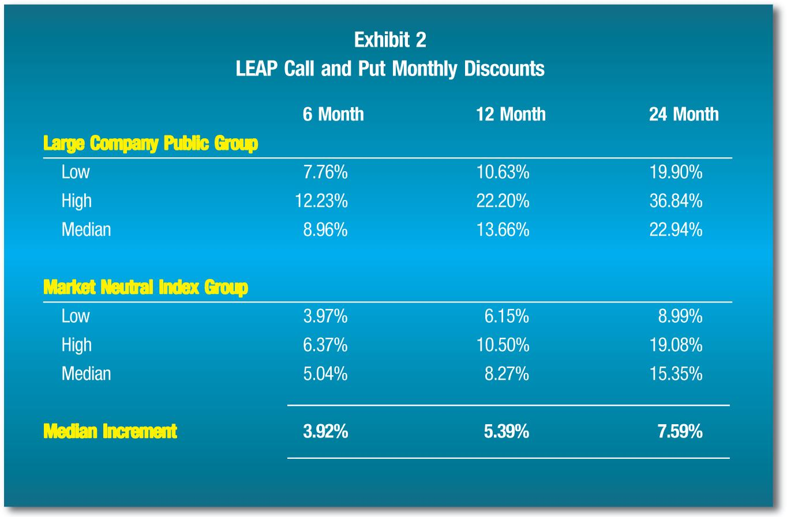

## Table of Contents

## What is a discount for lack of marketability (DLOM)?

A discount for lack of marketability (DLOM) is a reduction in the value of an asset because it is hard to sell quickly. Imagine you have a piece of art. If it's easy to sell at a fair price, it's marketable. But if it's hard to find someone to buy it, you might have to lower the price. That lower price is the DLOM.

DLOM is important in business valuations, especially for private companies. Since shares in private companies can't be sold as easily as stocks in public companies, they often need a discount. This discount reflects the risk and time it might take to find a buyer. It helps make sure the value is fair for everyone involved.

## Why is DLOM important in business valuation?

DLOM is important in business valuation because it helps make sure the value of a company is fair. When you're valuing a private company, its shares aren't as easy to sell as stocks in a public company. Because of this, you need to lower the value to account for the time and risk involved in finding a buyer. This discount makes the valuation more realistic and fair for everyone involved.

For example, if someone wants to buy a private company, they need to know that they might not be able to sell their shares quickly if they need to. The DLOM reflects this difficulty. By applying the discount, the buyer gets a clearer picture of what the company is really worth, considering how hard it might be to sell the shares later on. This helps in making better, more informed decisions about buying or selling the company.

## How does DLOM affect the value of a private company?

DLOM, or discount for lack of marketability, lowers the value of a private company. This happens because shares in a private company are not easy to sell. When you want to sell a share in a public company, you can do it quickly on the stock market. But with a private company, finding a buyer can take a long time. Because of this, the value of the company needs to be reduced to show that it's harder to turn those shares into cash.

This discount makes the value of the private company more realistic. If someone is thinking about buying the company, they need to know that they might not be able to sell their shares quickly if they need money. The DLOM helps them understand this risk. By lowering the value, the buyer gets a fair price that takes into account how hard it might be to sell the shares later on. This way, everyone involved can make better decisions about the company's worth.

## What are the common methods used to calculate DLOM?

One common method to calculate DLOM is by looking at studies and data from past sales of similar private companies. These studies show how much less private company shares sold for compared to public company shares. By using this data, you can estimate a fair discount for the private company you're valuing. This method is called the empirical method because it uses real-world data.

Another method is the option pricing method. This method uses financial models to figure out the discount. It treats the lack of marketability like an option that the buyer has to wait before selling the shares. By using these models, you can calculate how much the value should be reduced to account for the time and risk of waiting to sell.

A third method is the restricted stock method. This involves looking at the price difference between restricted stocks and freely traded stocks of the same company. Restricted stocks are shares that can't be sold right away, similar to private company shares. By comparing the prices, you can see how much of a discount is needed for the private company's shares.

## Can you explain the difference between marketability and liquidity in the context of DLOM?

Marketability and [liquidity](/wiki/liquidity-risk-premium) are two important ideas in the context of DLOM, but they are not the same thing. Marketability is about how easy it is to find a buyer for your shares. If you own shares in a private company, it can be hard to find someone who wants to buy them. This difficulty is what DLOM tries to account for by lowering the value of the shares. Marketability is more about the process of selling and the time it takes to find a buyer.

Liquidity, on the other hand, is about how quickly you can turn your shares into cash. If you own stocks in a public company, you can sell them on the stock market and get your money fast. But with private company shares, even if you find a buyer, it might take a long time to actually get the money. So, liquidity is more about the speed of getting cash, while marketability is about the ease of finding a buyer. Both affect the value of a private company, but in different ways.

## What are some empirical studies that support the application of DLOM?

One well-known study is the SEC Institutional Investor Study from 1971. This study looked at the prices of restricted stocks, which are similar to private company shares because they can't be sold right away. The study found that these restricted stocks sold for about 25% to 35% less than the freely traded stocks of the same company. This big difference in price showed that investors wanted a lower price for shares that were hard to sell quickly. This study helped show why DLOM is important and gave a way to estimate the discount.

Another important study is the FMV Opinions study from 1997. This study looked at many private sales of companies and compared them to public companies. It found that private company shares sold for around 40% to 50% less than similar public company shares. This large discount showed that investors really care about how easy it is to sell shares. The study helped support the idea that DLOM should be used in valuing private companies to make sure the price is fair.

## How do factors like company size and industry affect DLOM?

Company size and industry can change how much DLOM is applied. If a company is small, it might be harder to find buyers for its shares. This means the DLOM could be bigger because it's riskier to invest in a small company where selling shares is tough. On the other hand, if a company is big, more people might want to buy its shares, so the DLOM might be smaller. The size of the company matters because it affects how easy it is to sell shares.

The industry also plays a role in DLOM. Some industries are more popular or easier to understand, so finding buyers for shares in those industries might be easier. For example, tech companies might have a smaller DLOM because many people want to invest in tech. But if a company is in a less popular or more complicated industry, like manufacturing, it might be harder to find buyers, leading to a bigger DLOM. The industry can make a big difference in how easy or hard it is to sell shares, which affects the discount.

## What role does the holding period play in determining DLOM?

The holding period is how long you might have to wait before you can sell your shares. If you own shares in a private company, you might need to hold onto them for a long time before finding a buyer. This long wait can make the shares less valuable because people don't like to wait a long time to get their money. The longer the holding period, the bigger the DLOM might be. This is because the risk and time involved in waiting to sell the shares are higher.

For example, if someone thinks they might need to wait five years to sell their shares, they might want a bigger discount to make up for that long wait. On the other hand, if the holding period is shorter, like one year, the DLOM might be smaller because it's not as hard to wait a shorter time. So, the holding period is an important part of figuring out how much to lower the value of the shares to make the price fair for everyone.

## How do legal and contractual restrictions influence DLOM?

Legal and contractual restrictions can make it harder to sell shares in a private company, which can increase the DLOM. For example, some companies have rules that say you can't sell your shares without the company's permission. This makes it tough to find a buyer because you have to wait for the company to say it's okay. Other times, there might be laws that limit who can buy the shares, like only people in certain countries. These restrictions mean you might have to wait longer to sell your shares, so the value of the shares needs to be lower to account for this.

These restrictions also add risk because you're not sure when or if you'll be able to sell your shares. If you can't sell them easily, you might need more money to be willing to buy them in the first place. This is why the DLOM goes up when there are more legal or contractual restrictions. The discount makes the price fair by showing how hard it might be to turn those shares into cash.

## What are the challenges and controversies surrounding the application of DLOM?

Using DLOM can be tricky because it's hard to know exactly how much to lower the value of a private company's shares. Different people might use different methods to figure out the discount, like looking at past sales or using financial models. Because these methods can give different results, people might argue about which one is best. Also, things like the size of the company, the industry it's in, and any legal rules can make the discount bigger or smaller. This means that even experts might not agree on the right amount of discount, which can lead to disagreements when buying or selling a company.

Another problem is that DLOM can be used to change the price of a company in ways that might not be fair. For example, if someone wants to buy a private company, they might say the shares are hard to sell and ask for a big discount. But if the seller thinks the shares are not that hard to sell, they might not want to give such a big discount. This can cause a lot of arguing and make it hard to agree on a fair price. Because DLOM is based on guesses about how easy it is to sell shares, it's easy for people to have different ideas about what's fair.

## How do valuation professionals typically document and justify the DLOM they apply?

Valuation professionals usually write a detailed report to explain the DLOM they use. In this report, they talk about the methods they used to figure out the discount, like looking at past sales of similar companies or using financial models. They also explain why they chose those methods and how they fit the specific company they are valuing. They might include data from studies, like the SEC Institutional Investor Study or the FMV Opinions study, to show why the discount makes sense. They also talk about things like the size of the company, the industry it's in, and any legal rules that might make it harder to sell the shares.

In the report, valuation professionals also explain how they thought about the holding period and any legal or contractual restrictions that could affect the discount. They might use examples or stories to make it clear why these things matter. They want to show that they thought carefully about all the factors that could make the shares harder to sell. By doing this, they help everyone understand why the discount they chose is fair and makes sense for the company they are valuing.

## What are advanced quantitative models used for estimating DLOM, and how do they differ from traditional approaches?

Advanced quantitative models for estimating DLOM often use complex math to figure out how much to lower the value of private company shares. One popular model is the option pricing model, which treats the lack of marketability like a financial option. This model looks at how long you might have to wait before selling the shares and how risky it is to hold onto them. It uses numbers and formulas to come up with a discount that reflects these factors. Another advanced model is the put option model, which looks at what it would cost to buy insurance against not being able to sell the shares quickly. These models are more detailed and try to capture the many different things that can affect how easy or hard it is to sell shares.

Traditional approaches to estimating DLOM are simpler and often rely on looking at past sales of similar companies. For example, valuation professionals might use studies like the SEC Institutional Investor Study or the FMV Opinions study to see how much less private company shares sold for compared to public company shares. They then use this data to guess a fair discount for the company they are valuing. These methods are easier to understand and use because they don't need complex math, but they might not be as accurate for every company. The main difference is that advanced quantitative models use detailed math to try to be more precise, while traditional approaches use simpler, more general data to estimate the discount.

## What are the methodologies for calculating DLOM?

Empirical models such as the restricted stock and pre-IPO studies are widely used to estimate the Discount for Lack of Marketability (DLOM) by leveraging historical data aimed at comparing private and public company stocks. The restricted stock method takes advantage of the price differential between restricted and unrestricted shares of public companies. This difference is assumed to represent the reduction in value due to lack of marketability, as restricted shares cannot be freely traded. Similarly, pre-IPO studies examine the price behavior of companies transitioning from private to public status. The comparison of pre-IPO valuations with subsequent public offerings provides insights into the marketability discounts attributable to private company shares.

On the theoretical front, option pricing models are often employed to evaluate DLOM by treating marketability as a quantifiable option to sell. These models consider the lack of marketability as analogous to holding a European-style option, where the owner cannot exercise the option to sell their interest until marketability constraints are lifted. The Black-Scholes model, a renowned option valuation framework, can be adapted to incorporate this angle, providing a mathematical approach to estimating DLOM. The formula used might resemble:

$$
DLOM = 1 - \frac{S_0}{C + S_0}
$$

where $S_0$ represents the initial stock price and $C$ the call option price as derived from the Black-Scholes equation.

Hybrid models, notably those proposed by Longstaff and Finnerty, integrate empirical and theoretical methods to offer a more nuanced estimation of DLOM. Longstaff's model uses a theoretical framework based on the cost of the option to sell as the basis for marketability discount, incorporating variables such as [volatility](/wiki/volatility-trading-strategies) and time to liquidity event. Finnerty, on the other hand, expands on this by employing historical data to adjust theoretical models, allowing for adjustments based on real-world observations. This blend of methods aims to reconcile the benefits of empirical and theoretical insights, striving for a balance that better reflects market conditions and specific investment scenarios.

The overarching goal of these methodologies is to provide precise assessments of DLOM that account for variations in market conditions and company-specific factors. By employing a blend of historical data analyses and theoretical valuation models, these approaches seek to deliver tailored valuations that are robust and adaptable to the nuances of different investment opportunities.

## References & Further Reading

[1]: Bajaj, M., & Mazumder, S. (2006). ["Measuring Discounts for Lack of Marketability for Closely-held Firms."](https://www.researchgate.net/publication/46555514_The_Discount_for_Lack_of_Marketability_in_Privately_Owned_Companies_A_Multiples_Approach) The Business Valuation Review.

[2]: Damodaran, A. (2005). ["Marketability and Value: Measuring the Illiquidity Discount."](https://pages.stern.nyu.edu/~adamodar/pdfiles/papers/liquidity.pdf) Stern School of Business, New York University.

[3]: Flanagan, J. (2012). ["Discounts for Lack of Marketability as Applied to Private Business Valuation."](https://cst-cpa.com/wp-content/uploads/Common_Discounts_Romagnoli_.pdf) Journal of Sustainable Finance & Investment.

[4]: Longstaff, F.A. (1995). ["How Much Can Marketability Affect Security Values?"](https://onlinelibrary.wiley.com/doi/abs/10.1111/j.1540-6261.1995.tb05197.x) The Journal of Finance.

[5]: Mandelbaum, E. A. (2020). ["Beyond Black-Scholes: Valuation of Private Companies Under Uncertainty and Ignorance."](https://edu.nacva.com/AdvancedDP/2014v1/Advanced_D-P_Chapter_Ten.pdf) Journal of Financial Economics.