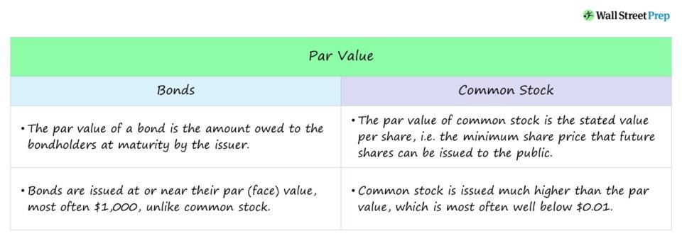

## Table of Contents

## What is the face value of a preferred stock?

The face value of a preferred stock is the fixed amount that the company promises to pay the shareholder when the stock is redeemed or when the company is liquidated. It's also known as the par value or nominal value. This value is set when the stock is issued and remains the same throughout the life of the stock. For example, if a preferred stock has a face value of $100, the shareholder is entitled to receive $100 per share when the stock is redeemed.

In addition to the face value, preferred stocks often come with a fixed dividend rate. This means that shareholders receive regular dividend payments based on the face value of their shares. For instance, if a preferred stock has a face value of $100 and a dividend rate of 5%, the shareholder would receive $5 per year for each share they own. The face value is important because it determines both the redemption amount and the basis for calculating dividend payments, making it a key feature of preferred stocks.

## What is the market value of a preferred stock?

The market value of a preferred stock is the price at which it is currently trading on the stock market. This value can go up or down based on many things, like how well the company is doing, what's happening in the economy, and what investors think about the stock. Unlike the face value, which stays the same, the market value can change every day.

People often compare the market value to the face value and the dividend rate to see if the stock is a good buy. If the market value is lower than the face value, it might look like a good deal. But, investors also think about other things, like how safe the dividends are and how easy it might be to sell the stock later. So, the market value is important because it tells you what you have to pay to buy the stock right now, and it can help you decide if it's worth the price.

## Why might the market value of a preferred stock differ from its face value?

The market value of a preferred stock can be different from its face value because of many reasons. One big reason is how the company is doing. If the company is doing well and making a lot of money, people might want to buy its preferred stocks, making the market value go up. On the other hand, if the company is not doing so well, people might not want to buy the stocks, and the market value could go down. Another reason is what's happening in the economy. If the economy is doing well, people might be willing to pay more for stocks, pushing the market value higher. But if the economy is not doing well, the market value might drop.

Interest rates also play a big role. Preferred stocks usually pay a fixed dividend, so if interest rates go up, new stocks might offer higher dividends, making older stocks with lower dividends less attractive. This can make the market value of the older stocks go down. Also, what investors think about the stock matters a lot. If they think the company might have trouble paying dividends in the future, they might not want to buy the stock, and the market value could drop below the face value. All these things together can make the market value of a preferred stock different from its face value.

## How is the face value of a preferred stock determined?

The face value of a preferred stock is set by the company when it first decides to issue the stock. This value is like a promise from the company to the people who buy the stock. It tells them how much money they will get back if the company decides to buy back the stock or if the company has to close down. The company picks this number based on what they think is fair and what will make people want to buy their stock. It's like setting a price tag on something before you sell it.

Once the face value is set, it doesn't change. It stays the same no matter what happens to the company or the economy. This face value is important because it's used to figure out how much money shareholders will get as dividends. For example, if a stock has a face value of $50 and a dividend rate of 6%, shareholders will get $3 every year for each share they own. So, the face value is a big deal because it helps decide how much money people can make from owning the stock.

## What factors influence the market value of preferred stocks?

The market value of preferred stocks goes up and down because of many things. One big thing is how the company is doing. If the company is making a lot of money and doing well, people might want to buy its preferred stocks, which can make the market value go up. But if the company is not doing so well, people might not want to buy the stocks, and the market value could go down. Another important thing is what's happening in the economy. If the economy is doing well, people might be willing to pay more for stocks, pushing the market value higher. But if the economy is not doing well, the market value might drop.

Interest rates also play a big role in the market value of preferred stocks. These stocks usually pay a fixed dividend, so if interest rates go up, new stocks might offer higher dividends, making older stocks with lower dividends less attractive. This can make the market value of the older stocks go down. Also, what investors think about the stock matters a lot. If they think the company might have trouble paying dividends in the future, they might not want to buy the stock, and the market value could drop. All these things together can make the market value of a preferred stock change a lot.

## Can the market value of a preferred stock ever be lower than its face value? Why?

Yes, the market value of a preferred stock can be lower than its face value. This happens when people think the stock is not worth as much as the company said it was when they first sold it. For example, if the company is not doing well or if people think the company might not be able to pay the dividends it promised, they might not want to buy the stock. This can make the price of the stock go down, even below the face value.

Another reason the market value might be lower is because of what's happening in the economy or with interest rates. If the economy is not doing well, people might not want to buy stocks, which can make the market value drop. Also, if interest rates go up, new preferred stocks might offer higher dividends, making older stocks with lower dividends less attractive. So, the market value of a preferred stock can be lower than its face value because of many reasons, like how the company is doing, what's happening in the economy, and changes in interest rates.

## How do dividends affect the discrepancy between face value and market value of preferred stocks?

Dividends are a big reason why the market value of a preferred stock can be different from its face value. Preferred stocks usually pay a fixed dividend, which is like a regular payment to people who own the stock. If the dividend is high compared to other investments, people might want to buy the stock, which can make the market value go up. But if the dividend is low, people might not want to buy it, and the market value could go down, even below the face value.

Another thing to think about is if people think the company can keep paying the dividends. If the company is doing well and making a lot of money, people might trust that it will keep paying the dividends, which can make the market value go up. But if the company is not doing so well, people might worry that it won't be able to pay the dividends in the future. This can make the market value go down, sometimes even lower than the face value. So, the dividends and what people think about the company's ability to pay them can make a big difference in the market value of a preferred stock.

## What role does interest rate environment play in the valuation of preferred stocks?

Interest rates are really important when it comes to figuring out how much preferred stocks are worth. Preferred stocks usually pay a fixed dividend, which is like a regular payment to people who own the stock. When interest rates go up, new preferred stocks might offer higher dividends to keep up with the higher rates. This can make older preferred stocks with lower dividends less attractive to people, which can make their market value go down. On the other hand, if interest rates go down, the fixed dividends on preferred stocks can look more attractive compared to other investments, which can make their market value go up.

Also, when interest rates change, it can affect how people feel about the economy. If interest rates are high, it might mean the economy is doing well, but it can also make people more careful about where they put their money. They might not want to buy preferred stocks if they can get a good return from other places like bonds. But if interest rates are low, people might be more willing to buy preferred stocks because they can't get a good return from other safe investments. So, the interest rate environment can really change how much people are willing to pay for preferred stocks, making their market value go up or down.

## How do changes in a company's credit rating impact the market value of its preferred stocks?

Changes in a company's credit rating can really affect how much people are willing to pay for its preferred stocks. If a company's credit rating goes up, it means people think the company is doing better and is less likely to have money problems. This can make people feel more confident that the company will keep paying the dividends on its preferred stocks. When people feel more confident, they might be willing to pay more for the stocks, which can make the market value go up.

On the other hand, if a company's credit rating goes down, it means people think the company might have trouble paying its bills or dividends. This can make people worried about buying the company's preferred stocks. When people are worried, they might not want to pay as much for the stocks, or they might even sell the stocks they already own. This can make the market value of the preferred stocks go down, sometimes even lower than the face value. So, a company's credit rating is important because it can change how much people trust the company and how much they are willing to pay for its preferred stocks.

## What are the implications of a significant discrepancy between face value and market value for investors?

A big difference between the face value and the market value of a preferred stock can mean a lot for investors. If the market value is much lower than the face value, it might look like a good deal. Investors might think they can buy the stock for less than what it's really worth and make money when the company pays back the face value. But, they also need to think about why the market value is so low. It could be because people think the company is not doing well or might not be able to pay the dividends. So, buying a stock just because it's cheap can be risky if the company's problems don't get better.

On the other hand, if the market value is much higher than the face value, it might mean that investors are really excited about the stock. They might think the company is doing great and will keep paying good dividends. This can be a good sign for investors who already own the stock, as they might be able to sell it for more than they paid. But, it also means that new investors might have to pay a lot more for the stock than what they will get back if the company buys it back at the face value. So, they need to be sure the dividends and any future growth will make up for the high price they are paying.

## How can an investor use the discrepancy between face value and market value to make investment decisions?

An investor can use the difference between the face value and the market value of a preferred stock to help decide if it's a good investment. If the market value is a lot lower than the face value, it might seem like a good deal. The investor might think they can buy the stock for less than what it's really worth and make money when the company pays back the face value or if the market value goes up. But, they need to be careful. A low market value could mean that other investors think the company is not doing well or might not be able to pay the dividends. So, buying the stock just because it's cheap can be risky if the company's problems don't get better.

On the other hand, if the market value is a lot higher than the face value, it might mean that investors are really excited about the stock. They might think the company is doing great and will keep paying good dividends. This can be a good sign for investors who already own the stock, as they might be able to sell it for more than they paid. But, it also means that new investors might have to pay a lot more for the stock than what they will get back if the company buys it back at the face value. So, they need to make sure the dividends and any future growth will make up for the high price they are paying. By looking at the difference between face value and market value, along with other information about the company, an investor can make smarter choices about whether to buy, hold, or sell a preferred stock.

## What advanced financial models are used to predict and analyze the discrepancy between face value and market value of preferred stocks?

To predict and analyze the difference between the face value and market value of preferred stocks, investors often use a financial model called the Dividend Discount Model (DDM). This model figures out what a stock is worth by looking at the dividends it pays out in the future. For preferred stocks, which usually pay a fixed dividend, the DDM can help investors see if the stock's market value makes sense compared to its face value. The model takes into account things like the dividend rate, how safe the dividends are, and what other investment options are out there. If the model shows that the stock's market value is a lot lower than its face value, it might mean the stock is a good deal, but investors need to be careful and think about why the market value is so low.

Another model that investors might use is the Capital Asset Pricing Model (CAPM). This model helps figure out what kind of return an investor should expect from a stock, based on how risky it is. By comparing this expected return to the dividends and face value of a preferred stock, investors can see if the stock's market value matches up with what they think it should be. If the market value is a lot different from what the CAPM suggests, it might be a sign that the stock is overvalued or undervalued. Both the DDM and CAPM can help investors make better decisions by giving them a clearer picture of how the market value of a preferred stock compares to its face value.

## How can algorithms be used for the valuation of preferred stocks?

Valuation of preferred stocks is a critical process in financial markets, requiring methodologies that capture their unique characteristics. The dividend discount model (DDM) is commonly used for valuing preferred stocks, leveraging the fixed nature of their dividend payments. The DDM calculates the present value of expected future dividends, assuming they continue indefinitely. The formula used in the DDM for preferred stocks is:

$$
P = \frac{D}{r}
$$

Where:
- $P$ is the price of the preferred stock.
- $D$ is the fixed dividend per period.
- $r$ is the required rate of return or discount rate.

In algorithmic trading, these valuation models are encoded into algorithms that can make buy or sell decisions based on set criteria. The integration of algorithms with DDM allows traders to automate the evaluation process, sharply reducing the time and effort needed to analyze stocks. Algorithms can be programmed to adjust to changes in the required rate of return $r$, responding dynamically to shifts in market conditions.

Historical data plays a pivotal role in refining these valuation models. Machine learning techniques can enhance the predictive capabilities of algorithms by identifying patterns and correlations in data that may not be immediately apparent. Machine learning models, such as support vector machines or neural networks, are built using historical price movements, dividend changes, and interest rates to forecast future valuations more accurately.

A basic Python example of a dividend discount model for preferred stocks includes the calculation of present value based on historical dividend data:

```python
def preferred_stock_valuation(dividend, required_rate_of_return):
    return dividend / required_rate_of_return

# Example for a preferred stock with a $5 annual dividend and a 10% required rate of return
dividend = 5
required_rate_of_return = 0.1
price = preferred_stock_valuation(dividend, required_rate_of_return)
print(f"The estimated price of the preferred stock is ${price:.2f}")
```

Algorithmic strategies that employ [machine learning](/wiki/machine-learning) may involve supervised learning approaches, where historical data sets containing labeled (i.e., known outcomes) training data are used to "teach" the algorithm. These data sets help the model learn the typical behavior of securities under different market conditions, thus informing future trading signals.

Examples of algorithmic strategies include [momentum](/wiki/momentum)-based strategies, where algorithms seek to buy preferred stocks experiencing short-term uptrends while selling those in decline. Mean reversion strategies are another example, leveraging the tendency of stock prices to revert to their historical average. In implementing these strategies, machine learning can aid in the accurate timing and execution of trades, potentially increasing profitability.

By systematically applying these technologically advanced methods, investors and financial institutions can enhance the accuracy and efficiency of preferred stock trading, gaining a competitive edge in fluctuating markets.

## References & Further Reading

[1]: ["Preferred Stock"](https://www.investopedia.com/terms/p/preferredstock.asp) on Investopedia, a comprehensive guide on the features and types of preferred stocks.

[2]: ["Algorithmic Trading and DMA: An Introduction to Direct Access Trading Strategies"](https://www.amazon.com/Algorithmic-Trading-DMA-introduction-strategies/dp/0956399207) by Barry Johnson, which provides insight into algorithmic trading's role in financial markets.

[3]: ["Fixed Income Securities: Tools for Today's Markets"](https://www.amazon.com/Fixed-Income-Securities-Markets-Finance/dp/1119835550) by Bruce Tuckman and Angel Serrat, introduces concepts important in the valuation of fixed-income securities like preferred stocks.

[4]: ["Quantitative Finance for Physicists: An Introduction"](https://www.sciencedirect.com/book/9780120884643/quantitative-finance-for-physicists) by Anatoly B. Schmidt, which addresses mathematical approaches used in financial trading.

[5]: ["Algorithmic and High-Frequency Trading"](https://www.amazon.com/Algorithmic-High-Frequency-Trading-Mathematics-Finance/dp/1107091144) by Álvaro Cartea, Sebastián Jaimungal, and José Penalva, explores the strategies used in algorithmic trading.