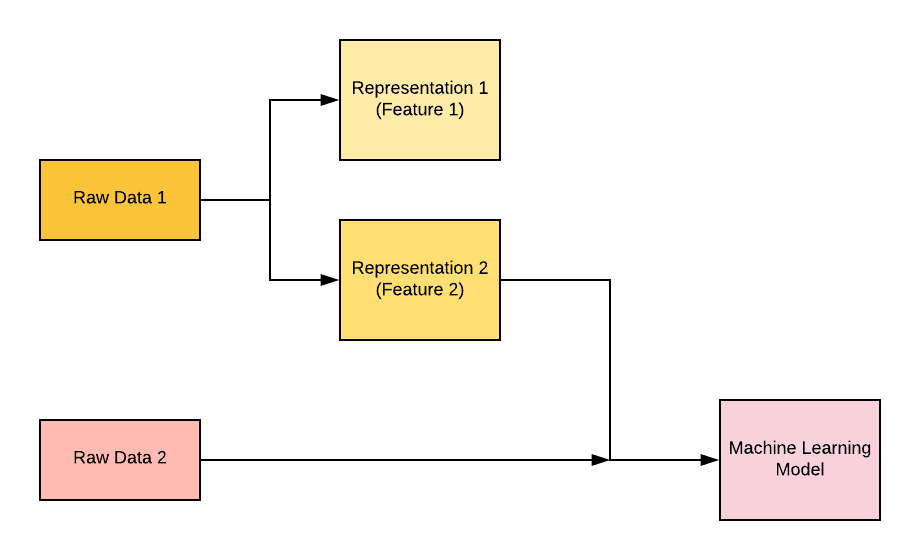

## Table of Contents

## What is a discrete feature in the context of machine learning?

In machine learning, a discrete feature is a type of variable that can only take on specific, separate values. Think of it like counting items; you can have 1, 2, or 3 items, but not 1.5 items. These values are often whole numbers or categories. For example, the number of bedrooms in a house is a discrete feature because you can have 2 bedrooms or 3 bedrooms, but not 2.5 bedrooms.

Discrete features are important in machine learning because they help in classifying and organizing data into distinct groups. For instance, if you're trying to predict whether someone will buy a product, you might use a discrete feature like their age group (e.g., 20-29, 30-39) to help make that prediction. Unlike continuous features, which can have any value within a range, discrete features provide clear, defined options that can simplify the analysis and improve the accuracy of machine learning models.

## How do discrete features differ from continuous features?

Discrete features and continuous features are two types of variables used in machine learning, and they differ in the kind of values they can take. Discrete features can only take on specific, separate values. These values are often whole numbers or categories. For example, the number of people in a room is a discrete feature because you can have 1, 2, or 3 people, but not 1.5 people. Discrete features are useful for counting things or putting data into clear groups.

On the other hand, continuous features can take on any value within a range. These values can be whole numbers or fractions. For example, the temperature outside can be 20 degrees, 20.5 degrees, or any other value in between. Continuous features are good for measuring things that can change smoothly, like height or weight. In machine learning, understanding whether a feature is discrete or continuous helps in choosing the right methods to analyze and predict from the data.

## What are some common examples of discrete features in datasets?

Discrete features are often things you can count or put into groups. For example, the number of children in a family is a discrete feature. You might have 0, 1, 2, or more children, but you can't have half a child. Another example is the type of car someone owns. This could be a sedan, SUV, or truck. These are categories, and you can't have a car that's half sedan and half SUV.

Another common discrete feature is the number of rooms in a house. You might have 3 bedrooms or 4 bedrooms, but not 3.5 bedrooms. Similarly, the day of the week is a discrete feature. It can be Monday, Tuesday, Wednesday, and so on, but not a day between Monday and Tuesday. These examples show how discrete features help us sort and analyze data into clear, separate groups.

## How can discrete features be encoded for use in machine learning models?

Discrete features need to be encoded in a way that [machine learning](/wiki/machine-learning) models can understand. One common method is called one-hot encoding. Imagine you have a feature like "color" with values like "red," "blue," and "green." One-hot encoding turns each of these values into a new column with a 1 if the item has that color and a 0 if it doesn't. For example, if an item is red, the "red" column gets a 1, and the "blue" and "green" columns get 0s. This way, the model can work with numbers instead of words.

Another method is label encoding, which is simpler but can sometimes confuse the model. In label encoding, you assign a number to each category. So, "red" might be 1, "blue" might be 2, and "green" might be 3. While this is easier to do, the model might think that 3 (green) is "more" than 2 (blue), which isn't true for colors. So, you have to be careful with label encoding. Both methods help turn words or categories into numbers that machine learning models can use to make predictions.

## What are the advantages of using discrete features in machine learning?

Discrete features make it easier for machine learning models to understand and work with data. When you use discrete features, you're giving the model clear, separate groups to work with. For example, if you're trying to predict if someone will like a movie, you might use their age group as a discrete feature. This helps the model see patterns more easily because it's working with defined categories like "20-29 years old" or "30-39 years old." This can lead to better predictions because the model isn't confused by a lot of different values; it's just looking at a few clear options.

Another advantage is that discrete features are often easier to collect and understand. For instance, counting the number of bedrooms in a house is simple and straightforward. You don't need fancy equipment or complex measurements; you just count the rooms. This makes it easier to gather data and explain it to others. Plus, when you use methods like one-hot encoding to turn these features into numbers, you're helping the model work better without losing the simple, clear nature of the data.

## What challenges might arise when working with discrete features?

One challenge with discrete features is that they can create a lot of columns when you use one-hot encoding. For example, if you have a feature like "country" with many different values, you might end up with a lot of new columns, one for each country. This can make your dataset very big and slow down your model. It can also make it harder for the model to find patterns because it has to look at so many different things at once.

Another challenge is that discrete features can sometimes be hard to interpret. When you turn categories into numbers using label encoding, like giving "red" the number 1 and "blue" the number 2, the model might think that 2 (blue) is "more" than 1 (red). This can confuse the model and lead to wrong predictions. You have to be careful about how you encode your discrete features so that the model understands them correctly.

## How does the choice of encoding method for discrete features impact model performance?

The choice of encoding method for discrete features can really affect how well a machine learning model works. If you use one-hot encoding, you turn each category into a new column with a 1 or a 0. This can make your dataset bigger, which might slow down your model. But it also helps the model understand the data better because it doesn't mix up the categories. For example, if you're looking at colors like "red," "blue," and "green," one-hot encoding makes sure the model knows these are different things, not just numbers like 1, 2, and 3.

On the other hand, label encoding is simpler but can confuse the model. With label encoding, you give each category a number, like "red" is 1 and "blue" is 2. The model might think that 2 (blue) is "more" than 1 (red), which isn't true for colors. This can lead to wrong predictions. So, choosing the right encoding method depends on what you're trying to predict and how your model works. One-hot encoding might be better for clear categories, while label encoding could be okay if the order of the numbers doesn't matter to your model.

## What are some advanced techniques for handling high cardinality in discrete features?

When you have a lot of different categories in a discrete feature, it's called high cardinality. This can make your dataset very big if you use one-hot encoding because you'll end up with a lot of new columns. One way to deal with this is by using a technique called "target encoding." With target encoding, you replace each category with a number that shows how often the target (what you're trying to predict) happens for that category. For example, if you're trying to predict if someone will buy a product and you have a "country" feature, you might replace each country with the percentage of people from that country who bought the product. This way, you keep the important information without making your dataset too big.

Another advanced technique is using "hashing." Hashing turns each category into a number using a special math formula. This can help reduce the number of columns you need. For example, if you have a feature with thousands of categories, hashing can turn them into a smaller set of numbers. But, you have to be careful because different categories might end up with the same number, which can confuse your model. Both target encoding and hashing can help you handle high cardinality in discrete features, but you need to think about what works best for your specific problem and model.

## How can feature selection techniques be applied specifically to discrete features?

Feature selection is important when working with discrete features because it helps you focus on the most useful ones for your machine learning model. One way to do this is by using the chi-square test. This test looks at how much a discrete feature relates to what you're trying to predict. If the test shows a high relationship, that feature might be good to keep. For example, if you're trying to predict if someone will buy a product and you have a "color" feature, the chi-square test can tell you if the color really matters for the prediction.

Another method is using mutual information. This measures how much knowing one thing (like a discrete feature) helps you know something else (like the target you're predicting). If the mutual information is high, the feature is probably important. For example, if you're trying to predict if someone will like a movie and you have an "age group" feature, mutual information can show if knowing someone's age group helps predict their movie preference. Both of these methods help you pick the best discrete features to use in your model, making it work better and faster.

## What role do discrete features play in different types of machine learning algorithms?

Discrete features are important in many types of machine learning algorithms because they help organize data into clear groups. In classification algorithms like decision trees and random forests, discrete features are especially useful. These algorithms split data based on different values of features. For example, a decision tree might use a discrete feature like "color" to decide if something is red or blue. This makes it easier for the algorithm to create clear rules for making predictions. In algorithms like k-nearest neighbors (k-NN), discrete features can help group similar items together. For example, if you're trying to predict if someone will buy a product, knowing their "age group" can help find similar people who made the same decision.

In regression algorithms, discrete features can also be helpful but need to be used carefully. For example, in linear regression, you might use a discrete feature like "number of bedrooms" to predict house prices. But you need to encode these features properly, like using one-hot encoding, so the algorithm doesn't get confused. In clustering algorithms like k-means, discrete features can help form distinct groups. For example, if you're grouping customers, knowing their "type of car" can help create clear clusters. Overall, discrete features help make data easier to understand and use in different machine learning algorithms, but how you use them can depend on the type of algorithm and the problem you're trying to solve.

## How can you assess the importance of discrete features in a trained model?

One way to assess the importance of discrete features in a trained model is by using feature importance scores. These scores tell you how much each feature helps the model make predictions. For example, if you're using a decision tree or a random forest, you can look at how often a feature is used to split the data. If a feature like "color" is used a lot, it's probably important. Another method is permutation importance, where you mix up the values of one feature and see how it affects the model's accuracy. If the model's performance drops a lot when you mix up "age group," then that feature is important.

Another way to check the importance of discrete features is by using the chi-square test or mutual information. The chi-square test looks at how much a feature relates to what you're trying to predict. If the test shows a high relationship between "number of bedrooms" and house prices, then that feature is important. Mutual information measures how much knowing one thing (like a discrete feature) helps you know something else (like the target). If knowing someone's "type of car" helps predict if they'll buy a product, then that feature has high mutual information and is important. Both methods help you understand which discrete features are key for your model's predictions.

## What are the latest research trends concerning discrete features in machine learning?

Recent research in machine learning has been focusing on improving how we handle discrete features, especially when there are a lot of them. One trend is the development of new encoding methods that work better with high-cardinality data. For example, researchers are looking into techniques like target encoding and hashing to turn a lot of categories into numbers without making the dataset too big. These methods try to keep the important information about each category while making it easier for the model to learn. Another trend is using more advanced feature selection methods to pick out the most useful discrete features. Techniques like mutual information and the chi-square test are being improved to work better with big datasets and complex models.

Another area of research is how to make machine learning models work better with both discrete and continuous features together. Some studies are looking at ways to combine these different types of features in a way that helps the model learn more effectively. For example, researchers are exploring new [neural network](/wiki/neural-network) architectures that can handle both types of data at the same time. They're also working on methods to automatically figure out if a feature should be treated as discrete or continuous, which can help make models more accurate and easier to use. These trends show that the field is moving towards more flexible and powerful ways to use discrete features in machine learning.

## References & Further Reading

[1]: Pedregosa, F., Varoquaux, G., Gramfort, A., Michel, V., Thirion, B., Grisel, O., Blondel, M., Prettenhofer, P., Weiss, R., Dubourg, V., Vanderplas, J., Passos, A., Cournapeau, D., Brucher, M., Perrot, M., & Duchesnay, É. (2011). ["Scikit-learn: Machine Learning in Python."](https://dl.acm.org/doi/10.5555/1953048.2078195) Journal of Machine Learning Research, 12, 2825–2830.

[2]: Murphy, K. P. (2012). ["Machine Learning: A Probabilistic Perspective."](https://www.cs.ubc.ca/~murphyk/MLbook/pml-toc-1may12.pdf) MIT Press.

[3]: Géron, A. (2019). ["Hands-On Machine Learning with Scikit-Learn, Keras, and TensorFlow: Concepts, Tools, and Techniques to Build Intelligent Systems."](https://www.amazon.com/Hands-Machine-Learning-Scikit-Learn-TensorFlow/dp/1098125975) O'Reilly Media.

[4]: Hastie, T., Tibshirani, R., & Friedman, J. (2009). ["The Elements of Statistical Learning: Data Mining, Inference, and Prediction."](https://link.springer.com/book/10.1007/978-0-387-84858-7) Springer Series in Statistics.

[5]: Bishop, C. M. (2006). ["Pattern Recognition and Machine Learning."](https://www.cs.uoi.gr/~arly/courses/ml/tmp/Bishop_book.pdf) Springer.

[6]: Kuhn, M., & Johnson, K. (2013). ["Applied Predictive Modeling."](https://link.springer.com/book/10.1007/978-1-4614-6849-3) Springer.

[7]: Chen, T., & Guestrin, C. (2016). ["XGBoost: A Scalable Tree Boosting System."](https://arxiv.org/abs/1603.02754) Proceedings of the 22nd ACM SIGKDD International Conference on Knowledge Discovery and Data Mining.