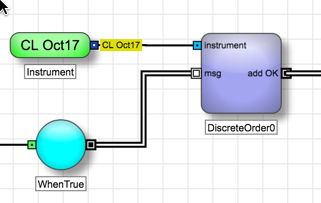

## Table of Contents

## What is discrete trading?

Discrete trading is a way of buying and selling things like stocks or commodities in set amounts, instead of in a continuous flow. Imagine you're buying apples at a store. Instead of picking any number of apples you want, you can only buy them in bags of 10. That's similar to discrete trading, where you can only trade specific amounts at certain times.

This type of trading is common in markets where things are sold in fixed lots or units. It helps keep trading organized and can make it easier for people to predict how much they will buy or sell. For example, if you want to buy gold, you might have to buy it in bars of a certain weight, not just any amount you want. This can make trading feel more controlled and less chaotic.

## How does discrete trading differ from continuous trading?

Discrete trading and continuous trading are two different ways to buy and sell things like stocks or commodities. In discrete trading, you can only buy or sell in set amounts, like buying apples only in bags of 10. This means you have to wait until the right amount is available to make a trade. It's like waiting for a bus that only comes at certain times. This type of trading is often used in markets where things are sold in fixed lots or units, making the trading process more organized and predictable.

On the other hand, continuous trading lets you buy or sell at any time and in any amount you want, like [picking](/wiki/asset-class-picking) any number of apples from a bin. It's more flexible because you don't have to wait for specific amounts to be available. This type of trading is common in stock markets where shares can be bought and sold at any time during trading hours. Continuous trading can feel more dynamic and fast-paced because trades can happen at any moment.

## What are the basic principles of discrete trading?

Discrete trading is all about trading in set amounts at specific times. Imagine you're at a candy store where you can only buy candy in packs of 5 pieces. You can't buy 3 pieces or 7 pieces, just multiples of 5. This is similar to how discrete trading works. You have to wait until the right amount is available to make a trade. This makes trading more organized and easier to predict because everyone knows they can only trade in certain amounts.

This type of trading is often used in markets where things are sold in fixed lots or units. For example, if you want to buy gold, you might have to buy it in bars of a certain weight, not just any amount you want. This helps keep the market orderly and can make it easier for people to plan their trades. By knowing exactly how much they can buy or sell at a time, traders can make better decisions and avoid confusion.

## What are the advantages of using discrete trading strategies?

Discrete trading has some big advantages. One of them is that it makes trading more organized. When everyone can only buy or sell in certain amounts, it's easier to keep track of what's happening in the market. This can help prevent confusion and make sure everyone knows what's going on. It's like playing a game where everyone follows the same rules, so it's fair and clear for everyone.

Another advantage is that discrete trading can help traders plan better. When you know you can only trade in set amounts, you can make your plans around those amounts. This can make it easier to decide when and how much to buy or sell. It's like knowing you can only buy apples in bags of 10, so you can plan your shopping better. This can help traders make smarter choices and maybe even make more money.

## What types of assets can be traded discretely?

Discrete trading can be used for many types of things. One common example is stocks. Some stock markets let you buy or sell shares only in certain amounts, like in lots of 100 shares. This means you have to wait until you can buy or sell exactly 100 shares or multiples of that number. This makes trading stocks more organized and easier to plan.

Another type of asset that can be traded discretely is commodities, like gold or oil. For instance, if you want to buy gold, you might have to buy it in bars that weigh a certain amount, like one ounce or one kilogram. You can't just buy any amount you want; it has to be in these set sizes. This helps keep the commodity market orderly and makes it easier for people to know how much they can buy or sell at a time.

Futures contracts are also often traded discretely. These are agreements to buy or sell something at a future date, and they come in set sizes. For example, a futures contract for wheat might be for 5,000 bushels. You can't trade a contract for 4,000 or 6,000 bushels; it has to be exactly 5,000. This makes the futures market more predictable and helps traders plan their strategies around these fixed amounts.

## How can beginners start with discrete trading?

If you're new to discrete trading, start by learning about the markets where it's used, like stocks, commodities, or futures. These markets often let you buy or sell things in set amounts, like buying shares in lots of 100 or gold in bars of a certain weight. To get started, you can open an account with a brokerage that offers trading in these markets. Make sure to choose a broker that has clear information about how their trading works and what the minimum trade sizes are. Once you have an account, you can practice with a demo or a small amount of money to get used to the rules of discrete trading.

As a beginner, it's important to understand the basics of how discrete trading works. Remember, you can only buy or sell in certain amounts, so you need to plan your trades around these set sizes. For example, if you want to buy stocks, you might need to buy them in lots of 100 shares. This means you have to wait until you can buy exactly 100 shares or multiples of that number. Take your time to learn about the different assets you can trade discretely, like stocks, gold, or futures contracts, and start with small trades to get comfortable with the process.

## What are common tools and platforms used in discrete trading?

For discrete trading, people often use online trading platforms like E*TRADE, TD Ameritrade, and [Interactive Brokers](/wiki/interactive-brokers-api). These platforms let you buy and sell things like stocks, commodities, and futures in set amounts. They have special tools that help you see what you can trade and how much you need to buy or sell at a time. For example, if you want to trade stocks, the platform will show you that you can buy them in lots of 100 shares. These platforms also have charts and graphs that help you understand the market better and make smarter trading decisions.

Another common tool for discrete trading is trading software like MetaTrader 4 or 5. These programs are used by traders who want to automate their trades or do more detailed analysis. They let you set up rules for when to buy or sell based on certain conditions, like if the price of gold reaches a certain level. This can be really helpful for beginners because it takes some of the guesswork out of trading. Plus, these software tools often come with educational resources to help you learn more about discrete trading and how to use the platform effectively.

## What are the key risks associated with discrete trading?

Discrete trading can be risky because you have to buy or sell in set amounts, like buying apples only in bags of 10. This means you might have to wait until you can trade exactly the right amount, which can be frustrating if the market moves quickly. If the price changes while you're waiting, you could end up buying or selling at a less favorable price than you expected. This can lead to losses if you're not careful about when and how much you trade.

Another risk is that discrete trading can make it harder to diversify your investments. Since you can only trade in certain amounts, you might not be able to spread your money across as many different assets as you'd like. This can make your portfolio less balanced and more vulnerable to big changes in the market. It's important to think carefully about how you're going to manage these risks and maybe start with small trades to get a feel for how discrete trading works before you invest more money.

## How do market conditions affect discrete trading strategies?

Market conditions can really change how you trade in discrete trading. When the market is moving fast, like when prices are going up and down a lot, you might have to wait longer to buy or sell the right amount. This can be frustrating because you might miss out on good prices. For example, if you want to buy 100 shares of a stock but the price goes up before you can, you might end up paying more than you planned. So, it's important to keep an eye on the market and be ready to act quickly when the right opportunity comes along.

On the other hand, when the market is calm and prices are stable, discrete trading can be easier. You can plan your trades better because you know you can buy or sell in set amounts without worrying too much about sudden price changes. This can help you make more predictable and safer trades. But even in calm markets, it's still important to stay alert because conditions can change quickly, and you need to be ready to adjust your strategy.

## What advanced techniques can be applied in discrete trading?

In discrete trading, one advanced technique is using algorithms to automate your trades. These are special computer programs that can buy or sell things like stocks or gold for you based on rules you set up. For example, you can tell the algorithm to buy 100 shares of a stock if the price drops to a certain level. This can help you make trades faster and more accurately, especially in a fast-moving market where waiting for the right amount can be tricky. Using algorithms can take some of the guesswork out of trading and help you stick to your strategy even when things get hectic.

Another technique is called position sizing, which means deciding how much of your money to put into each trade. In discrete trading, where you can only buy or sell in set amounts, it's important to figure out how many units you should trade to balance risk and reward. For example, if you want to buy gold bars, you need to decide how many bars to buy based on how much money you have and how much risk you're willing to take. This can help you manage your money better and avoid putting too much into one trade, which can be risky if the market moves against you.

## How can one measure the performance of discrete trading strategies?

To measure the performance of discrete trading strategies, you can look at how much money you've made or lost over time. This is called your return on investment, or ROI. You can figure out your ROI by taking the profit you've made from your trades and dividing it by the amount of money you started with. Then, multiply that number by 100 to get a percentage. If your ROI is positive, it means you've made money, and if it's negative, it means you've lost money. It's also helpful to compare your ROI to a benchmark, like the overall stock market, to see if your strategy is doing better or worse than average.

Another way to measure performance is by looking at how much risk you're taking. You can do this by calculating the [volatility](/wiki/volatility-trading-strategies) of your trades, which shows how much the value of your investments goes up and down. One common measure of risk is the standard deviation of your returns. If your trades have a high standard deviation, it means they're more risky because the value can change a lot. You can also use a risk-adjusted performance measure like the Sharpe ratio, which compares your ROI to the risk you're taking. A higher Sharpe ratio means you're getting a good return for the amount of risk you're taking. By looking at both your returns and your risk, you can get a better idea of how well your discrete trading strategy is working.

## What are the regulatory considerations for discrete trading?

When you're doing discrete trading, you need to pay attention to the rules set by the people who watch over the markets. These rules can change depending on where you live and what you're trading, like stocks or gold. For example, in the United States, the Securities and Exchange Commission (SEC) makes rules for trading stocks. They want to make sure everyone is playing fair and that the market is safe for everyone. So, you might need to follow rules about how much you can trade at once or when you can trade. It's important to know these rules because breaking them can get you in trouble.

Another thing to think about is that different countries have different rules. If you're trading something like futures contracts, you might need to follow rules from the Commodity Futures Trading Commission (CFTC) in the U.S., or similar groups in other countries. These rules can affect how you trade and what you can trade. For example, some countries might have limits on how much of a certain asset you can buy or sell at one time. To make sure you're following all the right rules, it's a good idea to talk to a financial advisor or read up on the regulations for the markets you're interested in.

## References & Further Reading

[1]: Narang, R. K. (2013). ["Inside the Black Box: A Simple Guide to Quantitative and High Frequency Trading."](https://onlinelibrary.wiley.com/doi/book/10.1002/9781118662717) John Wiley & Sons.

[2]: Kissell, R. (2013). ["The Science of Algorithmic Trading and Portfolio Management."](https://www.sciencedirect.com/book/9780124016897/the-science-of-algorithmic-trading-and-portfolio-management) Academic Press.

[3]: Bass, S. A., & Pajares, P. (2016). ["Algorithmic and High-Frequency Trading."](https://assets.cambridge.org/97811070/91146/frontmatter/9781107091146_frontmatter.pdf) Oxford University Press.

[4]: Popper, N. (2016). ["Digital Gold: Bitcoin and the Inside Story of the Misfits and Millionaires Trying to Reinvent Money."](https://www.amazon.com/Digital-Gold-Bitcoin-Millionaires-Reinvent/dp/006236250X) Harper.

[5]: "Algorithmic Trading & DMA: An introduction to Direct Access Trading Strategies" by Barry Johnson.