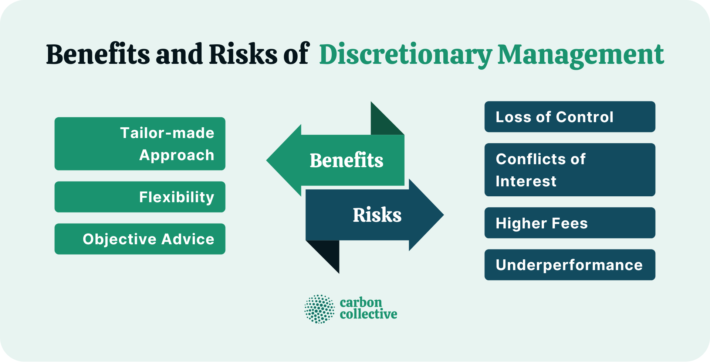

## Table of Contents

## What is discretionary investment management?

Discretionary investment management is when you hire a professional, like a financial advisor, to manage your investments for you. Instead of you making all the decisions about what to buy or sell, the advisor does it for you. They have the power to make choices about your money based on what they think is best for your financial goals.

This type of management can be helpful because it saves you time and uses the expertise of someone who knows a lot about investing. They can watch the markets every day and make changes to your portfolio quickly if needed. It's like having a personal coach for your money, making sure it's working hard to meet your goals without you having to do all the work.

## How does discretionary investment management differ from non-discretionary management?

Discretionary investment management and non-discretionary management are two different ways a financial advisor can help you with your investments. With discretionary management, you give your advisor the power to make decisions about your investments without asking you every time. They can buy or sell assets in your portfolio whenever they think it's a good move, based on your goals and the market conditions. This means you don't have to be involved in the day-to-day decisions, which can be a big relief if you're busy or not confident in making investment choices yourself.

On the other hand, non-discretionary management means your advisor will give you advice and suggestions, but they won't act on them without your approval. Every time they want to make a change to your investments, they need to check with you first. This can be good if you want to stay in control and be part of every decision. But it also means you need to be more involved and ready to make choices, which can take more of your time and might delay actions in the fast-moving world of investing.

## What are the primary benefits of using a discretionary investment manager?

Using a discretionary investment manager can save you a lot of time and effort. Instead of you having to watch the stock market every day and make decisions about buying or selling, your manager does it for you. They use their expertise to make choices that fit your financial goals. This means you can focus on other things in your life, like your job or family, and still know that your investments are being taken care of.

Another big benefit is that a discretionary manager can react quickly to changes in the market. Since they don't need to ask for your permission before making a move, they can buy or sell assets right away when they see a good opportunity or need to avoid a risk. This quick action can help your investments perform better over time. Plus, they bring a lot of knowledge and experience to the table, which can lead to smarter investment choices than you might make on your own.

## Can you explain the potential risks involved in discretionary investment management?

One risk with discretionary investment management is that you're giving someone else control over your money. Even if they're experts, they might make choices that don't work out as well as you hoped. If the market goes down or they pick the wrong investments, you could lose money. It's important to trust your manager, but remember, no one can predict the future perfectly.

Another risk is that you might not fully understand or agree with all the decisions your manager makes. Since they don't need to ask you before acting, you might find out about big changes to your investments after they've already happened. This can be unsettling if you like to stay in control or if you have specific ideas about how your money should be invested. It's a good idea to keep talking with your manager to make sure your goals are still aligned.

## Who typically uses discretionary investment management services?

People who use discretionary investment management services often have busy lives and don't have time to manage their investments themselves. They might be business owners, executives, or professionals who trust experts to handle their money while they focus on their careers and families. These people value the convenience of having someone else make quick decisions about their investments without needing to ask them first.

Others who use these services might not feel confident in making investment choices on their own. They could be new to investing or just prefer to leave it to professionals who have more experience and knowledge. This way, they can still grow their wealth without the stress of having to learn everything about the stock market or worry about making the wrong moves.

## How is performance measured in discretionary investment management?

Performance in discretionary investment management is often measured by looking at how much money the investments have made over time. This is usually shown as a percentage, called the return on investment. For example, if you started with $100,000 and it grew to $110,000 in a year, your return would be 10%. Managers also compare these returns to benchmarks, like the S&P 500, to see if they're doing better or worse than the overall market.

Another way to measure performance is by looking at risk-adjusted returns. This means checking how much risk was taken to achieve the returns. A common tool for this is the Sharpe ratio, which shows how much extra return you get for each unit of risk. A higher Sharpe ratio means the manager did a good job of balancing risk and reward. It's important for investors to understand both the returns and the risks involved to really know how well their money is being managed.

## What fees should one expect when engaging a discretionary investment manager?

When you hire a discretionary investment manager, you'll usually have to pay fees for their services. These fees can be a percentage of the money they're managing for you, often called an asset management fee. This fee might be around 1% to 2% of your total investment each year. So, if you have $100,000 invested, you could expect to pay $1,000 to $2,000 a year in fees. Sometimes, there might also be performance fees, which are extra charges if your investments do really well.

On top of the management fees, you might have to pay other costs too. These could include transaction fees every time the manager buys or sells something in your portfolio. There might also be fees for things like administrative work or using certain investment platforms. It's a good idea to ask about all the fees upfront so you know exactly what you'll be paying. Remember, while fees are important, it's also worth thinking about the value the manager brings to your investments.

## What are the regulatory requirements for discretionary investment managers?

Discretionary investment managers have to follow rules set by government agencies like the Securities and Exchange Commission (SEC) in the United States. These rules are there to protect investors and make sure managers act honestly and fairly. Managers need to register with the SEC or state regulators, depending on how much money they manage. They also have to give clients clear information about their fees, services, and any conflicts of interest.

On top of registering, managers must follow strict rules about how they handle client money. They need to keep client funds separate from their own money, and they have to report regularly on how the investments are doing. They also have to follow rules about advertising their services and can't make false claims. If they break these rules, they could face big fines or lose their license to manage investments.

## How does one select a competent discretionary investment manager?

Picking a good discretionary investment manager means looking at a few key things. First, you want to check their track record. How have their clients' investments done over time? It's good to see if they've consistently made money for people. Also, look at their experience and education. A manager with a lot of years in the business and the right qualifications is usually a safer bet. Don't forget to ask about their fees too. You want to know exactly what you'll be paying and if it's worth it for the service they provide.

Another important thing is to see if you trust them and if they understand your goals. Talk to them about what you want to achieve with your money. A good manager will listen and make a plan that fits your needs. It's also smart to check if they're registered with the right authorities like the SEC. This means they follow the rules and are less likely to do anything shady. Finally, ask for references or read reviews from other clients. Hearing about others' experiences can help you decide if this manager is the right one for you.

## What role does the investor play in a discretionary investment management relationship?

In a discretionary investment management relationship, the investor's main job is to set clear goals and share them with the manager. This means telling the manager what you want to achieve with your money, like saving for retirement or buying a house. You also need to let the manager know how much risk you're okay with. Once you've done this, you can step back and let the manager handle the day-to-day decisions about your investments.

Even though the manager makes the choices, it's still important for the investor to stay involved. You should check in with your manager regularly to see how your investments are doing. If your goals or life situation changes, you need to tell your manager so they can adjust your investment plan. Staying in touch helps make sure your money is always working towards what you want.

## How can technology enhance the effectiveness of discretionary investment management?

Technology can make discretionary investment management better by giving managers more information and tools to work with. With computers and the internet, managers can look at lots of data about how the market is doing and what's happening in the world. This helps them make smarter choices about when to buy or sell investments. They can also use special software to keep track of all their clients' portfolios easily and make changes quickly if they need to. This means they can react faster to changes in the market and keep their clients' money safer.

Another way technology helps is by making it easier for managers and investors to talk to each other. With apps and online platforms, investors can check on their investments anytime they want and see what their manager is doing. This keeps everyone on the same page and makes sure the manager knows about any changes in the investor's life or goals. Plus, technology can help managers do their jobs more efficiently, so they can take care of more clients without making mistakes. This can make the whole process smoother and more successful for everyone involved.

## What advanced strategies might a discretionary investment manager employ to optimize portfolio performance?

A discretionary investment manager might use a strategy called asset allocation to spread an investor's money across different types of investments, like stocks, bonds, and real estate. This helps to lower the risk because if one type of investment goes down, the others might go up or stay the same. They might also use a technique called rebalancing, where they adjust the portfolio to keep it in line with the investor's goals. For example, if stocks have done really well and now make up too big a part of the portfolio, the manager might sell some stocks and buy more bonds to balance things out.

Another strategy could be tactical asset allocation, where the manager makes short-term changes to take advantage of market conditions. If they think the stock market is going to go up, they might put more money into stocks for a while. They might also use derivatives, like options or futures, to protect the portfolio from big drops in the market or to make extra money. These strategies need a lot of knowledge and quick action, but they can help the portfolio do better if the manager uses them right.

## References & Further Reading

[1]: Bergstra, J., Bardenet, R., Bengio, Y., & Kégl, B. (2011). ["Algorithms for Hyper-Parameter Optimization."](https://dl.acm.org/doi/10.5555/2986459.2986743) Advances in Neural Information Processing Systems 24.

[2]: ["Advances in Financial Machine Learning"](https://www.amazon.com/Advances-Financial-Machine-Learning-Marcos/dp/1119482089) by Marcos Lopez de Prado

[3]: ["Evidence-Based Technical Analysis: Applying the Scientific Method and Statistical Inference to Trading Signals"](https://www.amazon.com/Evidence-Based-Technical-Analysis-Scientific-Statistical/dp/0470008741) by David Aronson

[4]: ["Machine Learning for Algorithmic Trading"](https://github.com/stefan-jansen/machine-learning-for-trading) by Stefan Jansen

[5]: ["Quantitative Trading: How to Build Your Own Algorithmic Trading Business"](https://www.amazon.com/Quantitative-Trading-Build-Algorithmic-Business/dp/1119800064) by Ernest P. Chan