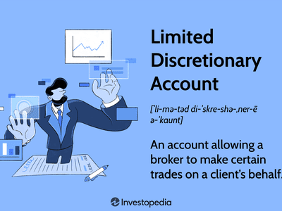

## Table of Contents

## What is a discretionary order in investment management?

A discretionary order in investment management is when an investor gives permission to a financial advisor or a broker to make investment decisions on their behalf. This means the advisor can buy or sell assets in the investor's account without needing to ask for approval each time. It's like trusting someone else to make choices for you because they have more knowledge or experience in the field.

This type of order can be helpful because it allows for quicker decision-making. Markets can change fast, and having someone who can act right away can be good for taking advantage of opportunities or avoiding losses. However, it also means the investor has to trust their advisor a lot, since they are giving them control over their money. It's important for investors to choose an advisor they trust and to keep an eye on how their investments are doing.

## How do discretionary orders differ from non-discretionary orders?

Discretionary orders and non-discretionary orders are two different ways investors can work with their financial advisors. With a discretionary order, the investor gives their advisor the power to make decisions about buying or selling investments without asking them first. This means the advisor can act quickly when they see a good opportunity or need to avoid a loss. It's like letting someone else drive your car because they know the roads better.

On the other hand, a non-discretionary order means the investor keeps control over their investment decisions. The advisor can give advice and make suggestions, but they can't do anything without the investor's okay. This can be slower because the investor has to agree to each move, but it lets them stay in charge of their money. It's like choosing to drive your own car, even if someone else knows a faster route.

## Who can issue discretionary orders and under what conditions?

Discretionary orders can be issued by investors who want to let their financial advisors or brokers make investment choices for them. This means the investor trusts the advisor enough to let them buy or sell things in their account without asking each time. Usually, an investor will sign a document that gives the advisor this power. This document is called a discretionary account agreement. It explains what the advisor can do and how they should do it.

For an advisor to accept a discretionary order, they need to be sure they understand the investor's goals and how much risk they are okay with. The advisor also has to follow rules set by financial regulators to make sure they are acting in the investor's best interest. This means they can't just do whatever they want; they have to make choices that fit with what the investor wants and needs.

## What are the benefits of using discretionary orders for investors?

Using discretionary orders can help investors because it lets their advisor make quick decisions. In the world of investing, things can change fast. If an advisor sees a good chance to buy or sell, they can do it right away without having to wait for the investor's okay. This can be really helpful for taking advantage of opportunities or avoiding losses that might happen if they had to wait.

Another benefit is that it takes some of the stress off the investor. Managing investments can be hard and time-consuming. By letting an advisor handle the day-to-day choices, the investor can relax more and not have to worry about keeping up with the market all the time. This can be especially good for people who don't have a lot of time or knowledge about investing but still want to grow their money.

## What are the potential risks associated with discretionary orders?

One big risk of using discretionary orders is that the investor has to trust their advisor a lot. They are letting someone else make choices with their money without asking them first. If the advisor does not make good choices, the investor could lose money. It's important for the investor to pick an advisor they trust and to keep an eye on what the advisor is doing with their money.

Another risk is that the advisor might not fully understand what the investor wants or how much risk they are okay with. Even though advisors have to follow rules and act in the investor's best interest, mistakes can still happen. If the advisor makes choices that are too risky or don't fit with the investor's goals, it could lead to problems. That's why it's good for investors to talk clearly with their advisor about what they want and to check in on their investments regularly.

## How do investment managers execute discretionary orders?

Investment managers execute discretionary orders by making decisions to buy or sell investments based on what they think is best for the investor. They use their knowledge and experience to watch the market and look for good opportunities. When they see a chance to make a good move, they can act quickly without having to ask the investor first. This means they can buy or sell stocks, bonds, or other investments right away, which can be helpful in a fast-changing market.

To do this, investment managers need to understand the investor's goals and how much risk they are willing to take. They have to follow rules set by financial regulators to make sure they are acting in the investor's best interest. This means they can't just do whatever they want; they have to make choices that fit with what the investor wants and needs. Regular communication with the investor is important to make sure everyone is on the same page and to keep the investor informed about what is happening with their money.

## What regulatory frameworks govern the use of discretionary orders?

In the United States, the use of discretionary orders is governed by rules set by the Securities and Exchange Commission (SEC) and the Financial Industry Regulatory Authority (FINRA). These rules are in place to make sure that investment advisors act in the best interest of their clients. For example, advisors must get written permission from the investor before they can use discretionary authority. They also have to keep good records of all the trades they make and be able to explain why they made those choices. This helps to protect investors and make sure that advisors are doing their job the right way.

In other countries, similar regulatory bodies exist to oversee the use of discretionary orders. For instance, in the United Kingdom, the Financial Conduct Authority (FCA) sets rules that investment managers must follow. These rules also focus on protecting investors and making sure that advisors act responsibly. No matter where you are, the main goal of these regulations is to make sure that investors are treated fairly and that their money is managed carefully by people they trust.

## Can you provide examples of situations where discretionary orders are most useful?

Discretionary orders are most useful when the market is moving fast and an investor needs to act quickly. Imagine the stock market is going up and down a lot in one day. An investor might not be able to watch the market all the time, but their advisor can. If the advisor sees a good chance to buy a stock at a low price, they can do it right away without waiting for the investor to say yes. This can help the investor make money they might have missed out on if they had to make the decision themselves.

Another situation where discretionary orders are helpful is when an investor doesn't know a lot about investing or doesn't have time to manage their money. Let's say someone works a lot and can't keep up with all the news and changes in the market. They can trust their advisor to make smart choices for them. The advisor can look at the investor's goals and risk level, then make trades that fit with what the investor wants. This way, the investor can focus on their job and life, while their money is still being taken care of.

## How do discretionary orders impact portfolio management strategies?

Discretionary orders can change how an investor manages their money. When an investor lets their advisor make choices without asking first, it can make the portfolio more active. This means the advisor can buy and sell things quickly when they see a good chance. This can be good for taking advantage of opportunities in the market or avoiding losses. But it also means the advisor needs to know a lot about what the investor wants and how much risk they are okay with. If the advisor makes choices that don't fit with the investor's goals, it could lead to problems.

Using discretionary orders can also help an investor's portfolio grow in a way that matches their goals. For example, if an investor wants to save for retirement and is okay with some risk, the advisor can pick investments that fit this plan. They can change the mix of stocks, bonds, and other things in the portfolio to try to get the best results. But the investor still needs to talk with their advisor regularly to make sure everything is going the way they want. This way, the investor can feel more sure about their money and the choices being made for them.

## What advanced tools or technologies support the management of discretionary orders?

Advanced tools and technologies help investment managers handle discretionary orders better. One important tool is [algorithmic trading](/wiki/algorithmic-trading) software. This software uses math and computer programs to make quick decisions about buying and selling investments. It can watch the market all the time and act fast when it sees a good chance. This is really helpful for advisors who need to make quick choices for their clients. Another tool is portfolio management systems. These systems help advisors keep track of all the investments in a client's account and make sure they fit with the client's goals. They can show the advisor how the portfolio is doing and suggest changes to make it better.

Another technology that supports discretionary orders is [artificial intelligence](/wiki/ai-artificial-intelligence) (AI). AI can look at a lot of data and find patterns that might be hard for a person to see. It can help advisors make better choices by giving them more information and ideas. For example, AI can predict how the market might change and suggest the best times to buy or sell. Also, risk management tools are important. These tools help advisors understand how much risk is in a client's portfolio and make sure it matches what the client is okay with. By using these advanced tools and technologies, advisors can manage discretionary orders more effectively and help their clients reach their investment goals.

## How can investors monitor and evaluate the performance of discretionary orders?

Investors can keep an eye on how their discretionary orders are doing by looking at regular reports from their advisor. These reports show what has been bought or sold, how much money has been made or lost, and how the whole portfolio is doing. It's a good idea for investors to check these reports often to make sure everything is going the way they want. They can also ask their advisor questions if they see something they don't understand or if they think a choice doesn't fit with their goals.

Another way to check on discretionary orders is by using online tools and apps that let investors see their account anytime. These tools show the latest prices of investments, how the portfolio is doing over time, and other important information. Investors can use these tools to make sure their advisor is making choices that match their risk level and goals. By staying involved and asking questions, investors can feel more sure about how their money is being managed.

## What are the best practices for investment managers handling discretionary orders?

Investment managers need to follow some important rules when they handle discretionary orders. First, they should always act in the best interest of their clients. This means making choices that fit with what the client wants and how much risk they are okay with. They should also keep good records of all the trades they make and be able to explain why they made those choices. This helps to show that they are being careful and honest with their clients' money. Another important thing is to get clear permission from the client before using discretionary authority. This means having a written agreement that explains what the manager can do and how they should do it.

It's also a good idea for investment managers to talk with their clients regularly. This helps to make sure everyone is on the same page and that the client knows what is happening with their money. Managers should use advanced tools like algorithmic trading software and portfolio management systems to make smart choices quickly. But they should also use their own knowledge and experience to check what the tools suggest. By following these best practices, investment managers can help their clients reach their investment goals while making sure they are acting responsibly and ethically.

## What are the best practices for using discretionary orders?

To leverage discretionary orders effectively, investors should develop a robust strategy and establish clear boundaries regarding the level of discretion permitted to brokers. A comprehensive understanding of investment goals is essential, as it allows for the formulation of precise conditions under which brokers can exercise their discretion. This clarity ensures that the broker's actions are consistently aligned with the investor's objectives, minimizing potential deviations from desired outcomes.

Choosing the right broker is crucial in managing discretionary accounts. Investors should prioritize brokers who have a proven track record of handling discretionary orders effectively. This involves assessing a broker's experience, reputation, and client reviews, as well as ensuring they possess a deep understanding of the financial markets. Trust is foundational in these relationships, as it empowers brokers to make informed decisions that could have significant financial implications.

Regular reviews and audits of the account's performance are vital in ensuring that discretionary actions remain aligned with the investor's goals. These evaluations should include an analysis of trade outcomes to ascertain whether the broker's decisions are yielding expected results. If discrepancies are identified, adjustments to the discretionary strategy may be necessary. Investors might consider employing benchmarking techniques to evaluate performance against market indices or predetermined criteria.

For instance, performance reviews can incorporate statistical tools such as Sharpe Ratio, which measures risk-adjusted returns:

$$

\text{Sharpe Ratio} = \frac{{R_p - R_f}}{{\sigma_p}}
$$

where $R_p$ is the return of the portfolio, $R_f$ is the risk-free rate, and $\sigma_p$ is the standard deviation of the portfolio's excess return. This analysis helps in understanding if the returns justify the level of risk taken, thus informing future adjustments to the discretionary approach.

In conclusion, a disciplined approach to using discretionary orders involves setting clear limitations, choosing experienced brokers, and consistently evaluating performance through structured reviews. These best practices not only facilitate effective management of discretionary accounts but also enhance an investor's ability to achieve their strategic investment goals.

## References & Further Reading

[1]: Bergstra, J., Bardenet, R., Bengio, Y., & Kégl, B. (2011). ["Algorithms for Hyper-Parameter Optimization."](https://dl.acm.org/doi/10.5555/2986459.2986743) Advances in Neural Information Processing Systems 24.

[2]: ["Advances in Financial Machine Learning"](https://www.amazon.com/Advances-Financial-Machine-Learning-Marcos/dp/1119482089) by Marcos Lopez de Prado

[3]: ["Evidence-Based Technical Analysis: Applying the Scientific Method and Statistical Inference to Trading Signals"](https://www.amazon.com/Evidence-Based-Technical-Analysis-Scientific-Statistical/dp/0470008741) by David Aronson

[4]: ["Machine Learning for Algorithmic Trading"](https://github.com/stefan-jansen/machine-learning-for-trading) by Stefan Jansen

[5]: ["Quantitative Trading: How to Build Your Own Algorithmic Trading Business"](https://www.amazon.com/Quantitative-Trading-Build-Algorithmic-Business/dp/1119800064) by Ernest P. Chan