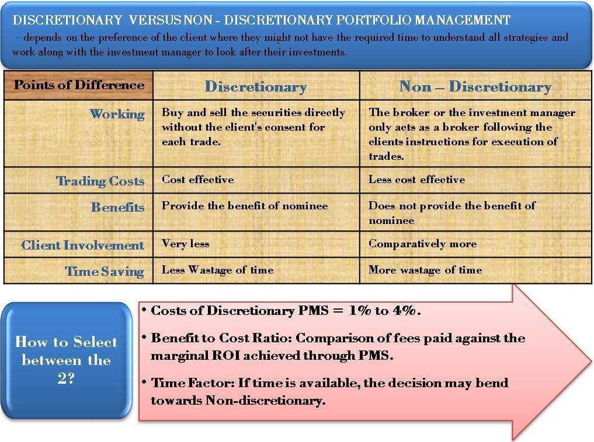

The ongoing debate over discretionary trading versus algorithmic trading in financial markets highlights the distinct merits and challenges each approach presents. Discretionary portfolio managers (PMS) rely on a blend of intuition, accumulated experience, and technical analysis to inform their trading decisions. This human-centric method emphasizes the ability to interpret market nuances and subtle signals that may not be immediately apparent to automated systems. Such intuition-driven strategies allow for adaptability in dynamic market conditions, albeit sometimes at the cost of being swayed by emotional biases.

Conversely, algorithmic trading employs data-driven methodologies executed by computer algorithms, offering a different set of advantages and limitations. These algorithms can process vast quantities of data and execute trades at speeds unparalleled by human traders, bringing precision and consistency to trading operations. By operating on predefined criteria, algorithmic trading minimizes emotional interference, yet it may lack the nuanced perception and adaptive capacity inherent in human judgment.

This article investigates how discretionary portfolio managers can play a pivotal role in algorithmic trading. It seeks to provide insights into how integrating the human element with algorithmic precision can potentially enhance trading performance. The synthesis of these two approaches could lead to improved trading strategies, capable of leveraging the strengths of both human intuition and machine efficiency in today's complex financial landscape.

## Table of Contents

## Understanding Discretionary Trading

Discretionary trading is a trading strategy where decisions are made based on a trader’s judgment and experience rather than strictly following automated rules or algorithms. This approach is characterized by a reliance on human insights, often incorporating technical analysis to evaluate market trends, price patterns, and potential indicators that may impact asset prices. 

A key advantage of discretionary trading is its flexibility, allowing traders to adapt quickly to changing market conditions. This adaptability enables traders to respond to sudden market shifts, news events, or anomalies that automated systems may fail to detect. However, this flexibility also introduces the potential for emotional biases to influence decision-making, a significant challenge for discretionary trading. Traders may overreact to market movements, succumb to fear or greed, or deviate from a well-considered strategy due to psychological pressures.

The expertise of discretionary portfolio managers is evident in their ability to spot complex patterns and make rapid decisions. They often use a combination of intuition, acquired from years of experience, and analytical skills to evaluate market dynamics. This approach can include the identification of technical patterns such as head and shoulders, double tops and bottoms, or moving averages, which might indicate a potential buy or sell opportunity. These patterns require a trained eye to identify and interpret correctly, highlighting the value of human intervention where algorithms may struggle.

Moreover, discretionary traders can incorporate a qualitative analysis that algorithms often overlook. Factors such as geopolitical developments, macroeconomic trends, and corporate news releases can be subjectively assessed and weighed in the trading decision process. While algorithms are bounded by their pre-set rules and data inputs, discretionary traders are not limited in the variables they can consider, giving them an edge in unpredictable scenarios. 

In conclusion, discretionary trading offers a dynamic approach to financial markets, leveraging human intuition and experience to make informed trading decisions. While the potential for emotional bias exists, the adaptability and depth of insight provided by skilled discretionary portfolio managers can distinguish their approach in markets increasingly dominated by algorithmic processes.

## The Rise of Algorithmic Trading

Algorithmic trading, also known as algo trading, has become increasingly prevalent in financial markets, driven by its ability to analyze large datasets and execute trades with remarkable speed. This technological advancement allows traders and financial institutions to implement complex trading strategies that were not feasible manually.

**Algorithmic Precision and Speed**

The primary advantage of [algorithmic trading](/wiki/algorithmic-trading) is its capability to process immense volumes of data rapidly. Algorithms are designed to operate on predefined criteria, which eliminates the emotional biases that often influence human traders. By maintaining consistency, these automated systems can execute trades around the clock, adhering strictly to established guidelines without the distractions of market noise or psychological interference.

**Strategic Approaches**

Algorithmic trading employs various strategies that cater to different market dynamics:

1. **Trend-following**: This strategy capitalizes on prevailing market trends. Algorithms detect and respond to trends, leveraging their early identification to optimize entry and exit points. The systematic approach minimizes human error and emotional decision-making.

2. **Market-making**: Algorithmic systems facilitate liquidity by simultaneously placing buy and sell orders for a particular asset. This strategy profits from the bid-ask spread, providing a steady, albeit often small, income stream. Market-makers play a crucial role in efficient market functioning, particularly in high-frequency trading environments.

3. **Statistical arbitrage**: Statistical models identify inefficiencies between related financial instruments, such as stocks, through complex mathematical computations. By spotting and exploiting temporary price discrepancies, algorithms can execute trades that hedge risk while capitalizing on the mean reversion tendency of asset prices.

Algorithmic trading’s reliance on mathematical models, statistical techniques, and computational technology has led to its proliferation across global financial markets. Its ability to automate decision-making processes and operate without human intervention ensures the efficient execution of trades, often resulting in improved [liquidity](/wiki/liquidity-risk-premium) and reduced transaction costs. As technology continues to advance, the potential for more sophisticated algorithms grows, likely expanding their role in market operations.

## Combining Discretionary and Algorithmic Approaches

Combining the intuition of a discretionary portfolio manager with the precision of algorithmic trading has the potential to create a robust trading strategy. Discretionary traders, equipped with experience and intuition, can make decisions that account for nuances and subtleties not always captured by algorithms. These traders can override algorithmic signals based on their judgment and insights, potentially improving profitability by capturing opportunities that emerge under specific market conditions or during unexpected events.

Empirical studies suggest that the discretionary approach can significantly enhance systematic trading strategies by identifying favorable conditions that algorithms might overlook. While algorithms are designed to operate based on predefined criteria, they may lack the flexibility required to react to unique economic or geopolitical events quickly. Discretionary traders can complement algorithms by interpreting such events and adjusting trading strategies in real-time.

For example, consider an algorithm designed for trend-following. While such an algorithm might execute trades based on historical price patterns and technical indicators, a discretionary trader might recognize that an unexpected central bank announcement could cause a temporary market disruption, thereby adjusting the trading strategy accordingly. This combination of human insight and algorithmic execution can increase the potential for capturing profit opportunities. Furthermore, discretionary traders can contribute to refining algorithmic models by providing feedback on their limitations in specific scenarios, allowing for iterative improvements to the algorithm's design.

Overall, the fusion of discretionary and algorithmic trading approaches not only enhances the capability to navigate complex financial markets but also offers a more adaptable and resilient trading framework. This synergy could lead to better decision-making, improved risk management, and optimized trading outcomes.

## Case Study: Discretionary Enhancements in Algo Trading

A study conducted by Zarattini and Stamatoudis illustrates the significant impact that discretionary enhancements can have on algorithmic trading performance. In their research, the authors examined scenarios where discretionary traders manipulated algorithmic operations by selecting trades during specific market conditions characterized by stock gap events. These gap events occur when a stock's price experiences a sharp movement up or down with little to no trading in between, often driven by news or significant market announcements.

Discretionary traders applied their experience and market understanding to identify and execute trades that the algorithm might have excluded or overlooked. These human-driven decisions were based on nuanced interpretations of news, events, and market sentiment that are not easily quantifiable or encoded into an algorithm. By focusing on specific trades that exhibited high potential due to these gap events, the traders were able to enhance the algorithm's profitability.

The study revealed a substantial improvement in cumulative portfolio returns when the traders employed their discretionary judgment. This fusion of human intuition with algorithmic execution capitalized on the strengths of both approaches. While the algorithms provided the speed and precision needed for quick market entry and [exit](/wiki/exit-strategy), the traders' insights allowed for a more informed decision-making process, leveraging opportunities that arose from dynamic market situations.

The findings from Zarattini and Stamatoudis support the notion that integrating human discretion into automatic trading processes can yield superior outcomes. By leveraging human expertise in conjunction with algorithmic strategies, trading systems can achieve greater adaptability and responsiveness to extraordinary market events, thereby potentially increasing profitability and reducing risk. This case study underscores the value of combining human intuition with algorithmic rigor, offering a compelling approach for the future of trading in complex financial markets.

## Advantages and Challenges of Integration

Integrating discretionary portfolio management with algorithmic trading systems presents several advantages and challenges, each crucial for financial market participants seeking to optimize their trading strategies.

One of the primary advantages is enhanced decision-making. By combining human intuition with algorithmic precision, traders can leverage the strengths of both approaches. Discretionary traders excel in interpreting qualitative data and can adapt strategies based on their insights, which algorithms might miss. This synergistic approach allows for more nuanced decision-making, particularly in volatile or unforeseen market conditions where algorithms may struggle.

Improved risk management is another significant benefit. Discretionary managers can provide a layer of risk assessment that complements algorithmic strategies, allowing for more dynamic responses to market fluctuations. This dual approach can help in identifying potential risks that algorithms may overlook due to their reliance on historical data and predetermined criteria. Consequently, integrating human judgment can lead to more robust risk mitigation strategies.

Furthermore, the adaptability to unforeseen market conditions is enhanced when discretionary insights are incorporated into algorithmic frameworks. Human traders bring flexibility and a depth of understanding that can complement the rigidity of algorithmic systems. This adaptability can be particularly beneficial during market anomalies or events where historical data may not provide sufficient guidance.

However, integration is not without its challenges. One core issue is the potential conflict between the discretionary trader's judgment and algorithmic signals. When human intuition contradicts algorithmic output, it can lead to delays or confusion in decision-making. Resolving these conflicts requires establishing clear protocols and communication channels to ensure coherence in the trading strategy.

The increased complexity in strategy implementation is another challenge. Combining the qualitative insights from discretionary decisions with the quantitative rigor of algorithms necessitates sophisticated models and infrastructure. This complexity can escalate costs and require substantial expertise in both domains to ensure smooth integration and operation.

Balancing qualitative insights with quantitative rigor is crucial to the success of this integration. It requires careful calibration of when to rely on human discretion over algorithmic decisions and vice versa. Developing a systematic approach to evaluate the conditions under which one method should prevail is essential to optimizing trading performance.

In conclusion, while the integration of discretionary portfolio managers in algorithmic trading offers substantial benefits, careful management of the inherent challenges is necessary for successful implementation.

## Future Trends in PMS and Algo Trading

In recent years, the field of portfolio management and algorithmic trading has been significantly transformed by technological advancements, particularly in [artificial intelligence](/wiki/ai-artificial-intelligence) (AI) and [machine learning](/wiki/machine-learning) (ML). These technologies are poised to play an increasingly crucial role in harmonizing the strengths of discretionary portfolio managers with the precision and efficiency of algorithmic systems. Future trends indicate a growing synergy between these approaches, potentially leading to enhanced investment strategies.

The integration of AI and ML into trading systems enables the analysis of massive datasets, identifying patterns and trends that may not be immediately apparent to human traders. Machine learning algorithms, especially those employing [deep learning](/wiki/deep-learning) techniques, have shown proficiency in processing unstructured data such as news articles, social media sentiment, and other text-based inputs. This capability allows for more comprehensive market analysis beyond traditional numerical datasets.

Moreover, AI-driven models, such as natural language processing (NLP) engines, can refine predictions by understanding the context and tone of financial news, leading to more informed decision-making. For example, a sentiment analysis tool can quantify the market's overall feel toward a specific asset, providing discretionary managers with additional insights to guide their intuition-based decisions.

The rise of automated machine learning (AutoML) also presents opportunities for discretionary portfolio managers to quickly develop and test multiple trading strategies. By automating the model-building process, AutoML reduces the time and expertise required to implement complex algorithms, allowing human managers to focus on strategic decision-making aspects. 

Additionally, [reinforcement learning](/wiki/reinforcement-learning), an area under the umbrella of ML, offers potential for developing algorithms that learn optimal trading actions through trial and error. This framework could mirror the iterative decision-making process of human traders, adapting to new market conditions without explicit programming for each scenario.

As these technologies evolve, hybrid strategies combining human intuition with algorithmic precision will likely become more prevalent. The key lies in leveraging AI to augment human decision-making rather than replace it. Human insights will still be necessary for qualitative judgments, such as assessing geopolitical events' implications or navigating unprecedented market conditions. 

The ongoing advancements in data analytics also offer new dimensions for strategy development. With increasing attention to [alternative data](/wiki/best-alternative-data) sources, traders can gain insights from non-traditional information, such as satellite imagery of retail parking lots, which might indicate economic activity levels. Combining these innovative data streams with robust analytical tools could further enhance the predictive capabilities of portfolio management systems.

In conclusion, the fusion of discretionary portfolio management and algorithmic trading harnessed through AI and machine learning represents a promising frontier in the financial industry. As technology continues to evolve, this integration will likely lead to more sophisticated, dynamic, and adaptive investment strategies, ultimately benefiting traders and investors in navigating complex markets.

## Conclusion

The integration of discretionary portfolio managers in algorithmic trading presents a promising approach to better navigate the complexities of financial markets. Each method, discretionary and algorithmic, has distinct advantages—discretionary trading brings flexibility and human insight, while algorithmic trading offers speed and data processing capabilities. By combining these strengths, traders can enhance performance and risk management.

Discretionary traders can provide qualitative insights that complement the quantitative rigor of algorithmic models. This symbiotic relationship allows for more adaptive and nuanced decision-making, especially in volatile or unforeseen market conditions where human judgment can be pivotal. As technology advances, particularly in the fields of artificial intelligence and machine learning, the fusion of human intuition with algorithmic precision is expected to become increasingly prevalent in trading strategies, paving the way for more sophisticated and effective investment solutions.

## References & Further Reading

[1]: Bergstra, J., Bardenet, R., Bengio, Y., & Kégl, B. (2011). ["Algorithms for Hyper-Parameter Optimization."](https://dl.acm.org/doi/10.5555/2986459.2986743) Advances in Neural Information Processing Systems 24.

[2]: ["Advances in Financial Machine Learning"](https://www.amazon.com/Advances-Financial-Machine-Learning-Marcos/dp/1119482089) by Marcos Lopez de Prado.

[3]: ["Evidence-Based Technical Analysis: Applying the Scientific Method and Statistical Inference to Trading Signals"](https://www.amazon.com/Evidence-Based-Technical-Analysis-Scientific-Statistical/dp/0470008741) by David Aronson.

[4]: ["Machine Learning for Algorithmic Trading"](https://github.com/stefan-jansen/machine-learning-for-trading) by Stefan Jansen.

[5]: ["Quantitative Trading: How to Build Your Own Algorithmic Trading Business"](https://books.google.com/books/about/Quantitative_Trading.html?id=j70yEAAAQBAJ) by Ernest P. Chan.