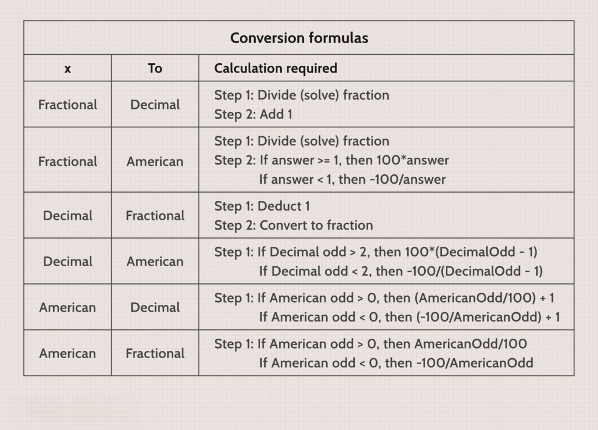

Determining the size of each trade in algorithmic trading is crucial for balancing risk management and optimizing returns. Discretization of bet size involves breaking down the decision-making process into manageable, quantifiable units. This approach facilitates the implementation of precise, systematic bet sizing strategies within trading algorithms.

By discretizing bet sizes, traders effectively enhance strategy performance, allowing for optimized trade execution levels. This process contributes to consistency and adaptability in response to fluctuating market dynamics. Throughout this article, we will explore how discretization techniques can be integrated into algorithmic trading systems to maximize performance and mitigate risk.



One of the central aspects is the use of popular bet sizing strategies like Fixed Fractional and the Kelly Criterion. Fixed Fractional Sizing involves allocating a fixed percentage of trading capital to each trade, which helps in managing exposure and minimizing risk. The Kelly Criterion, rooted in probability theory, seeks to define an optimal bet size by considering both the probability of winning trades and their respective payout ratios. These strategies, among others, can be systematically applied within algorithmic frameworks to refine trade execution and enhance overall portfolio growth.

Effective discretization of bet sizes aligns trading activities with risk management principles, promoting long-term trading success and consistent performance. This article investigates into the mechanics of implementing such strategies in algorithmic trading systems, demonstrating the tangible benefits of adopting discrete bet-sizing methods.

## Table of Contents

## Understanding Bet Sizing in Algo Trading

Bet sizing in trading is a crucial component that involves determining the amount of capital to allocate to each trade. This decision-making process is particularly important in [algorithmic trading](/wiki/algorithmic-trading), where transactions are executed with high speed and precision. In such contexts, bet sizing decisions are automated using predefined algorithms, allowing for systematic and rapid responses to market changes.

Effective bet sizing is essential for mitigating risk, enhancing strategy performance, and improving the overall consistency of trading outcomes. By carefully deciding the amount to wager on each trade, traders can prevent excessive loss and optimize the potential for profit. Discretization, a technique used to simplify bet sizing, plays a significant role in achieving these objectives. It involves breaking down the bet-sizing decision into manageable, quantifiable units, thereby allowing for more precise control over trade sizes.

Discretization integrates seamlessly with risk management rules and real-time market data, two critical components of successful algorithmic trading strategies. By employing discretization, traders can ensure that their capital allocation adheres to pre-established risk parameters while also adapting dynamically to ongoing market fluctuations. This integration not only supports the achievement of consistent performance but also helps in maintaining portfolio stability.

Furthermore, employing discretization in bet sizing allows traders to leverage real-time data analytics. By utilizing data-driven insights, traders can dynamically adjust the size of their trades to reflect current market conditions, enhancing responsiveness and strategic adaptability. This process is often supported by sophisticated algorithms that process market data, assess risk levels, and adjust bet sizes accordingly, thereby optimizing trading efficiency and effectiveness.

In summary, bet sizing in algorithmic trading is a multifaceted process that relies significantly on automation and data analysis. Through discretization, traders are empowered to make informed decisions that enhance strategy performance, reduce risk, and ensure consistency, making it a vital practice for achieving successful trading outcomes.

## Benefits of Discretizing Bet Size

Discretization of bet size offers several advantages in algorithmic trading, primarily by maintaining consistency across multiple trades. By dividing trade sizes into smaller, manageable units, traders achieve precise control over their positions. This control is crucial for preventing overly large position sizes that can result in significant drawdowns. 

The ability to adapt quickly to changing market conditions is another critical benefit of discretizing bet sizes. Traders can dynamically adjust bet sizes in response to market [volatility](/wiki/volatility-trading-strategies), ensuring their strategies remain robust and effective. This adaptability helps align bet sizing strategies with portfolio objectives, allowing for a coherent approach to risk management and capital allocation.

This approach is particularly useful in strategies like Fixed Ratio bet sizing, where incremental increases in bet size are made during winning streaks. By discretizing trade sizes, traders can systematically increase their exposure in a controlled manner as their account grows, thus optimizing the reward potential without disproportionately increasing the risk. 

Overall, discretizing bet sizes is a strategic tool that supports traders in their pursuit of consistent and efficient portfolio growth.

## Common Strategies for Bet Size Discretization

Fixed Fractional Bet Sizing is a widely adopted approach in trading, where a trader allocates a fixed percentage of their total capital to each trade. This method provides a straightforward and consistent framework for managing risk, as a fixed fractional approach inherently reduces position sizes after a losing trade and increases them after a winning trade, helping to limit potential losses while taking advantage of profitable opportunities. For example, if a trader decides on using a 2% fixed faction of their capital, and their total capital is $10,000, they will risk $200 on each trade.

$$
\text{Bet Size} = \text{Total Capital} \times \text{Fixed Fraction}
$$

The Kelly Criterion provides a more dynamic framework for determining bet sizes. The formula calculates the optimal size of a series of bets to maximize logarithmic wealth utility assuming known risks and payoffs. It is derived from:

$$
f^* = \frac{bp - q}{b}
$$

Where $f^*$ is the fraction of the portfolio to bet, $b$ is the odds received on the wager (net fractional odds), $p$ is the probability of winning, and $q$ is the probability of losing (1 − $p$). Although theoretically appealing, the Kelly Criterion can lead to large position sizes, thus making it crucial for traders to adjust the criterion with a fractional Kelly to mitigate risks.

Incremental Adjustments involve increasing bet sizes incrementally as one's trading account grows. This strategy allows the trader to ramp up their bet sizes in a controlled manner, adjusting to the cumulative growth of their account balance. It's a conservative approach best suited for traders preferring gradual portfolio scaling as opposed to abrupt increases. This method can align closely with strategies that focus on mitigating risk through a progressive increase in exposure as profits accumulate.

All these strategies aim to strike a balance between risk and reward. By optimizing the size of each trade, traders seek to enhance their portfolio's growth while maintaining a level of risk that aligns with their individual risk tolerance and investment objectives.

## Implementing Bet Size Discretization in Algo Trading

Integrating discretization within trading algorithms is a pivotal step in automating bet sizing decisions. This process involves adjusting the size of trades based on predefined rules and real-time data analytics, ensuring that bet sizes are dynamically aligned with current market conditions. By automating these decisions, traders can limit emotional influence and maintain consistency in their trading strategies.

To adjust bet sizes dynamically, real-time data and analytics are essential. Algorithms analyze market variables such as volatility, price movement, and order flow to make informed decisions. For example, during periods of high volatility, an algorithm might reduce bet sizes to manage risk, while during stable conditions, it might increase them within the boundaries set by the chosen strategy.

Backtesting plays a crucial role in validating the effectiveness of chosen bet sizing strategies over historical data. By simulating trading scenarios using past market data, traders can assess the performance of their algorithms and refine their bet-sizing parameters. This process helps in identifying potential weaknesses in the strategy and ensures that the algorithms are robust against various market conditions. Backtesting can be implemented in Python using libraries such as `pandas` for data manipulation and `zipline` for simulations.

```python
import pandas as pd
from zipline import run_algorithm
from datetime import datetime

# Example of a simple backtesting setup
def initialize(context):
    context.asset = symbol('AAPL')

def handle_data(context, data):
    # Implement bet size discretization logic here
    price = data.current(context.asset, 'price')
    # Example condition: if price is above $150, place a trade
    if price > 150:
        order_target_percent(context.asset, 0.1)  # Allocate 10% of portfolio

# Running the backtest
start = pd.Timestamp(datetime(2020, 1, 1), tz='utc')
end = pd.Timestamp(datetime(2023, 1, 1), tz='utc')
result = run_algorithm(start=start, end=end, initialize=initialize, capital_base=10000,
                       handle_data=handle_data)
```

Regular monitoring and optimization of bet sizing parameters are necessary to adapt to performance outcomes and market shifts. This involves periodic analysis of trading results to identify patterns that suggest a need for adjustment. If a strategy consistently underperforms during certain market conditions, it may be beneficial to reassess the parameters used in the discretization process.

Overall, successful implementation of bet size discretization in algorithmic trading leverages technology and data-driven insights to optimize trade execution. By executing continuous improvements based on empirical data, traders can enhance the efficiency and effectiveness of their strategies, leading to potentially improved portfolio performance over time.

## Challenges and Considerations

Discretizing bet size in algorithmic trading introduces several challenges and considerations that require careful attention to ensure the effective implementation of trading strategies. One significant challenge is the potential complexity involved in calculations and the necessity for robust systems to handle these computations accurately. This complexity arises from the need to break down continuous bet sizes into discrete units that are both operationally feasible and strategically optimal.

Over-optimization of bet sizes is another critical consideration, as it can inadvertently lead to increased transaction costs and slippage. Overly precise or frequent adjustments to bet size can result in a higher number of transactions, each incurring costs that may erode overall profitability. Similarly, slippage— the difference between the expected price of a trade and the actual price— can magnify, especially in a volatile market. Careful calibration of discretization parameters is essential to mitigate these risks.

Traders must ensure that their chosen discretization strategy aligns with their risk tolerance and capital management plans. This requires an understanding of the statistical properties of the trading strategy, such as expected returns, volatility, and distribution of outcomes. For example, using a method like the Kelly Criterion, which maximizes logarithmic growth of capital, requires precise probabilities and payout ratios to compute the optimal bet size:

$$
f^* = \frac{bp - q}{b}
$$

where $f^*$ is the fraction of the capital to bet, $b$ is the odds received on the wager, $p$ is the probability of winning, and $q$ is the probability of losing ($q = 1 - p$).

Incorporating these calculations into algorithmic systems necessitates robust programming and testing frameworks. Languages like Python, with its comprehensive libraries for mathematical computation and data analysis (e.g., NumPy, Pandas), are commonly used in developing and testing trading algorithms. A snippet of Python code might look like this to integrate Kelly Criterion into bet sizing:

```python
def calculate_kelly_criterion(prob_win, odds):
    q = 1 - prob_win
    kelly_fraction = (odds * prob_win - q) / odds
    return max(0, kelly_fraction)

# Example usage
probability_of_winning = 0.6
odds = 2.0
bet_fraction = calculate_kelly_criterion(probability_of_winning, odds)
print(f"Optimal bet fraction: {bet_fraction:.2%}")
```

Ultimately, the successful application of bet size discretization in algorithmic trading demands that traders systematically test and optimize their systems. This includes [backtesting](/wiki/backtesting) strategies across different market conditions to evaluate their robustness and adjust parameters accordingly. By considering these challenges and ensuring strategic alignment with financial goals, traders can harness the benefits of discretization to enhance their trading performance.

## Conclusion

Discretizing bet sizes is a crucial aspect of algorithmic trading that significantly influences both risk management and the potential for reward. By breaking down trade sizes into manageable, quantifiable units, traders can optimize the execution of their strategies and ensure consistent application of their trading principles. Proper implementation of bet size discretization can lead to enhanced trade efficiency, as it allows for precise control over capital allocation and aligns with specific portfolio objectives. 

Moreover, adapting discretization strategies to fit individual trading goals can provide a tailored approach to risk and reward, accommodating varying levels of risk tolerance and market conditions. Traders should actively experiment with different discretization techniques, such as Fixed Fractional or Kelly Criterion, to determine which most effectively aligns with their investment strategies. 

When approached with the right tools and strategies, bet size discretization becomes a powerful component of a robust trading system. It aids in maximizing long-term trading success by maintaining a balance between capital preservation and growth potential, ultimately contributing to improved portfolio performance.

## References & Further Reading

[1]: Knight, J. L., & Satchell, S. E. (2011). ["Forecasting Volatility in the Financial Markets."](https://www.sciencedirect.com/book/9780750669429/forecasting-volatility-in-the-financial-markets) Butterworth-Heinemann.

[2]: Tharp, V. K. (1998). ["Trade Your Way to Financial Freedom."](https://www.amazon.com/Trade-Your-Way-Financial-Freedom/dp/007147871X) McGraw-Hill Education.

[3]: Kelly, J. L. (1956). ["A New Interpretation of Information Rate."](https://www.princeton.edu/~wbialek/rome/refs/kelly_56.pdf) The Bell System Technical Journal, 35(4), 917-926.

[4]: Van K. Tharp, Ph.D. (2008). ["The Definitive Guide to Position Sizing."](https://www.amazon.com/Definitive-Guide-Position-Sizing-Objectives/dp/0935219099) International Institute of Trading Mastery.

[5]: Balsara, N. J. (1992). ["Money Management Strategies for Futures Traders."](https://archive.org/details/moneymanagements00bals) Wiley.