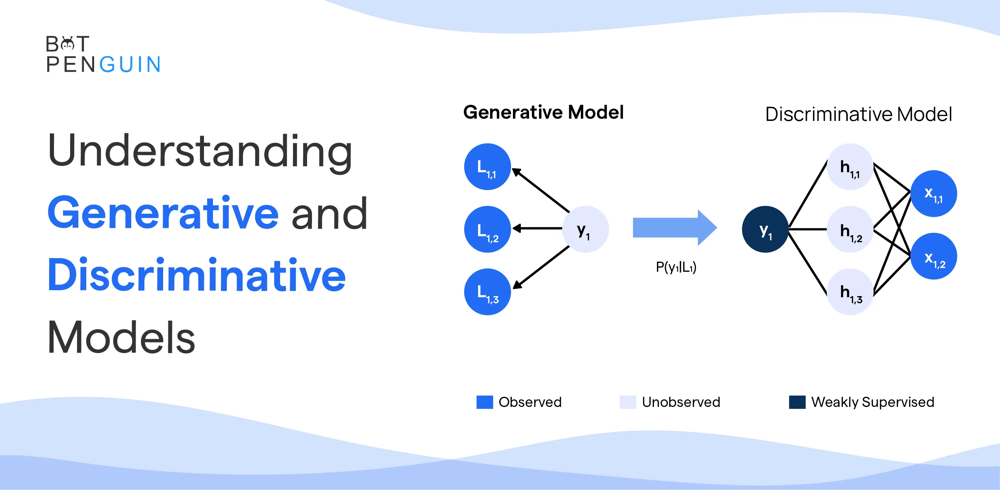

## Table of Contents

## What is Generative Discrimination in the context of machine learning?

Generative Discrimination is a concept in machine learning that combines the strengths of both generative and discriminative models. A generative model tries to understand how data is created by learning the joint probability distribution of the input features and the output labels. On the other hand, a discriminative model focuses directly on learning the boundary between different classes by estimating the conditional probability of the output labels given the input features. Generative Discrimination aims to use the generative model's understanding of data creation to help the discriminative model better distinguish between classes.

In practice, this approach can lead to better performance, especially when the amount of training data is limited. By using the generative model to create additional synthetic data, the discriminative model can learn from a larger and more diverse dataset. This can help the model generalize better to new, unseen data. For example, if you're trying to classify different types of animals, a generative model could create images of animals in various poses and lighting conditions, which the discriminative model could then use to improve its classification accuracy.

## How does Generative Discrimination differ from traditional discriminative models?

Generative Discrimination differs from traditional discriminative models in how they approach learning from data. Traditional discriminative models focus solely on learning the boundary that separates different classes. They do this by estimating the conditional probability of the output labels given the input features, often using methods like logistic regression or support vector machines. The main goal is to directly predict the label based on the input data without worrying about how the data was generated.

In contrast, Generative Discrimination uses a two-step process that combines both generative and discriminative approaches. First, a generative model is used to learn the joint probability distribution of the input features and the output labels. This model can then generate new, synthetic data that resembles the real data. The discriminative model then uses this expanded dataset to learn the class boundaries more effectively. By leveraging the generative model's understanding of data creation, the discriminative model can achieve better performance, especially when the original training dataset is small.

For example, if you're trying to classify images of cats and dogs, a traditional discriminative model would only use the available images to learn the difference between cats and dogs. A Generative Discrimination approach, however, would first use a generative model to create more images of cats and dogs in various poses and lighting conditions. The discriminative model would then use all these images, both real and synthetic, to better understand and distinguish between the two classes. This can lead to improved accuracy and better generalization to new, unseen images.

## What is the role of minibatch discrimination in Generative Discrimination?

Minibatch discrimination is a technique used in Generative Discrimination to help the model learn better by comparing groups of data points instead of individual ones. In traditional methods, the model might look at one picture at a time to decide if it's a cat or a dog. With minibatch discrimination, the model looks at a small group of pictures together. By doing this, the model can see how the pictures in the group are similar or different, which helps it understand the data better and create more realistic fake pictures.

In Generative Discrimination, minibatch discrimination is important because it makes the generative model better at creating data that looks real. When the generative model tries to fool the discriminative model, it uses minibatch discrimination to make sure the fake data it creates fits well with the real data. This way, the discriminative model has a harder time telling the difference between real and fake, which pushes both models to improve. By working together like this, the overall system can learn more effectively and make better predictions.

## Can you explain the basic process of how Generative Discrimination works?

Generative Discrimination works by using two types of models together: a generative model and a discriminative model. The generative model learns how data is made by figuring out the patterns that create it. It can then make new, fake data that looks like the real stuff. The discriminative model's job is to tell different kinds of data apart, like deciding if a picture is of a cat or a dog. By using the fake data from the generative model, the discriminative model can practice more and get better at telling things apart.

In the process, the generative model keeps making new data, and the discriminative model keeps trying to spot the difference between the real and fake data. They work together in a kind of game where the generative model tries to fool the discriminative model, and the discriminative model tries to get better at spotting the fakes. This back-and-forth helps both models improve. Over time, the generative model gets better at making realistic fake data, and the discriminative model gets better at making accurate predictions, leading to a stronger overall system.

## What are the advantages of using Generative Discrimination over other methods?

Generative Discrimination has several advantages over other methods. One big advantage is that it can work well even when you don't have a lot of data to start with. By using a generative model to make more fake data, the discriminative model can learn from a bigger and more varied set of examples. This helps the model understand the data better and make better predictions, especially when new, unseen data comes along. For example, if you're trying to tell cats and dogs apart, the generative model can make lots of different pictures of cats and dogs, which helps the discriminative model learn the difference more accurately.

Another advantage is that Generative Discrimination can make the model more robust. By constantly trying to fool the discriminative model with fake data, the generative model helps the discriminative model learn to spot tricky cases that might be hard to tell apart. This back-and-forth process makes the discriminative model better at handling real-world data that might have a lot of variation. So, even if you have a picture of a cat in a weird pose or a dog in bad lighting, the model is more likely to get it right because it's been trained on a wide range of examples.

## What are some common challenges or limitations faced when implementing Generative Discrimination?

One big challenge with Generative Discrimination is that it can be tricky to balance the generative and discriminative models. If the generative model is too good at making fake data, it might fool the discriminative model too easily, and the whole system might not learn much. On the other hand, if the generative model isn't good enough, the discriminative model won't have enough good fake data to learn from, and its performance might not improve. Finding the right balance takes a lot of careful tuning and testing.

Another limitation is that Generative Discrimination can be computationally expensive. Both the generative and discriminative models need to be trained and updated constantly, which can take a lot of time and computer power. This can make it hard to use Generative Discrimination in situations where you need quick results or don't have a lot of computing resources. Despite these challenges, when done right, Generative Discrimination can lead to better performance and more accurate predictions.

## How can Generative Discrimination be applied in real-world scenarios?

Generative Discrimination can be used in real-world situations like helping doctors tell the difference between healthy and sick patients from medical images. Imagine a doctor has a few pictures of lungs from patients with different diseases. A generative model can make more pictures of lungs that look like the real ones but show the diseases in different ways. The discriminative model then uses these real and fake pictures to learn how to spot the diseases more accurately. This way, even if the doctor sees a new patient with a rare or unusual case, the model can still help diagnose it correctly.

Another use is in the world of self-driving cars. A generative model can create different scenes on the road, like various weather conditions, different times of day, or unexpected obstacles. The discriminative model then uses these scenes to learn how to recognize and react to them. This helps the car's system understand a wider range of driving situations and make better decisions on the road, making it safer and more reliable. By using Generative Discrimination, the car can handle tricky situations that it might not have seen before in its training data.

## What metrics are typically used to evaluate the performance of Generative Discrimination models?

To see how well a Generative Discrimination model is doing, people usually look at a few key numbers. One important one is accuracy, which tells you how often the model gets the right answer. If the model is good at telling cats and dogs apart, its accuracy will be high. Another useful number is the confusion matrix, which shows how the model mixes up different classes. For example, it can tell you if the model often thinks a cat is a dog or if it gets it right most of the time. These numbers help you understand if the model is doing a good job overall and where it might need to improve.

Another set of numbers that are often used are precision and recall. Precision tells you how many of the things the model says are cats are actually cats. Recall tells you how many of the real cats the model was able to find. These numbers are especially helpful when the model needs to be good at spotting one type of thing, like finding sick patients in medical images. By looking at these numbers, you can see if the model is good at avoiding false alarms (high precision) or if it's good at not missing any cases (high recall). Together, these metrics give a full picture of how well the Generative Discrimination model is working.

## How does the choice of minibatch size affect the performance of Generative Discrimination?

The size of the minibatch can make a big difference in how well Generative Discrimination works. A smaller minibatch size means the model looks at fewer pictures at once. This can make the training faster because the computer doesn't have to handle as much data at one time. But, if the minibatch is too small, the model might not see enough variety in the data, which can make it harder for the model to learn the right patterns. On the other hand, a bigger minibatch size lets the model see more pictures together, which can help it understand the data better and make more accurate predictions. However, using a bigger minibatch can slow down the training because it takes more computer power to process all those pictures at once.

Finding the right minibatch size is all about balance. If the minibatch size is just right, the model can learn quickly and accurately. For example, if you're using Generative Discrimination to tell cats and dogs apart, a good minibatch size might help the model see different types of cats and dogs in each batch, helping it learn the differences better. But if the minibatch size is too big or too small, the model might struggle. So, people often try different minibatch sizes to see which one works best for their specific task. This way, they can make sure the model is learning as well as it can.

## Can you discuss any recent advancements or variations in Generative Discrimination techniques?

One recent advancement in Generative Discrimination is the use of more advanced generative models, like Generative Adversarial Networks (GANs). GANs are really good at making fake data that looks very real. They do this by having two models, a generator and a discriminator, play a game where the generator tries to fool the discriminator with fake data, and the discriminator tries to spot the fakes. When used in Generative Discrimination, these GANs can make the fake data even better, which helps the discriminative model learn to tell things apart more accurately. This can be especially helpful in areas like medical imaging, where having more realistic fake images can help doctors spot diseases better.

Another variation is the use of transfer learning in Generative Discrimination. Transfer learning means using a model that was trained on one task to help with another task. For example, if you have a model that's good at recognizing objects in pictures, you can use that knowledge to help a new model tell the difference between cats and dogs. By using transfer learning, the generative model can make better fake data, and the discriminative model can learn faster and make more accurate predictions. This can save a lot of time and effort, especially when you don't have a lot of data to start with.

## What are the computational requirements for implementing Generative Discrimination, particularly with minibatch discrimination?

Implementing Generative Discrimination, especially with minibatch discrimination, requires a lot of computer power. Both the generative and discriminative models need to be trained at the same time, which means the computer has to do a lot of math very quickly. The size of the minibatch can affect how much computer power you need. If you use a bigger minibatch, the computer has to handle more data at once, which can make the training slower. But if the minibatch is too small, the model might not learn as well. So, you need a strong computer with a good graphics card to make sure the training goes smoothly and quickly.

There are also other things to think about when it comes to computational requirements. For example, using more advanced models like Generative Adversarial Networks (GANs) can make the fake data better, but they also need more computer power to train. Transfer learning can help save some time and effort, but setting it up still takes a lot of computing resources. Overall, to use Generative Discrimination effectively, you need a computer that can handle a lot of data and do a lot of math quickly. This way, the model can learn well and make good predictions without taking too long.

## How does Generative Discrimination integrate with other machine learning techniques like GANs or VAEs?

Generative Discrimination can work really well with other machine learning methods like Generative Adversarial Networks (GANs) and Variational Autoencoders (VAEs). GANs are made up of two parts: a generator that makes fake data and a discriminator that tries to tell real from fake. When used in Generative Discrimination, the generator part of the GAN can make the fake data that the discriminative model uses to learn. This can make the fake data very realistic, which helps the discriminative model do a better job at telling things apart. For example, if you're trying to spot diseases in medical images, the GAN can make lots of different pictures of sick lungs, which helps the discriminative model learn to find the diseases more accurately.

VAEs are another type of generative model that can be used in Generative Discrimination. VAEs learn how to make new data by understanding the patterns in the data they see. They can then use this understanding to make new, fake data that looks like the real stuff. When you use a VAE in Generative Discrimination, it can make the fake data that the discriminative model uses to learn. This can be especially helpful when you don't have a lot of real data to start with. The VAE can make more data for the discriminative model to practice on, which can help it make better predictions when it sees new data.