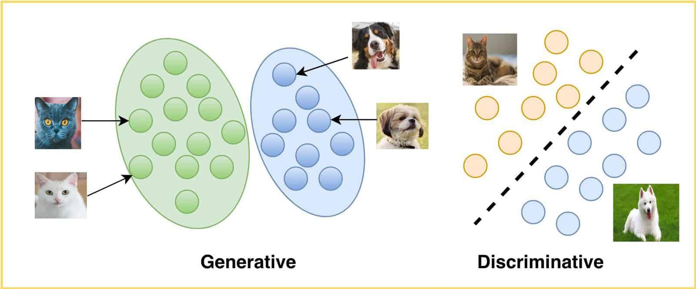

## Table of Contents

## What is a discriminative model in machine learning?

A discriminative model in machine learning is a type of model that focuses on learning the differences between different classes or outcomes directly. Instead of trying to understand the underlying structure of the data, discriminative models aim to find the best way to separate or classify the data into different categories. For example, in a problem where you need to distinguish between pictures of cats and dogs, a discriminative model would try to learn the features that make a picture more likely to be a cat or a dog, without worrying about what makes a cat or a dog in general.

These models are often used in classification tasks, where the goal is to assign labels to new data points based on the learned decision boundaries. Common examples of discriminative models include logistic regression, support vector machines (SVMs), and neural networks. These models are particularly good at achieving high accuracy in classification tasks because they focus directly on the decision-making process, making them efficient for many practical applications.

## How do discriminative models differ from generative models?

Discriminative models and generative models are two different approaches to machine learning. Discriminative models focus on learning the boundary between different classes directly. They try to find the best way to separate or classify data into different categories without worrying about how the data was generated. For example, if you want to tell apart pictures of cats and dogs, a discriminative model would look for features that help it decide if a picture is more likely to be a cat or a dog. Common discriminative models include logistic regression, support vector machines (SVMs), and neural networks.

On the other hand, generative models focus on understanding how the data is generated. They try to learn the underlying distribution of the data for each class. For instance, a generative model would learn what makes a cat a cat and what makes a dog a dog, and then use that knowledge to classify new pictures. Generative models can be used to generate new data that looks like the training data. Examples of generative models include Naive Bayes, Gaussian Mixture Models, and more recently, models like Generative Adversarial Networks (GANs).

The key difference between the two is their approach to learning. Discriminative models are typically better at classification tasks because they focus directly on the decision boundary. Generative models, however, can be more flexible because they model the entire data distribution, which allows them to do things like generate new data or handle missing data more effectively. Both types of models have their strengths and are chosen based on the specific needs of the task at hand.

## What are some common examples of discriminative models?

Discriminative models are used to classify data into different groups. Some common examples include logistic regression, support vector machines (SVMs), and neural networks. Logistic regression is a simple model that works well for binary classification, where you need to decide between two outcomes. It uses the sigmoid function to turn a linear combination of features into a probability between 0 and 1. For example, if you want to predict if an email is spam or not, logistic regression can help you figure out the probability that an email is spam based on its features.

Support vector machines, or SVMs, are another type of discriminative model. They work by finding the best line, or hyperplane, that separates different classes of data. SVMs are good at handling complex data and can work with both linear and non-linear decision boundaries. They are often used in tasks like image classification or text categorization. Neural networks, on the other hand, are more complex models that can learn very intricate patterns in data. They are made up of layers of interconnected nodes and can be used for a wide range of tasks, from simple classification to more advanced applications like image recognition and natural language processing.

These models are all focused on finding the best way to separate data into different classes. They do this by directly learning the decision boundary between classes, rather than trying to understand how the data was generated. This makes them very effective for classification tasks, where the goal is to correctly label new data points based on what they have learned from the training data.

## What types of problems are discriminative models best suited for?

Discriminative models are really good at solving problems where you need to sort things into different groups. These models focus on finding the best way to draw a line between different types of data. For example, if you want to tell if an email is spam or not, a discriminative model can look at things like the words in the email or who it's from, and then decide if it's more likely to be spam or not. They are great for tasks like telling apart pictures of cats and dogs, figuring out if a bank transaction is fraud, or deciding if a patient has a certain disease based on their symptoms.

These models are especially useful when you have a lot of data and you just want to make the best guesses about new data. They don't try to understand everything about the data, they just focus on the differences between the groups. This makes them fast and accurate for classification tasks. For example, logistic regression, which is a type of discriminative model, uses a formula like $$ P(Y=1|X) = \frac{1}{1 + e^{-(\beta_0 + \beta_1 X_1 + ... + \beta_n X_n)}} $$ to figure out the probability that something belongs to one group or another. This makes them very practical for many real-world problems where you need to make quick and accurate decisions.

## How does a discriminative model learn from data?

A discriminative model learns from data by focusing on the differences between different groups. It looks at examples of data that are already labeled and tries to find patterns or features that can help it tell these groups apart. For example, if you want to tell if an email is spam or not, the model will look at lots of emails that are already marked as spam or not spam. It will then figure out which words or features make an email more likely to be spam. This process is called training, and during training, the model adjusts its internal rules or weights to get better at separating the groups.

Once the model is trained, it can use what it has learned to make predictions about new data. If you give it a new email, it will look at the words and other features of that email and use its learned rules to decide if it's more likely to be spam or not. For example, in logistic regression, a common discriminative model, the model uses a formula like $$ P(Y=1|X) = \frac{1}{1 + e^{-(\beta_0 + \beta_1 X_1 + ... + \beta_n X_n)}} $$ to calculate the probability that the email is spam based on its features. The model keeps adjusting the values of $$ \beta_0, \beta_1, ..., \beta_n $$ during training to make its predictions as accurate as possible.

## What are the key components of a discriminative model?

Discriminative models are made up of a few key parts that help them learn how to tell things apart. The first part is the input data, which are the examples the model looks at to learn. These examples come with labels that say which group they belong to. The model uses these examples to find patterns or features that can help it decide which group new examples should go in. The second part is the model's structure, which could be something simple like logistic regression or something more complex like a [neural network](/wiki/neural-network). This structure has parameters, like weights or coefficients, that the model adjusts to get better at telling things apart.

During training, the model looks at the input data and adjusts its parameters to make its guesses more accurate. For example, in logistic regression, the model uses a formula like $$ P(Y=1|X) = \frac{1}{1 + e^{-(\beta_0 + \beta_1 X_1 + ... + \beta_n X_n)}} $$ to figure out the probability that something belongs to one group. The model changes the values of $$ \beta_0, \beta_1, ..., \beta_n $$ to make its predictions match the labels of the training data as closely as possible. Once the model is trained, it can use what it has learned to make predictions about new data, helping it to tell things apart in real-world situations.

## Can you explain the role of loss functions in discriminative models?

Loss functions are really important in discriminative models. They help the model figure out how well it's doing and what it needs to change to get better. When the model makes a guess about which group something belongs to, the loss function checks how far off that guess is from the right answer. If the guess is way off, the loss function will give a high number, telling the model it needs to make some big changes. If the guess is close, the loss function will give a low number, telling the model it's doing pretty well but still needs a little tweaking.

During training, the model keeps adjusting its parameters to make the loss function's number as small as possible. For example, in logistic regression, the model uses a formula like $$ P(Y=1|X) = \frac{1}{1 + e^{-(\beta_0 + \beta_1 X_1 + ... + \beta_n X_n)}} $$ to guess the probability that something belongs to one group. The loss function helps the model figure out the best values for $$ \beta_0, \beta_1, ..., \beta_n $$ so its guesses get more and more accurate. By using the loss function, the model can learn from its mistakes and keep getting better at telling things apart.

## How do discriminative models handle overfitting and underfitting?

Discriminative models can run into problems like overfitting and underfitting. Overfitting happens when a model learns the training data too well, including all its little mistakes and oddities. It's like memorizing a test instead of learning the material. When this happens, the model might do great on the training data but not so well on new data it hasn't seen before. To stop overfitting, you can use techniques like regularization, which adds a penalty to the model's complexity. For example, in logistic regression, you might add a term like $$ \lambda \sum_{i=1}^n \beta_i^2 $$ to the loss function to keep the model from getting too complicated.

On the other hand, underfitting is when the model is too simple to capture the important patterns in the data. It's like trying to solve a math problem with just addition when you need multiplication too. When a model underfits, it won't do well on either the training data or new data because it can't learn enough to make good guesses. To fix underfitting, you might need to make the model more complex, like adding more features or using a more powerful model like a neural network. Finding the right balance between overfitting and underfitting is key to making sure the model works well in the real world.

## What are the advantages of using discriminative models in classification tasks?

Discriminative models are really good at sorting things into different groups because they focus on finding the best way to tell these groups apart. They look at the differences between the groups directly, which makes them very good at figuring out if something is a cat or a dog, spam or not spam, or sick or healthy. This direct approach helps them make quick and accurate guesses about new data. For example, in logistic regression, which is a type of discriminative model, the model uses a formula like $$ P(Y=1|X) = \frac{1}{1 + e^{-(\beta_0 + \beta_1 X_1 + ... + \beta_n X_n)}} $$ to figure out the probability that something belongs to one group. This makes them very practical for many real-world problems where you need to make quick and accurate decisions.

Another advantage of discriminative models is that they can handle a lot of data and still perform well. They don't try to understand everything about the data, just the differences between the groups. This makes them fast and efficient, especially when you have a lot of examples to learn from. They also have tools like regularization that help prevent them from overfitting, which means they can keep their guesses accurate even when they see new data. This makes discriminative models a great choice for tasks where you need to classify things quickly and correctly.

## How can the performance of discriminative models be evaluated?

The performance of discriminative models can be evaluated using different measures that show how well the model is doing at telling things apart. One common way is to use accuracy, which is the percentage of correct guesses the model makes. For example, if the model correctly identifies 90 out of 100 emails as spam or not spam, its accuracy is 90%. Another important measure is the confusion matrix, which shows how many times the model guessed right and wrong for each group. From the confusion matrix, you can calculate other useful numbers like precision, which is how often the model's positive guesses are correct, and recall, which is how often the model finds all the positive cases.

Besides accuracy, precision, and recall, you can also use the F1 score, which is a combination of precision and recall. The F1 score is calculated as $$ F1 = 2 \times \frac{\text{precision} \times \text{recall}}{\text{precision} + \text{recall}} $$. This score is helpful when you want to balance how often the model is right with how often it finds all the right cases. Another way to evaluate the model is by looking at the ROC curve, which shows how well the model can tell the groups apart at different thresholds. The area under the ROC curve (AUC) is a number between 0 and 1, where a higher number means the model is better at telling things apart. By using these different measures, you can get a good idea of how well the discriminative model is working and where it might need to improve.

## What are some advanced techniques used to improve discriminative models?

One advanced technique to improve discriminative models is to use ensemble methods. This means combining several different models to make one big, better model. For example, you might use a method called bagging, where you train many versions of the same model on different parts of your data and then let them vote on the final answer. Another ensemble method is boosting, where you train models one after the other, with each new model trying to fix the mistakes of the last one. By using these ensemble methods, you can make your discriminative model more accurate and less likely to make mistakes on new data.

Another way to improve discriminative models is to use regularization. Regularization helps stop the model from overfitting, which is when it learns the training data too well and doesn't work as well on new data. There are different types of regularization, like L1 and L2 regularization. L2 regularization adds a term to the loss function that makes the model's parameters smaller, like $$ \lambda \sum_{i=1}^n \beta_i^2 $$. This helps keep the model simple and less likely to overfit. L1 regularization works a bit differently but can also help by making some of the model's parameters zero, which can make the model even simpler. By using regularization, you can make your discriminative model more reliable and better at guessing right on new data.

## How do discriminative models integrate with deep learning architectures?

Discriminative models can be part of [deep learning](/wiki/deep-learning) by using neural networks, which are a type of deep learning model. Neural networks are made up of layers of connected nodes that learn to tell things apart by adjusting their connections. For example, a neural network might have an input layer where it looks at the data, some hidden layers where it finds patterns, and an output layer where it makes its guess. The model learns by changing the weights of the connections between nodes to make its guesses more accurate. This process is guided by a loss function, which tells the model how far off its guesses are from the right answers. By using techniques like backpropagation, the model can adjust its weights to make the loss function smaller, helping it learn better.

One way to make discriminative models work even better with deep learning is to use advanced techniques like convolutional neural networks (CNNs) for things like image recognition. CNNs are good at finding patterns in images by using layers that look at small parts of the image and combine them to understand the whole picture. Another technique is to use recurrent neural networks (RNNs) for tasks like understanding text or speech, where the order of the data matters. RNNs can remember what they've seen before and use that to make better guesses about what comes next. By using these advanced deep learning architectures, discriminative models can handle more complex data and make more accurate predictions.

## References & Further Reading

[1]: Ng, A. Y., & Jordan, M. I. (2002). ["On Discriminative vs. Generative classifiers: A comparison of logistic regression and naive Bayes."](https://papers.nips.cc/paper/2001/file/7b7a53e239400a13bd6be6c91c4f6c4e-Paper.pdf) Advances in Neural Information Processing Systems 14.

[2]: Bishop, C. M. (2006). ["Pattern Recognition and Machine Learning."](https://www.cs.uoi.gr/~arly/courses/ml/tmp/Bishop_book.pdf) Springer.

[3]: Bishop, C. M. (2007). ["Discriminative vs. Generative" Classifiers."](https://www.microsoft.com/en-us/research/wp-content/uploads/2016/05/Bishop-Valencia-07.pdf) International Conference on Machine Learning.

[4]: Hastie, T., Tibshirani, R., & Friedman, J. (2009). ["The Elements of Statistical Learning."](https://link.springer.com/book/10.1007/978-0-387-84858-7) Springer.

[5]: Goodfellow, I., Bengio, Y., & Courville, A. (2016). ["Deep Learning."](https://link.springer.com/article/10.1007/s10710-017-9314-z) MIT Press.