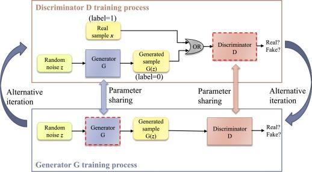

## Table of Contents

## What is a discriminator in the context of machine learning?

In machine learning, a discriminator is a part of a model that helps to tell the difference between real and fake data. It's often used in a type of model called a Generative Adversarial Network (GAN). In a GAN, there are two main parts: the generator and the discriminator. The generator creates new data that looks like the real data, and the discriminator checks this new data to see if it's real or fake. The discriminator's job is to get better and better at spotting the fake data, which helps the generator to make more realistic data.

Think of the discriminator like a security guard at a club. The generator is trying to sneak in fake guests (data), and the discriminator is checking IDs to see if they are real or not. As the generator gets better at making fake IDs, the discriminator has to get better at spotting them. This back-and-forth helps both parts of the GAN to improve. Over time, the generator makes data that is very hard to tell from the real thing, and the discriminator becomes very good at telling real from fake.

## How does a discriminator function within a Generative Adversarial Network (GAN)?

In a Generative Adversarial Network (GAN), the discriminator plays the role of a judge. It looks at samples of data and decides if they are real or fake. The discriminator is like a student learning to tell the difference between two things. At first, it might not be very good at this job. But as it sees more and more examples, it gets better. The goal of the discriminator is to become very good at spotting fake data created by the generator.

The way the discriminator works is by taking in data, either real data from the training set or fake data created by the generator. It then outputs a probability, a number between 0 and 1, that tells how likely it thinks the data is real. If the number is close to 1, the discriminator thinks the data is real. If it's close to 0, it thinks the data is fake. As the GAN trains, the discriminator and generator play a game. The generator tries to fool the discriminator by making better and better fake data, and the discriminator tries to get better at spotting the fakes. This back-and-forth helps both parts of the GAN improve over time.

## What are the key components of a discriminator?

A discriminator in a Generative Adversarial Network (GAN) has a few main parts that help it do its job. The first part is the input layer, which takes in the data that the discriminator needs to check. This data could be real from the training set or fake from the generator. The second part is the hidden layers, where the discriminator does its thinking. These layers have neurons that process the data and learn to spot patterns that tell real from fake data.

The last part of the discriminator is the output layer, which gives a final answer. This answer is a number between 0 and 1, showing how sure the discriminator is that the data is real. If the number is close to 1, the discriminator thinks the data is real. If it's close to 0, it thinks the data is fake. The discriminator learns by adjusting the weights in its hidden layers, making it better at telling real from fake over time.

## Can you explain the training process of a discriminator in a GAN?

The training process of a discriminator in a Generative Adversarial Network (GAN) is like a game between two players. The discriminator starts by looking at real data from the training set and fake data made by the generator. It tries to guess which data is real and which is fake. At first, the discriminator might not be very good at this, but it gets better over time. The discriminator does this by using a loss function, which is a way to measure how wrong its guesses are. It then uses this information to adjust its internal weights, making it better at spotting real and fake data next time.

During training, the discriminator and generator take turns learning. The generator tries to make fake data that looks more and more like the real data, hoping to fool the discriminator. At the same time, the discriminator is trying to get better at spotting these fakes. This back-and-forth helps both parts of the GAN improve. The training continues until the generator makes data that is very hard to tell from real data, and the discriminator is very good at telling real from fake. This process can be described by the following loss function for the discriminator: $$ \mathcal{L}_D = -\frac{1}{2} \mathbb{E}_{x \sim p_{\text{data}}(x)}[\log D(x)] - \frac{1}{2} \mathbb{E}_{z \sim p_z(z)}[\log (1 - D(G(z)))] $$ where $$ D(x) $$ is the output of the discriminator for real data $$ x $$, and $$ D(G(z)) $$ is the output for fake data generated from noise $$ z $$.

## What is the role of loss functions in training a discriminator?

Loss functions are very important for training a discriminator in a GAN. They help the discriminator learn by telling it how well it's doing at telling real data from fake data. The loss function measures the difference between the discriminator's guesses and the actual truth. If the discriminator makes a lot of mistakes, the loss function will be high. This tells the discriminator that it needs to change its weights to do better next time. By using the loss function, the discriminator can slowly get better at its job.

The loss function for the discriminator in a GAN is made up of two parts. The first part looks at how well the discriminator does with real data. It wants the discriminator to say "real" for real data, so it uses a term like $$ -\mathbb{E}_{x \sim p_{\text{data}}(x)}[\log D(x)] $$. The second part looks at how well the discriminator does with fake data. It wants the discriminator to say "fake" for fake data, so it uses a term like $$ -\mathbb{E}_{z \sim p_z(z)}[\log (1 - D(G(z)))] $$. By adding these two parts together, the loss function helps the discriminator learn to tell real and fake data apart better and better.

## How do you evaluate the performance of a discriminator?

Evaluating the performance of a discriminator in a GAN involves looking at how well it can tell real data from fake data. One common way to do this is by using the discriminator's loss function. The loss function measures how wrong the discriminator's guesses are. If the loss is low, it means the discriminator is doing a good job at telling real and fake data apart. If the loss is high, it means the discriminator is making a lot of mistakes and needs to improve. The loss function for the discriminator can be written as $$ \mathcal{L}_D = -\frac{1}{2} \mathbb{E}_{x \sim p_{\text{data}}(x)}[\log D(x)] - \frac{1}{2} \mathbb{E}_{z \sim p_z(z)}[\log (1 - D(G(z)))] $$. This formula shows that the discriminator's goal is to maximize the probability of correctly classifying real data as real and fake data as fake.

Another way to evaluate the discriminator's performance is by looking at its accuracy. Accuracy is the percentage of times the discriminator correctly identifies real data as real and fake data as fake. You can calculate accuracy by testing the discriminator on a set of data where you know which samples are real and which are fake. If the discriminator has high accuracy, it means it's doing a good job. If the accuracy is low, it means the discriminator needs more training. Both the loss function and accuracy give you a good idea of how well the discriminator is working and whether it needs more training to improve.

## What are common architectures used for discriminators?

Common architectures for discriminators in GANs often use neural networks, which can be either fully connected or convolutional. A fully connected [neural network](/wiki/neural-network) is like a series of connected layers where each neuron in one layer is connected to every neuron in the next layer. This type of network is good for simple data but can be less effective for images. On the other hand, a [convolutional neural network](/wiki/convolutional-neural-network) (CNN) is better for images because it can recognize patterns in the data. In a CNN, the layers use filters to look at small parts of the image and then combine these parts to understand the whole image. This makes CNNs very good at telling real images from fake ones.

Another common architecture for discriminators is the use of deep neural networks, which have many layers. These deep networks can learn very complex patterns in the data, making them powerful for tasks like image recognition. For example, a deep CNN might have several convolutional layers followed by pooling layers, which reduce the size of the data, and then fully connected layers at the end. The output of the discriminator is usually a single number between 0 and 1, which shows how likely the input data is real. The formula for the output of a discriminator in a GAN can be written as $$ D(x) $$, where $$ x $$ is the input data and $$ D(x) $$ is the probability that $$ x $$ is real.

## How does the concept of overfitting affect a discriminator's performance?

Overfitting is when a discriminator learns too much about the training data and starts to do too well on it. This can be a problem because the discriminator might not be able to tell real from fake data that it hasn't seen before. Imagine the discriminator is like a student who memorizes answers for a test instead of learning the material. If the test has different questions, the student won't do well. In the same way, if the discriminator overfits, it might not work well on new data.

To avoid overfitting, you can use techniques like regularization, which helps the discriminator learn in a way that works better on new data. Regularization can be thought of as adding a penalty to the loss function, making the discriminator focus on the most important patterns in the data. For example, you might add a term to the loss function like $$ \lambda \cdot \text{regularization term} $$, where $$ \lambda $$ is a small number that controls how much the penalty affects the training. By using these techniques, you can help the discriminator perform better on new data and avoid overfitting.

## What are the challenges in training a discriminator to achieve equilibrium with a generator?

Training a discriminator to achieve equilibrium with a generator in a GAN can be tricky. The main challenge is to make sure both the discriminator and the generator improve at the same rate. If the discriminator gets too good too quickly, it might always be able to tell real data from fake data, and the generator will never learn to make better fakes. On the other hand, if the generator gets too good too quickly, it might fool the discriminator all the time, and the discriminator will never learn to spot the fakes. This back-and-forth is like a game where both players need to stay balanced for the GAN to work well.

Another challenge is mode collapse, where the generator starts making the same kind of fake data over and over again. This happens when the generator finds a way to fool the discriminator with a specific type of data and keeps doing it. The discriminator might be tricked into thinking it's doing well, but it's not really learning to tell different kinds of data apart. To avoid this, you might need to change how the GAN is trained or use different loss functions to make sure the generator keeps trying new things. The loss function for the discriminator, $$ \mathcal{L}_D = -\frac{1}{2} \mathbb{E}_{x \sim p_{\text{data}}(x)}[\log D(x)] - \frac{1}{2} \mathbb{E}_{z \sim p_z(z)}[\log (1 - D(G(z)))] $$, needs to be carefully balanced to help both the discriminator and the generator improve together.

## How can transfer learning be applied to improve a discriminator's performance?

Transfer learning can help a discriminator in a GAN do a better job by using what it already knows from one task to help with another task. Imagine you're learning to play a new game that's similar to one you've played before. You can use the skills you learned from the old game to get better at the new one faster. In the same way, if you train a discriminator on one kind of data, like pictures of animals, you can use what it learned to help it tell real from fake data in another kind of data, like pictures of cars. This can save time and make the discriminator better at its job right away.

To use transfer learning with a discriminator, you start by training it on a big set of data where it learns to spot real and fake examples. Then, you take this trained discriminator and use it as a starting point for training on a new, different set of data. The weights in the discriminator's neural network, which it learned from the first task, are a good starting point for the new task. This can be shown in the loss function for the discriminator as $$ \mathcal{L}_D = -\frac{1}{2} \mathbb{E}_{x \sim p_{\text{data}}(x)}[\log D(x)] - \frac{1}{2} \mathbb{E}_{z \sim p_z(z)}[\log (1 - D(G(z)))] $$. By using transfer learning, the discriminator can learn faster and do a better job at telling real from fake data in the new task.

## What advanced techniques can be used to enhance the stability and effectiveness of a discriminator in GANs?

One advanced technique to enhance the stability and effectiveness of a discriminator in GANs is called gradient penalty. This technique helps to keep the discriminator from getting too good too quickly, which can make the training process unstable. The gradient penalty works by adding a term to the loss function that makes sure the gradients (or slopes) of the discriminator's output are not too big. This helps the discriminator and generator to improve at a more balanced rate. The loss function with gradient penalty can be written as $$ \mathcal{L}_D = -\frac{1}{2} \mathbb{E}_{x \sim p_{\text{data}}(x)}[\log D(x)] - \frac{1}{2} \mathbb{E}_{z \sim p_z(z)}[\log (1 - D(G(z)))] + \lambda \cdot \mathbb{E}_{\hat{x} \sim p_{\hat{x}}}(\|\nabla_{\hat{x}} D(\hat{x})\|_2 - 1)^2 $$, where $$ \lambda $$ is a small number that controls how much the penalty affects the training.

Another technique is using a Wasserstein GAN (WGAN), which changes how the discriminator and generator are trained. In a WGAN, the discriminator is called a critic, and it tries to tell how different the real and fake data are instead of just saying if they are real or fake. This makes the training process more stable because the critic gives more useful feedback to the generator. The loss function for the critic in a WGAN is $$ \mathcal{L}_D = \mathbb{E}_{x \sim p_{\text{data}}(x)}[D(x)] - \mathbb{E}_{z \sim p_z(z)}[D(G(z))] $$. By using these advanced techniques, you can help the discriminator and generator work together better, making the GAN more stable and effective.

## How do recent research developments address the limitations of discriminators in complex GAN models?

Recent research has focused on improving discriminators in complex GAN models by addressing issues like mode collapse and training instability. One key approach is the use of spectral normalization, which helps to control the Lipschitz constant of the discriminator. This means the discriminator's output doesn't change too quickly when the input changes a little bit. By keeping the discriminator's output smooth, spectral normalization helps to make the training process more stable. The formula for spectral normalization can be written as $$ W_{\text{SN}} = W / \sigma(W) $$, where $$ W $$ is the weight matrix and $$ \sigma(W) $$ is its largest singular value. This technique makes sure the discriminator and generator improve at a more balanced rate, reducing the chance of mode collapse.

Another development is the use of self-attention mechanisms in the discriminator architecture. Self-attention helps the discriminator focus on the most important parts of the input data, which can be especially useful for complex data like images. By paying more attention to key features, the discriminator can better tell real from fake data, improving the overall performance of the GAN. Researchers have also explored using multiple discriminators, each trained on different aspects of the data. This multi-scale approach helps the GAN capture a wider range of features, making the generated data more realistic and diverse. These advancements show how ongoing research continues to push the boundaries of what GANs can achieve.