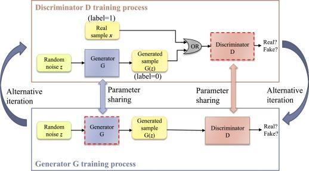

## Table of Contents

## What is a discriminator in the context of machine learning?

In machine learning, a discriminator is a part of a model used in a type of algorithm called Generative Adversarial Networks (GANs). A GAN consists of two main components: a generator and a discriminator. The generator creates new data that looks like the training data, while the discriminator's job is to tell the difference between the real data and the fake data created by the generator. Think of it like a game where the generator tries to fool the discriminator, and the discriminator tries to get better at spotting the fakes.

The discriminator works by taking in data, either real or generated, and outputting a probability that the data is real. It uses a neural network to learn the features of the real data and compare them to the generated data. Over time, as the generator improves its fake data, the discriminator also improves its ability to distinguish between real and fake. This back-and-forth process helps both parts of the GAN to get better at their tasks. The goal is for the generator to produce data so good that the discriminator can't tell the difference anymore.

## How does a discriminator function within a Generative Adversarial Network (GAN)?

In a Generative Adversarial Network (GAN), the discriminator acts like a detective. Its main job is to look at data and decide if it's real or if it was made up by the generator. The discriminator gets better at its job over time by learning from examples of real data and the fake data the generator makes. When the discriminator sees data, it gives a score, kind of like a guess, on how likely it thinks the data is real. If the score is close to 1, it thinks the data is real. If it's close to 0, it thinks the data is fake.

As the GAN keeps running, the generator tries to make better and better fake data to trick the discriminator. At the same time, the discriminator keeps learning to spot the fakes more accurately. This back-and-forth makes both parts of the GAN smarter. The goal is for the generator to make data that's so good the discriminator can't tell it apart from real data. When that happens, the GAN has learned to create very realistic data, which can be used for things like making new images or even creating realistic text.

## What is a PatchGAN discriminator and how does it differ from a traditional discriminator?

A PatchGAN discriminator is a type of discriminator used in GANs, especially in image-to-image translation tasks like style transfer or image enhancement. Instead of looking at the whole image to decide if it's real or fake, a PatchGAN looks at small parts of the image, called patches. Each patch is evaluated separately, and the discriminator gives a score for each patch. The final decision about the whole image is made by averaging the scores of all the patches. This approach helps the GAN focus on local details and textures, making the generated images look more realistic.

The main difference between a PatchGAN and a traditional discriminator is how they process the input. A traditional discriminator looks at the entire image at once and tries to classify it as real or fake. This can sometimes miss out on local details because it's focused on the overall structure of the image. On the other hand, a PatchGAN breaks the image into smaller pieces and evaluates each piece individually. This allows it to pay more attention to the finer details and textures within the image, which can lead to better results in tasks where local accuracy is important.

## Can you explain the concept of a Projection Discriminator and its advantages?

A Projection Discriminator is a special kind of discriminator used in GANs that helps make the generated images even better. Instead of just looking at the whole image or parts of it like other discriminators, a Projection Discriminator uses a trick to focus on different features of the image. It does this by taking the image and turning it into a new form, called a projection, which helps it see the image from different angles. This way, it can catch more details and make sure the generated images are as realistic as possible.

The main advantage of using a Projection Discriminator is that it can spot more details in the images. By looking at the image from different angles, it can see things that other discriminators might miss. This helps the generator in the GAN to make images that look more real and have fewer mistakes. In the end, using a Projection Discriminator can lead to better quality images, which is really helpful in tasks like making new art or improving old photos.

## What is a Window-based Discriminator and in what scenarios is it most effective?

A Window-based Discriminator is a type of discriminator used in GANs that looks at the image through small windows or patches, similar to a PatchGAN. Instead of judging the whole image at once, it slides a small window across the image and makes a decision about each part it sees. This helps it focus on local details and textures, making sure the generated images are more realistic in smaller areas.

This type of discriminator is most effective in scenarios where the quality of local details matters a lot. For example, if you're using a GAN to turn a simple sketch into a detailed painting, a Window-based Discriminator can help make sure the brush strokes and textures look right. It's also useful in image enhancement tasks, where you want to improve the quality of small parts of an image, like making the leaves on a tree look more realistic. By focusing on these smaller areas, the GAN can create images that look better overall.

## How does the NIMA (Neural Image Assessment) discriminator work and what is its primary application?

The NIMA (Neural Image Assessment) discriminator is a special kind of discriminator used in GANs that helps judge how good an image looks. Instead of just saying if an image is real or fake, NIMA gives a score that shows how nice the image is. It does this by using a [neural network](/wiki/neural-network) that has been trained on lots of images that people have rated. When NIMA looks at an image, it guesses a score from 1 to 10, where 10 means the image is really good and 1 means it's not so great. This helps the GAN make images that not only look real but also look nice to people.

The primary application of the NIMA discriminator is in tasks where you want to make images that people will like. For example, if you're using a GAN to create new art or to make old photos look better, NIMA can help. It tells the GAN how to make images that people will find appealing. By using NIMA, the GAN can keep improving the images until they get high scores, which means they'll be more likely to be enjoyed by people looking at them.

## What are the key features of a Multiple Random Window Discriminator?

A Multiple Random Window Discriminator is a special kind of discriminator used in GANs that helps make better images by looking at them in a unique way. Instead of looking at the whole image or just one part of it, this discriminator picks several small windows from the image at random. Each window is like a small piece of the picture, and the discriminator checks each piece to see if it looks real or fake. By looking at different parts of the image, it can catch more details and help the GAN create images that are more realistic overall.

This type of discriminator is really helpful when you want to make sure all parts of an image look good, not just the big picture. For example, if you're using a GAN to turn a simple drawing into a detailed painting, a Multiple Random Window Discriminator can make sure the brush strokes and textures in different areas of the painting look right. By focusing on these small, randomly chosen parts, the GAN can improve the quality of the whole image, making it more appealing and lifelike.

## How does the SESAME Discriminator improve upon existing discriminator models?

The SESAME Discriminator, which stands for "Self-Ensembling Semi-Supervised Adversarial Mutual Entropy," improves upon existing discriminator models by using a smart way to learn from both labeled and unlabeled data. It does this by making the discriminator look at the same image in different ways and then combining what it learns. This helps the discriminator get better at telling real images from fake ones, even when it doesn't have a lot of labeled data to work with. By using this self-ensembling method, the SESAME Discriminator can make the GAN create more realistic images because it can learn from more examples.

Another way the SESAME Discriminator improves is by using a special kind of loss function called mutual entropy. This helps the discriminator focus on the parts of the image that are most important for telling real from fake. By paying attention to these key parts, the SESAME Discriminator can help the GAN make images that look more real and have fewer mistakes. This makes it really useful for tasks where you want to create high-quality images, like turning sketches into detailed paintings or making old photos look better.

## What are the common challenges faced when training discriminators and how can they be mitigated?

Training discriminators in GANs can be tricky because they often get too good at their job. When this happens, the discriminator can tell the difference between real and fake images so well that the generator can't learn anymore. This is called mode collapse, where the generator keeps making the same kind of images because it's the only way to fool the discriminator. Another challenge is when the discriminator and generator don't train at the same speed. If the discriminator gets ahead, it can make it hard for the generator to catch up, and if the generator gets ahead, the discriminator might not be able to keep up with the new fake images.

To fix these problems, you can use a few tricks. One way is to use a technique called label smoothing, where instead of telling the discriminator that real images are always 1 and fake images are always 0, you use numbers a bit closer to the middle, like 0.9 for real and 0.1 for fake. This makes the discriminator less sure of itself and helps the generator learn better. Another way is to use different learning rates for the discriminator and generator, so they can train at a pace that helps them both improve without one getting too far ahead. By using these methods, you can help the GAN train better and make more realistic images.

## How do different types of discriminators impact the performance of a GAN?

Different types of discriminators can change how well a GAN works by focusing on different parts of the images. For example, a traditional discriminator looks at the whole image to decide if it's real or fake. This can be good for seeing the big picture but might miss small details. On the other hand, a PatchGAN breaks the image into small pieces and checks each piece. This helps the GAN make images that look more real in small areas, like making sure the leaves on a tree look right. A Window-based Discriminator slides a small window across the image, which can help focus on local details and textures. A Multiple Random Window Discriminator picks random parts of the image to check, which can catch more details and help make the whole image look better.

The SESAME Discriminator uses both labeled and unlabeled data to learn, which can help the GAN make more realistic images even with less labeled data. It does this by looking at the image in different ways and combining what it learns. The NIMA Discriminator goes further by not just saying if an image is real or fake but also giving it a score on how nice it looks. This can help the GAN create images that people will like. Each type of discriminator has its own way of helping the GAN, and choosing the right one depends on what you want the GAN to do, like making art or improving old photos. By [picking](/wiki/asset-class-picking) the right discriminator, you can help the GAN make better images.

## What advanced techniques can be applied to enhance the effectiveness of discriminators in complex models?

To make discriminators work better in complex models, you can use a technique called feature matching. Instead of just looking at the whole image, the discriminator checks if the features of the real and fake images are similar. This helps the generator learn to make images that not only look real but also have the right details. Another way to improve discriminators is by using a method called gradient penalty. This helps keep the training stable by making sure the discriminator's guesses don't change too quickly. By adding a small penalty to the loss function, the GAN can train more smoothly and make better images.

Using techniques like spectral normalization can also help. This method makes sure the discriminator doesn't get too powerful by controlling how it learns. By doing this, the generator has a better chance to learn and make realistic images. Another advanced technique is to use multiple discriminators at different scales. This means having some discriminators look at the whole image and others focus on smaller parts. By combining what all these discriminators learn, the GAN can create images that look good from far away and up close. These methods can make the GAN work better and create more realistic images.

## Can you discuss the future trends and potential developments in discriminator technology?

In the future, discriminator technology in GANs is likely to get even better. One trend we might see is more use of self-supervised learning, where the discriminator can learn from data without needing a lot of labels. This could make GANs work better with less data, which is great for tasks like making art or improving old photos. Another trend could be the use of more advanced neural networks, like transformers, which are really good at understanding patterns in data. By using these, discriminators might be able to tell real from fake even better, making the images the GAN creates look more realistic.

Another potential development is the use of multi-modal discriminators. These are discriminators that can handle different types of data, like images and text, at the same time. This could help GANs create things like realistic images with captions that match perfectly. Also, we might see more work on making discriminators explainable, so we can understand why they think an image is real or fake. This could make GANs more trustworthy and useful in areas like medical imaging, where it's important to know why a decision was made. Overall, these trends and developments could make GANs even more powerful and useful in the future.

## References & Further Reading

[1]: Goodfellow, I., Pouget-Abadie, J., Mirza, M., Xu, B., Warde-Farley, D., Ozair, S., ... & Bengio, Y. (2014). ["Generative Adversarial Nets."](https://arxiv.org/abs/1406.2661) Advances in Neural Information Processing Systems 27.

[2]: Isola, P., Zhu, J. Y., Zhou, T., & Efros, A. A. (2017). ["Image-to-Image Translation with Conditional Adversarial Networks."](https://arxiv.org/abs/1611.07004) Proceedings of the IEEE conference on computer vision and pattern recognition.

[3]: Zhang, H., Zhang, H., & Wang, C. (2018). ["Projection Discriminator for Point Cloud Generation."](https://scholar.google.com/citations?user=EeNTBlcAAAAJ&hl=en) arXiv preprint arXiv:1811.09321.

[4]: Karras, T., Laine, S., & Aila, T. (2019). ["A Style-Based Generator Architecture for Generative Adversarial Networks."](https://arxiv.org/abs/1812.04948) Proceedings of the IEEE/CVF Conference on Computer Vision and Pattern Recognition, 4401-4410.

[5]: Wang, T-C., Liu, M-Y., Zhu, J-Y., Liu, G., Tao, A., Kautz, J., & Catanzaro, B. (2018). ["High-Resolution Image Synthesis and Semantic Manipulation with Conditional GANs."](https://arxiv.org/abs/1711.11585) Proceedings of the IEEE Conference on Computer Vision and Pattern Recognition, 8798-8807.