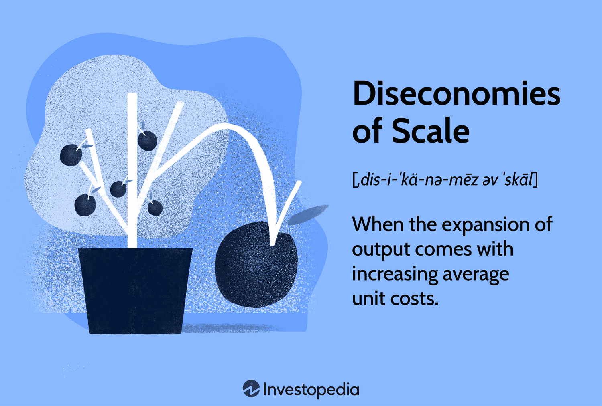

## Table of Contents

## What are diseconomies of scale?

Diseconomies of scale happen when a company gets bigger and it starts to cost more to make each product. This is the opposite of economies of scale, where costs go down as a company grows. When a company becomes too large, it can be hard to manage everything well. Communication between different parts of the company can become slow and confusing. Also, it might be harder to keep workers motivated and working together well.

As companies grow, they might need more managers to keep things running smoothly. Hiring more managers adds to the costs. Sometimes, big companies can become less flexible and slower to make decisions. This can make it harder for them to change quickly when the market changes. All these things can lead to higher costs per product, which is what we call diseconomies of scale.

## How do diseconomies of scale differ from economies of scale?

Economies of scale and diseconomies of scale are two concepts that explain how a company's costs change as it grows. Economies of scale happen when a company gets bigger and it costs less to make each product. This is because the company can buy things in bulk, use its resources more efficiently, and spread fixed costs like rent and machinery over more products. As a result, the cost per product goes down, which can lead to higher profits.

On the other hand, diseconomies of scale occur when a company grows too big and it starts to cost more to make each product. This can happen because the company becomes harder to manage. Communication can become slow and confusing, and it might be harder to keep workers motivated. The company might need to hire more managers, which adds to the costs. Also, a big company can become less flexible and slower to make decisions, making it harder to adapt to changes in the market. This leads to higher costs per product, which is the opposite of what happens with economies of scale.

## What are the main causes of diseconomies of scale?

One main cause of diseconomies of scale is when a company grows too big and becomes hard to manage. As a company gets larger, communication between different parts of the company can become slow and confusing. It can be hard for everyone to stay on the same page and work together well. Also, as the company grows, it might need to hire more managers to keep things running smoothly. Hiring more managers adds to the costs and can make the company less efficient.

Another cause is that big companies can become less flexible. When a company is small, it can make decisions quickly and change direction if needed. But when a company gets bigger, making decisions can take longer because there are more people involved. This can make it harder for the company to adapt to changes in the market or to new opportunities. As a result, the company might miss out on chances to save money or grow, which can lead to higher costs per product.

Lastly, keeping workers motivated can be harder in a large company. When a company is small, it's easier for everyone to feel connected and part of a team. But in a big company, workers might feel less important and less motivated to do their best. This can lead to lower productivity, which means the company might need to pay more to get the same amount of work done. All these factors together can cause diseconomies of scale, making it more expensive to produce each product as the company grows.

## Can you explain the concept of diminishing returns in relation to diseconomies of scale?

Diminishing returns and diseconomies of scale are related ideas that show how a business can face challenges as it grows. Diminishing returns happen when adding more of something, like workers or machines, doesn't help as much as it used to. For example, if a factory keeps hiring more workers but the factory space stays the same, each new worker won't be able to produce as much because there's less room to work. This means the cost to make each product goes up because you're paying more workers but not getting much more work done.

This idea of diminishing returns ties into diseconomies of scale. As a company grows bigger, it might start to see diminishing returns in different areas. For example, a big company might need more managers to keep things running, but having more managers can make communication slower and more confusing. This can lead to higher costs because the company is spending more on managers but not getting the same benefit from them. So, both diminishing returns and diseconomies of scale show how a company can face higher costs and lower efficiency as it gets bigger.

## What role does organizational structure play in creating diseconomies of scale?

Organizational structure is very important when it comes to diseconomies of scale. When a company grows bigger, its structure can become more complex. This means more levels of management and more departments. As the company gets larger, communication can become slower and more confusing. It's harder for everyone to stay on the same page and work together well. This can lead to mistakes and delays, which can make it more expensive to make each product.

Also, a big company might need more managers to keep things running smoothly. Hiring more managers adds to the costs. Sometimes, having more managers can make decision-making slower because there are more people involved. This can make the company less flexible and slower to change when the market changes. All these problems with the organizational structure can lead to diseconomies of scale, where it costs more to make each product as the company grows.

## How does communication breakdown contribute to diseconomies of scale?

Communication breakdown can really hurt a big company. As a company grows, it gets harder for everyone to talk to each other easily. There are more people and more departments, and messages can get lost or misunderstood. When people can't communicate well, they might not know what others are doing or what they need to do themselves. This can lead to mistakes and delays in getting work done. All these problems can make it more expensive to make each product because the company is not working as efficiently as it could.

When communication breaks down, it can also make the company less flexible. If people can't share information quickly, it's harder to make decisions fast. This means the company might miss out on new opportunities or take longer to fix problems. When a company can't adapt quickly, it can lead to higher costs because it's not able to take advantage of ways to save money or grow. So, communication breakdown can be a big reason why a company faces diseconomies of scale as it gets bigger.

## What are the different types of diseconomies of scale?

Diseconomies of scale can be grouped into a few main types. One type is technical diseconomies, which happen when a company grows so big that it can't use its machines and equipment as well as before. For example, if a factory gets too crowded, the machines might not work as efficiently because there's not enough space. Another type is organizational diseconomies, which come from problems in how the company is run. As a company gets bigger, it might need more managers and more layers of management. This can make communication slow and confusing, leading to mistakes and delays.

Another type of diseconomies of scale is managerial diseconomies. When a company grows, it can be hard for managers to keep everything under control. They might have too many people to manage, which can make it hard to make quick decisions or keep everyone working together well. Finally, there are financial diseconomies, which happen when a big company has trouble getting money or paying for things. For example, a big company might have to pay more to borrow money because it's seen as riskier. All these types of diseconomies of scale can make it more expensive for a company to make each product as it grows bigger.

## Can you provide examples of diseconomies of scale in real-world businesses?

One example of diseconomies of scale is seen in big retail companies like Walmart. As Walmart grew bigger, it opened more stores and hired more people. But managing so many stores and employees became harder. Communication between different stores and the head office got slower and more confusing. This led to mistakes and delays in getting products to the stores. Also, Walmart had to hire more managers to keep everything running, which added to their costs. These problems made it more expensive for Walmart to run each store as it grew bigger.

Another example is seen in large tech companies like Microsoft. As Microsoft grew, it had more products and more teams working on different projects. But managing all these teams and making sure they worked well together became a challenge. Sometimes, different teams would work on similar projects without knowing it, which wasted time and money. Also, making decisions took longer because there were more people involved. This made Microsoft less flexible and slower to change when the market changed. All these issues led to higher costs for Microsoft as it got bigger.

## How can a company identify if it is experiencing diseconomies of scale?

A company can tell if it's experiencing diseconomies of scale if it notices that the cost to make each product is going up as the company gets bigger. One way to spot this is by looking at the company's financial reports. If the costs are increasing faster than the number of products being made, that's a sign of diseconomies of scale. Another way is by paying attention to how well the company is running. If there are more mistakes, delays, or if communication is getting slower and more confusing, these are also signs that the company might be facing diseconomies of scale.

Another thing to watch out for is how the company is managing its growth. If the company is hiring more managers but still struggling to keep everything under control, that can be a problem. Also, if the company is becoming less flexible and slower to make decisions, it might be a sign of diseconomies of scale. By keeping an eye on these signs, a company can figure out if it's facing diseconomies of scale and take steps to fix the problems before they get worse.

## What strategies can businesses employ to mitigate the effects of diseconomies of scale?

One way businesses can fight diseconomies of scale is by making their organization simpler. When a company grows, it can get too many managers and too many layers of management. This makes things slow and confusing. By cutting down on the number of managers and making the company structure flatter, businesses can talk to each other better and make decisions faster. This can help the company stay flexible and save money.

Another strategy is to use technology to help with communication and management. Big companies can use computer systems to share information quickly and keep everyone on the same page. This can stop mistakes and delays. Also, businesses can use machines and robots to do some of the work. This can help the company use its space and resources better, even if it's getting bigger. By using technology smartly, companies can keep costs down and work more efficiently as they grow.

## How do diseconomies of scale impact the long-run average cost curve?

Diseconomies of scale show up on the long-run average cost curve when a company gets bigger and it starts to cost more to make each product. The long-run average cost curve shows how the cost per product changes as a company grows. At first, as the company gets bigger, the cost per product goes down because of economies of scale. But after a certain point, if the company keeps growing, the cost per product starts to go up. This is where diseconomies of scale kick in, and it makes the long-run average cost curve go up.

When a company is experiencing diseconomies of scale, it means that the benefits of being big are not as strong anymore. The company might have trouble managing everything well, communication can get slow and confusing, and it might need to hire more managers, which adds to the costs. All these problems make the long-run average cost curve start to rise, showing that it's more expensive to make each product as the company gets bigger. By understanding where diseconomies of scale start on the long-run average cost curve, a company can try to find the right size where it can still keep costs low.

## What advanced economic theories explain the occurrence of diseconomies of scale?

One advanced economic theory that helps explain diseconomies of scale is the theory of the firm. This theory looks at how companies work and grow. It says that as a company gets bigger, it faces more challenges in managing its resources and keeping everyone working together well. The theory talks about how a big company might need more managers to keep things running smoothly, but having more managers can make communication slower and more confusing. This can lead to mistakes and delays, making it more expensive to make each product. The theory of the firm helps us understand how these management problems can cause diseconomies of scale.

Another theory is transaction cost economics, which focuses on the costs of doing business. This theory says that as a company grows, it can become harder to keep track of all the deals and agreements it makes with other companies and its own parts. When a company gets bigger, it might have to spend more time and money to make sure everyone is doing what they're supposed to do. This can make the company less efficient and increase the cost of making each product. Transaction cost economics helps explain how these extra costs can lead to diseconomies of scale as a company grows.

## References & Further Reading

[1]: Bain, J. S. (1956). Barriers to New Competition: Their Character and Consequences in Manufacturing Industries. Harvard University Press.

[2]: Blinder, A. S., & Baumol, W. J. (1993). Economics: Principles and Policy. Dryden Press.

[3]: Chandler, A. D. (1962). Strategy and Structure: Chapters in the History of the American Industrial Enterprise. MIT Press.

[4]: Coase, R. H. (1937). "The Nature of the Firm." Economica, 4(16), 386-405. [doi](https://onlinelibrary.wiley.com/doi/full/10.1111/j.1468-0335.1937.tb00002.x)

[5]: Hart, O. (1983). "The Market Mechanism as an Incentive Scheme." The Bell Journal of Economics, 14(2), 366-382. [doi](https://www.jstor.org/stable/pdf/3003639.pdf)

[6]: Lopez de Prado, M. (2018). "Advances in Financial Machine Learning." Wiley.

[7]: Phlips, L. (1983). Applied Consumption Analysis. North-Holland. 

[8]: Robinson, J. (1933). The Economics of Imperfect Competition. Macmillan.

[9]: Schumpeter, J. A. (1942). Capitalism, Socialism and Democracy. Harper & Brothers.

[10]: Stigler, G. J. (1958). "The Economies of Scale." The Journal of Law & Economics, 1, 54-71. [doi](https://www.jstor.org/stable/724882?item_view=read_online)