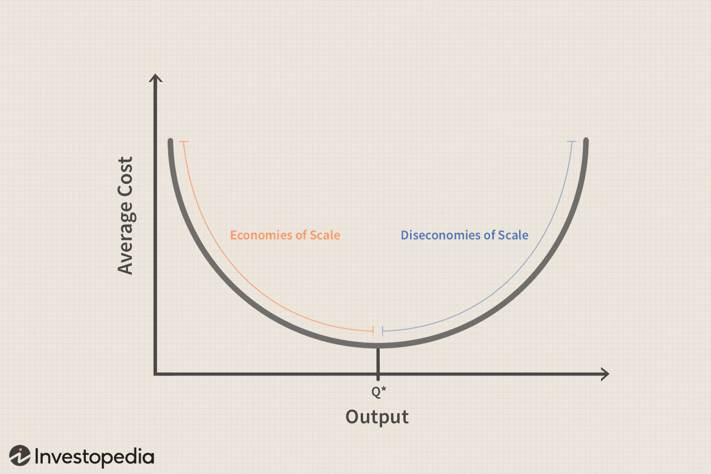

## Table of Contents

## What are diseconomies of scale?

Diseconomies of scale happen when a company gets bigger and it starts to cost more to make each thing they produce. This is the opposite of economies of scale, where bigger companies can make things cheaper. When a company grows too big, it can be hard to manage everything well. There might be too many people working, and they might not talk to each other properly. This can lead to mistakes and wasted time.

Another reason for diseconomies of scale is that big companies might have a lot of rules and layers of bosses. This can slow things down and make it hard to make quick decisions. Also, if a company is too big, it might not be able to change quickly if the market changes. This can make the company less efficient and more expensive to run. So, while getting bigger can help a company save money at first, growing too much can lead to higher costs and less efficiency.

## How do diseconomies of scale differ from economies of scale?

Economies of scale and diseconomies of scale are two opposite ideas about how the size of a company affects its costs. Economies of scale happen when a company gets bigger and it can make things cheaper. This is because they can buy things in bulk, use their machines more, and spread out their fixed costs over more products. For example, a big factory can make a lot of cars and each car costs less to make than if a small factory made them.

Diseconomies of scale, on the other hand, happen when a company gets too big and it starts to cost more to make each thing. This can happen because the company becomes hard to manage. There might be too many people and they don't communicate well, leading to mistakes and wasted time. Also, a big company might have a lot of rules and layers of bosses, which can slow things down and make it hard to make quick decisions. So, while getting bigger can save money at first, growing too much can lead to higher costs and less efficiency.

## What is the typical point at which diseconomies of scale begin to occur?

The exact point at which diseconomies of scale start to happen can be different for each company. It depends on things like what the company makes, how it is run, and how big it is already. Usually, diseconomies of scale start to show up when a company grows past a certain size where it becomes hard to manage everything well. This might happen when the company gets so big that the people working there start having trouble talking to each other and working together smoothly.

For example, a company might find that when it grows from 100 to 500 employees, things start to get more complicated. At this point, the company might need more managers and more rules to keep everything in order. But these extra managers and rules can make things slower and more expensive. So, the company needs to find the right balance between getting big enough to save money and not getting so big that it starts to cost more to make each thing.

## Can you explain the concept of diminishing returns in relation to diseconomies of scale?

Diminishing returns and diseconomies of scale are related because they both talk about how adding more resources doesn't always help as much as you might think. Diminishing returns happen when you keep adding more of something, like workers or machines, but you don't get as much extra output as before. For example, if you have a small factory and you add one more worker, you might make a lot more products. But if you keep adding workers, after a while, each new worker won't help as much because there's only so much space and machines to work with.

Diseconomies of scale can start to happen because of diminishing returns. When a company gets bigger, it might add more workers and machines to make more products. But if the company gets too big, the extra workers and machines might not help as much as they should. The factory might get crowded, and it might be hard for everyone to work together well. This can lead to higher costs for the company because they're not getting as much extra output as they hoped for when they got bigger. So, diminishing returns can be one reason why a company starts to see diseconomies of scale as it grows.

## What are the main causes of diseconomies of scale?

One main cause of diseconomies of scale is poor communication. When a company gets bigger, it can be hard for everyone to talk to each other well. There might be too many people and too many different parts of the company. This can lead to mistakes and wasted time because people don't know what others are doing. If people can't share information easily, the company might make the same product twice or miss important deadlines.

Another cause is too many layers of management. As a company grows, it might need more managers to keep everything in order. But if there are too many managers, it can slow things down. Decisions might take longer because they have to go through many people. This can make the company less efficient and more expensive to run. Also, big companies might have a lot of rules and paperwork, which can make it hard to get things done quickly.

A third cause is lack of flexibility. When a company gets very big, it can be hard to change quickly if the market changes. Big companies might have a lot of fixed costs, like big factories and machines, that they can't change easily. This can make it hard for them to adapt to new trends or customer needs. So, while getting bigger can help a company save money at first, growing too much can lead to higher costs and less efficiency.

## How does organizational structure contribute to diseconomies of scale?

Organizational structure can contribute to diseconomies of scale when a company grows too big and becomes hard to manage. As a company gets bigger, it might add more layers of managers to keep everything in order. But too many managers can make things slower. Decisions might take longer because they have to go through many people. This can make the company less efficient and more expensive to run. Also, big companies might have a lot of rules and paperwork, which can make it hard to get things done quickly.

Another way organizational structure can lead to diseconomies of scale is through poor communication. When a company grows, it can be hard for everyone to talk to each other well. There might be too many people and too many different parts of the company. This can lead to mistakes and wasted time because people don't know what others are doing. If people can't share information easily, the company might make the same product twice or miss important deadlines. So, a big and complex organizational structure can make it hard for a company to stay efficient as it grows.

## What role does communication play in creating diseconomies of scale?

Communication plays a big role in creating diseconomies of scale. When a company gets bigger, it can be hard for everyone to talk to each other well. There might be too many people and too many different parts of the company. This can lead to mistakes and wasted time because people don't know what others are doing. If people can't share information easily, the company might make the same product twice or miss important deadlines.

Poor communication can also make the company less efficient. When people don't talk to each other well, it can take longer to make decisions and get things done. This can make the company more expensive to run because it takes more time and effort to do the same work. So, as a company grows, good communication becomes really important to avoid these problems and keep things running smoothly.

## Can you discuss how increased bureaucracy leads to diseconomies of scale?

Increased bureaucracy can lead to diseconomies of scale when a company grows too big. As a company gets bigger, it might need more rules and more people to manage everything. But too many rules and too many managers can make things slower. It can take longer to make decisions because they have to go through a lot of people. This can make the company less efficient and more expensive to run. When there are too many layers of bosses, it can be hard to get things done quickly.

Bureaucracy can also make it hard for people to talk to each other well. When there are a lot of rules and a lot of different parts of the company, it can be hard for everyone to share information easily. This can lead to mistakes and wasted time because people don't know what others are doing. If the company can't communicate well, it might make the same product twice or miss important deadlines. So, too much bureaucracy can make a big company less efficient and more costly.

## How do coordination challenges affect a company's efficiency as it grows?

As a company grows, coordination challenges can make it less efficient. When a company gets bigger, it can be hard for everyone to work together well. There might be too many people and too many different parts of the company. This can lead to mistakes and wasted time because people don't know what others are doing. If people can't share information easily, the company might make the same product twice or miss important deadlines. This can make the company less efficient and more expensive to run.

Another way coordination challenges affect efficiency is through decision-making. When a company grows, it might need more managers to keep everything in order. But too many managers can slow things down. Decisions might take longer because they have to go through many people. This can make the company less efficient because it takes more time and effort to do the same work. So, as a company grows, good coordination becomes really important to avoid these problems and keep things running smoothly.

## What are some real-world examples of companies experiencing diseconomies of scale?

General Motors (GM) is a good example of a company that has faced diseconomies of scale. As GM grew bigger, it became harder for them to manage everything well. They had a lot of different factories and workers all over the world. This made it hard for them to talk to each other and work together smoothly. Also, GM had a lot of rules and layers of bosses, which slowed things down. They had to spend a lot of money just to keep everything running, and this made it more expensive to make each car.

Another example is Xerox. When Xerox got bigger, they started to have problems with too many managers and too many rules. This made it hard for them to make quick decisions and get things done fast. They also had trouble getting everyone to work together well. As a result, Xerox started to lose money because it was costing them more to make each product. They had to spend a lot of time and money just to fix these problems, which made their business less efficient.

## How can a company measure and identify when it is experiencing diseconomies of scale?

A company can measure and identify diseconomies of scale by looking at its costs and how efficiently it is working. One way to do this is by checking the average cost per unit of what they make. If the company sees that the cost per unit is going up as they get bigger, it might be a sign of diseconomies of scale. They can also look at how long it takes to make decisions and get things done. If it's taking longer and more people are needed to manage things, that could mean the company is getting too big and hard to handle.

Another way is to look at how well different parts of the company are working together. If there are a lot of mistakes or if people are doing the same work twice, it could be because the company is too big and people can't talk to each other well. The company can also ask its workers about their experiences. If a lot of them say it's hard to get things done or that there are too many rules and bosses, that's a good sign that diseconomies of scale are happening. By keeping an eye on these things, a company can figure out if it's getting too big and what it needs to do to fix the problem.

## What strategies can companies implement to mitigate or avoid diseconomies of scale?

Companies can use different strategies to avoid or reduce diseconomies of scale. One way is to keep their organizational structure simple. Instead of adding more layers of bosses and more rules, companies can try to keep things straightforward. This can help them make quick decisions and get things done faster. Another way is to use technology to help people talk to each other better. With good communication tools, everyone can share information easily and work together well, even if the company is big.

Another strategy is to focus on training and teamwork. By teaching workers how to work together and share information, companies can avoid the problems that come with getting bigger. Companies can also try to stay flexible and ready to change. Instead of having a lot of fixed costs, like big factories that are hard to change, companies can use smaller, more flexible setups. This can help them adapt to new trends or customer needs without making things more expensive. By using these strategies, companies can keep growing without running into diseconomies of scale.

## References & Further Reading

[1]: Bergstra, J., Bardenet, R., Bengio, Y., & Kégl, B. (2011). ["Algorithms for Hyper-Parameter Optimization."](https://dl.acm.org/doi/10.5555/2986459.2986743) Advances in Neural Information Processing Systems 24.

[2]: ["Advances in Financial Machine Learning"](https://books.google.com/books/about/Advances_in_Financial_Machine_Learning.html?id=oU9KDwAAQBAJ) by Marcos Lopez de Prado

[3]: ["Evidence-Based Technical Analysis: Applying the Scientific Method and Statistical Inference to Trading Signals"](https://www.amazon.com/Evidence-Based-Technical-Analysis-Scientific-Statistical/dp/0470008741) by David Aronson

[4]: ["Machine Learning for Algorithmic Trading"](https://github.com/stefan-jansen/machine-learning-for-trading) by Stefan Jansen

[5]: ["Quantitative Trading: How to Build Your Own Algorithmic Trading Business"](https://books.google.com/books/about/Quantitative_Trading.html?id=j70yEAAAQBAJ) by Ernest P. Chan