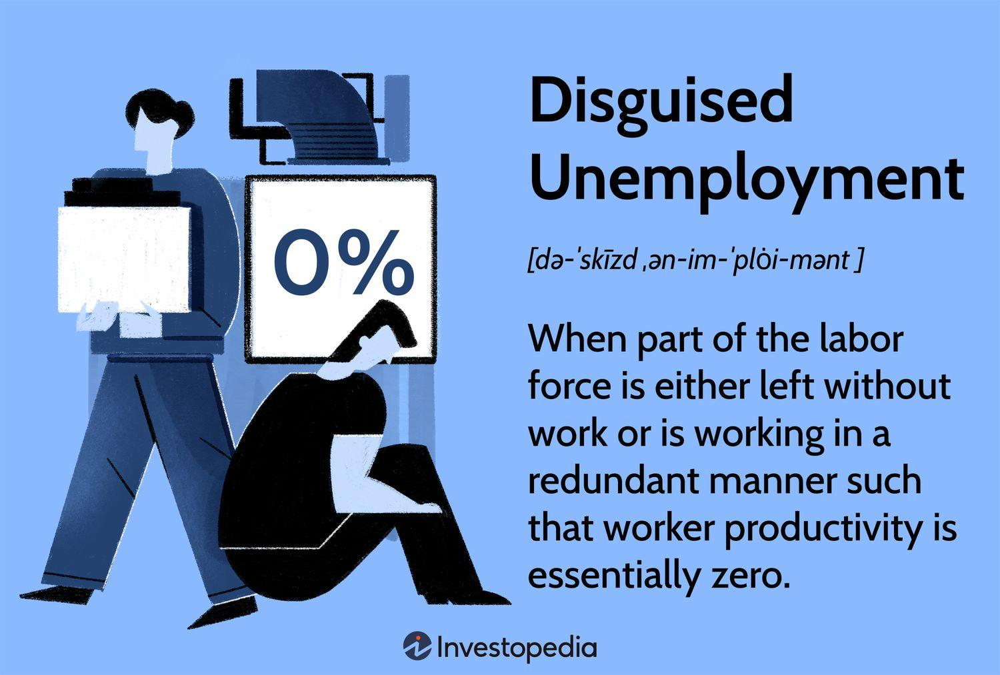

Understanding the dynamics of unemployment is crucial for assessing the overall health of an economy. Unemployment is a significant indicator used to gauge the economic stability and productivity of a nation. However, it is a multifaceted phenomenon, manifesting in various forms that may not always be apparent in conventional unemployment statistics. One such form is disguised unemployment, where individuals appear to be employed but their labor is not utilized effectively, creating distortions in economic data.

Disguised unemployment often goes undetected because it is not reflected in the standard measures of unemployment rates. This can obscure the true economic picture by masking the inefficiencies in labor usage. For instance, sectors such as agriculture in many developing countries employ more workers than necessary, which results in low productivity. This type of unemployment is particularly challenging as it does not immediately suggest the need for policy intervention, yet it can substantially hinder economic growth and development.

This article aims to provide an understanding of the various types of unemployment, including cyclical, structural, frictional, and particularly, disguised unemployment. Each type has distinct causes and implications, affecting how policy measures should be structured to effectively address employment challenges.

Another facet explored is the role of algorithmic trading—commonly referred to as algo trading—in today’s financial markets. Algo trading involves the use of complex algorithms to execute trades at high speeds and volumes, thereby enhancing market efficiency. However, its impact on employment, particularly in trading-related occupations, and its potential to introduce volatility in the stock markets raise important questions about economic stability.

By examining these interconnected areas—types of unemployment, disguised unemployment, and the influence of algo trading—this article underscores the necessity for informed policymaking. Such strategies are essential not only to mitigate the adverse effects of unemployment but also to leverage technological advancements to foster economic growth. Understanding these dynamics helps ensure that economic policies are responsive to the realities of the labor market and financial systems, thereby supporting a more stable and productive economy.

## Table of Contents

## Types of Unemployment

Unemployment is a multifaceted economic condition that can be categorized into several distinct types based on underlying causes and characteristics. These types are critical for understanding and addressing employment challenges effectively. 

**Cyclical Unemployment**: This type of unemployment correlates with the business cycle. During periods of economic downturns or recessions, demand for goods and services decreases, leading to a reduction in workforce needs. As the economy recovers and demand picks up, re-employment occurs. Cyclical unemployment is therefore temporary and fluctuates with the economic cycle.

**Structural Unemployment**: Structural unemployment results from a mismatch between the skills that workers offer and the skills needed by employers. Technological advancements or changes in consumer preferences can render certain skills obsolete, leading to long-term unemployment unless workers retrain or upskill. For instance, automation in manufacturing can lead to structural unemployment for workers whose roles are replaced by machines.

**Frictional Unemployment**: Frictional unemployment involves short-term joblessness as individuals transition between jobs, careers, or locations. It is usually voluntary and temporary, reflecting the time taken for individuals to find a role that matches their skills and preferences. This form of unemployment is often considered a sign of a dynamic labor market rather than a negative economic factor.

**Disguised Unemployment**: Unlike the more observable forms, disguised unemployment occurs when an individual appears to be employed but is underutilized, contributing less to aggregate output than their employment status implies. This is common in agricultural or labor-intensive sectors where too many workers share the same tasks that fewer workers could complete more efficiently. Disguised unemployment does not directly affect unemployment statistics but indicates inefficiency in labor usage.

Understanding these various types aids policymakers in formulating targeted solutions. Strategies can include fiscal policies to address cyclical unemployment, workforce development programs for structural unemployment, and support mechanisms for frictionally unemployed individuals. Recognizing disguised unemployment helps in redirecting human resources towards more productive sectors, ultimately contributing to economic growth and stability.

## Understanding Disguised Unemployment

Disguised unemployment is a form of unemployment that occurs when a segment of the labor force appears to be employed but is not optimally utilized. This situation often prevails in sectors like agriculture, where productivity and labor allocation do not match the potential output. In these scenarios, employment may be more of a social role rather than an economic necessity, as the labor performed by the extra workers does not contribute effectively to the overall production level.

Typically, disguised unemployment remains hidden in conventional unemployment [statistics](/wiki/bayesian-statistics) because individuals who are technically 'employed' are not producing at their full capacity or are engaged in tasks that yield minimal economic benefit. For instance, on a family farm, several family members might contribute to work that could be completed by fewer hands without impacting the agricultural output. Here, the surplus labor does not enhance production, leading to inefficiencies.

This inefficiency is significant because it results in a lower aggregate output without influencing reported unemployment rates. For example, consider a rural farm where 10 workers are employed, but only 5 are needed for optimal productivity. The remaining 5 are technically employed but are not contributing to increased output. From a statistical perspective, these workers are not unemployed, but their presence does not translate into equivalent economic productivity, thus concealing the true nature of the labor market's inefficiencies.

Mathematically, this can be expressed as a situation where the marginal productivity of labor (MPL) is zero or negligible. In economic terms:

$$
\text{MPL} = \frac{\Delta Q}{\Delta L}
$$

where $\Delta Q$ is the change in output and $\Delta L$ is the change in labor. In cases of disguised unemployment, $\Delta Q$ is zero despite changes in $\Delta L$, meaning additional workers do not alter output levels, showcasing redundancy in the workforce.

Understanding disguised unemployment is critical for policymakers, as its presence can mislead employment data analysis, consequently affecting decisions related to labor market interventions and economic planning. Efficiently identifying and addressing disguised unemployment requires strategies that promote optimal labor utilization, ensuring that employment figures accurately reflect economic productivity.

## Impact of Disguised Unemployment on the Economy

Disguised unemployment poses significant challenges to economic productivity and growth, primarily due to the misallocation of labor resources. When more workers are employed than necessary, particularly in sectors such as agriculture or certain service industries, the excess labor does not contribute to increasing output. This inefficiency results in stagnant or declining productivity rates since the workforce is not utilized in capacities that maximize economic output. As disguised unemployment typically goes unnoticed in standard unemployment metrics, it can result in overestimated employment levels, misleading policymakers and skewing economic assessments.

For example, in a scenario where a farm requires only five workers to operate efficiently but employs ten, the additional five workers are effectively underutilized. This overstaffing does not stimulate further growth or output, instead burdening the economic framework with inefficiency. This scenario can be expanded to a mathematical model to further understand the impact on productivity:

$$
\text{Actual Productivity} = \frac{\text{Output}}{\text{Employed Workers}}
$$

In cases of disguised unemployment, this formula yields a lower value for Actual Productivity compared to potential productivity, as the output remains unchanged despite the higher count of employed workers.

Moreover, the presence of disguised unemployment can obscure the effectiveness of policy interventions aimed at improving employment rates. Policies crafted to reduce unemployment might not address the inefficiency in labor use, thus failing to boost economic growth. For instance, labor market interventions focusing solely on job creation without regard for productivity may inadvertently mask the true extent of ineffective labor deployment.

Identifying and addressing disguised unemployment is critical for crafting accurate and effective employment policies. Strategies need to include improving labor market efficiency, such as retraining workers for more productive roles or transitioning excess labor to sectors with higher demand. Such interventions can help bridge the productivity gap caused by disguised unemployment and support sustainable economic development.

## Algorithmic Trading and Economic Efficiency

Algorithmic trading, or algo trading, utilizes sophisticated computer algorithms to execute market trading orders at high speed and [volume](/wiki/volume-trading-strategy). This method automates the trading process, leveraging historical data, analytical models, and market trends to make rapid decisions. By optimizing the timing, price, and volume of trades, algo trading enhances market efficiency by reducing the bid-ask spread and providing [liquidity](/wiki/liquidity-risk-premium). These algorithms can operate on various strategies, including [arbitrage](/wiki/arbitrage), [trend following](/wiki/trend-following), and [market making](/wiki/market-making).

The introduction of [algorithmic trading](/wiki/algorithmic-trading) has profoundly impacted the financial markets. It allows for the execution of complex trading decisions in milliseconds, thereby increasing the accuracy and effectiveness of trades. As a result, algo trading plays a crucial role in price discovery and helps narrow efficiency gaps by quickly correcting price deviations.

However, the inevitability of high-frequency trading ([HFT](/wiki/high-frequency-trading-strategies)), a subset of algo trading, has led to significant shifts in trading-related occupations. HFT requires minimal human intervention, which has impacted employment in traditional trading roles. Traders who once relied on manual analysis and execution have faced challenges adapting to an algo-dominated ecosystem. While some roles have been eliminated, new jobs that focus on the development, regulation, and maintenance of algorithmic systems have emerged.

Furthermore, the rapid evolution of algo trading has also influenced stock [volatility](/wiki/volatility-trading-strategies). By enabling quick responses to market stimuli, it can either stabilize or exacerbate market movements. Automated strategies that execute large volumes simultaneously may lead to flash crashes, where abrupt market dives occur due to a lack of human oversight.

In conclusion, algorithmic trading fundamentally restructures the financial landscape by providing faster, more precise trade executions that contribute to market liquidity and efficiency. Meanwhile, it continues to reshape job profiles in the financial sector, indicating a shift toward technological adeptness as a requisite skill. The balance between the benefits of enhanced market operations and the potential disruptions in employment and market stability remains a pivotal focus for policymakers and market participants.

## Policy Implications

Addressing disguised unemployment requires strategic policy interventions tailored to enhance labor efficiency. One of the primary approaches is to focus on education and skill development. By equipping the workforce with relevant and up-to-date skills, policymakers can ensure that labor is more effectively utilized, reducing the prevalence of underemployment in sectors where it is common, such as agriculture. Initiatives such as vocational training programs and continuous education opportunities can help workers transition to roles that optimize their skills.

Labor market reforms play a critical role in addressing disguised unemployment. These reforms may include policies aimed at improving job matching processes and enhancing labor mobility. Removing bureaucratic hurdles that impede job transitions, and providing incentives for industries to expand job opportunities, can help in redistributing labor more efficiently, ensuring that supply meets demand in a balanced manner.

In parallel, the regulation of algorithmic trading is essential to ensure that it contributes positively to economic stability. Algorithmic trading, when left unchecked, can lead to market volatility and disproportionate impacts on employment in finance-related sectors. Thus, implementing robust regulatory frameworks that include monitoring system stability, enforcing stringent data usage policies, and ensuring transparency in algorithmic operations are vital. These measures not only preserve market integrity but also maintain employment levels by preventing disruptive trading practices.

The strategic integration of educational advancements, labor market reforms, and transparent regulation of algorithmic trading can significantly mitigate the adverse impacts of disguised unemployment and promote a more stable economic ecosystem.

## Conclusion

Understanding the various types of unemployment, particularly disguised unemployment, is essential for thorough economic analysis. Disguised unemployment, often unnoticed in official statistics, presents a significant challenge as it indicates inefficient labor utilization, thus affecting both productivity and economic growth. Recognizing and addressing these dynamics allows for more accurate economic assessments and informed policy decisions.

The integration of algorithmic trading in financial markets has introduced another layer of complexity to employment and economic dynamics. Algorithmic trading, which relies on computer algorithms for high-frequency transactions, has reshaped the landscape of financial markets. While it enhances market efficiency by enabling more nuanced and speedy trades, it also impacts employment, particularly in trading-related vocations. The automation of trade functions can lead to job displacement, particularly for those in positions that are easily automated.

Strategic policymaking is crucial to counteract the adverse effects of various unemployment types and to harness technological advances offered by algorithmic trading. For instance, targeted policies could focus on retraining programs and skill development to prepare the workforce for changes in employment patterns caused by automation. Furthermore, regulations around algorithmic trading should be crafted to maintain market stability and prevent economic disruptions. This approach ensures that technological progress contributes positively to economic stability and growth. By understanding and addressing these complex economic variables, policymakers can better navigate the challenges of modern economies and facilitate sustainable development.

## References & Further Reading

[1]: Sen, A. (1975). ["Employment, Technology and Development: A Study Prepared for the International Labour Office within the Framework of the World Employment Programme."](https://openlibrary.org/books/OL5243949M/Employment_technology_and_development) Oxford University Press.

[2]: Harris, J. R., & Todaro, M. P. (1970). ["Migration, Unemployment and Development: A Two-Sector Analysis."](https://www.aeaweb.org/aer/top20/60.1.126-142.pdf) The American Economic Review, 60(1), 126-142.

[3]: Duflo, E., & Banerjee, A. (2011). ["Poor Economics: A Radical Rethinking of the Way to Fight Global Poverty."](https://onlinelibrary.wiley.com/doi/abs/10.1111/j.1728-4457.2011.00462.x) PublicAffairs.

[4]: Hyman, D. (2013). ["Economics."](https://www.goodreads.com/book/show/3700726-economics) Cengage Learning, Chapter on Unemployment.

[5]: Hull, J. C. (2018). ["Options, Futures, and Other Derivatives."](https://www.semanticscholar.org/paper/Options%2C-Futures%2C-and-Other-Derivatives-Hull/89bdee500c8623864fc9eb7a471546aa713acc44) Pearson. 

[6]: Knight, F. H. (1921). ["Risk, Uncertainty and Profit."](https://archive.org/details/riskuncertaintyp00knigrich) Hart, Schaffner & Marx; Houghton Mifflin Co.

[7]: Lopez de Prado, M. (2018). ["Advances in Financial Machine Learning."](https://books.google.com/books/about/Advances_in_Financial_Machine_Learning.html?id=oU9KDwAAQBAJ) Wiley.

[8]: Chan, E. P. (2009). ["Quantitative Trading: How to Build Your Own Algorithmic Trading Business."](https://github.com/ftvision/quant_trading_echan_book) Wiley.