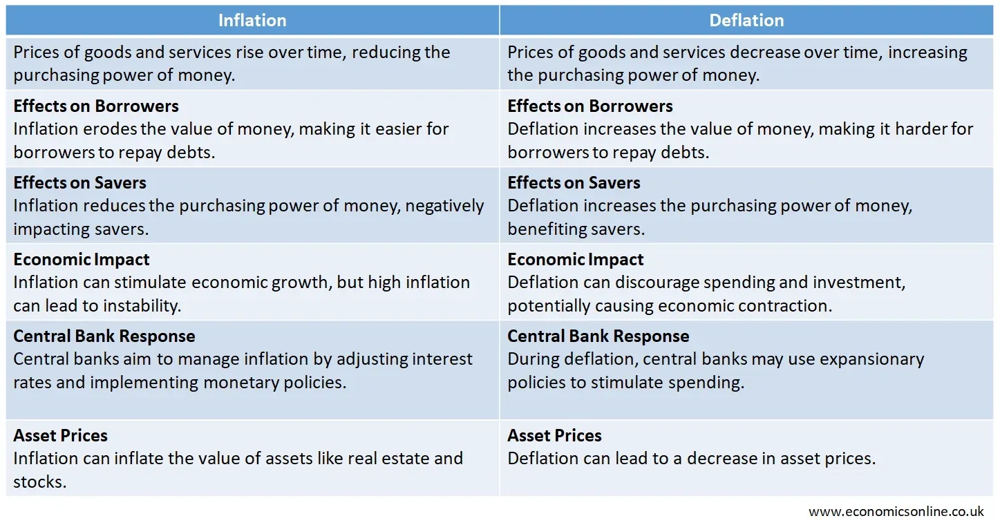

## Table of Contents

## What is disinflation?

Disinflation is when the rate of inflation slows down over time. This means that prices are still going up, but they are not increasing as quickly as before. For example, if last year prices went up by 5% and this year they only go up by 3%, that's disinflation.

Disinflation is different from deflation, which is when prices actually start to go down. Disinflation can be a good sign for an economy because it shows that inflation is being controlled. However, if it goes too far, it might lead to slower economic growth because people might delay buying things if they think prices will keep getting lower.

## How is disinflation different from deflation?

Disinflation and deflation might sound similar, but they are different. Disinflation happens when the rate at which prices go up gets slower. Imagine last year prices went up by 5%, but this year they only go up by 3%. That's disinflation. Prices are still going up, just not as fast as before.

Deflation, on the other hand, is when prices actually start to go down. Instead of things getting more expensive, they get cheaper over time. This can happen for many reasons, like less demand for products or too much supply. Deflation can be tricky because people might wait to buy things if they think prices will keep dropping, which can slow down the economy.

Both disinflation and deflation affect the economy, but in different ways. Disinflation can be a good sign if it means inflation is under control. But if disinflation keeps going and turns into deflation, it could cause problems because people might stop spending, hoping prices will fall even more.

## What are the common causes of disinflation?

Disinflation often happens because of changes in the economy. One big reason is when central banks, like the Federal Reserve, decide to raise interest rates. When interest rates go up, borrowing money becomes more expensive. This can make businesses and people spend less, which slows down how fast prices go up. Another reason can be a drop in demand for goods and services. If people are buying less, businesses might not raise their prices as much, leading to disinflation.

Another cause of disinflation can be an increase in the supply of goods. If there are more products available than people want to buy, companies might not increase their prices as quickly. This can happen if technology improves and makes it easier to produce things, or if global trade brings in more goods. Governments can also play a role by introducing policies that control how fast prices rise, like setting price controls or subsidies.

Overall, disinflation is influenced by a mix of these factors. It's about the balance between what people want to buy, how much it costs to borrow money, and how much stuff is available. When these things shift, the speed at which prices go up can slow down, leading to disinflation.

## Can you explain the role of monetary policy in causing disinflation?

Monetary policy, which is managed by central banks like the Federal Reserve, plays a big role in causing disinflation. One way they do this is by raising interest rates. When interest rates go up, it costs more for people and businesses to borrow money. This makes them spend less because borrowing is more expensive. When spending slows down, businesses don't raise their prices as quickly, which leads to disinflation.

Central banks can also use other tools to control how fast prices go up. For example, they might sell government bonds to take money out of the economy. When there's less money around, people and businesses have less to spend, which can slow down how fast prices rise. By carefully adjusting these tools, central banks can help manage inflation and guide the economy towards disinflation, making sure prices don't go up too fast.

## How does fiscal policy influence disinflation?

Fiscal policy, which is about how the government spends and taxes, can also help cause disinflation. When the government decides to spend less money, it can slow down the economy. If the government is not spending as much, businesses might not get as many orders, and they might not raise their prices as quickly. Also, if the government raises taxes, people have less money to spend. When people spend less, businesses don't need to increase their prices as fast, which can lead to disinflation.

Another way fiscal policy can influence disinflation is through subsidies and price controls. If the government gives money to businesses to help them keep prices low, it can slow down how fast prices go up. Price controls are when the government sets limits on how much prices can rise. These actions can help keep inflation in check and lead to disinflation. By using these tools, the government can help manage how fast prices increase and guide the economy towards disinflation.

## What economic indicators signal the onset of disinflation?

One of the main signs that disinflation might be starting is when the inflation rate starts to go down. This means that if last year prices went up by 5% but this year they are only going up by 3%, it's a signal of disinflation. People and businesses keep an eye on the Consumer Price Index (CPI) and the Producer Price Index (PPI) to see these changes. If these numbers show that prices are not going up as fast as before, it's a clear sign that disinflation could be happening.

Another thing to watch is how much people are spending. If people start spending less money, it can mean that they expect prices to not go up as fast. This can be seen in retail sales numbers or personal consumption data. When spending slows down, businesses might not raise their prices as quickly, which can lead to disinflation. Also, if the unemployment rate goes up, it can be a sign too, because when more people are out of work, they have less money to spend, which can slow down price increases.

## What are the effects of disinflation on the economy?

Disinflation can be good for the economy in some ways. When prices go up more slowly, it can help people and businesses plan better because they know their money will go further. It can also make the economy feel more stable because big jumps in prices are not happening. This can make people feel more confident about spending and investing, which helps the economy grow. Plus, when inflation is under control, it can make it easier for the government and central banks to manage the economy without having to make big changes.

However, disinflation can also have some downsides. If prices are not going up as fast, businesses might think that people will buy less, so they might cut back on hiring or even lay off workers. This can lead to higher unemployment, which is not good for the economy. Also, if disinflation keeps going and turns into deflation, where prices actually start to go down, it can make people wait to buy things. They might think prices will keep falling, so why buy now? This can slow down the economy because when people spend less, businesses make less money, and the whole economy can suffer.

## How do businesses and consumers typically respond to disinflation?

When disinflation happens, businesses usually start to be more careful. They might not raise their prices as fast because they see that inflation is slowing down. This can be good for them because it helps keep their customers happy. But it can also make them worried. If they think people will buy less because prices are not going up as fast, they might cut back on spending. They might not hire as many new workers or they might even let some go. This is because they want to save money in case things get tougher.

Consumers often feel better when disinflation happens. They see that prices are not going up as fast, so their money can buy more. This can make them feel more confident about spending on things they want or need. But if disinflation goes on for a long time, some people might start to worry. They might think that prices will not go up at all or might even start to go down. This can make them hold off on buying things, waiting for even better deals. If lots of people do this, it can slow down the economy because businesses will sell less.

## Can you provide historical examples of disinflation?

In the 1980s, the United States went through a period of disinflation. This happened after inflation was very high in the late 1970s. The Federal Reserve, led by Paul Volcker, raised interest rates a lot to fight inflation. By doing this, they made borrowing money more expensive, which slowed down spending and helped bring down the rate of inflation. By the mid-1980s, inflation had gone down a lot, showing that disinflation was happening.

Another example of disinflation happened in the early 2000s in the European Union. After the introduction of the Euro in 1999, the European Central Bank worked hard to keep inflation under control. They used monetary policy to make sure prices did not go up too fast. Over the next few years, the rate of inflation in the Eurozone slowed down, leading to a period of disinflation. This helped make the new currency more stable and gave people more confidence in the Euro.

## What are the challenges in managing disinflation?

Managing disinflation can be tricky for central banks and governments. One big challenge is finding the right balance. They want to slow down inflation, but they don't want it to stop completely or turn into deflation. If they raise interest rates too much to control inflation, it might slow down the economy too much. This can make businesses cut back on spending and hiring, which can lead to higher unemployment and less growth. So, they have to be very careful with how they adjust interest rates and other tools to make sure they don't go too far.

Another challenge is dealing with people's expectations. If people think prices will keep going up slowly, they might spend less, waiting for even better deals. This can make disinflation worse because when people spend less, businesses might not raise prices as much. But if disinflation goes on for too long, it can turn into deflation, which can be very bad for the economy. Central banks and governments need to communicate well with the public, letting them know that they are working to keep the economy stable and that prices will not keep going down. This can help keep people spending and keep the economy moving forward.

## How do central banks measure and respond to disinflation?

Central banks use different tools to measure disinflation. They look at the Consumer Price Index (CPI) and the Producer Price Index (PPI) to see how fast prices are going up. If these numbers show that prices are not going up as fast as before, it means disinflation might be happening. Central banks also watch how much people are spending and how many people have jobs. If spending slows down and more people are out of work, it can be another sign of disinflation.

When central banks see signs of disinflation, they have to decide how to respond. They might lower interest rates to make borrowing money cheaper. This can encourage people and businesses to spend more, which can help keep the economy growing. But they have to be careful not to lower rates too much, or it could lead to inflation going up again. Central banks also use other tools, like buying or selling government bonds, to control how much money is in the economy. By doing these things, they try to keep inflation at a level that helps the economy stay stable and grow.

## What are the long-term implications of sustained disinflation on economic growth?

Sustained disinflation can have mixed effects on economic growth over the long term. On one hand, if prices keep going up more slowly, it can help the economy stay stable. People and businesses can plan better because they know their money will go further. This can make them feel more confident about spending and investing, which helps the economy grow. When inflation is under control, it's easier for the government and central banks to manage the economy without making big changes, which can lead to steady growth.

On the other hand, if disinflation goes on for a long time, it can slow down the economy. Businesses might think that people will buy less because prices are not going up as fast, so they might cut back on hiring or even lay off workers. This can lead to higher unemployment, which is bad for growth. If disinflation turns into deflation, where prices actually start to go down, people might wait to buy things, thinking prices will keep falling. This can make the economy slow down because when people spend less, businesses make less money, and the whole economy can suffer.

## References & Further Reading

[1]: Mishkin, F. S. (2012). ["The Economics of Money, Banking and Financial Markets"](https://www.pearsonhighered.com/assets/preface/0/1/3/4/0134855388.pdf). Pearson.

[2]: ["Inflation Targeting as a Framework for Monetary Policy"](https://www.imf.org/external/pubs/ft/issues/issues15/) by Ben S. Bernanke & Frederic S. Mishkin. National Bureau of Economic Research.

[3]: ["The Theory and Practice of Disinflation"](https://www.stlouisfed.org/open-vault/2023/august/explaining-inflation-disinflation-deflation) by Michael Bordo, Christopher Erceg, Andrew Levin. University of Toronto Department of Economics.

[4]: Friedman, B. M., & Kuttner, K. N. (1996). ["A Price Target for U.S. Monetary Policy? Lessons from the Experience with Money Growth Targets"](https://www.brookings.edu/wp-content/uploads/1996/01/1996a_bpea_friedman_kuttner_gertler_tobin.pdf). Brookings Papers on Economic Activity.

[5]: ["Interest and Prices: Foundations of a Theory of Monetary Policy"](https://www.jstor.org/stable/j.ctv30pnvmf) by Michael Woodford. Princeton University Press.