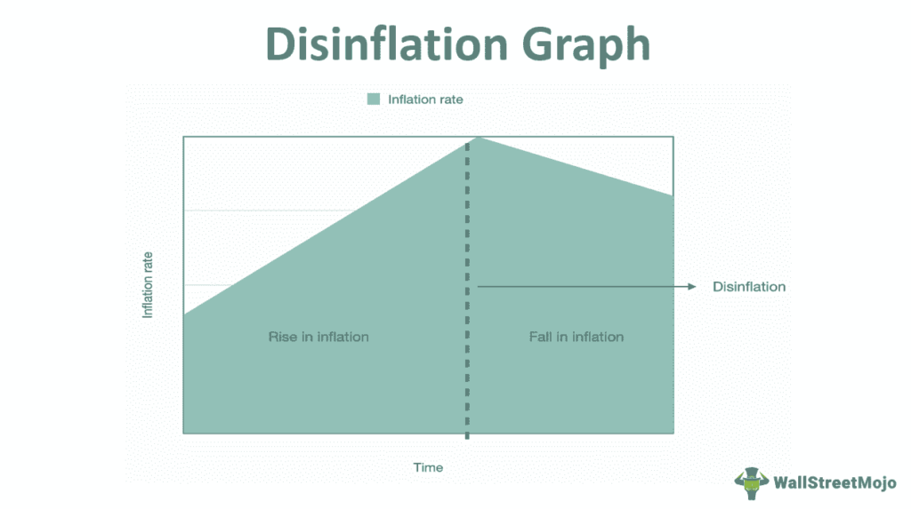

In the intricate dynamics of economics, numerous factors contribute to the fluctuations observed within an economy. Disinflation, a key economic process, is characterized by a reduction in the rate of inflation. Unlike deflation, which involves actual decreases in price levels, disinflation is regarded as beneficial because it indicates a slowdown in inflation without turning negative. This process is critical as it helps maintain economic stability by preventing rapid inflation, thus allowing for sustainable growth without leading to detrimental economic overheating.

This article investigates the economic mechanisms that promote disinflation, the conditions that trigger such phases, and the interactions between disinflation and algorithmic trading systems. Disinflation's role in moderating inflation rates has complex effects on financial markets and trading strategies. With the rise of algorithmic trading, understanding how automated systems interpret economic indicators during disinflationary periods becomes increasingly important.



Algorithmic trading models depend heavily on economic data, including inflation trends, to craft sophisticated trading decisions. These systems can alter their strategies based on their interpretations of disinflation, often shifting preferences towards specific asset classes according to updated inflation forecasts. This capacity to adapt makes analyzing the signals that accompany disinflation crucial for refining trading algorithms. The section will focus on how different elements of the economy interact with disinflation, influencing both macroeconomic policy and investment strategies in financial markets.

## Table of Contents

## Understanding Disinflation

Disinflation signifies a deceleration in the rate of inflation, where the general level of prices continues to rise but at a slower pace than previously observed. This economic phenomenon is distinct from deflation, which refers to a decline in the general price level, ultimately resulting in negative inflation rates. Disinflation is often considered a favorable scenario within an economy as it indicates a controlled slowdown in inflation, avoiding excessive inflationary pressures that could lead to economic instability.

The importance of disinflation lies in its ability to stabilize an economy without leading to negative growth. When inflation rates rise too quickly, it can undermine public confidence and diminish purchasing power, eroding savings and wages. As inflation accelerates, central banks may intervene by implementing monetary policies designed to moderate inflationary pressures. Disinflation, achieved through cautious economic policies, ensures that the economy cools off sustainably, avoiding the pitfalls of both high inflation and deflation.

Disinflation can provide several benefits. Firstly, it allows consumers and businesses time to adjust their expectations and financial strategies in response to changing economic conditions. Secondly, it can foster an environment conducive to long-term investment by reducing uncertainty about future inflation, which in turn can stabilize interest rates. Lastly, disinflation may augment international competitiveness by tempering domestic production costs, potentially boosting exports.

In summary, disinflation is a measured reduction in inflationary [momentum](/wiki/momentum) that prevents an economy from overheating, while still maintaining economic growth and stability. This balanced approach helps safeguard the broader economic framework, ensuring sustainable development and providing policymakers with the flexibility to navigate future inflationary or deflationary pressures effectively.

## Economic Mechanisms of Disinflation

Disinflation results from various economic mechanisms, chiefly linked to monetary policy decisions. Central banks play a pivotal role in orchestrating disinflation through careful adjustments to monetary policy. One primary tool at their disposal is the manipulation of interest rates. By increasing interest rates, central banks can reduce borrowing and spending, effectively slowing down the rate of inflation. This strategy curtails excess demand in the economy, helping to stabilize prices.

Another method involves altering the money supply by engaging in open market operations, such as selling government securities. By doing so, central banks absorb [liquidity](/wiki/liquidity-risk-premium) from the financial system, which constrains spending and investment activities. This decrease in money supply pressure contributes to a lower inflation rate, aiding in the controlled process of disinflation.

Apart from direct monetary interventions, a contraction in the business cycle can also lead to disinflation. During economic slowdowns, businesses often resort to competitive pricing strategies to maintain their market share. When demand weakens, companies may reduce prices to attract customers, indirectly contributing to the slowdown of inflation. This competitive pressure ensures that prices are kept in check, further facilitating a disinflationary environment.

Overall, the concerted efforts of central banks alongside market dynamics contribute to the mechanisms of disinflation, serving to align economic growth with sustainable inflation rates. By understanding these mechanisms, policymakers and stakeholders in financial markets can anticipate and respond to periods of disinflation effectively.

## Triggers and Causes of Disinflation

Disinflation occurs when the rate of inflation slows down over a period, and several triggers and causes contribute to this economic phenomenon. One of the primary drivers is technological advancements, which often lead to increased efficiency and productivity. When businesses become more efficient, they can produce goods at lower costs. These savings are frequently passed on to consumers as lower prices, contributing to disinflationary pressures.

Another significant [factor](/wiki/factor-investing) is a decline in consumer demand. When consumers become cautious about spending, possibly due to economic uncertainty or increasing saving rates, the aggregate demand for goods and services falls. Lower demand pressures businesses to reduce prices or limit price increases, thereby contributing to the slowing of inflation.

Changes in global economic conditions also play a critical role in triggering disinflation. For instance, a global economic slowdown can lead to decreased demand for exports, impacting domestic prices. Similarly, fluctuations in exchange rates can influence import and export prices, thereby affecting domestic inflation rates. For example, if a country's currency appreciates, imported goods become cheaper, which can reduce the overall price level within the country.

Commodity prices, particularly oil and food, are another crucial factor. A significant drop in these prices can lead to disinflation, as they directly affect the prices of a wide range of consumer goods and services. For instance, a decline in oil prices can lower transportation and production costs, which businesses may pass on to consumers.

Increased productivity combined with technological improvements is another substantial cause of disinflation. When productivity rises, the output per unit of input increases, leading to reduced cost per unit of output. Businesses can then offer products at competitive prices without sacrificing margins, contributing to a deceleration in inflation rates.

Understanding these factors is vital for policymakers and traders who must anticipate and react to changes in economic conditions that influence the inflation trajectory.

## Impacts of Disinflation on the Economy

Disinflation, characterized by a decrease in the rate of inflation, can have significant consequences for financial markets and the broader economy. One of the primary impacts is the potential increase in the real value of debt. In an environment where inflation rates slow, the nominal interest rates might not adjust as swiftly, leading to higher real interest rates. Consequently, the burden of existing debt becomes more substantial for borrowers, as their debt repayments maintain their nominal value while the purchasing power of money increases.

Historically, the United States experienced extended periods of disinflation from 1980 to 2015. This era saw significant shifts in market dynamics, with varying effects on stock market performances and [interest rate](/wiki/interest-rate-trading-strategies) adjustments. A notable outcome was the decline in inflation expectations, which affected investment decisions and risk assessments in financial markets. Equities, for example, can react unpredictably to disinflation, as lower inflation might suggest slower economic growth, influencing corporate profit forecasts and stock valuations.

Interest rates, a key lever of monetary policy, often require careful calibration during disinflationary periods. Central banks might be inclined to lower interest rates to stimulate economic activity and prevent deflationary spirals. However, if rates are reduced too rapidly, it could undermine financial stability or trigger speculative investments. Conversely, maintaining higher interest rates could exacerbate debt servicing costs and curb economic growth.

The disinflationary trend also intersects with currency valuations. As inflation rates fall, currencies typically strengthen due to the anticipated increase in purchasing power. A stronger currency, while beneficial for importers, can pose challenges for exporters by making goods and services less competitive globally. This scenario impacts trade balances and might necessitate adjustments in monetary policy to stabilize exchange rates.

Furthermore, disinflation influences consumer and business confidence. While lower inflation aligns with stable price expectations, it might also signal a lack of demand or economic stagnation. Both consumers and businesses may defer spending and investment, awaiting clearer economic signals or more favorable financial conditions.

In summary, while disinflation can alleviate inflationary pressures, it introduces complexities to economic frameworks, affecting debt dynamics, financial markets, and policy decisions. The nuanced balance between fostering growth and maintaining price stability requires strategic oversight from policymakers and market participants alike.

## Algorithmic Trading and Disinflation

Algorithmic trading systems rely on the interpretation of economic data to make trading decisions that are both rapid and informed. During periods of disinflation, these models must adjust their predictions and strategies to align with the evolving economic environment. Typically, disinflation induces a change in expected returns and [volatility](/wiki/volatility-trading-strategies), prompting [algorithmic trading](/wiki/algorithmic-trading) systems to favor certain asset classes over others.

Disinflation, characterized by a slowdown in the rate of inflation, influences the pricing dynamics of various asset classes. In these periods, algorithmic models often recalibrate their strategies based on inflation forecasts, which can affect interest rates, bond yields, and equity valuations. For instance, a declining inflation rate might lead to expectations of stable or falling interest rates, making fixed-income investments more attractive. Algorithmic systems might increase allocations to bonds, anticipating higher real returns as future cash flows hold more purchasing power in a low-inflation environment.

The relationship between disinflation and market signals is integral for refining trading algorithms. Machine learning and statistical models are commonly employed to detect patterns and anomalies in economic data, such as inflation rates, gross domestic product (GDP) growth, and employment figures. These insights are translated into actionable trading signals. Here is a simple example using Python to illustrate how an algorithm might process inflation data to adjust trading strategies:

```python
import numpy as np
import pandas as pd
from sklearn.linear_model import LinearRegression

# Sample inflation data over time
inflation_data = pd.DataFrame({
    'year': np.arange(2000, 2021),
    'inflation_rate': [3.5, 3.0, 2.8, 2.5, 2.3, 2.1, 1.9, 2.0, 3.0, 4.0, 
                       3.2, 2.5, 2.1, 1.5, 1.3, 1.6, 2.0, 1.7, 1.5, 1.8, 2.0]
})

# Predict future inflation
X = inflation_data[['year']]
y = inflation_data['inflation_rate']
model = LinearRegression().fit(X, y)
future_year = np.array([[2025]])
predicted_inflation = model.predict(future_year)

print(f"Predicted inflation for 2025: {predicted_inflation[0]:.2f}%")
```

This snippet uses historical inflation data to forecast future inflation, a crucial step in adjusting trading strategies. A low predicted inflation rate might signal a shift toward investing in assets that benefit from stable purchasing power, such as government bonds or dividend-paying stocks.

Overall, understanding the nuanced impact of disinflation on economic indicators is essential for algo traders. By integrating economic insights into automated trading models, traders can deploy strategies that effectively capitalize on the subtleties of disinflationary periods. Robust algorithms that incorporate these factors provide traders with a competitive edge in financial markets.

## Conclusion

Disinflation represents a critical phase in economics requiring meticulous scrutiny and strategic initiatives across policymaking and financial markets. By moderating the upward pressure on prices, disinflation provides an essential balance that economies need to grow sustainably without triggering the adverse effects of high inflation or falling into deflation.

As algorithmic trading systems become more dominant in financial markets, deciphering the nuances of disinflation becomes increasingly vital for traders. These systems depend heavily on real-time data analysis to execute trades autonomously. Therefore, understanding how disinflation alters market dynamics enables algorithmic traders to refine models for better predictive accuracy, thus gaining a competitive edge.

Integrating thorough economic insights into trading strategies and policy decisions can significantly enhance the ability of traders and policymakers alike to manage the complexities posed by disinflation. Such integration allows for a more informed approach to exploiting the inherent opportunities while mitigating the risks associated with this economic phase. Thus, staying informed and adaptable to disinflation trends is crucial for sustaining economic vitality and achieving strategic financial goals.

## References & Further Reading

[1]: Mishkin, F. S. (2012). ["The Economics of Money, Banking and Financial Markets"](https://www.pearsonhighered.com/assets/preface/0/1/3/4/0134855388.pdf). Pearson.

[2]: ["Inflation Targeting as a Framework for Monetary Policy"](https://www.imf.org/external/pubs/ft/issues/issues15/) by Ben S. Bernanke & Frederic S. Mishkin. National Bureau of Economic Research.

[3]: ["The Theory and Practice of Disinflation"](https://www.stlouisfed.org/open-vault/2023/august/explaining-inflation-disinflation-deflation) by Michael Bordo, Christopher Erceg, Andrew Levin. University of Toronto Department of Economics.

[4]: Friedman, B. M., & Kuttner, K. N. (1996). ["A Price Target for U.S. Monetary Policy? Lessons from the Experience with Money Growth Targets"](https://www.brookings.edu/wp-content/uploads/1996/01/1996a_bpea_friedman_kuttner_gertler_tobin.pdf). Brookings Papers on Economic Activity.

[5]: ["Interest and Prices: Foundations of a Theory of Monetary Policy"](https://www.jstor.org/stable/j.ctv30pnvmf) by Michael Woodford. Princeton University Press.