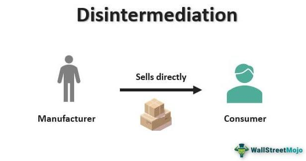

Disintermediation has emerged as a significant force transforming various sectors by eliminating the necessity for intermediaries in transactions. This transformation is particularly evident in the financial industry, where disintermediation has revolutionized how producers and consumers connect directly, thereby reducing costs and enhancing efficiency. By removing traditional middlemen such as brokers and banks, both individuals and businesses can engage in more streamlined and cost-effective transactions.

The advent of technological advancements like algorithmic trading and cryptocurrencies has further accelerated this trend. Algorithmic trading employs sophisticated computer algorithms to execute trades at high frequencies and speeds, transcending human capabilities and bypassing the need for conventional trading roles. Similarly, cryptocurrencies utilize blockchain technology to facilitate peer-to-peer transactions without involving traditional financial institutions. These technologies exemplify disintermediation by enabling direct market access and enhancing transactional speed.

This article provides a comprehensive exploration of the concept of disintermediation, particularly within the financial sector. It further investigates various real-world examples, demonstrating the wide-ranging impact of this transformative trend on different industries. Understanding the implications of disintermediation is crucial, as it continues to reshape business models and redefine interactions between consumers and producers in an ever-evolving marketplace.

## Table of Contents

## Understanding Disintermediation

Disintermediation refers to the process of removing intermediaries, such as brokers or financial institutions, from transactions, allowing for direct interaction between buyers and sellers. This approach aims to enhance efficiency and cut costs, fundamentally altering how transactions are conducted.

At its core, disintermediation removes third-party involvement in financial activities, facilitating more direct and immediate interactions between parties. For example, in traditional finance, banks and brokers often serve as middlemen in transactions, offering services like trade execution or loan facilitation in exchange for fees. These intermediaries can add complexity and cost to transactions, which disintermediation seeks to eliminate by enabling direct transactions.

In practice, disintermediation leverages technology to achieve these ends. Automation and digital platforms have become essential tools, reducing the need for physical intermediaries. For instance, online platforms and financial technologies allow consumers to purchase products or invest without the need for a traditional broker or financial advisor. This not only saves consumers money by eliminating commission fees but also speeds up the transaction process.

For businesses, disintermediation can lead to significant operational benefits. By directly connecting with consumers, companies can foster stronger relationships and better understand customer needs, leading to more targeted and effective product offerings. The direct feedback loop can also drive innovation and responsiveness in product development, enhancing competitive advantage.

However, while disintermediation presents opportunities for cost-saving and efficiency, it also poses potential challenges. These include increased responsibility for handling transactions securely and the need for robust technological infrastructure. This is especially pertinent as businesses and consumers assume roles traditionally managed by intermediaries, who typically provide additional layers of oversight and security.

In conclusion, disintermediation represents a fundamental shift in the way transactions are executed. By removing intermediaries, it promises to simplify interactions, reduce costs, and empower both businesses and consumers. The ongoing development and application of technology will continue to drive this transition, reshaping financial landscapes and business models.

## Financial Examples of Disintermediation

Algorithmic trading has significantly transformed the financial landscape by automating the trading process and thus eliminating the need for human brokers. This form of trading involves using complex algorithms that execute trades at speeds and frequencies far superior to human capabilities. Algorithmic trading utilizes mathematical models and formulas to make swift decisions in response to market conditions, allowing for the execution of a high [volume](/wiki/volume-trading-strategy) of trades with precision and efficiency. The replacement of intermediaries by these algorithms not only reduces transaction costs but also increases trading speed, making the market more efficient and providing investors with better opportunities for profit.

Cryptocurrencies have further propelled the concept of disintermediation in finance. Built on blockchain technology, cryptocurrencies facilitate peer-to-peer transactions without requiring traditional financial institutions such as banks or payment processors. Blockchain's decentralized nature ensures transparency and security, allowing individuals to execute transactions directly with one another. This model removes the need for third-party verification and reduces transaction fees, making financial processes more streamlined and accessible. Bitcoin, Ethereum, and other cryptocurrencies continue to challenge the conventional banking system by offering an alternative that is both secure and efficient.

Peer-to-peer (P2P) lending platforms exemplify another financial sector significantly impacted by disintermediation. Platforms such as LendingClub and Prosper connect borrowers directly with lenders, bypassing traditional banking institutions. This connection allows lenders to earn higher returns compared to traditional savings accounts, while borrowers may benefit from lower interest rates than those offered by banks. Additionally, P2P lending platforms utilize advanced credit models to assess borrower risk, making the lending process efficient and data-driven. By reducing the dependency on traditional banks, P2P lending democratizes the lending market and provides more individuals with access to credit.

These examples illustrate the broad impact of disintermediation across various financial services. By removing intermediaries and leveraging technology, these innovations improve market efficiency, reduce costs, and empower consumers with more direct access to financial markets and services.

## The Role of Algorithmic Trading

Algorithmic trading utilizes computer algorithms to execute trades at speeds and frequencies far beyond the capabilities of human traders. These algorithms are designed according to predetermined criteria, allowing them to analyze market conditions and react within milliseconds—a response time that traditional trading methods simply cannot match. This rapid execution is made possible by computer programs that can receive, process, and act upon vast amounts of financial data from various markets almost instantaneously.

Algorithmic trading facilitates disintermediation by directly connecting traders to the markets, thereby removing traditional roles often filled by brokers. In conventional trading, brokers act as intermediaries, matching buy and sell orders and often requiring manual intervention and decision-making. However, through [algorithmic trading](/wiki/algorithmic-trading), traders can automatically execute strategies based on quantitative analysis, reducing reliance on human judgment and intermediate brokers. This streamlines the process, enhances [liquidity](/wiki/liquidity-risk-premium), and significantly lowers transaction costs.

The algorithms can range from simple sets of rules to complex mathematical models that leverage [machine learning](/wiki/machine-learning) and [artificial intelligence](/wiki/ai-artificial-intelligence) for dynamic decision-making. For example, a basic algorithm may simply follow a moving average strategy, such as buying a stock when its short-term moving average crosses above its long-term moving average and selling when the reverse occurs. On the other hand, more advanced algorithms might incorporate sentiment analysis, factoring in qualitative data like news headlines alongside quantitative metrics.

Furthermore, algorithmic trading systems often exploit [arbitrage](/wiki/arbitrage) opportunities by executing trades across multiple markets faster than those relying on human intervention. This ability to capitalize on fleeting price discrepancies further illustrates how these systems diminish the roles previously played by human intermediaries and enhance market efficiency.

While algorithmic trading offers substantial benefits in terms of speed and cost-effectiveness, it also poses challenges, such as increased market [volatility](/wiki/volatility-trading-strategies) and the potential for systemic risks due to errors in algorithm design. Regulating such technology, ensuring fair access, and maintaining market integrity become critical to balance the benefits associated with disintermediation in financial markets. Nevertheless, as technology continues to evolve, algorithmic trading remains a pivotal force in reshaping how trades are conducted directly on markets without traditional intermediaries.

## Disintermediation and the Internet

The internet has significantly accelerated disintermediation, affecting how goods and services are distributed by reducing or eliminating the need for traditional intermediaries. This transformation has allowed producers to connect directly with consumers, often offering more competitive pricing due to reduced overhead costs typically associated with middlemen.

Online platforms like Amazon and eBay exemplify how internet-driven models can bypass traditional retail pathways. These platforms, while serving as new forms of intermediaries, facilitate direct sales between sellers and buyers. For example, small businesses and individual sellers can utilize Amazon's vast infrastructure to reach a global customer base without having to invest in physical storefronts. Similarly, eBay provides a marketplace that accommodates both new and used goods, enabling peer-to-peer transactions that would otherwise require brick-and-mortar consignment stores or classified ads.

The reshaping of supply chains through internet-driven disintermediation has a profound impact on traditional business models. Retail businesses that once relied heavily on physical stores and in-person customer interactions are increasingly adopting online strategies to compete. This shift is evident in the growth of direct-to-consumer (DTC) brands, which forego traditional retail channels in favor of selling exclusively through their own online platforms. This model enables companies to retain greater control over their brand and customer experience while capturing more value by avoiding retailer markups.

Internet disintermediation also affects pricing strategies and consumer expectations. With easier access to a broader range of products, consumers are empowered to compare prices and seek the best deals, increasing competitive pressure on sellers. In response, businesses are adopting dynamic pricing models and leveraging data analytics to better understand market trends and consumer behavior, enabling more informed pricing and inventory decisions.

In conclusion, the internet's role in disintermediation involves transforming the way businesses operate, with significant effects on supply chains and traditional business strategies. As more sectors embrace online models, the continued evolution of internet-driven disintermediation will likely introduce both opportunities and challenges for producers and consumers alike.

## Impact of Disintermediation on Financial Markets

Disintermediation in financial markets primarily aims to reduce costs and enhance transaction speed by eliminating intermediaries. However, this transformative process is not without its complications. A key challenge lies in regulatory oversight. Traditional intermediaries, such as banks and brokers, often play roles in ensuring compliance with financial regulations. When these players are removed, regulatory gaps may emerge, necessitating new frameworks to maintain market integrity and protect investors.

Additionally, disintermediation can lead to increased market fragmentation. As direct transactions bypass traditional structures, data and liquidity become dispersed across numerous platforms and markets. This [dispersion](/wiki/dispersion-trading) complicates market monitoring and trend analysis, introducing inefficiencies that can counter the benefits of cost reduction and speed.

Technological risks also pose significant concerns. Disintermediated systems are heavily reliant on technology, and this creates vulnerabilities. System failures or cybersecurity threats can jeopardize the stability of markets, potentially leading to substantial financial losses. Given the reliance on digital infrastructures, ensuring cybersecurity and system robustness is critical.

Balancing innovation with effective regulation is essential for sustaining the benefits of disintermediation. Innovation drives efficiency and growth but must be tempered with regulations that safeguard against risks. Hence, regulatory bodies need to adapt, designing frameworks that both encourage technological advancement and provide rigorous oversight to prevent systemic risks. This equilibrium is crucial for fostering a secure and efficient financial environment where innovation and investor protection coexist harmoniously.

## Real-World Case Studies

Disintermediation has been significantly marked by the rise of platforms that streamline access between service providers and consumers. One prominent example is Robinhood, a financial services company that has revolutionized the brokerage industry. It allows individual investors to engage in commission-free trading, directly accessing real-time market data and executing transactions without traditional brokerage fees. This direct market access model has democratized trading, enabling a broader audience to participate in stock markets. Robinhood's platform underscores the shift towards user-friendly interfaces that remove the barriers historically associated with stock trading, thereby fostering an inclusive investment environment.

Similarly, the travel industry has undergone transformation through the advent of online platforms like Expedia. Traditionally, travel arrangements required intermediaries such as travel [agents](/wiki/agents), entailing higher costs and processing times. With Expedia, consumers can directly compare prices, book flights, hotels, and other travel-related services at their convenience. This shift has empowered users with more control over their travel plans, increased price transparency, and enhanced the overall customer experience. The role of traditional travel agencies has diminished, highlighting the efficacy of digital platforms in providing comprehensive service options swiftly and efficiently.

These examples emphasize the broad applicability of disintermediation across sectors, showcasing its potential to streamline operations, reduce costs, and empower consumers. By eliminating unnecessary intermediaries, industries can adapt to consumer needs more rapidly and efficiently, providing a blueprint for future innovations in service delivery.

## Challenges and Considerations

Disintermediation, while offering significant efficiency gains and cost reductions, introduces several challenges. A primary concern is the diminishment of human judgment in transactions and decision-making processes. The reliance on automated systems and algorithms, which operate based on predefined criteria, may not account for the nuances and complexities of individual circumstances. This lack of flexibility and adaptability can lead to suboptimal outcomes, especially in scenarios requiring empathy or nuanced understanding.

Another significant issue is increased dependence on technology, which can pose risks if systems fail or experience technical glitches. The reliability of these systems becomes crucial, and any malfunction could disrupt operations and lead to substantial financial losses. Moreover, cybersecurity threats pose a growing risk, as disintermediated platforms might become targets for malicious attacks, impacting the integrity and confidentiality of transactions.

Market fragmentation is another challenge associated with disintermediation. The proliferation of platforms and services can lead to a dispersed market environment, making it difficult for participants to track comprehensive market trends and data. This fragmentation might result in inefficiencies and reduce market transparency, which can hinder informed decision-making.

Considering these challenges is essential to harness the potential benefits of disintermediation effectively. A balanced approach involves implementing robust regulatory frameworks that address technological and market risks while fostering innovation. Ensuring the integration of human oversight and judgment where necessary, alongside technological systems, can also mitigate the drawbacks of excessive reliance on automated processes. By understanding and addressing these considerations, it is possible to optimize the advantages of disintermediation while minimizing potential risks.

## Conclusion

Disintermediation is a significant force in transforming the financial landscape, largely due to technological innovations that facilitate direct interactions and transactions between producers and consumers. This evolution aligns with consumer expectations for faster, more cost-effective services. By eliminating intermediaries, disintermediation provides opportunities for reducing transaction costs and streamlining processes. For instance, technologies such as blockchain and algorithmic trading empower users with more direct and efficient ways to manage their financial activities, enhancing access and control.

However, the shift towards disintermediation is not without challenges. The absence of traditional intermediaries can result in a lack of human oversight and judgment, potentially leading to unforeseen errors and risks. Furthermore, as financial systems become more automated and reliant on technology, there is an increased vulnerability to cybersecurity threats and system failures. These risks underline the necessity for robust regulatory frameworks that can provide oversight without stifling innovation.

The future of finance will be shaped by balancing the benefits of disintermediation with the need for regulation. Effective regulatory measures must evolve alongside technological advancements to ensure market integrity and protect consumers. It is essential for regulatory bodies to collaborate with technology providers and financial institutions to craft guidelines that foster innovation while mitigating risks. Ultimately, the ongoing transformation of finance through disintermediation will depend on the ability to navigate these complexities and create a resilient financial ecosystem.

## References & Further Reading

[1]: Vayanos, D., & Woolley, P. (2013). ["An Institutional Theory of Momentum and Reversal."](https://www.jstor.org/stable/23470044) The Review of Financial Studies, 26(5), 1087-1145.

[2]: Narayanan, A., Bonneau, J., Felten, E., Miller, A., & Goldfeder, S. (2016). ["Bitcoin and Cryptocurrency Technologies: A Comprehensive Introduction."](https://press.princeton.edu/books/hardcover/9780691171692/bitcoin-and-cryptocurrency-technologies) Princeton University Press.

[3]: Chishti, S., & Barberis, J. (2016). ["The FINTECH Book: The Financial Technology Handbook for Investors, Entrepreneurs and Visionaries."](https://www.researchgate.net/publication/318790084_THE_FINTECH_BOOK_THE_FINANCIAL_TECHNOLOGY_HANDBOOK_FOR_INVESTORS_ENTREPRENEURS_AND_VISIONARIES) Wiley.

[4]: Yao, J., Tan, C. L., & Poh, H. L. (1999). ["Neural Networks for Technical Analysis: A Study on KLCI."](https://www2.cs.uregina.ca/~jtyao/Papers/klci_ijtaf.pdf) Proceedings of the International Joint Conference on Neural Networks.

[5]: Easley, D., López de Prado, M. M., & O'Hara, M. (2012). ["The Microstructure of the 'Flash Crash': Flow Toxicity, Liquidity Crashes and the Probability of Informed Trading."](https://www.semanticscholar.org/paper/Flow-Toxicity-and-Liquidity-in-a-High-Frequency-Easley-Prado/9369430bd005d194f9332ae7cbd5a57ace5e9ab3) The Journal of Portfolio Management, 40(1), 119-123.

[6]: Riggs, C. T. (2015). ["Peer-to-Peer Lending: A Financing Alternative for Small Businesses."](https://advocacy.sba.gov/wp-content/uploads/2015/06/Issue-Brief-10-P2P-Lending_0.pdf) Pepperdine University, School of Public Policy Working Papers.