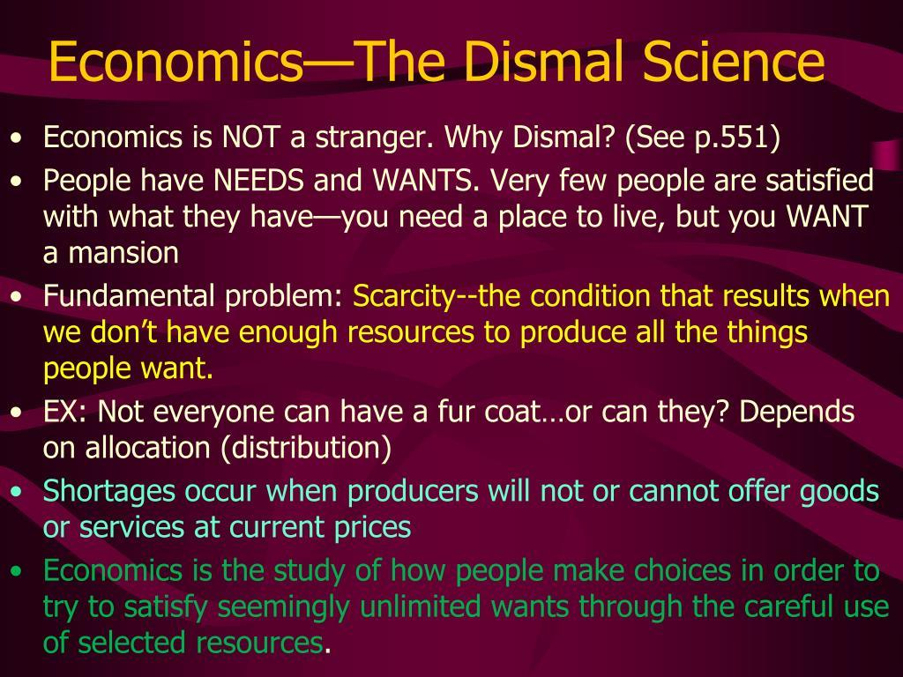

## Table of Contents

## What is the origin of the term 'Dismal Science' in relation to economics?

The term 'Dismal Science' was first used to describe economics by the Scottish writer Thomas Carlyle in the 19th century. Carlyle used this phrase in an essay called "Occasional Discourse on the Negro Question" in 1849. He was unhappy with the ideas of economists like Thomas Malthus, who said that population growth would always outstrip food supply, leading to poverty and suffering. Carlyle thought these ideas were too gloomy and depressing, so he called economics the 'Dismal Science'.

Over time, the term 'Dismal Science' stuck, but its meaning changed a bit. Now, it is often used to poke fun at economics because it can seem boring or too focused on numbers and theories. However, not everyone agrees with this view. Many people think economics is important and interesting because it helps us understand how societies use resources and make decisions. So, while the term started as a criticism, it has become a light-hearted way to talk about the challenges of studying economics.

## How does the concept of 'Dismal Science' reflect on the study of economics?

The term 'Dismal Science' reflects on the study of economics by highlighting the often gloomy predictions and theories within the field. When Thomas Carlyle first used the phrase, he was reacting to the pessimistic views of economists like Thomas Malthus, who believed that population growth would always lead to more poverty and suffering. This negative outlook made economics seem depressing and uninviting, hence the label 'Dismal Science'. It suggests that economics can be seen as a field that focuses too much on the darker aspects of human society, like scarcity and struggle.

Today, the term 'Dismal Science' is often used more playfully to tease economists about their subject. It points out that economics can seem boring or too complicated with all its numbers and theories. However, many people appreciate economics because it helps us understand important things like how money and resources are used in society. So, while the term started as a criticism, it has become a way to acknowledge the challenges of studying economics, while also recognizing its importance.

## What are the basic principles of economics that are often considered 'dismal'?

One of the basic principles of economics that people often find dismal is the idea of scarcity. This means there are never enough resources to satisfy everyone's wants and needs. Because of scarcity, people have to make tough choices about what to do with the limited resources they have. This can lead to situations where some people don't get what they need, which can feel gloomy and unfair.

Another principle that can seem dismal is the idea of opportunity cost. This means that whenever you choose to do one thing, you give up the chance to do something else. For example, if a country spends money on building roads, it can't use that same money to improve schools. This idea can make economics feel like a series of hard choices where someone always loses out.

Lastly, the concept of diminishing returns can also feel dismal. This principle says that as you keep adding more of something, like workers to a factory, you'll eventually get less and less benefit from each additional unit. This can make it seem like no matter how hard you try, you can't keep improving things forever, which can be discouraging.

## Can you explain how scarcity and resource allocation relate to the 'Dismal Science'?

Scarcity is a big reason why economics is called the 'Dismal Science'. It means there's never enough stuff to go around for everyone. Because of this, people have to make tough choices about what to do with the limited things they have. This can lead to situations where some people don't get what they need, which can feel sad and unfair. When economists talk about scarcity, they're often pointing out that life is full of hard choices, and that can make their field seem gloomy.

Resource allocation is another part of economics that can seem dismal. It's all about deciding how to use the limited resources we have. For example, a country might have to choose between spending money on building hospitals or on improving schools. No matter what they choose, some people will feel like they're missing out. This idea of always having to make tough choices and seeing some people lose out can make economics feel like a depressing subject. That's why it's sometimes called the 'Dismal Science'.

## How do economic theories address the 'dismal' aspects of human behavior and societal outcomes?

Economic theories often try to explain and deal with the tough parts of human behavior and how societies turn out. One big idea is that people are always trying to get the most out of what they have, but there's never enough to go around. This is called scarcity. Because of scarcity, people have to make hard choices, and sometimes those choices lead to bad outcomes like poverty or inequality. Economists study these choices to understand why some people end up with more and others with less. They look at things like how much people work, how much they earn, and how they spend their money to see how these choices affect everyone.

Another way economic theories address the dismal parts of life is by looking at how resources are shared in society. This is called resource allocation. Economists study how governments and markets decide who gets what. For example, they might look at how tax money is spent on things like schools or hospitals. These decisions can make a big difference in people's lives, but they're often hard to make because there's never enough money to do everything. Economists try to find ways to make these choices fairer and more efficient, but it's a tough job because there are always winners and losers. This focus on hard choices and tough outcomes is why economics is sometimes called the 'Dismal Science'.

## What role does the 'Dismal Science' play in policy making and economic forecasting?

The 'Dismal Science' label reminds us that economics often deals with tough choices and gloomy predictions. This affects policy making because economists help governments decide how to use limited resources. They look at things like how to spend tax money on schools, hospitals, or roads. Economists try to find ways to make these choices fairer and better for everyone, but it's hard because there's never enough money to do everything. So, they have to think about who might lose out and how to help them.

Economic forecasting also feels the impact of the 'Dismal Science'. Economists use theories and data to predict what might happen to the economy in the future. They might say things like, "If we don't change our policies, more people might become poor." These predictions can sound gloomy, but they're important because they help leaders make plans to avoid bad outcomes. Even though it might seem depressing, this kind of forecasting helps governments prepare for the future and try to make things better for everyone.

## How has the perception of economics as a 'Dismal Science' evolved over time?

When Thomas Carlyle first called economics the 'Dismal Science' in the 1800s, he was upset about economists like Thomas Malthus who said scary things about population growth and poverty. Carlyle thought these ideas made economics sound too gloomy and sad. Back then, the term was a way to criticize economists for being too negative about the future. People felt that economics was all about hard choices and bad outcomes, which made the subject seem depressing and not very fun.

Over time, the way people think about economics as the 'Dismal Science' has changed a bit. Today, the term is often used more as a playful tease than a serious criticism. People might say economics is 'dismal' because it can seem boring with all its numbers and theories, but they don't always mean it in a bad way. Many people now see economics as an important tool for understanding how societies work and how to make better decisions about money and resources. Even though it can still seem gloomy at times, the 'Dismal Science' label has become a light-hearted way to talk about the challenges of studying economics.

## What are some key criticisms of economics being labeled as the 'Dismal Science'?

Some people don't like it when economics is called the 'Dismal Science' because they think it makes the subject sound too gloomy and depressing. They say that economics isn't just about bad news and hard choices. It's also about finding ways to make people's lives better. For example, economists help figure out how to use money to build schools and hospitals, which can make a big difference. Calling economics 'dismal' ignores all the good things it can do.

Others argue that the label is unfair because it focuses too much on old ideas like Thomas Malthus's gloomy predictions about population growth. They say that economics has changed a lot since then and now covers many different areas, like how people behave and make decisions. The 'Dismal Science' label can make people think economics is boring and all about numbers, but really, it's a lively field that helps us understand the world better.

## How do different economic schools of thought interpret the 'Dismal Science' differently?

Different economic schools of thought have their own ways of looking at the 'Dismal Science'. Classical economists, like Thomas Malthus, focus on the gloomy side of things, like how population growth can lead to more poverty. They think economics is about hard choices and not having enough for everyone, which is why Carlyle called it 'dismal'. But they also believe that free markets can help solve some of these problems by letting people trade and find the best ways to use resources.

On the other hand, Keynesian economists see the 'Dismal Science' differently. They think the government should step in to help fix economic problems, like unemployment or inequality. They believe economics can be used to make things better for everyone, not just to point out the bad stuff. So, they might not like the 'dismal' label because they see economics as a tool for positive change.

Behavioral economists have yet another view. They study how people actually make choices, not just how they should make them. They think the 'Dismal Science' label misses the point because economics is about understanding human behavior, which can be interesting and not just gloomy. They focus on how people can be helped to make better decisions, which can lead to happier outcomes.

## Can you discuss a case study where the principles of 'Dismal Science' were effectively applied in economic policy?

One good example of using the 'Dismal Science' in real life is what happened in Sweden in the 1990s. Sweden had a big economic problem because they spent too much money and their banks were in trouble. Economists, using the idea of scarcity, told the government that they had to make some hard choices. They said Sweden needed to cut spending and let some banks fail to fix the economy. It was a tough decision because it meant some people would lose their jobs and savings, but it was necessary to stop things from getting worse.

The government listened to the economists and made those hard choices. They cut spending on things like welfare and let some banks go bankrupt. It was a gloomy time, but it worked. Sweden's economy got better and became stronger. This case shows how the 'Dismal Science' can help make tough decisions that lead to better outcomes in the long run, even if they're hard in the short term.

## What are the latest research trends in economics that challenge or reinforce the notion of 'Dismal Science'?

Recent research in economics is showing us new ways to think about the 'Dismal Science'. One big trend is behavioral economics, which looks at how people really make choices, not just how they should. This can make economics seem less gloomy because it's about understanding people better, not just predicting bad things. For example, researchers are finding ways to help people save more money or make healthier choices by understanding their behavior. This focus on positive changes challenges the idea that economics is all about bad news and hard choices.

Another trend is the study of happiness and well-being in economics. Economists are now looking at how policies can make people happier, not just richer. This means they're thinking about things like job satisfaction, health, and free time, not just money and resources. This new way of looking at economics makes it seem less 'dismal' because it's about improving people's lives in many different ways. So, even though economics still deals with tough problems, these new trends show that it's not all gloom and doom.

## How might future developments in economics potentially alter the understanding and application of the 'Dismal Science'?

Future developments in economics could change how we think about the 'Dismal Science' by focusing more on how people feel and behave, not just on numbers and theories. As we learn more about behavioral economics, we might see economists using this knowledge to help people make better choices about money, health, and happiness. This could make economics seem less gloomy because it's about helping people live better lives, not just predicting bad things. If economists can show that their work makes a real difference in people's everyday lives, the 'Dismal Science' label might start to fade away.

Another way future developments could change our view of economics is through new technology and data. With big data and artificial intelligence, economists might be able to predict economic trends more accurately and find new ways to solve problems. This could make economics more exciting and useful, as people see it helping to solve real-world issues like climate change or inequality. As these tools become more common, economics might be seen as a field that's all about finding solutions and making things better, rather than just pointing out the hard choices and gloomy outcomes.

## What is the origin of the 'Dismal Science'?

Thomas Carlyle's term "dismal science" emerged from a critique of early economic predictions, particularly those articulated by Thomas Robert Malthus. Malthus, in his influential work "An Essay on the Principle of Population" published in 1798, posited that population growth tends to outpace the production of food. He argued that, without checks such as famine, disease, or war, humanity would face widespread poverty and suffering. The mathematical underpinning of Malthus's theory is based on the geometric progression of population growth contrasted with the arithmetic progression of food supply. Specifically, he theorized that populations grow exponentially, expressed as:

$$
P(t) = P_0 \times (1 + r)^t
$$

where $P(t)$ is the population at time $t$, $P_0$ is the initial population, and $r$ is the growth rate. Meanwhile, food production grows linearly, $F(t) = F_0 + s \times t$, where $F_0$ is the initial food supply and $s$ is the rate of food production increase. This mismatch predicted an inevitable crisis.

Carlyle's use of "dismal science" primarily reflected a reaction to these bleak prophecies of inevitable human suffering due to resource constraints. However, the term later gained a broader association with the moral and ethical concerns arising from certain economic theories. Notably, Carlyle criticized economists, including John Stuart Mill, who argued against institutions like slavery. Carlyle believed these economists' visions lacked moral substance, hence coining the term "dismal". This criticism also pointed toward the more optimistic, although controversial, aspects of economics, such as the potential to challenge and reform unjust social systems, aligning economic progress with moral values.

Despite its ostensibly negative origin, the moniker "dismal science" ultimately underscores the discipline's dedication to grappling with complex societal challenges. Economics engages with issues such as resource allocation, inequality, and institutional reform. This field insists on methodical, often quantitative approaches to human behavior and societal progress, striving to forecast and mitigate real-world challenges.

## References & Further Reading

[1]: Thomas Malthus. ["An Essay on the Principle of Population"](http://www.esp.org/books/malthus/population/malthus.pdf). J. Johnson, in St Paul's Church-yard, 1798.

[2]: Carver, T. (1975). ["Thomas Carlyle"](https://www.jstor.org/stable/44945814). Cambridge University Press.

[3]: Lo, Andrew W. & MacKinlay, Craig A. (1999). ["A Non-Random Walk Down Wall Street"](https://www.amazon.com/Non-Random-Walk-Down-Wall-Street/dp/0691092567). Princeton University Press.

[4]: Aldridge, Irene. ["High-Frequency Trading: A Practical Guide to Algorithmic Strategies and Trading Systems"](https://www.amazon.com/High-Frequency-Trading-Practical-Algorithmic-Strategies/dp/1118343506). Wiley.

[5]: De Groot, Morris H. ["Optimal Statistical Decisions."](https://onlinelibrary.wiley.com/doi/book/10.1002/0471729000). Wiley-Interscience Series in Systems and Optimization.