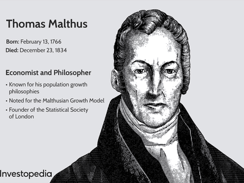

Economics, often dubbed the "dismal science," plays an essential role in shaping financial paradigms and trading systems worldwide. The term was coined by Thomas Carlyle in the 19th century, initially to describe the grim predictions associated with economic analysis, particularly those concerning population growth and resource scarcity posited by Thomas Malthus. Despite its bleak connotations, economics provides a comprehensive framework for understanding and addressing real-world challenges, influencing policy-making, business strategy, and personal financial decisions.

In the modern era, the influence of economics extends into technology through algorithmic trading, an innovative frontier in financial markets. Algorithmic trading utilizes complex algorithms to execute trades at high speeds, capitalizing on the minute-by-minute fluctuations in various asset prices. This intersection of economics and technology highlights a dynamic evolution from theoretical models to practical application, enabling traders and investors to make informed decisions swiftly and accurately.



This article examines the historical context of economics as the dismal science, tracing its evolution to contemporary applications in algorithmic trading. By exploring these developments, we aim to demonstrate how understanding economic terminology and principles equips traders and investors with a vital edge in navigating increasingly complex and competitive markets. As such, the study of economics—whether through traditional theories or modern algorithms—remains crucial for anyone seeking to comprehend and succeed in the financial world.

Understanding fundamental economic concepts is not just a theoretical exercise; it provides actionable insights that are essential for navigating both traditional and modern trading environments. As the financial landscape becomes more digital, economic vocabulary has expanded, encompassing new concepts like cryptocurrency, automation, and algorithmic trading. Mastering this language is a strategic advantage, offering clarity and precision in decision-making processes amidst the intricate web of global financial systems.

## Table of Contents

## The Origin of the 'Dismal Science'

Thomas Carlyle's term "dismal science" emerged from a critique of early economic predictions, particularly those articulated by Thomas Robert Malthus. Malthus, in his influential work "An Essay on the Principle of Population" published in 1798, posited that population growth tends to outpace the production of food. He argued that, without checks such as famine, disease, or war, humanity would face widespread poverty and suffering. The mathematical underpinning of Malthus's theory is based on the geometric progression of population growth contrasted with the arithmetic progression of food supply. Specifically, he theorized that populations grow exponentially, expressed as:

$$
P(t) = P_0 \times (1 + r)^t
$$

where $P(t)$ is the population at time $t$, $P_0$ is the initial population, and $r$ is the growth rate. Meanwhile, food production grows linearly, $F(t) = F_0 + s \times t$, where $F_0$ is the initial food supply and $s$ is the rate of food production increase. This mismatch predicted an inevitable crisis.

Carlyle's use of "dismal science" primarily reflected a reaction to these bleak prophecies of inevitable human suffering due to resource constraints. However, the term later gained a broader association with the moral and ethical concerns arising from certain economic theories. Notably, Carlyle criticized economists, including John Stuart Mill, who argued against institutions like slavery. Carlyle believed these economists' visions lacked moral substance, hence coining the term "dismal". This criticism also pointed toward the more optimistic, although controversial, aspects of economics, such as the potential to challenge and reform unjust social systems, aligning economic progress with moral values.

Despite its ostensibly negative origin, the moniker "dismal science" ultimately underscores the discipline's dedication to grappling with complex societal challenges. Economics engages with issues such as resource allocation, inequality, and institutional reform. This field insists on methodical, often quantitative approaches to human behavior and societal progress, striving to forecast and mitigate real-world challenges.

## Economic Terminology in Modern Context

Understanding foundational economic terms is essential for navigating both traditional and modern trading environments. Central to economic analysis are concepts such as supply and demand, fiscal policy, monetary policy, and market equilibrium.

Supply and demand form the backbone of economic theory, dictating how goods and services are allocated in the market. The law of demand states that, ceteris paribus, as the price of a good decreases, the quantity demanded increases. Conversely, the law of supply posits that as the price increases, the quantity supplied does as well. The interaction between supply and demand determines market equilibrium, the point at which the quantity supplied equals the quantity demanded.

Fiscal policy refers to government measures employed to influence economic activity, primarily through taxation and spending. By adjusting these levers, governments can stimulate economic growth or curb inflation. For example, during a recession, a government might increase spending or cut taxes to boost demand.

Monetary policy, managed by central banks, involves the manipulation of interest rates and money supply to achieve macroeconomic goals such as controlling inflation, consumption, growth, and [liquidity](/wiki/liquidity-risk-premium). A key tool is the manipulation of interest rates; lowering rates tends to encourage borrowing and spending, while raising them can help contain inflation.

In recent times, economic terminology has evolved with the advent of digital markets and technological advancements. Cryptocurrency has emerged as a significant element, representing decentralized digital currencies reliant on blockchain technology. Bitcoin, for example, exemplifies how digital assets can operate independent of central bank policies, influencing global trading dynamics and investor behavior.

Automation in trading, particularly [algorithmic trading](/wiki/algorithmic-trading), has introduced terminology associated with high-frequency trading and [machine learning](/wiki/machine-learning). In algorithmic trading, predefined algorithms make decisions on buying and selling stocks, operating at speeds and volumes beyond human capabilities. This requires an understanding of new metrics and data analytics techniques to optimize trading performance.

Integrating these modern concepts with traditional economic vocabulary equips traders and investors with a comprehensive toolkit, facilitating informed decision-making and the ability to capitalize on both emerging and established markets. As the financial landscape continues to evolve, proficiency in these terminologies will remain crucial for successfully navigating complex economic environments.

## Algorithmic Trading and Economics

Algorithmic trading involves the use of complex algorithms to analyze massive datasets and execute trades at high velocities. This methodical approach to trading is underpinned by economic principles that guide strategic decision-making. Economics plays a crucial role in interpreting market behaviors and trends, offering a theoretical framework that helps in predicting future movements and optimizing trade execution.

Key benefits of algorithmic trading include enhanced trading efficiency and reduced transaction costs. Efficiency is achieved by automating the trading process, thus minimizing the delay inherent in manual trading. This automation also allows traders to capitalize on profitable opportunities within milliseconds, an advantage particularly vital in volatile market environments.

Economic models are integral to the design and application of these trading algorithms. Models such as the Efficient Market Hypothesis and Modern Portfolio Theory provide foundational insights that inform the algorithms' predictive capabilities. By employing these models, algorithms can better understand and forecast market movements, ensuring that trades are executed with optimal timing and pricing.

Algorithmic trading also facilitates operation in volatile markets with exceptional precision, through techniques such as statistical [arbitrage](/wiki/arbitrage). For instance, quantitative models can identify pricing inefficiencies between related securities and execute trades to exploit these disparities, thereby generating returns while managing risk. 

In Python, a basic algorithmic trading example might involve using libraries such as NumPy and pandas for data analysis, alongside machine learning frameworks like scikit-learn to develop predictive models. A simple code snippet could involve importing financial data, calculating moving averages, and deciding trade actions based on these insights:

```python
import pandas as pd
import numpy as np

# Load historical stock data
data = pd.read_csv('stock_data.csv')
# Calculate moving averages
data['Short_MA'] = data['Close'].rolling(window=40).mean()
data['Long_MA'] = data['Close'].rolling(window=100).mean()

# Define the trading strategy
def implement_strategy(data):
    buy_signals = []
    sell_signals = []
    for i in range(len(data)):
        if data['Short_MA'][i] > data['Long_MA'][i]:
            # Buy signal
            buy_signals.append(data['Close'][i])
            sell_signals.append(np.nan)
        elif data['Short_MA'][i] < data['Long_MA'][i]:
            # Sell signal
            buy_signals.append(np.nan)
            sell_signals.append(data['Close'][i])
        else:
            buy_signals.append(np.nan)
            sell_signals.append(np.nan)
    return buy_signals, sell_signals

data['Buy'], data['Sell'] = implement_strategy(data)

# Plot the signals
import matplotlib.pyplot as plt

plt.figure(figsize=(12,6))
plt.plot(data['Close'], label='Price')
plt.plot(data['Short_MA'], label='40-day MA', alpha=0.5)
plt.plot(data['Long_MA'], label='100-day MA', alpha=0.5)
plt.scatter(data.index, data['Buy'], label='Buy Signal', marker='^', color='g')
plt.scatter(data.index, data['Sell'], label='Sell Signal', marker='v', color='r')
plt.title('Stock Price Buy and Sell Signals')
plt.xlabel('Date')
plt.ylabel('Price')
plt.legend()
plt.show()
```

This example identifies buy and sell signals based on short-term and long-term moving averages, embodying the application of economic theories and quantitative methods to make informed trading decisions.

Overall, algorithmic trading demonstrates the synergy between economic theory and technological advancements, allowing market participants to navigate complexities with enhanced precision and efficacy.

## Impacts of Algorithmic Trading on the Economy

Algorithmic trading has profoundly impacted the economic architecture of financial markets by enhancing liquidity and market depth. This pivotal change arises from the ability of algorithms to execute a significant [volume](/wiki/volume-trading-strategy) of trades rapidly and efficiently, which provides continuous liquidity and narrows bid-ask spreads. Such improvements create a more efficient trading environment, benefiting both institutional and retail investors.

However, algorithmic trading is not without its challenges. Critics argue that while it introduces efficiencies, it also heightens market [volatility](/wiki/volatility-trading-strategies). High-frequency trading, a subset of algorithmic trading, has been associated with abrupt market movements known as "flash crashes." These occur when algorithms react instantaneously to market data, leading to rapid price changes that can trigger a cascade of algorithmic sales or purchases. One notable instance is the flash crash of May 6, 2010, which saw the Dow Jones Industrial Average plummet nearly 1,000 points within minutes, only to recover shortly afterward.

The potential for such rapid market disruptions has prompted concerns among regulators. The need for robust regulatory frameworks is emphasized to ensure transparent trading practices and mitigate risks. Regulatory bodies, such as the Securities and Exchange Commission (SEC) in the United States, are continually developing measures to monitor algorithmic trading activities. These measures include implementing circuit breakers, which pause trading temporarily when extreme volatility is detected, thereby allowing human intervention and assessment.

Despite these challenges, algorithmic trading is considered a groundbreaking advancement in the practical application of economic theories. It enables the automation of complex trading strategies grounded in economic principles, such as market arbitrage and statistical analysis. This automation allows traders to capitalize on market inefficiencies with precision and speed unavailable to manual trading alone. The continuous development of sophisticated algorithms helps in predicting market movements more accurately, improving decision-making processes and optimizing portfolio management.

In summary, while algorithmic trading introduces complexities and potential risks, its contributions to enhancing trading efficiency and aligning economic theory with real-world applications are undeniably significant. Balancing innovation with regulatory oversight will be crucial in ensuring that algorithmic trading continues to benefit financial markets while safeguarding against systemic risks.

## Conclusion

Economics, often referred to as the "dismal science," continues to play a crucial role in understanding and interpreting financial markets. This role is particularly evident in the domain of algorithmic trading, where economic theories and principles are leveraged to make informed, strategic trading decisions. Algorithmic trading uses complex algorithms to analyze vast amounts of data and execute trades at speeds and efficiency levels unmatched by traditional methods.

Algorithmic trading not only highlights the practical application of economic principles but also underscores the necessity for a deep understanding of market dynamics. Traders who grasp the intricacies of supply and demand, market equilibrium, and fiscal and monetary policies can better navigate the multifaceted landscapes of global markets. This comprehension is vital as it equips traders to capitalize on opportunities while mitigating inherent market risks.

As financial markets continue to evolve, so too must our grasp of their economic foundations. Staying abreast of economic concepts and their implications allows market participants to adapt to changes proactively, ensuring that they can effectively manage risks and foster growth. The integration of economics with advanced technologies, like machine learning and [artificial intelligence](/wiki/ai-artificial-intelligence), is expected to usher in new paradigms in trading. These advancements promise to refine algorithmic trading strategies, enhancing their accuracy and predictive power.

Looking ahead, the fusion of economics with emerging technologies will likely continue to reshape the trading landscape. This progression not only aligns with the historical trajectory of economics influencing financial systems but also sets the stage for a future where economic theories are intricately woven with technological innovations. Understanding this interplay will remain essential for traders and economists aiming to harness cutting-edge tools for optimal market engagement.

## References & Further Reading

[1]: Thomas Malthus. ["An Essay on the Principle of Population"](http://www.esp.org/books/malthus/population/malthus.pdf). J. Johnson, in St Paul's Church-yard, 1798.

[2]: Carver, T. (1975). ["Thomas Carlyle"](https://www.jstor.org/stable/44945814). Cambridge University Press.

[3]: Lo, Andrew W. & MacKinlay, Craig A. (1999). ["A Non-Random Walk Down Wall Street"](https://www.amazon.com/Non-Random-Walk-Down-Wall-Street/dp/0691092567). Princeton University Press.

[4]: Aldridge, Irene. ["High-Frequency Trading: A Practical Guide to Algorithmic Strategies and Trading Systems"](https://www.amazon.com/High-Frequency-Trading-Practical-Algorithmic-Strategies/dp/1118343506). Wiley.

[5]: De Groot, Morris H. ["Optimal Statistical Decisions."](https://onlinelibrary.wiley.com/doi/book/10.1002/0471729000). Wiley-Interscience Series in Systems and Optimization.