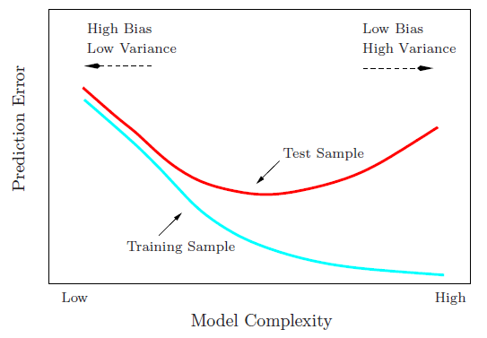

## Table of Contents

## What is Disparate Impact in the context of machine learning?

Disparate impact in machine learning refers to a situation where an algorithm or model produces results that unfairly affect certain groups of people more than others, even if there was no intention to discriminate. This often happens when the data used to train the model contains historical biases or when the model picks up on patterns that reflect societal inequalities. For example, if a model used for hiring decisions was trained on data from a company with a history of hiring more men than women, it might learn to favor male candidates, resulting in a disparate impact on female applicants.

Addressing disparate impact is important for creating fair and ethical machine learning systems. To mitigate this issue, developers can use techniques like fairness-aware machine learning, where they adjust the model or the data to reduce bias. This might involve reweighting the training data to give more importance to underrepresented groups or using algorithms that are designed to be fair by design. By being aware of and actively working to prevent disparate impact, we can help ensure that machine learning benefits everyone equally.

## How does Disparate Impact differ from other forms of bias in machine learning?

Disparate impact is a type of bias in machine learning that happens when a model's decisions affect certain groups unfairly, even if there was no intention to discriminate. This is different from other biases like selection bias, where the data used to train the model is not representative of the whole population, or confirmation bias, where the model's results are influenced by the expectations of the people using it. Disparate impact focuses on the outcomes of the model and how they might unfairly impact specific groups, like different races, genders, or ages.

For example, if a bank uses a machine learning model to decide who gets a loan, and the model ends up approving loans for men more often than for women, that could be a case of disparate impact. This might happen even if the model was not designed to be biased against women. The key difference here is that disparate impact is about the unintended consequences of the model's decisions, while other biases might be more about the data or how the model is used. To fix disparate impact, developers need to look at the results of their models and make sure they are fair for everyone.

## Can you provide an example of Disparate Impact in a real-world machine learning application?

One real-world example of disparate impact in [machine learning](/wiki/machine-learning) happened with a tool used by courts in the United States to predict if someone might commit a crime again. This tool, called COMPAS (Correctional Offender Management Profiling for Alternative Sanctions), was meant to help judges decide who should be kept in jail and who could be let out. But, studies showed that COMPAS was more likely to wrongly predict that black defendants would commit crimes again compared to white defendants. This meant that black people were more likely to be kept in jail, even if they were not going to commit another crime. This is a clear case of disparate impact because the tool's decisions unfairly affected black people more than white people, even though there was no intention to be biased.

To fix this kind of problem, researchers and developers need to look at the data and the results of their models carefully. They might need to change how the model works or use different data to make sure the tool is fair for everyone. For example, they could use fairness-aware algorithms that try to balance the outcomes for different groups. By doing this, they can help make sure that tools like COMPAS do not unfairly impact certain groups of people more than others.

## What are the legal implications of Disparate Impact in machine learning?

Disparate impact in machine learning can lead to legal problems because it might break laws that protect people from unfair treatment. In the United States, the Civil Rights Act of 1964 has a part called Title VII that says it's not okay to treat people differently at work because of their race, color, religion, sex, or national origin. If a machine learning model used in hiring or other decisions has a disparate impact, it could be seen as breaking this law, even if the company did not mean to be unfair. This means that companies could face lawsuits and have to pay money or change how they use their models.

To avoid these legal problems, companies need to be careful when they use machine learning. They should check their models often to see if they are treating everyone fairly. If they find a disparate impact, they need to fix it by changing the model or the data it uses. This can help them follow the law and avoid getting into legal trouble. By being proactive about fairness, companies can use machine learning in a way that helps everyone and stays within the law.

## How can Disparate Impact be measured in machine learning models?

Measuring disparate impact in machine learning involves looking at how a model's decisions affect different groups of people. One common way to do this is by using a metric called the disparate impact ratio. This ratio compares the rate at which a favorable outcome is given to a protected group, like a certain race or gender, to the rate at which it is given to a reference group. If the ratio is far from 1, it might mean there is a disparate impact. For example, if a model approves loans for white applicants at a rate of 80% but only approves loans for black applicants at a rate of 40%, the disparate impact ratio would be $$ \frac{0.40}{0.80} = 0.5 $$, which shows a significant difference.

To calculate this, you can gather data on the outcomes for different groups and then use the formula to find the ratio. If the ratio is less than 0.8 or more than 1.2, it might suggest a problem that needs to be fixed. By regularly checking these ratios, developers can keep an eye on their models and make changes to reduce any unfair impacts. This helps make sure the model treats everyone fairly and follows the law.

## What are common sources of Disparate Impact in machine learning datasets?

Disparate impact in machine learning often comes from the data used to train the models. This data can have biases because it might not represent everyone equally. For example, if a dataset used for a hiring model only includes information from people who were hired in the past, and those people were mostly men, the model might learn to favor men over women. This happens because the data reflects past biases and inequalities in society. Another source of disparate impact can be the way data is collected. If certain groups are left out or underrepresented in the data collection process, the model will not learn about those groups and might make unfair decisions.

To fix these problems, it's important to look at the data carefully. Developers need to make sure the data includes a good mix of people from different groups. They might need to add more data from underrepresented groups or adjust the data to give more weight to those groups. By doing this, they can help the model learn to treat everyone fairly. Regular checks on the data and the model's decisions can also help spot and fix any disparate impacts before they cause problems.

## What techniques can be used to mitigate Disparate Impact in machine learning models?

To mitigate disparate impact in machine learning models, one common technique is to use fairness-aware algorithms. These algorithms are designed to balance the outcomes for different groups. For example, developers can use techniques like reweighting the training data to give more importance to underrepresented groups. This means that during training, the model pays more attention to examples from groups that are less represented in the data. Another approach is to adjust the model's decision thresholds so that it is less likely to make unfair decisions. By doing this, the model can be more fair and treat everyone equally.

Another way to reduce disparate impact is to use pre-processing techniques on the data before it is used to train the model. This can involve changing the data to remove or reduce biases. For example, developers might use a technique called "[data augmentation](/wiki/data-augmentation)" to add more examples from underrepresented groups to the dataset. They might also use "data balancing" to make sure that the different groups are represented equally in the training data. By cleaning up the data before training the model, developers can help prevent the model from learning and repeating the biases that are in the original data.

Finally, post-processing techniques can be used to adjust the model's outputs after it has made its predictions. This can involve changing the model's final decisions to make them more fair. For example, if a model tends to approve loans for men more often than for women, developers might use a post-processing algorithm to adjust the approval rates so that they are more equal across genders. By using these techniques, developers can help ensure that their machine learning models do not unfairly impact certain groups of people.

## How does the choice of algorithm affect Disparate Impact?

The choice of algorithm can have a big effect on disparate impact in machine learning. Some algorithms are more likely to pick up on and repeat biases that are in the data. For example, complex algorithms like deep neural networks can find very detailed patterns in the data. If the data has biases, these algorithms might learn those biases and make unfair decisions. On the other hand, simpler algorithms like decision trees might be easier to understand and fix if they show bias. By choosing the right algorithm, developers can help reduce the chances of disparate impact happening.

To deal with disparate impact, developers can use fairness-aware algorithms. These are special kinds of algorithms that try to treat everyone fairly. They can do this by changing how the model learns from the data or by adjusting the model's decisions to make them more equal for different groups. For example, if a model tends to approve loans for men more often than for women, a fairness-aware algorithm might adjust the approval rates to make them more equal across genders. By using these algorithms, developers can help make sure their models do not unfairly impact certain groups of people.

## What role does data preprocessing play in reducing Disparate Impact?

Data preprocessing is really important for reducing disparate impact in machine learning. It's all about fixing the data before it's used to train the model. If the data has biases, like if it doesn't include enough examples from certain groups of people, the model might learn those biases and make unfair decisions. By cleaning up the data, developers can help the model learn to treat everyone fairly. For example, they might use a technique called "data augmentation" to add more examples from underrepresented groups to the dataset. This makes sure the model sees a good mix of people and doesn't just learn from one group.

Another way data preprocessing helps is by balancing the data. If one group is overrepresented in the data, the model might pay too much attention to that group and ignore others. By using "data balancing," developers can make sure that all groups are represented equally in the training data. This can help the model make fair decisions for everyone. By taking these steps before training the model, developers can reduce the chances of disparate impact and help make sure their machine learning models are fair and equal for all people.

## How can fairness metrics be used to evaluate Disparate Impact in machine learning?

Fairness metrics are important tools to help understand and fix disparate impact in machine learning. One common metric is the disparate impact ratio, which compares how often a good outcome happens for a protected group, like a certain race or gender, to how often it happens for a reference group. For example, if a model approves loans for white applicants at a rate of 80% but only approves loans for black applicants at a rate of 40%, the disparate impact ratio would be $$ \frac{0.40}{0.80} = 0.5 $$. If this ratio is far from 1, it might show there's a problem with the model treating different groups unfairly. By regularly checking these ratios, developers can spot and fix any unfair impacts before they cause problems.

Another useful fairness metric is equalized odds, which looks at how well a model predicts outcomes for different groups. It checks if the model's true positive and false positive rates are the same across groups. For instance, if a model used for predicting if someone will commit a crime again has different error rates for different races, it could be unfairly impacting certain groups. By using these fairness metrics, developers can make sure their models are treating everyone fairly and help prevent legal issues that might come from disparate impact.

## What are the challenges in balancing model performance and reducing Disparate Impact?

Balancing model performance with reducing disparate impact can be tricky. When developers try to make their models fairer, they might find that the model's accuracy goes down. For example, if a model used for approving loans is changed to be fairer to all groups, it might not be as good at predicting who will pay back their loans. This happens because fairness often means giving more attention to underrepresented groups, which can make the model less focused on the patterns it used to make accurate predictions. Developers need to find a good balance where the model is both fair and still works well.

One way to handle this challenge is to use fairness-aware algorithms, which try to treat everyone fairly while keeping the model's performance high. These algorithms can adjust how the model learns from the data or change the model's decisions to make them more equal for different groups. For example, if a model tends to approve loans for men more often than for women, a fairness-aware algorithm might adjust the approval rates to make them more equal across genders. By using these techniques, developers can help make sure their models do not unfairly impact certain groups of people while still being effective at their main job.

## How do advanced machine learning models, such as deep learning, handle Disparate Impact differently from traditional models?

Advanced machine learning models, like [deep learning](/wiki/deep-learning), can handle disparate impact differently from traditional models because they are more complex and can find very detailed patterns in the data. If the data has biases, these models might learn those biases and make unfair decisions. For example, a deep learning model used for hiring might pick up on small differences in how resumes from different groups look, even if those differences don't matter for the job. This can lead to the model treating people unfairly, even if the developers didn't mean for that to happen. Traditional models, like decision trees, are simpler and easier to understand, which can make it easier to spot and fix biases.

To deal with disparate impact, developers can use special techniques with deep learning models. They might use fairness-aware algorithms that try to treat everyone fairly. These algorithms can change how the model learns from the data or adjust the model's decisions to make them more equal for different groups. For instance, if a deep learning model tends to approve loans for men more often than for women, a fairness-aware algorithm might adjust the approval rates to make them more equal across genders. By using these techniques, developers can help make sure their deep learning models do not unfairly impact certain groups of people, even though these models are more complex and harder to control than traditional ones.