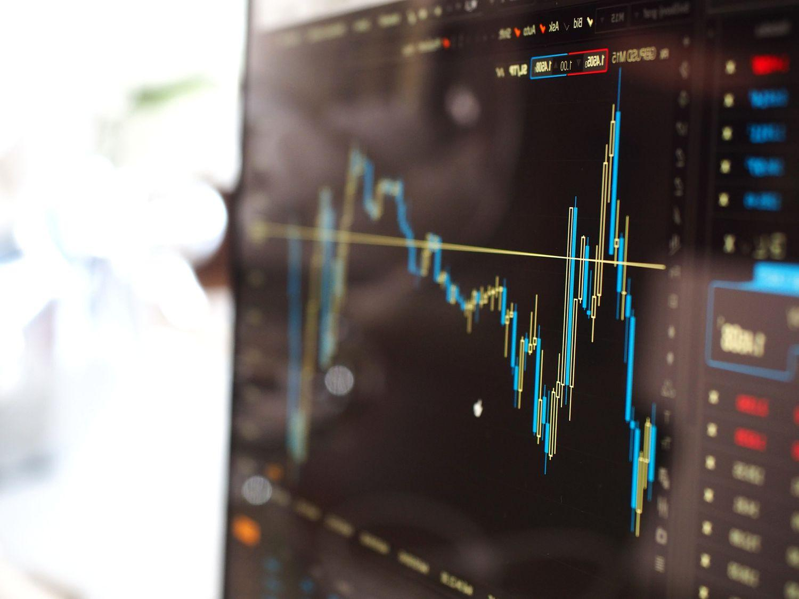

## Table of Contents

## What is after-hours trading?

After-hours trading is when people buy and sell stocks outside of the normal trading hours. Normally, the stock market is open from 9:30 AM to 4:00 PM Eastern Time, Monday through Friday. But after-hours trading happens before the market opens in the morning or after it closes in the evening. This gives people more chances to trade if they can't do it during the day.

During after-hours trading, the prices of stocks can change a lot. This is because fewer people are trading, so big orders can move the prices more easily. It's good to be careful because the market can be more unpredictable. But it can also be a good time to trade if you want to react quickly to news that comes out after the market closes.

## What are bid and ask quotes?

Bid and ask quotes are important parts of trading. The bid is the highest price someone is willing to pay to buy a stock right now. If you want to sell your stock, you would get the bid price. On the other hand, the ask is the lowest price someone is willing to sell a stock for right now. If you want to buy a stock, you would have to pay the ask price.

The difference between the bid and the ask is called the bid-ask spread. This spread can tell you how easy or hard it is to trade a stock. If the spread is small, it means the stock is easy to buy and sell. If the spread is large, it might be harder to trade because there's a bigger difference between what buyers are willing to pay and what sellers want to get.

## Why is there a disparity between bid and ask quotes?

The difference between bid and ask quotes, called the bid-ask spread, happens because of how buying and selling works. When someone wants to buy a stock, they look at the lowest price someone is willing to sell it for, which is the ask price. But when someone wants to sell a stock, they look at the highest price someone is willing to pay, which is the bid price. These two prices are not the same because buyers want to pay less and sellers want to get more.

The size of the bid-ask spread can change based on a few things. If a stock is very popular and lots of people want to trade it, the spread is usually small because there are many buyers and sellers. But if a stock is not popular and fewer people want to trade it, the spread can be bigger because it's harder to find someone to buy or sell with. Also, if the market is moving a lot or if it's after hours when fewer people are trading, the spread can get bigger because it's harder to match buyers and sellers.

## How does after-hours trading affect bid and ask quotes?

After-hours trading can make the difference between bid and ask quotes bigger. During normal trading hours, there are lots of people buying and selling, so the prices stay close together. But after the market closes, fewer people are trading. This means there might not be as many buyers and sellers, so the highest price someone is willing to pay (the bid) and the lowest price someone is willing to sell for (the ask) can be far apart.

This bigger difference happens because when fewer people are trading, big orders can change the prices more easily. If someone wants to buy a lot of stock after hours, they might have to pay more because there are fewer sellers. And if someone wants to sell a lot of stock, they might have to accept a lower price because there are fewer buyers. So, after-hours trading can make the market more unpredictable, and it's important to be careful when trading during these times.

## What causes increased volatility in after-hours trading?

After-hours trading can be more unpredictable because fewer people are trading during these times. When there are fewer buyers and sellers, big orders can move the prices a lot more easily. If someone wants to buy a lot of stock after the market closes, they might have to pay more because there aren't many sellers around. And if someone wants to sell a lot of stock, they might have to take a lower price because there aren't many buyers. This makes the prices go up and down more than during normal trading hours.

Another reason for the increased volatility is that important news often comes out after the market closes. Companies might share their earnings reports or other big news after the market is done for the day. This news can make people want to buy or sell the stock quickly, which can cause big changes in the stock's price. So, after-hours trading can be riskier because the prices can change a lot more and it's harder to predict what will happen.

## How do liquidity and volume impact bid-ask spreads in after-hours trading?

Liquidity and [volume](/wiki/volume-trading-strategy) have a big impact on bid-ask spreads during after-hours trading. Liquidity means how easy it is to buy or sell a stock without changing its price too much. When there are lots of people trading, the market is more liquid, and the bid-ask spread is smaller. But in after-hours trading, there are fewer people buying and selling, so the market is less liquid. This means the bid-ask spread gets bigger because it's harder to find someone to trade with.

Volume, which is the number of shares being traded, also affects the bid-ask spread. During normal trading hours, lots of shares change hands, and this high volume helps keep the bid-ask spread small. But after the market closes, the volume drops a lot. With fewer shares being traded, big orders can move the price more easily, making the bid-ask spread larger. So, lower liquidity and volume in after-hours trading make the market more unpredictable and can lead to bigger bid-ask spreads.

## What role do market makers play in after-hours trading?

Market makers are important during after-hours trading. They help keep the market working smoothly by always being ready to buy and sell stocks. When fewer people are trading after the market closes, market makers step in to make sure there are still prices for stocks. They do this by giving bid and ask quotes, which means they tell people the highest price they'll pay to buy a stock and the lowest price they'll take to sell a stock.

Even though market makers help keep the market going, they can also make the bid-ask spread bigger during after-hours trading. Because there are fewer people trading, market makers might not want to take as much risk. So, they might set their bid price lower and their ask price higher to protect themselves. This makes the difference between the bid and ask prices bigger, which can make trading more expensive and riskier for everyone else.

## How can investors use bid-ask spreads to gauge market sentiment during after-hours trading?

Investors can use bid-ask spreads to understand how people feel about a stock during after-hours trading. If the spread is small, it means there are a lot of people who want to buy and sell the stock, and they agree on the price. This can show that people feel good about the stock and think it's easy to trade. But if the spread is big, it means there are fewer people trading, and they don't agree on the price. This can show that people are unsure or worried about the stock, making it harder to trade.

During after-hours trading, big news can come out that changes how people feel about a stock. If the news is good, more people might want to buy the stock, making the bid price go up and the spread get smaller. But if the news is bad, more people might want to sell, making the ask price go down and the spread get bigger. By watching the bid-ask spread, investors can see how the market is reacting to news and decide if it's a good time to buy or sell.

## What are the risks associated with trading on wide bid-ask spreads after hours?

Trading on wide bid-ask spreads after hours can be risky. When the spread is big, it means there's a big difference between what people want to pay for a stock and what people want to sell it for. If you want to buy a stock, you might have to pay a lot more than what it's worth because the ask price is high. And if you want to sell, you might have to take a lot less money because the bid price is low. This can make trading more expensive and less profitable.

Another risk is that the market can be more unpredictable after hours. With fewer people trading, big orders can move the prices a lot. This means the price you see when you decide to trade might change quickly before your trade goes through. If the price moves against you, you could lose money. So, it's important to be careful and think about these risks before trading after hours when the bid-ask spreads are wide.

## How do electronic communication networks (ECNs) influence bid-ask disparities in after-hours trading?

Electronic Communication Networks (ECNs) are systems that help people trade stocks outside of normal market hours. They connect buyers and sellers directly, without needing a middleman like a market maker. During after-hours trading, ECNs can help make the bid-ask spread smaller by bringing more people together to trade. When more people are trading, it's easier to find someone who wants to buy at the price you want to sell, or sell at the price you want to buy. This can make the market more liquid and the prices more stable.

However, ECNs can also make the bid-ask spread bigger if there are not many people using them. If only a few people are trading on an ECN after hours, it can be hard to find someone to trade with. This means the highest price someone is willing to pay (the bid) and the lowest price someone is willing to sell for (the ask) can be far apart. So, while ECNs can help by bringing more traders together, they can also make trading riskier if there are not enough people using them during after-hours trading.

## What strategies can traders employ to mitigate the risks of bid-ask spread disparities during after-hours trading?

Traders can use a few strategies to lower the risks of big bid-ask spread differences when trading after hours. One good way is to use limit orders instead of market orders. A limit order lets you set the highest price you're willing to pay to buy a stock or the lowest price you're willing to accept to sell it. This can help you avoid paying too much or selling for too little when the spread is wide. Another strategy is to keep an eye on the volume and liquidity of the stock you want to trade. If there are a lot of people trading, the spread might be smaller, making it safer to trade.

Another helpful approach is to be patient and wait for the spread to get smaller before making a trade. Sometimes, the spread can change a lot during after-hours trading, especially if there's important news. By waiting for a better time, you might get a better price. Also, it's a good idea to do your homework and understand the stock you're trading. Knowing how the stock usually behaves after hours can help you make smarter choices and avoid big surprises.

## How do regulatory differences between regular and after-hours trading sessions impact bid-ask spreads?

During regular trading hours, there are lots of rules that help keep the market fair and safe. These rules make sure there are always enough people buying and selling, which keeps the bid-ask spread small. But after hours, some of these rules don't apply, or they are not as strict. This can make the market less predictable because fewer people are trading, and it's harder to find someone to buy or sell with. As a result, the bid-ask spread can get bigger, making it riskier and more expensive to trade.

Because of these regulatory differences, traders need to be more careful when trading after hours. Without as many rules to protect them, they might face bigger price changes and wider bid-ask spreads. This means they could end up paying more to buy a stock or getting less when they sell it. Understanding these differences can help traders make better decisions and use strategies like limit orders to protect themselves from the risks of trading when the market is less regulated.

## What is Understanding After-Hours Trading?

After-hours trading, which occurs from 4 p.m. to 8 p.m. Eastern Time in the United States, offers investors the ability to trade securities outside the traditional market hours. This trading window is characterized by fewer participants, resulting in lower trading volumes compared to the regular session. Consequently, traders often encounter wider bid and ask spreads during this period. 

The bid-ask spread is a crucial concept in understanding after-hours trading dynamics. It is the difference between the highest price a buyer is willing to pay for a security (bid) and the lowest price a seller is willing to accept (ask). More specifically:

$$
\text{Bid-Ask Spread} = \text{Ask Price} - \text{Bid Price}
$$

During after-hours trading, the reduced number of market participants leads to fewer orders, which in turn widens the bid-ask spread. This can create challenges for traders as the cost of entering and exiting positions might be higher due to these larger spreads. In contrast, during regular trading hours when there is more activity, the bid-ask spreads tend to be tighter, reflecting a more efficient price discovery process.

Understanding these dynamics is essential for traders aiming to take advantage of after-hours opportunities. It requires considering the impact of reduced [liquidity](/wiki/liquidity-risk-premium) and the potential for increased [volatility](/wiki/volatility-trading-strategies), as price movements might be less predictable with fewer participants setting the market direction. Those adept in navigating these circumstances can exploit potential pricing inefficiencies that occur when important news releases or earnings reports are made after the regular market closes. Mastery of this environment often necessitates sophisticated trading strategies and tools, such as [algorithmic trading](/wiki/algorithmic-trading) systems, which can help manage the unique challenges of after-hours trading.

## References & Further Reading

[1]: Bergstra, J., Bardenet, R., Bengio, Y., & Kégl, B. (2011). ["Algorithms for Hyper-Parameter Optimization."](https://dl.acm.org/doi/10.5555/2986459.2986743) Advances in Neural Information Processing Systems 24.

[2]: ["Advances in Financial Machine Learning"](https://www.amazon.com/Advances-Financial-Machine-Learning-Marcos/dp/1119482089) by Marcos Lopez de Prado

[3]: ["Evidence-Based Technical Analysis: Applying the Scientific Method and Statistical Inference to Trading Signals"](https://www.amazon.com/Evidence-Based-Technical-Analysis-Scientific-Statistical/dp/0470008741) by David Aronson

[4]: ["Machine Learning for Algorithmic Trading"](https://github.com/stefan-jansen/machine-learning-for-trading) by Stefan Jansen

[5]: ["Quantitative Trading: How to Build Your Own Algorithmic Trading Business"](https://www.amazon.com/Quantitative-Trading-Build-Algorithmic-Business/dp/1119800064) by Ernest P. Chan