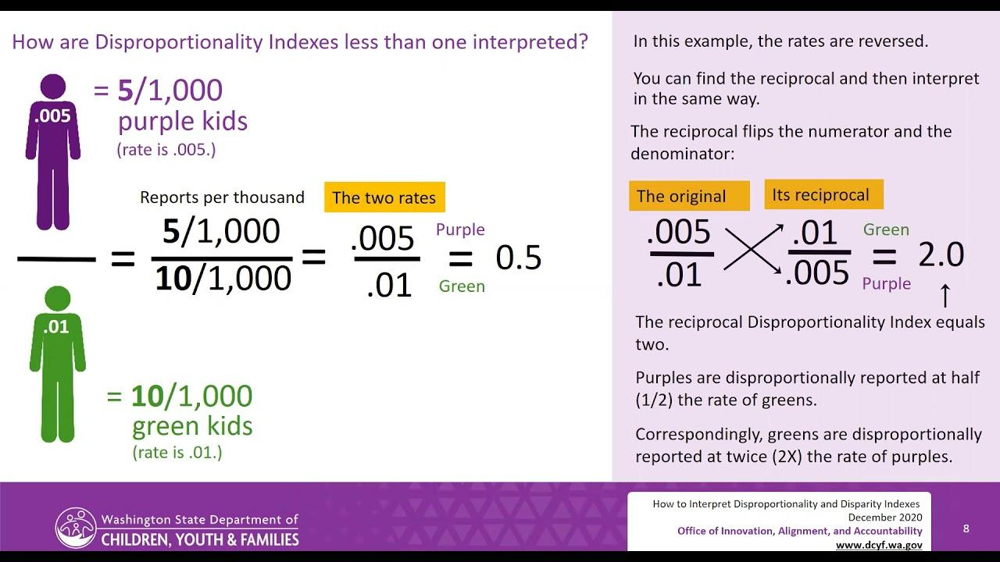

## Table of Contents

## What is the Disparity Index?

The Disparity Index is a technical analysis tool used by traders to measure how far the current price of a stock or other financial asset is from its average price over a certain period. It helps traders understand if a stock is overbought or oversold. The index is calculated by comparing the current closing price of the asset to its moving average, usually over 14 days. If the Disparity Index is high, it means the price is much higher than the average, suggesting the asset might be overbought. If it's low, it suggests the asset might be oversold.

Traders use the Disparity Index to make decisions about buying or selling assets. For example, if the index shows a stock is overbought, a trader might decide to sell it, expecting the price to fall back to the average. On the other hand, if the index shows a stock is oversold, a trader might see it as a good time to buy, expecting the price to rise back to the average. The Disparity Index can be a helpful tool, but it's important for traders to use it along with other indicators and not rely on it alone for making trading decisions.

## Why is the Disparity Index important in financial analysis?

The Disparity Index is important in financial analysis because it helps traders see if a stock's price is too high or too low compared to its average price over time. This is useful because it can show when a stock might be overbought, meaning its price is much higher than usual, or oversold, meaning its price is much lower than usual. By understanding this, traders can make better decisions about when to buy or sell a stock. For example, if the Disparity Index shows a stock is overbought, a trader might decide to sell it before the price drops back to normal.

Another reason the Disparity Index is important is that it helps traders confirm trends and potential reversals in the market. If the index stays high for a long time, it might mean the stock's price will keep going up. But if it suddenly drops after being high, it could be a sign that the price will soon go down. This information can help traders plan their moves more carefully. While the Disparity Index is a helpful tool, it's best used with other indicators to get a fuller picture of the market.

## How is the Disparity Index calculated?

The Disparity Index is calculated by comparing the current closing price of a stock to its moving average over a certain number of days, often 14 days. To find the Disparity Index, you first need to calculate the moving average of the stock's closing prices over those days. Then, you take the current closing price and divide it by the moving average. After that, you multiply the result by 100 to get the Disparity Index as a percentage.

For example, if the current closing price of a stock is $50 and its 14-day moving average is $45, you would divide $50 by $45 to get about 1.11. Then, you multiply 1.11 by 100 to get a Disparity Index of 111%. This means the current price is 11% higher than the average price over the last 14 days. Traders use this information to decide if a stock is overbought or oversold, helping them make better trading decisions.

## What data is needed to compute the Disparity Index?

To compute the Disparity Index, you need the current closing price of the stock and its moving average over a certain period, usually 14 days. The moving average is found by adding up the closing prices of the stock for the past 14 days and then dividing by 14. This gives you an average price that you can compare with the current price.

Once you have these two pieces of data, you can calculate the Disparity Index. You do this by dividing the current closing price by the 14-day moving average, then multiplying the result by 100 to turn it into a percentage. This percentage shows how much the current price differs from the average price over the last 14 days.

## Can you explain the formula used for the Disparity Index?

The formula for the Disparity Index is easy to understand. It involves taking the current closing price of a stock and dividing it by the stock's moving average over a certain number of days, usually 14 days. This moving average is found by adding up the closing prices of the stock for the past 14 days and then dividing by 14. Once you have this average, you divide the current closing price by it.

After dividing the current price by the moving average, you multiply the result by 100. This turns the number into a percentage, which is the Disparity Index. For example, if the current closing price is $50 and the 14-day moving average is $45, you divide $50 by $45 to get about 1.11. Then, you multiply 1.11 by 100 to get a Disparity Index of 111%. This percentage shows how much the current price is different from the average price over the last 14 days.

## What does a positive Disparity Index indicate?

A positive Disparity Index means the current price of a stock is higher than its average price over the last 14 days. For example, if the Disparity Index is 110%, it shows the stock's price is 10% higher than its average. This can suggest that the stock might be overbought, meaning its price has gone up a lot and might soon go back down.

Traders use a positive Disparity Index to decide if they should sell a stock. If the index is high, they might think the price is too high and could drop soon. But, it's important not to rely only on the Disparity Index. Traders should look at other signs and information too before making choices about buying or selling stocks.

## What does a negative Disparity Index signify?

A negative Disparity Index means the current price of a stock is lower than its average price over the last 14 days. For example, if the Disparity Index is -10%, it shows the stock's price is 10% lower than its average. This can suggest that the stock might be oversold, meaning its price has gone down a lot and might soon go back up.

Traders use a negative Disparity Index to decide if they should buy a stock. If the index is low, they might think the price is too low and could rise soon. But, it's important not to rely only on the Disparity Index. Traders should look at other signs and information too before making choices about buying or selling stocks.

## How can the Disparity Index be used to identify overbought or oversold conditions?

The Disparity Index helps traders see if a stock's price is too high or too low compared to its average price over the last 14 days. If the Disparity Index is positive and high, like 110%, it means the stock's price is 10% higher than its average. This can suggest the stock is overbought, meaning its price has gone up a lot and might soon go back down. Traders might decide to sell the stock if they think it's overbought.

On the other hand, if the Disparity Index is negative and low, like -10%, it means the stock's price is 10% lower than its average. This can suggest the stock is oversold, meaning its price has gone down a lot and might soon go back up. Traders might decide to buy the stock if they think it's oversold. But, it's important for traders to use the Disparity Index along with other tools and not just rely on it alone to make decisions about buying or selling stocks.

## What are the common time periods used for calculating the Disparity Index?

The Disparity Index is usually calculated using a 14-day period. This means traders look at the average price of a stock over the last 14 days and compare it to the current price. Using 14 days helps give a good picture of how the stock's price has been moving recently. It's not too short, so it doesn't get affected by small changes, and not too long, so it stays useful for making quick decisions.

Sometimes, traders might use different time periods depending on what they need. For example, if they want to see how a stock has been doing over a longer time, they might use a 30-day or even a 50-day period. But if they need to make quick decisions based on very recent changes, they might use a shorter period like 7 days. The most common, though, is still the 14-day period because it gives a good balance of recent and slightly older information.

## How does the Disparity Index differ from other momentum indicators?

The Disparity Index is different from other momentum indicators because it shows how far the current price of a stock is from its average price over a certain time, usually 14 days. It gives a percentage that tells you if the stock is overbought or oversold. Other momentum indicators, like the Relative Strength Index (RSI) or the Moving Average Convergence Divergence (MACD), look at how fast the price is changing and if it's going up or down. They help traders see if a trend is strong or if it might change soon.

The Disparity Index is simple to understand because it's just a percentage of how much the price differs from the average. It's good for traders who want to know if a stock's price is too high or too low compared to what it has been lately. Other indicators, like the RSI, use more complex math and can be harder to understand. The RSI, for example, looks at how big the price changes are over time and turns that into a number between 0 and 100. The MACD looks at the difference between two moving averages and can show when a trend might be starting or ending. So, while the Disparity Index is straightforward, other momentum indicators give different kinds of information that can be useful in different ways.

## What are the limitations of using the Disparity Index in trading?

The Disparity Index is helpful, but it has some limits. One big limit is that it can give false signals. Sometimes, the index might show a stock is overbought or oversold, but the price keeps going in the same direction. This can trick traders into making the wrong choices about buying or selling. Also, the Disparity Index only looks at the price compared to its average over a certain time, like 14 days. It doesn't think about other important things like how much people are buying or selling the stock, or what's happening in the whole market.

Another limit is that the Disparity Index works best when used with other tools. If traders only use the Disparity Index, they might miss important information. For example, other indicators like the Relative Strength Index (RSI) or the Moving Average Convergence Divergence (MACD) can give more details about how fast the price is changing or if a trend might be starting or ending. So, it's important for traders to use the Disparity Index along with other indicators to get a full picture of what's happening with a stock.

## How can the Disparity Index be integrated into a comprehensive trading strategy?

The Disparity Index can be a helpful part of a complete trading strategy by showing traders when a stock's price might be too high or too low compared to its average. Traders can use this information to decide when to buy or sell a stock. For example, if the Disparity Index is high and shows a stock is overbought, a trader might choose to sell it, expecting the price to go down. If the index is low and shows a stock is oversold, a trader might decide to buy it, expecting the price to go up. But, it's important not to rely only on the Disparity Index. It should be used with other tools to make sure traders have all the information they need to make good choices.

Other tools that can be used with the Disparity Index include the Relative Strength Index (RSI), which looks at how fast the price is changing, and the Moving Average Convergence Divergence (MACD), which can show when a trend might start or end. These indicators together can give traders a fuller picture of what's happening with a stock. For instance, if the Disparity Index shows a stock is overbought and the RSI also shows the price is high, it might be a stronger sign to sell. By combining the Disparity Index with other indicators, traders can make more informed decisions and build a strategy that considers many different aspects of the market.

## What is the Disparity Index and how can we understand it?

The Disparity Index is a technical indicator that quantifies the relative difference between a security's current price and a chosen moving average of that price. It is expressed as a percentage and provides insights into how current prices compare to past price trends. The Disparity Index is calculated using the formula:

$$

\text{Disparity Index} = \left( \frac{\text{Current Price} - \text{Moving Average (MA)}}{\text{Moving Average (MA)}} \right) \times 100
$$

This formula helps traders understand whether a security is overbought or oversold relative to its historical average, facilitating informed investment decisions. 

### Importance in Assessing Market Conditions

The Disparity Index is an essential tool for assessing market conditions as it helps identify potential price reversals, trends, and market [momentum](/wiki/momentum). A high positive Disparity Index value could indicate that a security is overbought, suggesting a potential selling opportunity or price correction. Conversely, a low negative value might suggest that the security is oversold, indicating a possible buying opportunity.

### Interpretation of Disparity Index Values

Interpreting the Disparity Index involves analyzing its values in relation to market conditions. Generally, a Disparity Index value above a threshold (e.g., +10%) indicates that the asset might be overbought, while a value below a lower threshold (e.g., -10%) suggests the asset might be oversold. Traders often consider these thresholds to time their entry and exit strategies effectively.

### Practical Applications and Examples

The Disparity Index is widely used by traders to enhance their market strategies. For instance, a trader might use it to confirm signals from other technical indicators, such as Moving Averages or the Relative Strength Index (RSI). If the Disparity Index indicates an overbought condition while the RSI also suggests the same, traders might have more confidence in executing a sell order.

Consider a stock whose 20-day moving average is $100. If the current stock price is $110, then the Disparity Index would be:

$$

\text{Disparity Index} = \left( \frac{110 - 100}{100} \right) \times 100 = 10\%
$$

This indicates a potential overbought condition, warranting further investigation or possible action.

### Comparing with Other Technical Indicators

The Disparity Index complements other technical indicators by providing a unique perspective on price deviations relative to moving averages. Unlike momentum indicators such as MACD or RSI that primarily focus on price direction and momentum strength, the Disparity Index directly measures price versus historical averages, offering an additional layer of analysis. It is particularly effective when used in conjunction with these indicators to validate market signals and mitigate the risks of false readings.

Overall, the Disparity Index serves as both a standalone metric and a complementary tool to traditional indicators, aiding traders in making more comprehensive and robust trading decisions.

## References & Further Reading

[1]: Aronson, D. R. (2006). ["Evidence-Based Technical Analysis: Applying the Scientific Method and Statistical Inference to Trading Signals"](https://www.amazon.com/Evidence-Based-Technical-Analysis-Scientific-Statistical/dp/0470008741). John Wiley & Sons.

[2]: Jansen, S. (2018). ["Machine Learning for Algorithmic Trading"](https://github.com/stefan-jansen/machine-learning-for-trading). Packt Publishing.

[3]: Chan, E. P. (2009). ["Quantitative Trading: How to Build Your Own Algorithmic Trading Business"](https://github.com/ftvision/quant_trading_echan_book). Wiley Trading.

[4]: Lopez de Prado, M. (2018). ["Advances in Financial Machine Learning"](https://books.google.com/books/about/Advances_in_Financial_Machine_Learning.html?id=oU9KDwAAQBAJ). Wiley.

[5]: Bergstra, J., Bardenet, R., Bengio, Y., & Kégl, B. (2011). ["Algorithms for Hyper-Parameter Optimization."](https://dl.acm.org/doi/10.5555/2986459.2986743) Advances in Neural Information Processing Systems 24.