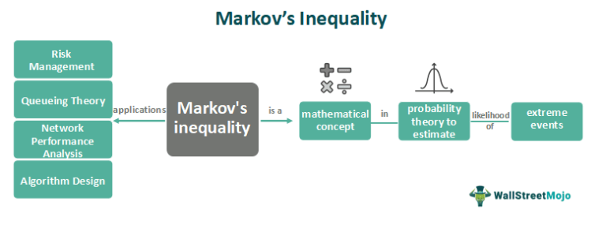

Financial markets are complex systems where success often hinges on the ability to analyze vast amounts of data and make informed trading decisions. One of the essential tools in crafting successful trading strategies is the use of technical indicators. Technical indicators are quantitative tools used to evaluate market trends and predict future price movements by analyzing statistical trends gathered from trading activity, such as price movement and volume. These indicators play a critical role in financial analysis by providing traders with insights into market behavior, thus assisting them in making data-driven decisions.

Technical indicators, such as Moving Averages, Relative Strength Index (RSI), and Moving Average Convergence Divergence (MACD), form the backbone of technical analysis. Technical analysis focuses on price and volume data, contrasting with fundamental analysis, which considers a company's financial health. The actionable insights derived from these indicators make them indispensable in assessing market conditions and potential investment opportunities.



Algorithmic trading represents a transformative approach to market participation, employing computer algorithms to execute trades at optimal conditions with minimal human intervention. This method emerged in response to the need for speed, precision, and the capacity to handle complex calculations beyond human reach. Algorithmic trading has revolutionized modern markets by increasing the efficiency and liquidity of trades, leading to rapid execution that was unattainable in traditional trading methods. It is enabled by the seamless integration of technical indicators into algorithms, enabling continuous market monitoring and responsive trading actions.

An intriguing concept within this sophisticated landscape of trading tools is the Disparity Index. The Disparity Index is a technical indicator that quantifies the percentage difference between a security's closing price and a chosen moving average. This index is used to assess whether a security is overbought or oversold, thereby guiding traders in timing their entry and exit points. The Disparity Index can complement other indicators, enhancing the robustness of trading strategies.

The purpose of this article is to explore the role of technical indicators in financial analysis, the evolution and benefits of algorithmic trading, and the practical application of the Disparity Index to improve algorithmic trading models. By understanding these elements, traders can enhance their strategies and embrace the synergy between technology and trading.

## Table of Contents

## Technical Indicators in Financial Analysis

Technical indicators are essential tools in financial analysis, primarily used to evaluate market trends and inform trading decisions. These indicators are mathematical calculations based on historical price, [volume](/wiki/volume-trading-strategy), or open interest data of a financial asset. The primary purpose of technical indicators is to facilitate the prediction of future price movements by analyzing past market data. While technical indicators are diverse, they can be broadly categorized into several types, including trend indicators, momentum indicators, volatility indicators, and volume indicators.

**Definition and Types of Technical Indicators**

1. **Trend Indicators**: These indicators help traders identify the direction and strength of a market trend. Common trend indicators include Moving Averages (MA), Moving Average Convergence Divergence (MACD), and the Average Directional Index (ADX). A Moving Average, for instance, smooths price data by creating a constantly updated average price, which can be calculated using different methods such as the simple moving average (SMA) or exponential moving average (EMA).

2. **Momentum Indicators**: These indicators measure the speed or rate of change of price movements to determine the strength of a trend. Popular momentum indicators are the Relative Strength Index (RSI) and Stochastic Oscillator. RSI values range between 0 and 100 and are used to identify overbought or oversold market conditions.

3. **Volatility Indicators**: These indicators reflect the degree of variation of trading prices over time, providing insights into market stability or unrest. The Bollinger Bands and Average True Range (ATR) are prominent examples. Bollinger Bands, for instance, consists of a middle band (SMA) and two outer bands (standard deviations away from the SMA), which can indicate whether prices are relatively high or low.

4. **Volume Indicators**: These indicators assess the strength of a price movement based on trading volume, helping identify buy or sell pressure. On-Balance Volume (OBV) and the Volume Price Trend (VPT) are commonly used volume indicators.

**The Role of Technical Indicators in Market Analysis**

Technical indicators are a cornerstone of market analysis, providing traders with insights into market sentiment, potential price reversals, continuation patterns, and [breakout](/wiki/breakout-trading) opportunities. These indicators offer quantitative metrics that can enhance a trader's ability to make informed decisions by identifying patterns or anomalies within market data.

**Comparison Between Technical and Fundamental Analysis**

While technical analysis focuses on price action and statistical trends, [fundamental analysis](/wiki/fundamental-analysis) evaluates a company's intrinsic value based on economic indicators, financial statements, and other qualitative factors. Technical analysis is often favored for short-term trading, whereas fundamental analysis is used for long-term investment decisions. However, many traders use a combination of both strategies to gain a comprehensive understanding of the market.

**How Traders Utilize Technical Indicators for Decision-Making**

Traders use technical indicators to generate buy and sell signals, manage risk, and optimize entry and [exit](/wiki/exit-strategy) points. By analyzing indicators, traders can set stop-loss orders, confirm trend directions, and predict potential price targets. Indicators such as MACD and RSI are often used in conjunction with support and resistance levels to improve trading accuracy.

**Examples of Popular Technical Indicators**

- **Moving Averages (MA)**: Used to smooth price data to identify trends over different timescales.
- **Relative Strength Index (RSI)**: Measures the speed and change of price movements to identify overbought or oversold conditions.
- **Moving Average Convergence Divergence (MACD)**: Utilizes moving averages to reveal changes in strength, direction, momentum, and duration of a trend.

In summary, technical indicators form a critical component of financial analysis, aiding traders in interpreting market behavior and making strategic decisions. Their integration with both technical and fundamental perspectives can enhance the robustness of trading strategies.

## Algorithmic Trading: A Revolutionary Approach

Algorithmic trading has transformed the landscape of financial markets by leveraging complex algorithms and computer programs to execute trades. Its development can be traced back to the 1970s with the advent of electronic trading systems. The introduction of computerized trading by NASDAQ in the 1980s marked a significant milestone, setting the stage for more sophisticated algorithms. Over the years, the technological advancements in computing power and telecommunications have propelled [algorithmic trading](/wiki/algorithmic-trading), enabling the rapid processing of large volumes of data.

Unlike traditional trading methods, which rely heavily on human intuition and decision-making, algorithmic trading utilizes pre-defined instructions based on quantitative models. This approach minimizes human emotions and errors in the trading process. Traditional trading often involves manual order placement and subjective judgment, whereas algorithmic trading automates these processes, offering speed and efficiency. Algorithms can be programmed to analyze market conditions, identify [arbitrage](/wiki/arbitrage) opportunities, and execute trades at optimal prices within milliseconds. 

One of the primary advantages of algorithmic trading is its ability to process vast datasets in real-time. Algorithms can analyze multiple indicators, historical data, and market trends to generate trading signals more accurately than a human trader. This capability allows traders to exploit microsecond price inefficiencies and profit from them. Moreover, algorithmic trading enables high-frequency trading ([HFT](/wiki/high-frequency-trading-strategies)), where thousands of trades can be executed in fractions of a second, enhancing [liquidity](/wiki/liquidity-risk-premium) and market efficiency.

An algorithmic trading system is composed of several key components. Firstly, data feeds and historical datasets form the backbone of any system, providing the necessary information for analysis. Secondly, quantitative models are developed to predict market movements and generate trading signals. These models can incorporate various strategies, such as [statistical arbitrage](/wiki/statistical-arbitrage), [trend following](/wiki/trend-following), or market-making. The execution platform, another critical component, interfaces with exchanges to place orders automatically. Additionally, risk management protocols are integral to safeguard against potential losses, ensuring that trading activity remains within predefined parameters.

Despite its advantages, algorithmic trading faces several challenges and limitations. Market [volatility](/wiki/volatility-trading-strategies) and sudden price movements can significantly impact the performance of trading algorithms. Furthermore, the reliance on electronic systems makes algorithmic trading susceptible to technical failures and cyber threats. Regulators also pose a challenge as they continuously evolve their frameworks to address concerns about market manipulation and systemic risks. Ensuring compliance and transparency can be a complex task for firms operating algorithmic trading systems.

Overall, although algorithmic trading presents a revolutionary approach to modern markets, it requires sophisticated technology, robust risk management, and constant adaptation to changing market conditions and regulatory environments.

## Understanding the Disparity Index

The Disparity Index is a technical indicator that quantifies the relative difference between a security's current price and a chosen moving average of that price. It is expressed as a percentage and provides insights into how current prices compare to past price trends. The Disparity Index is calculated using the formula:

$$

\text{Disparity Index} = \left( \frac{\text{Current Price} - \text{Moving Average (MA)}}{\text{Moving Average (MA)}} \right) \times 100
$$

This formula helps traders understand whether a security is overbought or oversold relative to its historical average, facilitating informed investment decisions. 

### Importance in Assessing Market Conditions

The Disparity Index is an essential tool for assessing market conditions as it helps identify potential price reversals, trends, and market [momentum](/wiki/momentum). A high positive Disparity Index value could indicate that a security is overbought, suggesting a potential selling opportunity or price correction. Conversely, a low negative value might suggest that the security is oversold, indicating a possible buying opportunity.

### Interpretation of Disparity Index Values

Interpreting the Disparity Index involves analyzing its values in relation to market conditions. Generally, a Disparity Index value above a threshold (e.g., +10%) indicates that the asset might be overbought, while a value below a lower threshold (e.g., -10%) suggests the asset might be oversold. Traders often consider these thresholds to time their entry and exit strategies effectively.

### Practical Applications and Examples

The Disparity Index is widely used by traders to enhance their market strategies. For instance, a trader might use it to confirm signals from other technical indicators, such as Moving Averages or the Relative Strength Index (RSI). If the Disparity Index indicates an overbought condition while the RSI also suggests the same, traders might have more confidence in executing a sell order.

Consider a stock whose 20-day moving average is $100. If the current stock price is $110, then the Disparity Index would be:

$$

\text{Disparity Index} = \left( \frac{110 - 100}{100} \right) \times 100 = 10\%
$$

This indicates a potential overbought condition, warranting further investigation or possible action.

### Comparing with Other Technical Indicators

The Disparity Index complements other technical indicators by providing a unique perspective on price deviations relative to moving averages. Unlike momentum indicators such as MACD or RSI that primarily focus on price direction and momentum strength, the Disparity Index directly measures price versus historical averages, offering an additional layer of analysis. It is particularly effective when used in conjunction with these indicators to validate market signals and mitigate the risks of false readings.

Overall, the Disparity Index serves as both a standalone metric and a complementary tool to traditional indicators, aiding traders in making more comprehensive and robust trading decisions.

## Integrating the Disparity Index into Algo Trading Strategies

The integration of the Disparity Index into algorithmic trading strategies can significantly enhance the capacity of trading models by providing real-time insights into market conditions. The Disparity Index, which measures the percentage difference between the current price and a selected moving average, serves as a critical tool in identifying overbought or oversold conditions — a valuable feature for algorithmic decision-making processes.

### The Role of the Disparity Index in Enhancing Algorithmic Trading Models

Algorithmic trading models incorporate various technical indicators to optimize trading decisions, and the Disparity Index can play a pivotal role in these models. By quantifying the deviation of an asset's price from its moving average, it aids algorithms in capturing the momentum and gauging the potential for price reversals or continuations. 

For instance, in a Python-based trading algorithm, the Disparity Index can be calculated using:

```python
def disparity_index(current_price, moving_average):
    return ((current_price - moving_average) / moving_average) * 100
```

This formula outputs the percentage difference, where positive values might imply overbought conditions and negative values may indicate oversold conditions. This allows algorithms to make informed buy or sell signals.

### Automation of Trading Decisions Using the Disparity Index

The ability to automate trading decisions based on the Disparity Index can improve efficiency and consistency. By integrating the Disparity Index into an algorithm, traders can set specific threshold values to trigger automatic trading actions. For example, a trader might program the system to sell if the Disparity Index exceeds a certain positive threshold or buy if it falls below a negative threshold. 

Python can be utilized to implement this rule-based trading strategy as follows:

```python
def trading_decision(index_value, buy_threshold=-5, sell_threshold=5):
    if index_value < buy_threshold:
        return "Buy"
    elif index_value > sell_threshold:
        return "Sell"
    else:
        return "Hold"
```

### Case Studies and Success Stories of Incorporating the Disparity Index

While literature specific to the Disparity Index is limited, its application can be observed in broader strategies where traders use moving averages to inform positions. Successful case studies often involve its use in conjunction with other indicators, providing a more comprehensive view of market dynamics. Quantitative funds and high-frequency traders leverage such multi-indicator strategies to mitigate risk and enhance returns.

### Considerations and Best Practices for Using the Disparity Index

To effectively incorporate the Disparity Index, traders should consider the context of other market conditions and additional indicators. It's crucial to back-test strategies using historical data to evaluate the efficacy of the index in different market scenarios. Moreover, parameter tuning, such as adjusting the period of the moving average, can be essential to tailor the Disparity Index to specific trading environments.

### Potential Pitfalls and How to Mitigate Them

Over-reliance on a single technical indicator like the Disparity Index could lead to inadequate market assessments. Thus, it’s advisable to complement it with other indicators to capture a more holistic market view. Additionally, market anomalies, such as sudden price shocks, might lead to misleading Disparity Index values. To mitigate these risks, real-time data monitoring and adaptive algorithm adjustments should be employed.

In summary, the Disparity Index offers valuable insights for algorithmic trading, especially when combined with a holistic approach to technical analysis. Its integration can automate and optimize trading strategies, though it necessitates careful application and ongoing assessment to address inherent challenges.

## Conclusion

Throughout this article, we have traversed the landscape of technical indicators and their integral role in both traditional and modern trading strategies. Key technical indicators like Moving Averages, RSI, and MACD have long assisted traders in making informed decisions, while algorithmic trading has revolutionized this space by integrating these indicators into automated models. Among these technical tools, the Disparity Index has emerged as a valuable metric for assessing market conditions and enhancing algorithmic trading strategies.

The Disparity Index offers a unique perspective by quantifying the deviation of an asset's current price from a chosen moving average. This metric aids in identifying overbought or oversold conditions, assisting traders in executing more precise entry and exit points. When automated within algorithmic models, the Disparity Index can significantly enhance trading efficiency and effectiveness. However, traders should also be mindful of potential pitfalls such as over-reliance on any single indicator and the inherent risks of automated systems.

Looking toward the future, technical indicators and algorithmic trading stand poised for continued evolution. Advances in [machine learning](/wiki/machine-learning) and [artificial intelligence](/wiki/ai-artificial-intelligence) promise to refine these systems further, offering even more sophisticated and adaptive trading models. Traders are encouraged to explore the Disparity Index as a component of their trading arsenal, testing its application and learning how it can complement existing strategies.

The collaboration between technology and trading methodologies represents a dynamic synergy that is reshaping financial markets. As the complexity of these systems grows, so too does the opportunity for traders to enhance their strategies with innovative tools. This journey invites ongoing learning and research, encouraging market participants to deepen their understanding of technical indicators and the ever-evolving algorithms that drive today's trading environment. In this pursuit, the Disparity Index offers both a challenge and an opportunity for those eager to refine their craft.

## References & Further Reading

[1]: Aronson, D. R. (2006). ["Evidence-Based Technical Analysis: Applying the Scientific Method and Statistical Inference to Trading Signals"](https://www.amazon.com/Evidence-Based-Technical-Analysis-Scientific-Statistical/dp/0470008741). John Wiley & Sons.

[2]: Jansen, S. (2018). ["Machine Learning for Algorithmic Trading"](https://github.com/stefan-jansen/machine-learning-for-trading). Packt Publishing.

[3]: Chan, E. P. (2009). ["Quantitative Trading: How to Build Your Own Algorithmic Trading Business"](https://github.com/ftvision/quant_trading_echan_book). Wiley Trading.

[4]: Lopez de Prado, M. (2018). ["Advances in Financial Machine Learning"](https://books.google.com/books/about/Advances_in_Financial_Machine_Learning.html?id=oU9KDwAAQBAJ). Wiley.

[5]: Bergstra, J., Bardenet, R., Bengio, Y., & Kégl, B. (2011). ["Algorithms for Hyper-Parameter Optimization."](https://dl.acm.org/doi/10.5555/2986459.2986743) Advances in Neural Information Processing Systems 24.