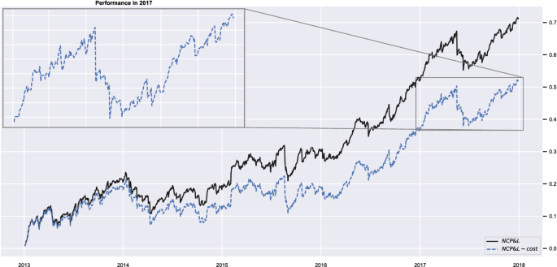
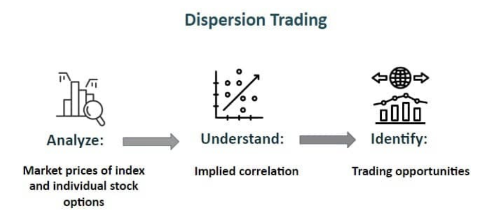

## Table of Contents

## What is Dispersion Trading?

Dispersion Trading is an options trading strategy that capitalizes on the differences in implied volatility between an index and its individual constituent stocks. Essentially, it’s a bet on how the volatility of the index as a whole compares to the combined volatilities of the stocks within it. Traders typically use this strategy when they believe the correlation between the stocks in the index is lower than what the market’s pricing suggests—or, conversely, when they think the correlation is overstated.

Here’s how it works in simple terms: an index like the S&P 500 is made up of many stocks, and its options reflect an "average" expected volatility. Meanwhile, options on the individual stocks in that index have their own implied volatilities. Dispersion Trading often involves selling index options (like puts or calls) while simultaneously buying options on a basket of the index’s component stocks—or vice versa—depending on whether you think the dispersion (the spread in volatilities) is mispriced. The goal is to profit from the difference as the market corrects itself.

It’s a sophisticated arbitrage play, rooted in the idea that stock movements don’t always align as tightly as the index pricing assumes. Think of it like betting on how much a group of runners will spread out in a race, rather than assuming they’ll all finish in a tight pack.

## How does Dispersion Trading differ from other trading strategies?

Dispersion Trading stands apart from other trading strategies because it’s specifically focused on exploiting the relationship between the [volatility](/wiki/volatility-trading-strategies) of an index and the volatilities of its individual stocks, rather than betting on price direction alone. Unlike directional strategies—like buying stocks or options to profit from an up or down move—Dispersion Trading is more about [arbitrage](/wiki/arbitrage) and statistical mispricing. It’s less concerned with whether the market rises or falls and more about how the pieces of the puzzle (the stocks) move relative to the whole (the index).

For example, compare it to a classic [momentum](/wiki/momentum) strategy, where you ride a stock’s upward trend based on past price action. Dispersion Trading doesn’t care about trends—it hinges on volatility spreads and correlation. Or take a value investing approach, where you buy undervalued stocks for the long haul; Dispersion Trading is typically shorter-term and options-driven, not about intrinsic company value.

It also differs from pure volatility trading, like a straddle or strangle, where you’re betting on big price swings regardless of direction. In those cases, you’re focused on a single asset’s volatility. Dispersion Trading, though, thrives on the interplay between an index and its components, often using a mix of selling and buying options to capture the “[dispersion](/wiki/dispersion-trading)” in implied volatilities. It’s a niche play—less about gut calls and more about mathematical precision, setting it apart from strategies that rely on broader market sentiment or fundamentals.

## What are the basic principles behind Dispersion Trading?

Dispersion Trading rests on a few core principles that drive its logic and execution. At its heart, it’s about understanding how volatility and correlation behave in the options market.

First, it leverages the idea that an index’s implied volatility—reflected in its options prices—is essentially a weighted average of the implied volatilities of its individual stocks, adjusted by their correlations. If the stocks move in lockstep (high correlation), the index volatility tends to align closely with the stocks’ volatilities. But if the stocks move more independently (low correlation), their individual volatilities can diverge significantly from the index’s.

Second, it’s built on spotting mispricing. Traders look for times when the market overestimates or underestimates this correlation. For instance, if index options are priced with high implied volatility (suggesting tight correlation), but the stocks are poised to move more independently, there’s an opportunity. The basic play is to sell the “expensive” index options and buy the “cheaper” stock options—or the reverse if correlations are underestimated.

Third, it’s a mean-reverting concept. The strategy assumes that over time, the relationship between index and stock volatilities will normalize, letting the trader pocket the difference. It’s not about predicting wild swings but about banking on the statistical tendency of these relationships to balance out.

Finally, it’s inherently a hedged approach. By taking offsetting positions—long on stock options, short on index options, or vice versa—you’re not fully exposed to market direction. The profit comes from the dispersion itself, not a bullish or bearish bet. These principles make it a calculated, almost clinical strategy, rooted in math more than market narrative.

## What role do options play in Dispersion Trading?

Options are the backbone of Dispersion Trading—they’re the tools that let you directly trade on volatility differences between an index and its component stocks. Since the strategy hinges on implied volatility (the market’s expectation of future price swings baked into options prices), options are the perfect vehicle to capture that.

In practice, you typically use options in two ways. First, you might sell options on the index—like calls or puts on the S&P 500—because their prices reflect the collective implied volatility of the index. Then, you buy options on a basket of individual stocks within that index, whose prices reflect their own volatilities. The idea is to profit when the spread between these volatilities shifts in your favor. For example, if the index options are overpriced (high implied volatility) relative to the stock options (lower combined volatility), selling the index and buying the stocks sets you up to gain as the mispricing corrects.

Options also allow flexibility. You can use calls, puts, or combinations like straddles, depending on whether you’re betting on dispersion increasing or decreasing. They let you hedge, too—your long and short positions offset some directional risk, keeping the focus on volatility spreads rather than market moves.

Plus, options give you leverage. You don’t need to own the underlying stocks or index outright; you’re just trading contracts, which amplifies returns (and risks) on the volatility bet. Without options, you’d be stuck trying to mimic this with stock positions, which wouldn’t isolate volatility as cleanly or efficiently. In short, options aren’t just part of Dispersion Trading—they define it.

## How does correlation affect Dispersion Trading?

Correlation is the heartbeat of Dispersion Trading—it’s what determines whether the strategy pays off. It measures how much the stocks in an index move together. When correlation is high, the stocks tend to rise or fall in sync, and the index’s volatility closely tracks the average volatility of its components. When correlation is low, the stocks move more independently, and their individual volatilities can diverge widely from the index’s.

In Dispersion Trading, you’re betting on whether the market’s pricing of options reflects the “true” correlation. If index options are priced with high implied volatility—implying strong correlation—but the stocks are actually less correlated than assumed, their individual volatilities won’t justify the index’s premium. A trader might sell those overpriced index options and buy the relatively cheaper stock options, profiting as the dispersion (the spread in volatilities) widens.

Conversely, if correlation is underestimated—index options are cheap, suggesting low correlation, but stocks are moving together—you’d buy index options and sell stock options, expecting the dispersion to shrink as correlation tightens. The profit comes from this gap between what the market expects and what actually plays out.

Correlation isn’t static, though. It can spike during crises (think 2008) when stocks fall together, or drop in calmer times when company-specific factors dominate. Dispersion Trading thrives on these shifts, but it’s a double-edged sword—get the correlation wrong, and the trade unravels. It’s why understanding correlation dynamics is make-or-break for the strategy.

## What is the significance of implied volatility in Dispersion Trading?

Implied volatility is the linchpin of Dispersion Trading—it’s the key metric that signals opportunity and drives the whole strategy. It represents the market’s expectation of future price swings, embedded in options prices, and in Dispersion Trading, you’re comparing the implied volatility of an index to the implied volatilities of its individual stocks.

The significance lies in the mismatch. The index’s implied volatility reflects an assumed average of the stocks’ volatilities, adjusted for their correlation. If the market prices index options with a high implied volatility—suggesting big, synchronized moves—but the stocks’ individual implied volatilities are lower or more scattered, there’s a discrepancy. A trader can sell the “expensive” index options and buy the “cheaper” stock options, betting that the actual volatility spread (dispersion) will reveal the mispricing.

On the flip side, if the index implied volatility is low—implying minimal movement or low correlation—but the stocks’ volatilities suggest tighter alignment, you’d buy index options and sell stock options, anticipating a correction. The profit comes from these implied volatility differences converging toward reality as the options play out.

Implied volatility also acts as the pulse of market sentiment. It spikes in panic, drops in calm, and Dispersion Trading uses that to gauge when the market’s overreacting or underestimating. Misjudge it, though, and you’re toast—it’s the yardstick that decides if you’re in the money or out of luck.

## How can a beginner start experimenting with Dispersion Trading?

For a beginner looking to dip their toes into Dispersion Trading, the key is to start small, keep it simple, and focus on learning the mechanics before risking real money. Here’s a practical way to ease in.

First, get familiar with the basics of options and volatility. Pick a well-known index like the S&P 500 and a handful of its big stocks—say, Apple, Microsoft, and Amazon. Use a free platform like Yahoo Finance or Thinkorswim’s paper trading feature to check their options prices. Look at the implied volatility for the index options (SPY or SPX) and compare it to the implied volatilities of those stock options. You don’t need to trade yet—just observe how they differ.

Next, simulate a tiny trade. Pretend you’re selling an at-the-money SPY call option and buying calls on those three stocks, keeping the quantities small and balanced (match the notional value roughly). Track how the prices move over a week or two—did the index volatility overstate or understate the stocks’ movements? This paper trading helps you see correlation and volatility in action without losing cash.

Read up, too. Grab something like "Option Volatility and Pricing" by Sheldon Natenberg to understand implied volatility better—it’s dry but gold for beginners. Watch X posts or YouTube videos from options traders to hear how they think about dispersion, but filter the hype.

Start with a demo account on a broker like [Interactive Brokers](/wiki/interactive-brokers-api) or Tastytrade once you’re ready to test real strategies. Use their tools to analyze historical volatility spreads and practice with $100 or less per trade. Keep it low-risk—focus on liquid options, avoid earnings seasons, and don’t overleverage. You’re not aiming to get rich; you’re learning how the puzzle fits together. Over time, you’ll spot when the market’s pricing feels off—and that’s where Dispersion Trading clicks.

## What are the key risks involved in Dispersion Trading?

Dispersion Trading might sound like a clever arbitrage play, but it’s got its share of pitfalls that can trip you up if you’re not careful. Here are the big risks to watch out for.

First, correlation can flip on you fast. You might bet on stocks moving independently, but a market shock—like a rate hike or geopolitical mess—can send everything crashing together, spiking correlation and blowing up your trade. The 2020 pandemic drop is a classic example: dispersion bets got crushed when stocks moved in lockstep.

Second, volatility misjudgments hurt. If you overestimate how much individual stock volatilities will diverge from the index—or underestimate it—the spread you’re banking on doesn’t materialize. Implied volatility is a guess, not a promise, and the market doesn’t always correct the way you expect.

Third, execution’s a beast. You’re juggling multiple positions—selling index options, buying stock options across a basket—and spreads, commissions, and timing can eat your edge. If you’re not precise, or if [liquidity](/wiki/liquidity-risk-premium) dries up, you’re stuck with slippage that turns a winner into a loser.

Then there’s event risk. Earnings reports, Fed announcements, or unexpected news can spike a single stock’s volatility, skewing your basket and throwing off the trade. You can’t predict black swans, but they can sink you.

Finally, it’s capital-intensive and leveraged. Options tie up margin, and small missteps get amplified. Beginners especially can overreach, thinking it’s “hedged,” only to find losses piling up when the hedge doesn’t hold. It’s not a set-it-and-forget-it strategy—blink, and you’re underwater.

## How do professionals measure success in Dispersion Trading?

Professionals gauge success in Dispersion Trading by focusing on a mix of quantitative metrics and practical outcomes, since it’s a strategy built on precision and volatility spreads rather than just raw profit. Here’s how they typically size it up.

The primary yardstick is the profitability of the volatility differential. They compare the realized dispersion—the actual spread between the index’s volatility and the weighted volatilities of the component stocks—against the implied dispersion they traded on. If they sold index options and bought stock options, success means the realized dispersion exceeded the implied cost baked into the premiums, netting a positive return after fees.

Sharpe ratio often comes into play, too. Pros want a high reward-to-risk balance, so they’ll calculate their returns relative to the portfolio’s volatility. A good Dispersion Trade might target a Sharpe above 1, showing consistent gains without wild swings—though in practice, this varies by market conditions.

Win rate and consistency matter more than home runs. Unlike directional traders chasing big pops, pros track how often their dispersion bets pay off over dozens of trades. A 60-70% success rate on small, steady wins beats sporadic jackpots, since the strategy thrives on statistical edges.

They also watch drawdowns. A successful trader keeps losses tight—say, under 5-10% of capital per trade—because blowouts from misjudged correlation or volatility can erase months of gains. Risk-adjusted return metrics like Sortino (focusing on downside risk) help here.

Finally, execution efficiency is key. Pros measure slippage and transaction costs against profits. If commissions or bid-ask spreads eat too much, even a “winning” trade flops. Success isn’t just catching the spread—it’s keeping it after the market takes its cut. For them, it’s a game of inches, not miles.

## What advanced techniques can enhance Dispersion Trading strategies?

Advanced techniques in Dispersion Trading take the basic framework and supercharge it with sharper analysis, better execution, and tighter risk control. Pros lean on these to squeeze out extra edge in a competitive game. Here’s what they bring to the table.

One big move is dynamic basket selection. Instead of trading options on all index stocks, they cherry-pick a subset—like the top 20 movers in the S&P 500—based on historical correlation data or volatility skews. This focuses the trade on where dispersion’s most likely to pop, cutting costs and noise from less volatile names.

Then there’s volatility surface modeling. Advanced traders dig into the full implied volatility surface—across strikes and expirations—to spot anomalies. They might use a stochastic volatility model (like Heston) to predict how index and stock volatilities evolve, timing trades when the surface looks misaligned with fundamentals or past patterns.

Delta hedging is another layer. Since Dispersion Trading isn’t purely about volatility—price moves can still mess with you—pros adjust their positions daily to stay delta-neutral. This keeps the focus on volatility spreads, not directional bets, and smooths out unwanted exposure.

They also play with skew and kurtosis. By targeting options with steep volatility skews (like out-of-the-money puts during fear spikes), they exploit overpricing in tail risk. Some even model higher moments like kurtosis to catch fat-tail events that juice dispersion.

Machine learning’s creeping in, too. Traders feed historical options data—implied vols, correlations, realized vols—into algorithms to predict when dispersion’s mispriced. A [neural network](/wiki/neural-network) might flag a trade you’d miss with basic scans.

Finally, multi-asset dispersion adds complexity. Beyond stocks, they mix in ETFs, sector indices, or even cross-asset plays (think equity vs. bond vols) to diversify the bet. It’s trickier but spreads the risk.

These tricks demand serious math, fast tech, and discipline—overdo it, and you’re just piling on cost. Done right, they turn a solid strategy into a scalpel.

## How do market conditions impact Dispersion Trading outcomes?

Market conditions are a make-or-break factor in Dispersion Trading—they dictate how volatility and correlation behave, which is the whole game. Different environments can either juice your returns or tank your strategy.

In calm, trending markets—like a slow bull run—correlations tend to drop as stocks move on their own fundamentals. Index implied volatility might lag behind the sum of individual stock volatilities, making it a sweet spot to sell index options and buy stock options. Dispersion widens, and if you catch it right, profits roll in. Think 2017, when steady growth let stock-specific stories shine.

Flip that to a crisis—like a 2022-style rate hike panic or the 2020 crash—and correlations spike. Stocks move together, often down hard, and index volatility soars, sometimes outpacing stock volatilities. If you’re positioned for high dispersion (long stock options, short index), you’re toast—the spread collapses. But if you anticipate the herd mentality, flipping to buy index options and sell stock options can pay off.

Volatility regimes matter, too. In low-volatility periods, dispersion trades might scrape by on thin margins—mispricings are small, and transaction costs can eat you alive. High-volatility times, like post-earnings or during macro shocks, amplify opportunities but also risks. Big swings can overshoot your models, turning a calculated bet into a gamble.

Liquidity’s another kicker. Choppy markets with tight spreads favor execution—you can enter and [exit](/wiki/exit-strategy) cleanly. But in illiquid, gappy conditions (say, a flash crash), wide bid-ask spreads and stalled orders shred your edge.

Seasonality and events play in, too. Earnings seasons often boost stock-specific volatility, widening dispersion, while Fed announcements or expirations can tighten it. Pros watch the calendar as much as the charts.

Bottom line: market conditions don’t just tweak Dispersion Trading—they define it. You’ve got to read the room—bull, bear, or chaos—or the trade’s DOA.

## What tools or software are commonly used for Dispersion Trading analysis?

Dispersion Trading demands precision, so traders lean on a mix of tools and software to crunch data, model volatility, and execute trades. Here’s what’s commonly in the toolbox.

Bloomberg Terminal is a staple. Its options pricing, implied volatility screens (like OVME), and historical correlation data let you compare index and stock volatilities in real time. You can pull up SPX options alongside a basket of stocks, chart dispersions, and spot mispricings fast.

Thinkorswim by TD Ameritrade is popular, especially for retail pros. It’s got built-in volatility analysis, options chains, and a paper trading mode to test dispersion setups. The “Analyze” tab lets you simulate multi-leg trades and track Greeks like vega, which is clutch for volatility plays.

For heavier lifting, Python’s a go-to. Traders use libraries like Pandas for data wrangling, NumPy for math, and QuantLib for options pricing. You can scrape Yahoo Finance or CBOE data, calculate realized vs. implied dispersion, and backtest strategies—all custom-built. A script to monitor S&P 500 components’ volatilities versus the index is table stakes.

Matlab or R pop up, too, especially for quants. They’re ace for statistical modeling—think correlation matrices or stochastic volatility models like SABR. You can prototype a trade based on historical spreads and tweak it with live data.

OptionVue or VolEdge cater to volatility traders directly. OptionVue’s got dispersion-specific features, like comparing index and basket vols, while VolEdge tracks real-time volatility surfaces and flags arbitrage opportunities.

Excel still holds its own for quick-and-dirty work. Pull options data via an API (like Polygon.io), plug in a Black-Scholes formula, and you’re off—though it’s clunky for scale.

Brokers like Interactive Brokers tie it together. Their API hooks into your models, and the Trader Workstation (TWS) handles complex orders—key for juggling index and stock legs.

These tools range from plug-and-play to hardcore coding. Pros mix a few—Bloomberg for speed, Python for depth—depending on how deep they’re diving.

## What drives Dispersion Trading?

Dispersion trading thrives on the foundation of market inefficiencies specifically related to the correlation between an index and its constituents. These inefficiencies give rise to potential profit opportunities, making the strategy particularly appealing to quantitative and sophisticated traders. So, why do traders gravitate towards dispersion trading in lieu of other available strategies?

1. **Volatility Mispricing**: In many market scenarios, there exists a discrepancy between the implied volatility of an index option and the aggregate implied volatilities of options on its constituent stocks. This gap, often stemming from diverse investor sentiments and positioning between index options and single stock options, presents arbitrage opportunities.
2. **Predictable Anomalies in Implied Correlation**: Over time, certain patterns have emerged in how implied correlations behave. For instance, during periods of market stress, implied correlations tend to spike, as traders expect stocks to move more closely together. Conversely, in calmer markets, these correlations may decline. Recognizing and anticipating these patterns can equip traders to position their dispersion trades accordingly.
3. **Diversification from Traditional Strategies**: Dispersion trading provides an alternative risk-reward profile that's distinct from more mainstream strategies. This can be especially valuable for institutional investors or hedge funds looking to diversify their portfolio's sources of return.
4. **Low Capital Requirement**: Relative to potential returns, the capital requirement for dispersion trading can be comparatively low, especially when trading through options. This efficient capital usage can result in superior return on capital.
5. **Complex yet Transparent**: While dispersion trading requires a keen understanding of volatility and correlation dynamics, it's fundamentally based on transparent and observable metrics. The transparency of the trade mechanics attracts traders who prefer strategies where the risks and rewards can be quantified upfront.
6. **Opportunities in Various Market Conditions**: Whether the market is bullish, bearish, or range-bound, dispersion trading offers potential profit opportunities. Its profitability isn't solely dependent on directional market movements, but rather on the relative volatilities and correlations.

In essence, dispersion trading offers a unique blend of complexity, transparency, and efficiency. Its reliance on volatility and correlation mispricings, combined with its potential for profitability in diverse market conditions, makes it an enticing choice for traders keen on exploiting niche inefficiencies in the financial markets.

## What are the key components of a Dispersion Trading strategy?

### Risk Factors and Management

Dispersion trading, though potentially profitable, is not without risks. Understanding these risks and employing strategies to manage them is essential for both novice and experienced traders.

**Market/Volatility Risk**

Volatility, a measure of price variation in a given timeframe, plays a pivotal role in dispersion trading. When the market's expected volatility (implied volatility) differs from the volatility realized over time, it can affect the profitability of a dispersion trade. For instance, if implied volatility is higher than realized volatility, selling index options and buying individual stock options can be profitable. However, should market conditions change and implied volatilities adjust, this could render a once-profitable strategy unviable[7]. To manage this, traders often use dynamic hedging techniques and monitor the volatility surface closely.

**Correlation Sensitivity**

Correlation sensitivity, often termed "correlation risk," arises when the assumed correlation between the index and its constituents changes. Dispersion trades thrive on the difference between implied and realized correlation. Any unexpected movement in these correlations can dramatically impact the trade's performance[8]. For instance, if all stocks in an index rise simultaneously due to macroeconomic news, the assumed dispersion can decrease, affecting the profitability.

**Introducing "Rega"**

"Rega" is a term that denotes the sensitivity of a trade's profit and loss to changes in correlation. In essence, it's the "correlation gamma" and can be thought of as the rate of change of a trade's vega with respect to correlation changes. Just as vega measures sensitivity to volatility changes, rega gives traders insight into how sensitive their position is to shifts in correlation.

To compute rega for a portfolio, one could use the following formula:

$\text{Rega} = \frac{\partial^2 V}{\partial \rho^2}$

Where $V$ represents the portfolio's value and $\rho$ is the correlation coefficient.

Monitoring rega is crucial for traders. A high positive rega implies that the trade stands to gain from an increase in correlation, whereas a negative rega suggests the opposite. Regularly assessing and adjusting one's position to manage rega ensures the trade doesn't become excessively exposed to sudden correlation shifts.

In dispersion trading, risks are inherent. However, by understanding and actively managing [factor](/wiki/factor-investing)s like market volatility, correlation sensitivity, and rega, traders can better navigate the complex landscapes of modern financial markets.

### Dispersion Statistics

Dispersion trading, being inherently quantitative, leans heavily on statistical methods for both understanding and optimization. Traders often rely on various statistical measures to gauge the effectiveness of their trades and to predict future movements.

**Implied versus Realized Correlation**

The heart of dispersion trading lies in the difference between implied and realized correlations. Traders often analyze historical data to gauge the typical spread between these two measures. A widening spread indicates potential for profit, assuming the trader believes that implied and realized correlations will converge.

**Volatility Forecasting**

Statistical models, including GARCH (Generalized Autoregressive Conditional Heteroskedasticity) and its variations, are widely employed to forecast volatility. Such models can predict the conditional variance of returns, a critical component in determining option prices[9]. By accurately forecasting volatility, traders can better predict the pricing of both index and individual stock options.

**Mean Reversion Analysis**

Many traders believe that implied correlation levels are mean-reverting. To test this hypothesis, traders can use statistical tools like the Augmented Dickey-Fuller test or the Hurst Exponent. If indeed implied correlations are found to be mean-reverting, it strengthens the case for dispersion trading, as traders can capitalize on deviations from the mean.

**Multivariate Regression Analysis**

Given that dispersion trading involves multiple assets, multivariate regression can be employed to understand the relationship between an index and its constituents. Such an analysis can provide insights into how individual stocks might behave given a particular movement in the index.

**Backtesting**

Any trading strategy, including dispersion trading, benefits from robust [backtesting](/wiki/backtesting). Using historical data, traders can simulate their dispersion trading strategies to understand their effectiveness in past market conditions. Statistical measures like the Sharpe Ratio, Maximum Drawdown, and Compound Annual Growth Rate can be derived from backtesting to gauge the potential risk and return of the strategy[10].

While [statistics](/wiki/bayesian-statistics) play a pivotal role in understanding and optimizing dispersion trades, they also serve as a reminder of the inherent risks. Past performance is not always indicative of future results, and statistical measures are mere tools, not guarantees. However, armed with these tools, a diligent trader can navigate the complex world of dispersion trading with greater confidence and clarity.

### Modeling and Signals

Volatility skew, often referred to as the "smile", arises when options of the same underlying asset but different strike prices exhibit different implied volatilities. This skewness is a critical component for dispersion traders, and understanding how to model and generate signals from it can unlock more sophisticated trading strategies[11].

**Volatility Skew and Its Origins**

The Black-Scholes model, a cornerstone in option pricing, assumes that volatility remains constant across strike prices. However, in reality, deep out-of-the-money (OTM) puts often have higher implied volatilities than at-the-money (ATM) options or out-of-the-money calls. This inconsistency is largely attributed to the demand for downside protection and market crashes, which tend to move faster and deeper than rallies[12].

**Signal Generation from Skew**

1. **Relative Skew Analysis:** By comparing the volatility skew of an index to the average skew of its components, traders can identify mispricings. If the index skew is steeper than its components, it might indicate that the index options are overpriced relative to the single stock options, or vice versa.
2. **Temporal Analysis:** Monitoring changes in skew over time can yield insights. A flattening skew might indicate decreasing demand for downside protection, possibly signaling market bullishness. Conversely, a steepening skew could signal increasing market nervousness.
3. **Spread Trades:** Given the relative pricing between ATM and OTM options, traders can structure spread trades to exploit perceived mispricings. For instance, if a trader believes that the skew is too steep and will flatten, they might buy the OTM options (which they perceive as overpriced) and sell the ATM options.

**Modeling Volatility Skew**

To model the volatility skew, traders often use the SABR model or variants of the stochastic volatility model[^20^]. These models allow for skewness and can be calibrated to market data:

$\sigma(T,K) = \frac{\alpha}{(1-T\beta)^{\frac{1-\beta}{2}}}\left[ 1 + \rho\zeta\omega + \frac{(2-3\rho^2)\zeta^2}{2} \right]$

Where:

- $\sigma(T,K)$ is the implied volatility for maturity $T$ and strike $K$.
- $\alpha$, $\beta$, $\rho$, and $\omega$ are parameters derived from market data.
- $\zeta$ is $\frac{\log(K/F)}{\omega}$, with $F$ being the forward price.

Modeling skew with such models provides a more nuanced understanding of market dynamics and allows traders to price options more accurately.

**Using Machine Learning for Signal Enhancement**

Modern traders also incorporate [machine learning](/wiki/machine-learning) techniques to enhance signal quality. Neural networks or support vector machines can be trained on historical data, capturing complex non-linear relationships in volatility surfaces that traditional models might miss[13].

In summary, the volatility skew offers dispersion traders an additional dimension of analysis and opportunity. Proper modeling and signal generation from the skew can lead to better-informed trades and potentially higher returns.

## References & Further Reading

[1]: [S&P U.S. Indices Methodology](https://www.spglobal.com/spdji/en/documents/methodologies/methodology-sp-us-indices.pdf) - S&P Dow Jones Indices.

[2]: [Volatility Dispersion Trading](https://papers.ssrn.com/sol3/papers.cfm?abstract_id=1156620) - Q. Deng, University of Illinois at Urbana-Champaign.

[3]: [Volatility and Correlation: The Perfect Hedger and the Fox](https://www.amazon.com/Volatility-Correlation-Perfect-Hedger-Fox/dp/0470091398) - Riccardo Rebonato.

[4]: [Option Volatility & Pricing: Advanced Trading Strategies and Techniques](https://www.amazon.com/Option-Volatility-Pricing-Strategies-Techniques/dp/0071818774) - Sheldon Natenberg.

[5]: [Trading Options Greeks: How Time, Volatility, and Other Pricing Factors Drive Profits](https://www.amazon.com/Trading-Options-Greeks-Volatility-Pricing/dp/1118133161) - Dan Passarelli.

[6]: [Dynamic Hedging: Managing Vanilla and Exotic Options](https://www.amazon.com/Dynamic-Hedging-Managing-Vanilla-Options/dp/0471152803) - Nassim Nicholas Taleb.

[7]: [Volatility Trading](https://www.amazon.com/Volatility-Trading-Website-Euan-Sinclair/dp/1118347137) - Euan Sinclair.

[8]: [The Concepts and Practice of Mathematical Finance](https://www.amazon.com/Concepts-Practice-Mathematical-Finance-Mathematics/dp/0521514088) - Mark S. Joshi.

[9]: [Analysis of Financial Time Series](https://www.amazon.com/Analysis-Financial-Time-Ruey-Tsay/dp/0470414359) - Ruey S. Tsay.

[10]: [Quantitative Trading: How to Build Your Own Algorithmic Trading Business](https://www.amazon.com/Quantitative-Trading-Build-Algorithmic-Business/dp/0470284889) - Chan, E.P.

[11]: [Option Volatility and Pricing](https://www.amazon.com/Option-Volatility-Pricing-Strategies-Techniques/dp/0071818774) - Sheldon Natenberg.

[12]: [Understanding Volatility Smile](https://www.investopedia.com/terms/v/volatilitysmile.asp) - Investopedia.

[13]: [Advances in Financial Machine Learning](https://www.amazon.com/Advances-Financial-Machine-Learning-Marcos/dp/1119482089) - Marcos Lopez de Prado.

[14]: [Margin Requirements for Option Writers](https://www.investopedia.com/terms/m/margin.asp) - Investopedia.