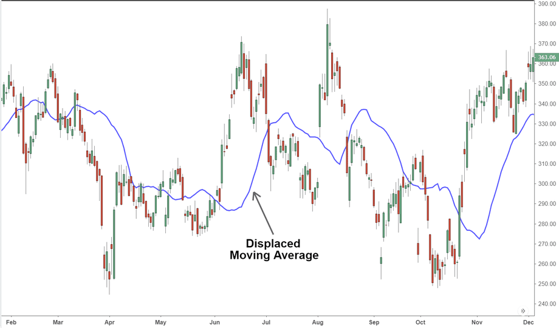

The Displaced Moving Average (DMA) is a sophisticated tool used by traders to enhance their trading strategies. To understand its utility, it’s crucial to first grasp the concept of moving averages and their role in trend analysis. Moving averages are statistical calculations used to analyze data points by creating averages of different subsets of the complete dataset. They serve as smoothing mechanisms for price data, clearing out short-term fluctuations and highlighting long-term trends. The two most commonly used moving averages in trading are the Simple Moving Average (SMA) and the Exponential Moving Average (EMA).

While traditional moving averages compute averages over specific periods, the Displaced Moving Average introduces a unique approach by shifting this average either forward or backward along the time axis. This displacement can provide traders with advanced signals compared to conventional moving averages. For instance, by shifting the moving average ahead, traders might receive potential buy or sell signals earlier than they would with non-displaced moving averages.



Algorithmic trading, which involves utilizing algorithms to automate trading decisions, has grown rapidly, increasing the importance of sophisticated tools like DMA. DMAs offer the advantage of providing traders with more timely signals, which is particularly crucial in fast-moving markets where timing can influence profitability. Thus, DMAs have become invaluable in the toolkit of algorithmic traders seeking to optimize their entry and exit points in various market conditions.

This article will explore different trading techniques that incorporate DMAs, highlighting how this tool can be leveraged to enhance trading strategies. The following sections will delve deeper into the calculation of DMAs, their distinct advantages, and the challenges traders may encounter when integrating them into their trading systems.

## Table of Contents

## Understanding Displaced Moving Averages

A Displaced Moving Average (DMA) is a variation of traditional moving averages used in trading that offers a unique approach to analyzing price trends. A moving average calculates the average value of a security's price over a specific number of periods. It smooths out price data to help identify trends by filtering out short-term fluctuations. In contrast, a DMA shifts this moving average line forward or backward on a chart by a certain number of periods, which is referred to as the "displacement."

The calculation of a Displaced Moving Average involves two key steps. First, the traditional moving average is calculated using either simple or exponential methods. The simple moving average (SMA) is obtained by summing the prices over a specified period and dividing by the number of periods. The exponential moving average (EMA), however, gives more weight to recent prices, making it more responsive to new price information. Once calculated, this moving average is then displaced by a set number of periods, either forward or backward, depending on the trader's strategy.

Python code for a Displaced Simple Moving Average (DSMA) might look like this:

```python
import pandas as pd

def calculate_dsma(prices, window, displacement):
    sma = prices.rolling(window=window).mean()
    dsma = sma.shift(periods=displacement)
    return dsma

# Example usage
prices = pd.Series([1, 2, 3, 4, 5, 6, 7, 8, 9, 10])
dsma = calculate_dsma(prices, window=3, displacement=2)
print(dsma)
```

The primary purpose of the displacement is to provide traders with advanced signals that could lead to earlier decision-making regarding entry and [exit](/wiki/exit-strategy) points. By shifting the moving average, traders aim to anticipate potential changes in trend direction more promptly than with a traditional moving average. For instance, a forward displacement may help traders identify an impending price movement before it occurs, while a backward displacement can help confirm trends as they develop.

When comparing DMAs to simple and exponential moving averages, the main difference lies in the time adjustment [factor](/wiki/factor-investing) introduced by the displacement. While SMAs and EMAs provide an average based on current or past data, DMAs adjust the placement of the moving average on the chart, potentially improving the timing of trading signals.

Displaced Moving Averages can be particularly useful in identifying trends and reversals. In a trending market, a DMA may help to reaffirm the direction of the trend, assisting traders in maintaining their positions longer. In contrast, during potential market reversals, DMAs can offer advanced warning of a change in market direction, allowing for more timely exits or entries. This capability makes DMAs a versatile tool in a trader's arsenal, especially when aiming to navigate unpredictable market conditions.

## Advantages of Using DMA in Trading

Displaced Moving Averages (DMAs) offer several advantages that can enhance trading strategies, especially in today's fast-paced financial markets. One key benefit is their ability to reduce market noise, which is crucial for traders seeking to identify genuine trends amidst the [volatility](/wiki/volatility-trading-strategies) often observed in asset prices. By shifting the moving average forward or backward in time, DMAs help smooth out erratic price movements, thus providing a clearer picture of the underlying trend. This smoothing effect aids traders in focusing on the essential patterns and trends rather than being misled by insignificant fluctuations.

Another significant advantage of DMAs is their provision of advanced signals for entry and exit points. In trading, timing is crucial, and DMAs provide a mechanism to anticipate market movements. By displacing the moving average, traders can potentially gain insights into future price actions, enabling them to enter or exit positions earlier than they would with traditional moving averages. This early signal capability can be instrumental in optimizing trading decisions, leading to more favorable trade outcomes. The advance information provided by a DMA can be vital in capturing profits in fast-moving markets or avoiding losses during downturns.

DMAs are also remarkably adaptable to various market conditions, which broadens their applicability across different trading environments. Whether the market is trending or range-bound, DMAs can be fine-tuned to suit the specific market dynamics. By adjusting the length and displacement parameters, traders can tailor DMAs to align with their unique trading styles and objectives. This adaptability allows for a versatile approach that can be adjusted based on historical performance, expected volatility, and other market factors. 

Successful trading scenarios involving DMAs often illustrate their effectiveness in diverse market conditions. For instance, during a strong upward trend, a positively displaced moving average can help confirm the trend's strength, keeping traders in the market longer to maximize gains. Conversely, a negatively displaced moving average during a downward trend can provide early warning signs of reversals, allowing traders to exit positions before significant losses occur. Such strategic adjustments underscore the importance of DMAs in enhancing a trader's ability to respond dynamically to market changes.

In summary, the incorporation of DMAs in trading strategies affords traders various benefits, including noise reduction, early signaling, and adaptability across market conditions. These advantages make DMAs a valuable tool in crafting robust and responsive trading strategies.

## Common Techniques for DMA in Algorithmic Trading

Displaced Moving Averages (DMAs) are integral components of [algorithmic trading](/wiki/algorithmic-trading), offering diverse techniques that can enhance trading strategies. These techniques provide traders with innovative ways to analyze market trends and make informed decisions. This section outlines some popular strategies involving DMAs, discussing their implementation and potential benefits.

**Momentum-Based Strategies**

Traders can use DMAs for [momentum](/wiki/momentum)-based strategies by analyzing the direction and strength of price movements. A DMA shifts the moving average forward or backward in time, helping traders to detect momentum changes more clearly. By identifying the start or continuation of a trend earlier than traditional moving averages, DMAs enable traders to capitalize on sustained price movements. Momentum traders typically look for situations where the price is consistently above a positively displaced DMA, indicating strong upward momentum, or below a negatively displaced DMA for downward momentum.

**Crossover Strategies**

Crossover strategies using DMAs are a common technique because they offer straightforward signals. In a crossover strategy, traders typically use two DMAs with different displacement periods. A buy signal is generated when a shorter DMA crosses above a longer DMA, suggesting the start of an upward trend. Conversely, a sell signal occurs when the shorter DMA crosses below the longer one, indicating a potential downward trend. This method can help traders identify changes in trend direction and improve their timing of entry and exit points. 

**Multi-Indicator Systems**

Incorporating DMAs into multi-indicator systems can enhance accuracy by confirming signals from other technical indicators. Traders often combine DMAs with tools like the Relative Strength Index (RSI) or the Moving Average Convergence Divergence (MACD) to filter out false signals and validate potential trades. For example, a trader might wait for DMA crossover confirmation along with an RSI divergence before executing a trade, thereby increasing the likelihood of a successful outcome.

**Case Studies and Examples**

To illustrate the effectiveness of DMAs, consider a hypothetical algorithmic trading system designed for the Forex market. The system uses a DMA crossover strategy combined with MACD histograms to generate buy and sell signals. The algorithm backtests the hybrid model on historical data, demonstrating how DMA crossovers align with MACD buy/sell patterns, leading to profitable trades. These case studies underscore the potential of DMAs to refine trading algorithms by providing early trend detection and enhancing decision-making processes.

In conclusion, DMAs offer versatile techniques for algorithmic trading, facilitating momentum analysis, crossover strategies, and multi-indicator systems. By understanding and implementing these methods, traders can improve their trading algorithms' performance, achieving better market forecasts and optimized trade execution.

## Challenges and Considerations

When utilizing Displaced Moving Averages (DMAs) in trading, traders must navigate several challenges and considerations to ensure effective strategy implementation. One significant challenge is the potential for false signals, which can lead to premature or delayed market entries and exits. This occurs because DMAs, like other moving averages, can sometimes provide misleading indications in volatile and sideways markets, where price "noise" may overshadow the underlying trend. To mitigate such risks, traders can employ a multi-indicator approach, confirming DMA signals with other technical tools such as Relative Strength Index (RSI) or MACD. This potentially reduces the likelihood of acting on false signals.

Backtesting and optimization of DMA parameters are paramount to enhancing the reliability of trading strategies. Traders should meticulously backtest DMAs using historical data to determine the most effective displacement period and moving average length for their specific asset class or market conditions. For instance, Python's [backtesting](/wiki/backtesting) libraries such as Backtrader can be efficiently utilized to simulate trading strategies over past timeframes, allowing for parameter optimization and strategy refinement. The following is an example of a simple backtesting setup using Python:

```python
import backtrader as bt

# Define a custom strategy
class DMAStrategy(bt.Strategy):
    params = (('maperiod', 15), ('displacement', 3),)

    def __init__(self):
        self.dma = bt.indicators.SMA(self.data, period=self.params.maperiod)      
        self.dma_displaced = self.dma(-self.params.displacement)

    def next(self):
        if not self.position:  # Check if we are in the market
            if self.data.close > self.dma_displaced:
                self.buy()  # Go long
        elif self.data.close < self.dma_displaced:
            self.sell()  # Go short or close position

# Create a cerebro instance and configure data/resources
cerebro = bt.Cerebro()
# Add your own data and strategy here
```

Market conditions can significantly influence the performance of DMAs. In trending markets, DMAs can offer timely entry and exit points, but in ranging markets, they may produce unreliable signals. Thus, traders need to assess market conditions continually and may choose to adjust DMA parameters or opt for alternative strategies when the market starts consolidating.

Risk management techniques are crucial when employing DMAs to protect against significant losses and capital depletion. Effective risk management may involve setting stop-loss orders, adjusting position sizes based on the volatility of the asset, and continuously monitoring market exposure. Additionally, employing a risk-reward ratio and determining potential loss thresholds before entering trades can aid traders in maintaining discipline and minimizing potential downsides.

In conclusion, while DMAs offer valuable insight into potential market trends, traders must address inherent challenges by employing robust risk management, comprehensive backtesting, and strategy optimization to enhance performance across varying market conditions.

## Conclusion

The Displaced Moving Average (DMA) has emerged as a significant tool in enhancing trading strategies, offering unique insights that are crucial for traders aiming for precision and reliability in their market analyses. Throughout the discussion, it has been clear that DMAs not only complement traditional moving averages but extend their utility by providing advanced signals which can be critical in timing market entry and exit points more effectively.

Traders are encouraged to integrate DMAs into a diversified trading approach due to their ability to refine signal detection and adapt to various market conditions. By effectively reducing market noise and identifying emerging trends, DMAs assist traders in making informed decisions supported by quantifiable data.

As financial markets continue to evolve, the importance of ongoing learning and adaptation cannot be overstated. Embracing new techniques and technologies, including DMAs, can offer a competitive edge. It's essential for traders to continually refine their strategies and remain open to incorporating innovative methods.

Finally, traders are invited to further research and experiment with DMAs in their trading endeavors. This hands-on approach, supplemented by thorough backtesting and optimization of DMA parameters, will provide valuable practical insights and foster a deeper understanding of how DMAs can be tailored to suit individual trading styles and objectives.

## References & Further Reading

[1]: ["Technical Analysis of the Financial Markets: A Comprehensive Guide to Trading Methods and Applications"](https://www.amazon.com/Technical-Analysis-Financial-Markets-Comprehensive/dp/0735200661) by John J. Murphy

[2]: Pring, Martin J. (2002). ["Technical Analysis Explained: The Successful Investor's Guide to Spotting Investment Trends and Turning Points."](https://www.amazon.com/Technical-Analysis-Explained-Fifth-Successful/dp/0071825177)

[3]: Elder, Dr. Alexander. (1993). ["Trading for a Living: Psychology, Trading Tactics, Money Management"](https://www.amazon.com/Trading-Living-Psychology-Tactics-Management/dp/0471592242)

[4]: ["Algorithmic Trading & DMA: An Introduction to Direct Access Trading Strategies"](https://www.amazon.com/Algorithmic-Trading-DMA-introduction-strategies/dp/0956399207) by Barry Johnson

[5]: ["High-Frequency Trading and Probability Theory"](https://worldscientific.com/worldscibooks/10.1142/9233) by Irene Aldridge

[6]: Chande, Tushar S. (1997). ["Beyond Technical Analysis: How to Develop and Implement a Winning Trading System"](https://cdn.preterhuman.net/texts/finance_and_marketing/stock_market/Chande,%20Tushar%20-%20Technical%20Analysis%20-%20How%20To%20Develop%20And%20Imp.pdf)