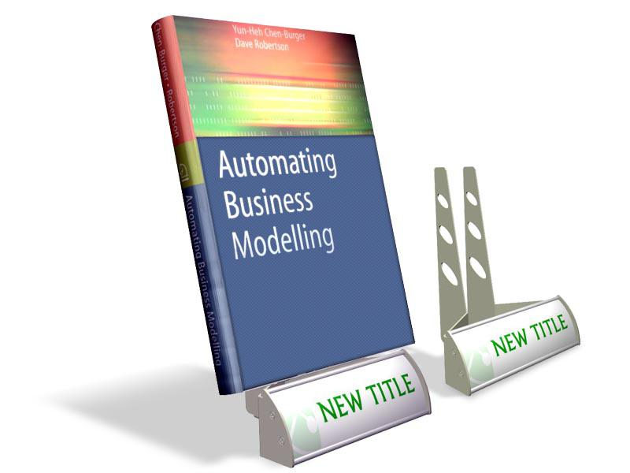

In the rapidly evolving world of finance, algorithmic trading has become a cornerstone for traders seeking efficiency and precision. This process involves using advanced mathematical models and algorithms to make high-speed trading decisions, leaving minimal room for human error and maximizing market opportunities. Traders and financial institutions rely on algorithmic trading to execute large volumes of orders with speed and accuracy that manual trading cannot achieve.

This article explores the intricacies of stock market trading systems, focusing on the Display Book and its evolution into modern algorithmic trading platforms. The Display Book was a milestone in the history of the New York Stock Exchange (NYSE), representing one of the first attempts to automate the process of recording and executing trades digitally. By managing trade orders and executions, the Display Book played a critical role in increasing market efficiency during its time.



Readers will gain insights into how these systems operate and the benefits they offer to today's traders. As technological advancements continue to shape the financial landscape, understanding the historical and contemporary applications of these systems is essential. This knowledge provides traders with the tools to adapt to new market conditions and leverage the potential of current technologies.

Our discussion covers the historical context, current applications, and future trends in algorithmic trading. As we look forward, the integration of artificial intelligence (AI) and machine learning into these systems promises even greater potential for innovation. The ongoing development and refinement of trading algorithms ensure they remain integral to modern financial markets, offering improved accuracy, speed, and strategic capabilities.

Through this comprehensive examination, the article aims to provide a detailed understanding of how algorithmic trading systems, like the Display Book, have evolved and what the future may hold for this critical component of global financial markets. As traders and institutions face continuous advancements, staying informed about these changes is key to maintaining a competitive edge.

## Table of Contents

## The Evolution of Stock Market Trading Systems

Stock market trading has undergone a remarkable transformation over the decades, driven by continuous technological advancements. The evolution began from a predominantly manual process, heavily reliant on individual brokers conducting trades through face-to-face interactions and via telephones. Brokers tirelessly managed order [books](/wiki/algo-trading-books), often physically present on the trading floors, using hand signals and verbal communication, a method that was not only time-consuming but also prone to human error.

The advent of computer systems in the 1970s initiated a new era in stock market trading. These systems introduced a level of speed and precision previously unattainable through manual methods. Electronic communication networks (ECNs) began to emerge, enabling more efficient matching of buy and sell orders, thereby reducing transaction times and minimizing potential mismatches.

A significant milestone in this evolution was the introduction of the NYSE Display Book system. This proprietary system by the New York Stock Exchange revolutionized trading by digitizing the order flow and facilitating more transparent order tracking. The Display Book was responsible for managing the lifecycle of market orders, including aspects like order types, pricing, timing, and quantities. By digitizing these records, the Display Book reduced latency and human error, contributing to faster transaction processing and improved accuracy in trade executions. Moreover, it allowed specialists on the exchange to manage orders more effectively, offering enhanced market oversight and execution quality.

As market demands grew and technology progressed, the limitations of the Display Book and similar systems began to surface. These older systems struggled to cope with the increasing complexity and speed required by the rapidly modernizing financial markets. This necessitated the development of more advanced trading platforms that could handle higher volumes, various equity products, and integrate seamlessly into a global market space with reduced latency.

In summary, the transformation from manual trading systems to sophisticated electronic platforms marks a pivotal shift in stock market trading. The introduction of computer-assisted systems and the pivotal role of platforms like the NYSE Display Book underscore the industry's move towards greater efficiency and precision, laying the groundwork for future innovations in trading technology.

## Understanding The Display Book

The Display Book was a pivotal proprietary system utilized by the New York Stock Exchange (NYSE) for the management of trade orders and executions. As a central component of the trading process, its primary function was to meticulously track market orders. This included essential details such as the type of order placed, the price at which it was executed, the precise time of the order, and the quantity involved. The system was essentially a comprehensive digital record keeper, offering a precise and reliable method for handling market orders under the watchful eye of specialists on the exchange.

The role of the Display Book was crucial in maintaining an orderly marketplace. It facilitated the accurate recording and execution of trades, ensuring that transactions were carried out smoothly and without unnecessary delay. Specialists—a select group of highly experienced traders—leveraged the Display Book to match buy and sell orders, thus ensuring [liquidity](/wiki/liquidity-risk-premium) and price stability on the trading floor. This system represented a significant step forward from the time when manual recording dominated, introducing a higher level of precision and efficiency.

However, as market demands evolved and expanded in complexity, the limitations of the Display Book became more pronounced. The proliferation of financial products, coupled with an increasing [volume](/wiki/volume-trading-strategy) of trades and the introduction of global trading, required more sophisticated technology. Consequently, the Display Book was eventually retired in favor of more advanced trading systems. These new systems were designed to handle higher trading volumes, offer enhanced functionalities, and meet the expectations of a rapidly changing and increasingly automated financial environment. In transitioning to these advanced systems, the NYSE ensured it remained at the forefront of technological innovation in stock trading.

## Transition to Universal Trading Platform (UTP)

The development of the Universal Trading Platform (UTP) by the New York Stock Exchange (NYSE) marked a significant evolution from the systems that preceded it, particularly the Display Book. As financial markets grew more complex, with a greater variety of equity products and an increasing shift towards global integration, the limitations of the Display Book became apparent. One of the most pressing challenges was the need for reduced latency, a critical [factor](/wiki/factor-investing) in the fast-paced environment of modern stock exchanges where even milliseconds can influence trading outcomes.

The UTP was designed to tackle these burgeoning demands, providing a more comprehensive and efficient trading solution. It combined the core functionalities of the Display Book with advancements in technology to enhance the overall trading process. This integration allowed for a more seamless operation, supporting a broader range of products and trading strategies. The UTP efficiently managed not just the volume of trades but also the complexity, thereby offering a platform capable of handling both current and anticipated future needs.

Furthermore, the UTP facilitated global market integration by providing a platform that could easily interact with international trading systems. This was crucial in an era where financial markets are increasingly interconnected, requiring platforms that support multi-market access and compliance with various international regulations.

In terms of operational enhancements, the UTP addressed issues with latency through the use of faster data processing technologies and algorithms that could execute trades with greater speed and accuracy. By improving data throughput and reducing delays in trade execution, the UTP provided traders with a more reliable and efficient tool for engaging in high-frequency trading and other time-sensitive strategies.

Overall, the transition to the Universal Trading Platform represented a necessary step forward in the evolution of stock market trading systems, enabling the NYSE to remain competitive in an ever-evolving financial landscape.

## The Rise of Algorithmic Trading

Algorithmic trading, often referred to as algo trading, represents a significant advancement in the automation of financial trading processes. This method employs algorithms, which are sets of predefined rules and strategies, to execute trades with minimal human intervention. This automation allows for faster and more precise trade execution, often outperforming manual trading processes.

At the core of [algorithmic trading](/wiki/algorithmic-trading) are complex algorithms designed to analyze vast datasets quickly and execute trades at optimal speeds. These algorithms consider various factors such as timing, price, and volume to make trading decisions. The use of technology enables traders to execute trades in milliseconds, a speed unattainable by human traders. This capability is crucial in markets where price fluctuations can occur in fractions of a second, potentially impacting trade profitability.

One of the primary benefits of algorithmic trading is its ability to reduce human error. Manual trading is prone to mistakes due to emotion-driven decision-making and fatigue. Algorithms, devoid of emotions, execute trades based on logic and data, leading to more consistent and reliable outcomes. This precision enhances the efficiency of trade execution, as trades are made based on strict criteria without the influence of external emotional factors.

Another significant advantage of algorithmic trading is the capacity for [backtesting](/wiki/backtesting) strategies. Backtesting involves running algorithms through historical market data to gauge their effectiveness before deployment in live markets. This process allows traders to refine their strategies, ensuring the algorithms perform optimally under various market conditions. By identifying potential weaknesses and adjusting strategies accordingly, traders can minimize risks and improve returns over time.

In summary, the rise of algorithmic trading has transformed the landscape of financial markets by automating complex trading processes, reducing human errors, and providing tools for thorough strategy assessment through backtesting. As technology continues to evolve, the role and sophistication of algorithmic trading are expected to expand, further enhancing the capabilities and opportunities available to modern traders.

## Integrating AI in Algorithmic Trading

Recent advancements in [artificial intelligence](/wiki/ai-artificial-intelligence) (AI) have significantly transformed trading strategies within algorithmic trading, leading to enhanced decision-making processes. AI models, unlike traditional statistical methods, possess the ability to learn and adapt rapidly to dynamic market environments, thereby predicting trends with higher accuracy and speed. 

Machine learning, a subset of AI, plays a pivotal role in improving pattern recognition capabilities in trading algorithms. Unlike conventional methods which rely on static data points and predetermined models, [machine learning](/wiki/machine-learning) algorithms dynamically adjust to new data, recognizing intricate patterns and relationships that may not be immediately apparent. Techniques such as supervised learning, unsupervised learning, and [reinforcement learning](/wiki/reinforcement-learning) are extensively employed to fine-tune trading models.

In supervised learning, models are trained on a known dataset that includes input-output pairs, allowing them to predict outcomes for unseen data. For instance, using historical market data, a supervised learning model can predict future stock prices by learning from past trends:

```python
from sklearn.model_selection import train_test_split
from sklearn.linear_model import LinearRegression
import numpy as np
import pandas as pd

# Simulating some historical market data
data = {
    'historical_price': [101, 102, 103, 104, 105],
    'future_price': [105, 106, 107, 108, 109]
}

df = pd.DataFrame(data)

# Split data into features and target
X = df[['historical_price']]
y = df['future_price']

# Training and testing dataset split
X_train, X_test, y_train, y_test = train_test_split(X, y, test_size=0.2, random_state=42)

# Implementing Linear Regression
model = LinearRegression()
model.fit(X_train, y_train)

# Predicting future prices
predictions = model.predict(X_test)
```

Unsupervised learning, on the other hand, identifies hidden patterns within unlabelled data. It is particularly useful for clustering similar trading behaviors or detecting anomalies, such as unusual trading volumes or unexpected market movements.

Reinforcement learning, distinguished by its reward-based approach, allows trading models to make a sequence of decisions, continuously learning from the results of prior actions to maximize returns. This paradigm mimics human decision-making and adapts over time, learning optimal trading strategies through interaction with the market.

The integration of AI into algorithmic trading also enables enhanced risk management. By analyzing vast datasets with minimal latency, AI-driven algorithms can swiftly assess risk factors and execute trades that account for both current market conditions and historical data trends. 

Overall, AI provides a strategic advantage by improving the speed and accuracy of trade executions and by offering deeper insights derived from complex market pattern analyses, thus contributing to more informed and effective decision-making in trading operations.

## Future Trends in Algo Trading

Algorithmic trading stands at the frontier of technological and financial innovation, with its future trajectory closely tied to emerging technologies like artificial intelligence (AI) and quantum computing. The integration of AI allows for the enhancement of trading strategies through predictive analytics, machine learning, and natural language processing. These capabilities facilitate real-time decision-making and adaptive learning from market data, which can improve trade execution and predictive accuracy. A key area of growth is the use of AI to dynamically adjust trading algorithms based on changing market conditions, enabling traders to respond to market shifts more rapidly than conventional statistical methods.

Quantum computing presents another promising avenue, potentially transforming the landscape of algo trading. Quantum algorithms could solve complex optimization problems at unprecedented speeds, potentially leading to more efficient trade execution strategies and risk assessment models. While still in early stages of development, research suggests that quantum computers can process and analyze large datasets faster than classical computers, offering a profound impact on trading speed and data analysis capabilities.

Regulatory changes and market transparency initiatives are expected to significantly influence the evolution of algorithmic trading. Authorities are becoming increasingly vigilant about ensuring fair and equitable trading practices, particularly in light of the rapid advancements in technology that can obscure transparency. Regulatory bodies may impose stricter guidelines to monitor and control algorithmic activities, aiming to prevent market manipulation and ensure a level playing field for all market participants.

There is also a notable trend towards democratizing algorithmic trading by making it accessible to retail investors. This democratization involves simplifying the tools and platforms required for algo trading, allowing smaller investors to leverage similar technologies that were once exclusive to large financial institutions. Technological advancements and cost reductions in computing power make it feasible to create platforms that are user-friendly for retail investors, potentially opening new market opportunities and encouraging a broader participation in financial markets.

In summary, the future of algorithmic trading will be shaped by technological advancements in AI and quantum computing, regulatory frameworks to ensure transparency and fairness, and initiatives aimed at democratizing access for retail investors. These trends suggest a continued transformation of financial markets, with algorithmic trading becoming increasingly integral to investment strategies worldwide.

## Conclusion

Algorithmic trading, a pivotal development in financial markets, continues to redefine trading operations by enhancing efficiency, speed, and precision. Through automation, traders can execute complex strategies with reduced latency, minimizing human error. The evolution from systems such as the NYSE Display Book to advanced trading platforms exemplifies the industry's ongoing transformation.

As technology advances, traders must adapt to maintain their competitive advantage. The incorporation of artificial intelligence (AI) offers predictive capabilities that surpass traditional methods. Machine learning algorithms analyze vast datasets swiftly, providing nuanced trading insights. These innovations are not merely accelerative but transformative, enabling traders to anticipate market movements with increased accuracy.

Understanding the progression from early systems like Display Book to modern algorithmic trading platforms is vital for thriving in contemporary markets. This knowledge equips traders with the necessary tools to leverage current technologies effectively. By staying informed about these technological developments, traders can harness the benefits of algorithmic trading, ensuring sustained success in a rapidly evolving financial landscape.

## References & Further Reading

[1]: Bergstra, J., Bardenet, R., Bengio, Y., & Kégl, B. (2011). ["Algorithms for Hyper-Parameter Optimization."](https://dl.acm.org/doi/10.5555/2986459.2986743) Advances in Neural Information Processing Systems 24.

[2]: ["Advances in Financial Machine Learning"](https://www.amazon.com/Advances-Financial-Machine-Learning-Marcos/dp/1119482089) by Marcos Lopez de Prado

[3]: ["Evidence-Based Technical Analysis: Applying the Scientific Method and Statistical Inference to Trading Signals"](https://www.amazon.com/Evidence-Based-Technical-Analysis-Scientific-Statistical/dp/0470008741) by David Aronson

[4]: ["Machine Learning for Algorithmic Trading"](https://github.com/stefan-jansen/machine-learning-for-trading) by Stefan Jansen

[5]: ["Quantitative Trading: How to Build Your Own Algorithmic Trading Business"](https://www.amazon.com/Quantitative-Trading-Build-Algorithmic-Business/dp/1119800064) by Ernest P. Chan

[6]: Hasbrouck, J. (2003). ["Intraday Price Formation in U.S. Equity Markets,"](https://onlinelibrary.wiley.com/doi/10.1046/j.1540-6261.2003.00609.x) The Journal of Finance, 58(6), 2375-2404.

[7]: Hendershott, T., Jones, C. M., & Menkveld, A. J. (2011). ["Does Algorithmic Trading Improve Liquidity?"](https://onlinelibrary.wiley.com/doi/full/10.1111/j.1540-6261.2010.01624.x) The Review of Financial Studies, 24(8), 2623-2654.

[8]: O'Hara, M. (2015). ["High Frequency Market Microstructure,"](https://www.sciencedirect.com/science/article/pii/S0304405X15000045) Annual Review of Financial Economics, 7, 31-50.

[9]: Aldridge, I. (2013). ["High-Frequency Trading: A Practical Guide to Algorithmic Strategies and Trading Systems"](https://www.amazon.com/High-Frequency-Trading-Practical-Algorithmic-Strategies/dp/1118343506), 2nd Edition.