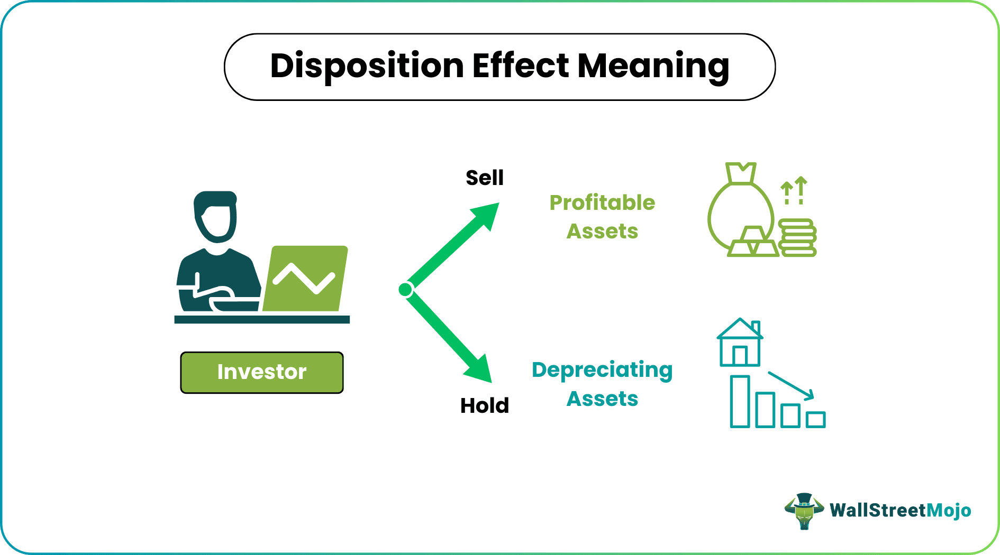

## Table of Contents

## What is disposition in the context of investing?

In the world of investing, disposition refers to the act of selling an asset, such as a stock, bond, or property. When an investor decides to sell their investment, they are said to be disposing of it. This action can be driven by various reasons, such as the need to realize profits, cut losses, or rebalance their investment portfolio.

Disposition is an important concept because it directly impacts an investor's returns and tax obligations. For example, if an investor sells a stock at a higher price than they bought it, they make a profit, known as a capital gain. On the other hand, selling at a lower price results in a capital loss. Additionally, the timing and type of disposition can affect the taxes an investor has to pay, making it crucial to consider these factors when deciding to sell an investment.

## Why is understanding disposition important for investors?

Understanding disposition is important for investors because it helps them know when to sell their investments. If an investor can sell at the right time, they can make more money or lose less money. For example, if they see that a stock's price is going up a lot, they might decide to sell it to take their profits. Or, if a stock is losing value, they might sell it to stop losing more money.

Disposition also affects the taxes investors have to pay. When investors sell something for more than they paid for it, they have to pay taxes on the profit, which is called a capital gain. If they sell it for less, they can use that loss to reduce their taxes. Knowing about disposition helps investors plan their sales to pay less in taxes. This can make a big difference in how much money they keep at the end of the day.

## How can disposition affect investment decisions?

Disposition can affect investment decisions because it's about when and why to sell your investments. If you know when to sell, you can make more money or lose less. For example, if you see that a stock's price is going up a lot, you might decide to sell it to take your profits. Or, if a stock is losing value, you might sell it to stop losing more money. Understanding disposition helps you decide the best time to sell, which can make a big difference in how much money you make or lose.

Disposition also affects how much tax you have to pay. When you sell something for more than you paid for it, you make a profit, called a capital gain, and you have to pay taxes on that profit. If you sell it for less, you have a loss, and you can use that loss to reduce your taxes. Knowing about disposition helps you plan when to sell to pay less in taxes. This can make a big difference in how much money you keep at the end of the day.

## What are common disposition biases that investors face?

One common disposition bias that investors face is called the disposition effect. This is when investors are more likely to sell investments that have gone up in value, to take their profits, and keep holding onto investments that have gone down in value, hoping they will go back up. This can be a problem because it might make investors miss out on even bigger gains from their winning investments and keep losing money on their losing investments.

Another common bias is loss aversion. This means that investors feel the pain of losing money more than the joy of making money. Because of this, they might hold onto losing investments for too long, hoping they will recover, instead of selling them and moving on. This can lead to bigger losses if the investments keep going down.

These biases can affect how much money investors make or lose. It's important for investors to be aware of these biases and try to make decisions based on facts and good planning, not just feelings.

## How can beginners identify their own disposition biases?

Beginners can start by looking at their past investment decisions. If they often sell stocks that have gone up in value but hold onto stocks that have gone down, they might have the disposition effect bias. This means they like to take profits quickly but are afraid to accept losses. To spot this, they can keep a record of when they buy and sell investments and see if there's a pattern. If they notice they're doing this a lot, they can try to be more patient with their winners and cut their losses faster with their losers.

Another way to identify biases is by paying attention to their feelings when making investment decisions. If they feel really bad about selling a stock at a loss, they might be dealing with loss aversion. This is when the fear of losing money makes them hold onto bad investments for too long. To check for this, beginners can ask themselves how they feel about selling a stock that's losing money. If the thought of selling at a loss makes them very uncomfortable, they might need to work on overcoming this bias by focusing on the long-term benefits of cutting their losses.

By keeping an eye on their actions and emotions, beginners can become more aware of their disposition biases. This awareness can help them make better investment decisions and avoid common mistakes that can hurt their returns.

## What strategies can be used to mitigate the impact of disposition biases?

One strategy to mitigate the impact of disposition biases is to set clear rules for buying and selling investments. For example, investors can use stop-loss orders to automatically sell a stock if it falls to a certain price. This helps them avoid holding onto losing investments for too long due to loss aversion. They can also set target prices for when to sell winning investments, which can help them avoid selling winners too soon because of the disposition effect. By following these rules, investors can make decisions based on their plan instead of their emotions.

Another helpful strategy is to keep a journal of investment decisions. Writing down why they bought or sold a stock can help investors see if they're making choices based on facts or feelings. If they notice they often sell winners quickly but hold onto losers, they can work on changing this pattern. Regularly reviewing their journal can make investors more aware of their biases and help them make better choices in the future.

Lastly, seeking advice from a financial advisor or joining an investment club can provide a different perspective. Talking to others about investment decisions can help investors see their biases more clearly. A financial advisor can offer objective advice and help create a plan that takes into account the investor's goals and risk tolerance. Being part of a group can also make it easier to stick to a plan and avoid making emotional decisions.

## Can disposition affect long-term investment performance? How?

Disposition can affect long-term investment performance because it influences when and why investors choose to sell their investments. If investors often sell their winning investments too soon because of the disposition effect, they might miss out on bigger gains. On the other hand, if they hold onto losing investments for too long because of loss aversion, they could lose more money. Over time, these habits can lead to lower overall returns because they're not making the best use of their winning investments and are letting their losing investments drag down their portfolio.

To improve long-term performance, investors need to be aware of their disposition biases and try to make decisions based on a clear plan rather than emotions. Setting rules like stop-loss orders and target prices can help them sell at the right times. Keeping a journal of their decisions can also help them see if they're making choices based on feelings or facts. By being more aware and sticking to a plan, investors can make better decisions that lead to better long-term results.

## How does disposition relate to risk tolerance in investing?

Disposition and risk tolerance are closely connected in investing. Risk tolerance is about how much risk an investor is willing to take with their money. If an investor has a high risk tolerance, they might be okay with holding onto an investment that's losing value, hoping it will go back up. On the other hand, someone with a low risk tolerance might sell that same investment quickly to avoid losing more money. So, understanding your risk tolerance can help you decide when to sell, which is part of your disposition.

Disposition is about the decisions to sell investments, and these decisions are often influenced by an investor's risk tolerance. For example, if you have a low risk tolerance, you might sell your investments more often to avoid big losses. This can lead to selling winners too soon and holding losers too long, which is known as the disposition effect. By knowing your risk tolerance, you can set rules for selling that match your comfort level with risk, helping you make better disposition decisions and manage your investments more effectively over time.

## What role does emotional intelligence play in managing disposition in investing?

Emotional intelligence is really important when it comes to managing disposition in investing. It's about understanding and handling your feelings well. When you know your emotions, you can stop them from making you sell or buy investments at the wrong times. For example, if you feel really scared when a stock goes down, you might want to sell it quickly. But if you have good emotional intelligence, you can think about the facts and your plan instead of just acting on fear. This helps you make better choices about when to sell your investments.

Having good emotional intelligence also helps you deal with the ups and downs of the stock market without getting too upset. It lets you keep a cool head and stick to your investment plan. When you can manage your emotions well, you're less likely to fall into common traps like selling winners too soon or holding onto losers for too long. By being aware of your feelings and using them in a smart way, you can make better disposition decisions and do better in your investments over time.

## How do experienced investors use disposition to their advantage?

Experienced investors use disposition to their advantage by carefully planning when to sell their investments. They set clear rules for selling, like using stop-loss orders to automatically sell a stock if it drops too much. This helps them avoid holding onto losing investments for too long. They also set target prices for when to sell winning investments, so they don't sell them too soon. By sticking to these rules, they can make decisions based on their plan instead of their emotions, which helps them make more money over time.

Another way experienced investors use disposition to their advantage is by being aware of their own biases. They know about things like the disposition effect, where people sell winners too soon and hold onto losers too long. To avoid this, they keep a journal of their decisions and look for patterns. If they see they're making choices based on feelings instead of facts, they can change their approach. This helps them sell at the right times and manage their investments better in the long run.

## What are some advanced techniques for analyzing disposition in investment portfolios?

Experienced investors use advanced techniques to analyze disposition in their investment portfolios by looking at historical data and using software tools. They study past sales to see if they sold too soon or held onto losers for too long. They might use software that helps them see patterns in their decisions, like if they often sell winners quickly or keep losers too long. This helps them understand their biases and make better choices in the future. They also look at how their selling decisions affect their taxes, trying to plan sales to pay less in taxes.

Another technique is using quantitative analysis to set up rules for selling investments. This means they use math and data to decide when to sell. For example, they might use algorithms that tell them to sell a stock if it drops a certain percentage or if it reaches a certain price. This helps them stick to a plan and not let emotions get in the way. By using these advanced techniques, experienced investors can make better disposition decisions and improve their long-term investment performance.

## How can disposition be integrated into a comprehensive investment strategy?

Disposition, or deciding when to sell investments, is a key part of a complete investment plan. Experienced investors think about disposition carefully because it affects how much money they make or lose. They set clear rules for when to sell, like using stop-loss orders to sell a stock if it falls too much, or target prices to sell when a stock goes up a lot. By sticking to these rules, they can make decisions based on their plan, not just their feelings. This helps them sell at the right times and avoid common mistakes like selling winners too soon or holding onto losers for too long.

To include disposition in their overall strategy, investors also look at how selling affects their taxes. They might plan to sell some investments at certain times to pay less in taxes. They keep a record of when they buy and sell and look for patterns in their decisions. If they see they're making choices based on feelings instead of facts, they can change their approach. By being aware of their biases and using tools like software to study their past decisions, investors can make better choices about when to sell. This helps them manage their investments well and do better in the long run.

## References & Further Reading

[1]: ["Advances in Financial Machine Learning"](https://www.amazon.com/Advances-Financial-Machine-Learning-Marcos/dp/1119482089) by Marcos Lopez de Prado

[2]: ["Evidence-Based Technical Analysis: Applying the Scientific Method and Statistical Inference to Trading Signals"](https://www.amazon.com/Evidence-Based-Technical-Analysis-Scientific-Statistical/dp/0470008741) by David Aronson

[3]: ["Machine Learning for Algorithmic Trading"](https://github.com/stefan-jansen/machine-learning-for-trading) by Stefan Jansen

[4]: ["Quantitative Trading: How to Build Your Own Algorithmic Trading Business"](https://www.amazon.com/Quantitative-Trading-Build-Algorithmic-Business/dp/1119800064) by Ernest P. Chan

[5]: Barker, K. (2020). ["Algorithmic Trading and the Efficient Market Hypothesis."](https://www.researchgate.net/publication/378548435_Algorithmic_Trading_and_AI_A_Review_of_Strategies_and_Market_Impact) The Journal of Financial Markets.