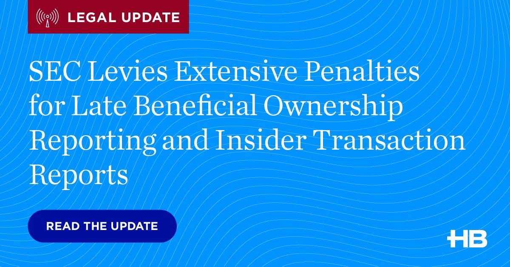

The world of finance is undergoing a seismic shift with the proliferation of algorithmic trading, which has revolutionized how trades are conducted. Algorithmic trading leverages computer-based algorithms to make trading decisions, resulting in increased speed and efficiency. This technological advancement has reshaped traditional trading, allowing for complex strategies to be executed in milliseconds. Consequently, the markets have seen a remarkable transformation, characterized by high-frequency trading and enhanced liquidity.

However, the rapid advancement of algorithmic trading carries inherent challenges, primarily for regulatory bodies tasked with ensuring market integrity. The U.S. Securities and Exchange Commission (SEC) is at the forefront of this regulatory battle, striving to maintain balance within increasingly automated markets. With the rise of algorithmic trading, there is heightened concern over issues such as market manipulation, flash crashes, and systemic risks that pose a threat to financial stability.

The SEC's role in maintaining market integrity involves a multifaceted approach, including the enforcement of regulatory actions and the imposition of financial penalties. These measures are vital in deterring misconduct and promoting accountability among market participants. The SEC's oversight focuses on ensuring transparency, enforcing compliance with securities laws, and safeguarding investor interests, all of which are crucial in preserving the trust and smooth functioning of financial markets.

This article examines how the SEC addresses misconduct within algorithmic trading and delineates the consequences of such actions through fines and penalties. Understanding these regulatory interventions is essential in appreciating their implications for financial markets and for those engaged in algorithmic trading. The exploration of the SEC's actions highlights the importance of regulatory oversight in an era where innovation in trading technology is relentless, raising questions about how best to balance advancement with accountability.

## Table of Contents

## Understanding Algorithmic Trading and Its Risks

Algorithmic trading employs computerized systems that execute trading orders with minimal human intervention. These systems leverage mathematical models and algorithms to make trading decisions quickly and accurately, with the primary aim of maximizing profits or minimizing risks. The advantages offered by algorithmic trading include enhanced speed—owing to the capability of executing complex computations and orders faster than any human could process—and increased accuracy, as it alleviates human errors that could occur due to fatigue or oversight.

Despite its benefits, algorithmic trading inherently carries significant risks. One major concern is market manipulation, where algorithms might be programmed to exploit market mechanics unfairly or create misleading market activity. A notable example includes the practice of "spoofing," where traders place fraudulent orders to create a false sense of demand or supply, only to cancel them before execution.

The potential for systemic risk is another critical concern. Systemic risk arises when issues within algorithmically-controlled trading systems cascade through financial markets, potentially resulting in widespread disruption. The "Flash Crash" of May 6, 2010, exemplifies this vulnerability. During this event, the Dow Jones Industrial Average plunged nearly 1,000 points, approximately nine percent, only to recover most of the losses minutes later. The incident was partially attributed to high-frequency trading algorithms interacting in unforeseen ways, triggering rapid selling and [volatility](/wiki/volatility-trading-strategies).

Algorithmic malfunctions can also lead to isolated market disruptions. One such instance occurred in 2012 with Knight Capital Group. A software error in their trading algorithms led to unintentional orders flooding the market, resulting in a loss of approximately $440 million within 45 minutes. This event illustrated how technological failures in algorithms could quickly escalate into financial catastrophes.

Mitigating these risks requires continuous improvements in algorithmic design and rigorous testing before implementation. Additionally, robust monitoring systems and regulatory frameworks are necessary to enhance transparency and accountability, reducing the likelihood of systemic disruptions.

## The Role of the SEC in Regulating Algorithmic Trading

The U.S. Securities and Exchange Commission (SEC) is tasked with the critical role of overseeing the securities markets, ensuring transparency, and safeguarding investor interests. As [algorithmic trading](/wiki/algorithmic-trading) has increasingly dominated market activities, the SEC has adapted its regulatory framework to address the complexities and risks inherent in this technologically-driven landscape.

The SEC's regulatory framework for algorithmic trading is multifaceted, focusing on preventing market manipulation, ensuring fair access, and maintaining the integrity of financial systems. One of the cornerstone initiatives is the Market Access Rule (Rule 15c3-5), which was implemented in 2010. This rule mandates that broker-dealers with market access establish risk management controls and supervisory procedures. It aims to prevent erroneous orders and protect against unauthorized access, thereby mitigating risks associated with high-speed trading environments.

Another significant initiative is Regulation SCI (System Compliance and Integrity), which was adopted in 2014. Reg SCI is designed to strengthen the technology infrastructure of securities markets, compelling key market participants to adhere to stringent standards concerning system capacity, integrity, resiliency, and security. Under this regulation, algorithmic trading firms are required to immediately report system disruptions and provide ongoing reports on their system's compliance with the defined standards. This ensures that critical market systems operate efficiently and reliably, minimizing the risks of widespread financial disruptions.

The SEC places considerable emphasis on transparency and accountability within algorithmic trading operations. By requiring detailed disclosures related to trading algorithms and strategies, the SEC aims to illuminate practices that could potentially lead to market manipulation or other adverse impacts on market stability. This transparency is crucial for regulatory bodies to effectively monitor and address potentially harmful activities before they escalate into significant financial threats.

In summary, the SEC's regulatory measures for algorithmic trading are intended to create a robust framework that supports the rapid advancement of technology in the financial markets while safeguarding market integrity and protecting investors. Through initiatives like the Market Access Rule and Reg SCI, along with a strong focus on transparency, the SEC strives to balance the efficiency gains from algorithmic trading with the need for rigorous oversight.

## Historical Overview of SEC Fines and Settlements

The U.S. Securities and Exchange Commission (SEC) has played an instrumental role in policing the activities of algorithmic trading firms, leveraging its regulatory authority to impose fines and enforce settlements as a means of maintaining market integrity. Over the years, the agency has taken several notable actions that highlight the range and intensity of punitive measures available to it when addressing misconduct in algorithmic trading.

Historically, one of the most significant shifts in SEC enforcement came during the 2010 Flash Crash, an event that underscored the vulnerabilities and risks posed by high-frequency trading algorithms. This episode prompted the SEC to increase scrutiny on algorithmic trading practices, leading to several high-profile cases and penalties. One landmark action involved a substantial fine against a major trading firm accused of engaging in market manipulation through rapid execution of a series of trades designed to create a misleading impression of market activity. This case set a precedent for identifying and penalizing "layering" or "spoofing" strategies, where traders place and then cancel orders to manipulate prices.

A notable case illustrating the SEC's enforcement approach occurred when it fined a prominent firm for inadequate controls and oversight of its trading algorithms, resulting in unintended market disruptions. The settlement involved both financial penalties and a mandate for the firm to overhaul its compliance and risk management procedures. This action underscored the SEC's commitment to preventing systemic risks by ensuring that firms have robust safeguards and controls in place.

Over time, the SEC's enforcement patterns reveal an evolving approach towards algorithmic trading misconduct, characterized by increasing financial penalties and a focus on transparency and accountability. The magnitude of fines has generally escalated, reflecting the growing complexity and potential impact of algorithmic strategies on financial markets. For instance, the agency has levied multi-million dollar fines on firms that breached market access rules, emphasizing the importance of maintaining secure and reliable automated trading systems.

Moreover, the SEC has utilized settlements as a strategic tool, not only to impose direct financial penalties but also to drive industry-wide changes in behavior. These settlements often include provisions requiring firms to enhance their compliance infrastructure and report on their progress, thereby promoting a more proactive approach to regulatory compliance across the industry.

In summary, the SEC's historical enforcement actions against algorithmic trading firms reveal a trajectory of increasingly stringent punitive measures, aiming to mitigate risks and safeguard market integrity. These actions highlight the importance of regulatory oversight in ensuring that the rapid pace of technological innovation does not compromise the stability and fairness of financial markets.

## Case Studies: Prominent SEC Actions in Algorithmic Trading

The U.S. Securities and Exchange Commission (SEC) has played a pivotal role in monitoring and regulating algorithmic trading practices by imposing significant fines and penalties on firms that breach regulatory norms. Analyzing notable cases illuminates the complexities and challenges entailed in achieving market integrity.

### Case 1: Knight Capital Group Incident

In August 2012, Knight Capital Group suffered a substantial loss of $440 million due to a software glitch that led to erroneous trades affecting 154 stocks on the NYSE. The SEC's investigation revealed inadequacies in the firm's infrastructure and procedures for deploying trading software. Knight Capital failed to ensure adequate safeguards and controls over its algorithmic systems, violating the SEC's Market Access Rule, which requires brokers and dealers to establish adequate risk management controls.

**Financial Penalty:** The SEC imposed a $12 million penalty on Knight Capital. The rationale was twofold: the firm's failure to implement and maintain effective operational controls, and the significant market disruption caused, which undermined investor confidence.

**Impact on Market Practices:** This case prompted firms to revisit their risk management strategies and technological infrastructures, emphasizing the importance of rigorous testing and quality assurance of algorithmic systems before their deployment in live markets.

### Case 2: Citadel Securities Violations

In 2017, the SEC fined Citadel Securities for misleading clients regarding the nature and quality of trade executions. The firm's algorithmic trading platform misrepresented the price improvement policies, thereby affecting the financial returns of the firm's retail clients. The SEC's findings indicated that Citadel's algorithms prioritized its trading interests over those of its clients, constituting a breach of fiduciary duty and fair practice requirements.

**Financial Penalty:** Citadel Securities agreed to a settlement of $22 million with the SEC. The penalty served as a deterrent to other firms about misrepresenting their trade execution quality—a critical component of fair trading practices.

**Impact on Regulatory Measures:** The penalty reinforced the necessity for algorithmic trading firms to maintain transparency concerning trade practices, spurring the development of enhanced disclosures to protect client interests.

### Case 3: Athena Capital Research

Athena Capital Research engaged in manipulative trading practices commonly known as "marking the close," which involves executing large numbers of trading actions in the final minutes of the trading day to manipulate closing prices of stocks. In 2014, the SEC uncovered this manipulative activity, which involved algorithm-based execution strategies designed to profit by affecting stock prices artificially.

**Financial Penalty:** Athena Capital was fined $1 million. The SEC's decision underscored that algorithm-based market manipulation is a serious offense that compromises the fairness and integrity of financial markets.

**Impact on Market Integrity:** This case highlighted the SEC's commitment to levelling trading fields by penalizing firms exploiting technological capabilities for market manipulation. It encouraged regulatory bodies to develop real-time monitoring tools to detect and prevent similar schemes.

### Conclusion of Case Studies

These cases show the SEC's assertive stance in ensuring fairness and accountability in securities trading. The significant financial penalties underscore the importance of compliance with regulatory norms and serve as lessons for algorithmic traders. Firms are compelled to adopt comprehensive risk management and transparency measures to protect investor interests and sustain market confidence. Moreover, these actions have prompted ongoing evolution in regulatory frameworks to adapt to the ever-changing dynamics of algorithmic trading environments.

## Implications of SEC Fines for Algorithmic Traders

The financial impact of SEC fines on companies engaged in algorithmic trading can be significant, affecting their profitability and operational capabilities. These fines serve not only as a financial burden but also as a deterrent against future misconduct. The consequences extend beyond immediate financial penalties, often necessitating strategic shifts within affected companies.

When the SEC imposes fines, companies must allocate resources to cover these charges, which can be substantial. For instance, large fines can deplete cash reserves, impairing the firm's ability to reinvest in technology or expand its operations. The immediate need to address the financial repercussions might force companies to restructure or cut costs elsewhere.

From a strategic perspective, SEC fines prompt algorithmic traders to reassess and modify their trading practices. To mitigate the risk of future penalties, companies often intensify their focus on compliance and risk management. This might involve the adoption of more robust monitoring systems, enhanced internal controls, and the appointment of compliance officers. As firms adapt, there is a noticeable shift towards more transparent and accountable trading practices. Enhanced compliance protocols not only reduce the risk of infractions but also improve a firm's reputation in the market, potentially attracting more clients or partners wary of regulatory liabilities.

Beyond direct financial and operational impacts, SEC fines can alter broader market behavior. The penalties highlight areas where regulatory scrutiny is intense, prompting other market participants to revise their practices preemptively. This can lead to industry-wide enhancements in compliance and risk management as firms seek to align with regulatory expectations. Additionally, the consistent enforcement of fines by the SEC reinforces the importance of transparency and accountability, encouraging market participants to prioritize ethical trading practices.

In conclusion, SEC fines influence algorithmic traders by imposing direct financial costs and necessitating strategic and operational changes. These changes are often aimed at enhancing compliance and reducing the risk of future penalties. Additionally, the market as a whole tends to follow suit, with improved trading behaviors and increased regulatory compliance emerging as common responses to SEC enforcement actions.

## Future Regulatory Trends and Challenges

The regulation of algorithmic trading is set to evolve significantly as technological advancements, particularly in [artificial intelligence](/wiki/ai-artificial-intelligence) (AI) and [machine learning](/wiki/machine-learning) (ML), increasingly shape the trading landscape. The integration of AI and ML into trading algorithms presents distinct challenges to regulators such as the U.S. Securities and Exchange Commission (SEC). Key among these challenges is the opacity of decision-making processes in AI-driven systems. Unlike traditional algorithms, which follow predefined instructions, AI systems often make decisions based on complex, self-taught patterns that can be difficult to interpret or predict.

One potential trend is a regulatory focus on the transparency of AI systems. As these technologies become more prevalent, there may be a push for firms to ensure their AI models can be audited and that their decision-making processes are explainable. This could involve mandatory disclosure of algorithmic strategies and the data on which they are trained. A critical aspect will be developing frameworks that balance the proprietary nature of trading algorithms with the need for transparency. Regulators might employ advanced tools and methodologies such as algorithmic audits to independently assess and verify these AI systems.

Another emerging challenge is the potential for AI algorithms to exacerbate market volatility. The autonomous nature of AI means that algorithms can react instantaneously to market conditions, potentially leading to sudden and severe market disruptions if not properly supervised. This could necessitate stricter controls and tests, such as circuit breakers tailored to algorithmic trading that momentarily halt trading to curb rapid market fluctuations.

Furthermore, as trading speeds continue to accelerate with the application of AI and high-frequency trading, regulators may need to address risks associated with market fairness and access. Ensuring a level playing field for all market participants might require additional measures, such as limiting the speed at which trades can occur or applying transaction taxes to high-frequency traders to reduce any undue advantage.

The integration of AI and ML also introduces the possibility of systemic risk from unforeseen interactions between algorithms used by different market participants. This systemic risk could be addressed through enhanced stress-testing requirements, simulating various market conditions to understand potential vulnerabilities.

As AI continues to evolve, the SEC and other regulatory bodies are likely to focus on areas such as cybersecurity to guard against algorithmic hacking and data breaches, which could lead to unauthorized trades or manipulation. The international nature of trading, where algorithms operate across multiple jurisdictions, presents an additional regulatory challenge, necessitating cross-border collaboration to harmonize rules and facilitate enforcement.

In summary, future regulatory trends in algorithmic trading will likely emphasize the transparency, accountability, and robustness of AI-driven systems. As these technologies develop, regulators will need to adapt quickly, requiring dynamic frameworks capable of responding to technological advances while maintaining market integrity.

## Conclusion

The exploration of the U.S. Securities and Exchange Commission's (SEC) actions in regulating algorithmic trading underscores the critical role of regulatory oversight in ensuring market integrity. Through case studies, we've observed how the SEC's imposition of fines and settlements addresses misconduct, acting as a deterrent to potential violators. These penalties serve not only to uphold the law but also to maintain a level playing field, fostering trust among market participants.

It is clear that the rapid advancement of technology, particularly in algorithmic trading, presents both opportunities and challenges. While innovation propels the financial industry toward greater efficiency and accuracy, it also opens new avenues for potential malfeasance and systemic risks. The SEC's task is to strike a balance between promoting technological advancement and enforcing regulatory compliance to protect investor interests and market stability.

As we look ahead, striking this balance will require adaptive regulatory frameworks that can respond to the fast-evolving nature of trading technologies, including the growing influence of AI and machine learning. By fostering a regulatory environment that encourages innovation while holding market participants accountable, the SEC can help ensure the sustainability and integrity of financial markets. This approach will be crucial in navigating the complexities of an ever-evolving financial landscape, where the need for robust oversight remains as crucial as ever.

## References

1. U.S. Securities and Exchange Commission. "Equity Market Structure Literature Review, Part II: High Frequency Trading," March 18, 2014. Available [here](https://www.sec.gov/marketstructure/research/hft_lit_review_march_2014.pdf).

2. U.S. Securities and Exchange Commission. "Market Access Rule," Rule 15c3-5. Available [here](https://www.sec.gov/rules/final/2010/34-63241.pdf).

3. U.S. Securities and Exchange Commission. "Regulation Systems Compliance and Integrity (Reg SCI)," [Release No. 34-73639](https://www.sec.gov/rules/final/2014/34-73639.pdf).

4. U.S. Securities and Exchange Commission. "SEC Charges Knight Capital With Violations of Market Access Rule," October 16, 2013. Available [here](https://www.sec.gov/news/press-release/2013-229).

5. Zuckerman, Gregory. "The Man Who Solved the Market: How Jim Simons Launched the Quant Revolution," Penguin, 2019.

6. Aldridge, Irene, and Krawciw, Steven. "Real-Time Risk: What Investors Should Know About Fintech, High-Frequency Trading, and Flash Crashes," Wiley, 2017.

7. McGowan, Michael. "The Rise of Computerized High Frequency Trading: Use and Controversy," Duke University School of Law, Duke Law & Technology Review, 2010. Available [here](https://scholarship.law.duke.edu/cgi/viewcontent.cgi?article=1221&context=dltr).

8. Paranjape, Ameya, and Vasudevan, Gopikrishnan. "A Survey of Legal Issues Arising From High-Frequency Trading in the United States and European Union," Yale University Law School, J.D. Dissertations, 2015. Available [here](https://digitalcommons.law.yale.edu/cgi/viewcontent.cgi?article=1028&context=journal).

9. International Organization of Securities Commissions (IOSCO). "Technological Challenges to Effective Market Surveillance: Issues and Regulatory Tools," January 2013. Available [here](https://www.iosco.org/library/pubdocs/pdf/IOSCOPD396.pdf).

10. Hasbrouck, Joel, and Saar, Gideon. "Low-Latency Trading," Journal of Financial Markets, Vol. 16, Issue 4, November 2013, Pages 646-679.

## References & Further Reading

[1]: U.S. Securities and Exchange Commission. "Equity Market Structure Literature Review, Part II: High Frequency Trading," March 18, 2014. Available [here](https://www.sec.gov/marketstructure/research/hft_lit_review_march_2014.pdf).

[2]: U.S. Securities and Exchange Commission. "Market Access Rule," Rule 15c3-5. Available [here](https://www.sec.gov/files/rules/final/2010/34-63241.pdf).

[3]: U.S. Securities and Exchange Commission. "Regulation Systems Compliance and Integrity (Reg SCI)," [Release No. 34-73639](https://www.sec.gov/files/rules/final/2014/34-73639.pdf).

[4]: U.S. Securities and Exchange Commission. "SEC Charges Knight Capital With Violations of Market Access Rule," October 16, 2013. Available [here](https://www.sec.gov/newsroom/press-releases/2013-222).

[5]: Zuckerman, Gregory. "The Man Who Solved the Market: How Jim Simons Launched the Quant Revolution," Penguin, 2019.

[6]: Aldridge, Irene, and Krawciw, Steven. "Real-Time Risk: What Investors Should Know About Fintech, High-Frequency Trading, and Flash Crashes," Wiley, 2017.

[7]: McGowan, Michael. "The Rise of Computerized High Frequency Trading: Use and Controversy," Duke University School of Law, Duke Law & Technology Review, 2010. Available [here](https://scholarship.law.duke.edu/dltr/vol9/iss1/15/).

[8]: Paranjape, Ameya, and Vasudevan, Gopikrishnan. "A Survey of Legal Issues Arising From High-Frequency Trading in the United States and European Union," Yale University Law School, J.D. Dissertations, 2015. Available [here](https://digitalcommons.law.yale.edu/cgi/viewcontent.cgi?article=1028&context=journal).

[9]: International Organization of Securities Commissions (IOSCO). "Technological Challenges to Effective Market Surveillance: Issues and Regulatory Tools," January 2013. Available [here](https://www.iosco.org/library/pubdocs/pdf/IOSCOPD389.pdf).

[10]: Hasbrouck, Joel, and Saar, Gideon. "Low-Latency Trading," Journal of Financial Markets, Vol. 16, Issue 4, November 2013, Pages 646-679.