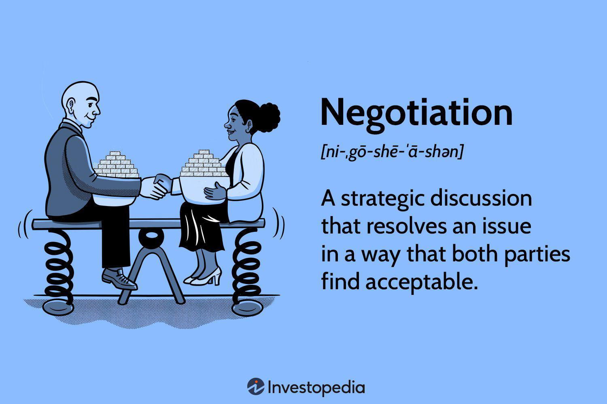

The landscape of financial markets has been significantly altered by the rise of algorithmic trading and the development of increasingly complex financial products. These advancements have not only increased the pace and efficiency of trading but have also brought forward new challenges, particularly concerning the relationships between financial advisors and traders. Disputes arising in this environment are becoming more frequent and complex, reflecting the intricate nature of the modern financial system.

Financial advisors have long played a pivotal role in guiding both individual and institutional clients through the investment process. However, as financial products grow in complexity and algorithmic trading becomes more prevalent, the potential for conflicts increases. Disagreements may occur over the quality of financial advice provided, the suitability of recommended investments, and the transparency and accuracy of communication between parties. Moreover, algorithmic trading introduces additional layers of complexity. Disputes can arise from the interpretation and execution of trading algorithms, often rooted in ambiguous contract terms or unexpected algorithmic trading outcomes.



This article examines these conflicts within financial guidance, particularly between financial advisors and algorithmic traders. Furthermore, it addresses dispute resolution mechanisms that can effectively resolve these issues. Maintaining market integrity and investor confidence is crucial; understanding these dynamics is a key part of achieving this. By exploring the roles of calculation agents, examining regulatory frameworks, and considering future trends in financial dispute resolution, this analysis offers valuable insights into managing and mitigating disputes in a rapidly evolving financial landscape.

The integration of technological advancements, such as algorithmic trading systems, requires an evolution in how disputes are resolved. Calculation agents play a significant role in ensuring fair pricing and execution in derivatives markets. Proper dispute resolution mechanisms are essential to fostering stability and trust among all stakeholders involved in financial markets. As the market continues to innovate, a delicate balance between embracing new technologies and ensuring sufficient regulatory oversight will be necessary to maintain a robust and trustworthy financial environment.

## Table of Contents

## Understanding Financial Guidance Conflicts

Financial advisors hold a pivotal role in shaping the investment decisions of both individual and institutional clients, providing strategic advice aimed at maximizing returns while managing risk. However, disputes frequently emerge due to differing perceptions regarding the quality of advice provided, the suitability of recommended investments, and the transparency maintained in communication. Such disagreements can undermine the fiduciary relationship between clients and advisors. For instance, clients may feel that the advice received was biased due to undisclosed conflicts of interest or inadequately aligned with their financial goals and risk tolerance.

The advent of algorithmic trading introduces additional layers of complexity to financial guidance conflicts. Algorithmic trading utilizes pre-set algorithms to automate trading processes, which can produce unintended consequences if not properly managed. Disputes often arise from the interpretation and execution of these algorithms, particularly when they lead to unexpected trading outcomes or fail to meet performance expectations. For example, an algorithm designed to capitalize on market inefficiencies might inadvertently cause a rapid sell-off, incurring significant losses.

Contractual ambiguity is another significant [factor](/wiki/factor-investing) fueling financial guidance disputes. Terms and conditions pertaining to [algorithmic trading](/wiki/algorithmic-trading) strategies or advisory services may not always be clearly delineated, leading to differing interpretations and expectations. Clients may question whether the financial advisor's or trading system's actions breached the agreed contractual obligations, particularly if investment outcomes deviate from expectations.

To address these conflicts effectively, it is crucial for financial advisors and trading firms to maintain stringent standards of due diligence and clear communication. This involves articulating the potential risks and limitations inherent in investment strategies and algorithmic systems to clients transparently. Furthermore, establishing robust contractual agreements that clearly outline the roles, obligations, and expectations of each party can mitigate the risk of misinterpretation and foster trust.

Such diligence is essential not only for preserving client-advisor relationships but also for maintaining the overall integrity of financial markets. By ensuring that financial guidance is conducted with the utmost transparency and adherence to contractual terms, parties can prevent the erosion of trust that could otherwise undermine market stability and investor confidence.

## Dispute Resolution Mechanisms in Financial Markets

Dispute resolution in financial markets encompasses several approaches, each tailored to address specific types of conflicts that arise between parties. These mechanisms include negotiation, mediation, arbitration, and litigation. Each method offers distinct advantages and challenges, making the selection of an appropriate mechanism critical for fair and efficient resolution.

Negotiation is typically the first step in resolving financial disputes. In this process, involved parties engage in direct discussions to reach a mutually agreeable solution without external intervention. Its informal nature allows for flexibility and the possibility of creative solutions.

When negotiation fails, mediation is often considered. Mediation involves a neutral third party who facilitates communication between disputing parties, assisting them in reaching a voluntary resolution. The mediator does not impose a decision but guides the parties towards a mutually satisfactory agreement. Mediation is favored for its confidentiality and ability to preserve business relationships.

Arbitration is another prevalent mechanism, especially for disputes involving financial advisors. The Financial Industry Regulatory Authority (FINRA) arbitration provides a structured, yet less formal, forum than litigation. FINRA arbitration is particularly popular due to the expertise of arbitrators familiar with financial industry intricacies. It offers a binding decision, ensuring resolution and closure for the parties involved.

The International Swaps and Derivatives Association (ISDA) plays a pivotal role in standardizing contracts and establishing dispute resolution protocols. ISDA's framework supports consistency and predictability in derivatives markets, reducing potential conflicts stemming from ambiguous contract terms. This standardization is crucial in maintaining trust and stability across global financial markets.

Regardless of the chosen mechanism, effective dispute resolution requires efficiency, transparency, and fairness. These principles ensure that all parties have confidence in the process and its outcomes. Regulatory bodies and professional organizations are essential in maintaining these standards, providing oversight, and upholding integrity in dispute resolution.

A comprehensive understanding of these mechanisms, alongside active engagement with regulatory frameworks, equips market participants to navigate disputes effectively. By aligning with these principles, financial markets can foster a robust environment conducive to sustained growth and investor confidence.

## The Impact of Algorithmic Trading on Dispute Resolution

Algorithmic trading has transformed financial markets by automating the buying and selling process based on predefined criteria. This automation, while improving efficiency and [liquidity](/wiki/liquidity-risk-premium), introduces complexities in dispute resolution due to errors, market manipulation, and system failures. Potential errors can arise from bugs in the trading algorithms or unexpected market conditions that the algorithm cannot appropriately handle. System failures, such as connectivity issues or hardware malfunctions, can also lead to disputes over execution times and prices.

Market manipulation is another significant concern associated with algorithmic trading. Algorithms can be exploited to engage in manipulative practices like spoofing—placing large orders with no intent to execute—or layering, which disrupts normal market operations. Such practices can lead to disputes over unfair trading advantages and harm market integrity.

High-frequency trading ([HFT](/wiki/high-frequency-trading-strategies)), a subset of algorithmic trading, operates at microsecond speeds and can exacerbate these issues. HFT strategies can amplify market movements and introduce short-term [volatility](/wiki/volatility-trading-strategies), escalating potential conflicts as trades are executed at rapid speeds with potentially differing valuations. This speed and [volume](/wiki/volume-trading-strategy) of HFT transactions increase the likelihood of errors and disputes over the accuracy and fairness of trade executions.

Combining algorithmic trading with calculation [agents](/wiki/agents), which determine the value of complex financial instruments, adds another layer of complexity to dispute resolution. Disputes may arise from differing valuations made by calculation agents due to varying inputs, models, or assumptions. This necessitates advanced computational techniques to ensure that valuations are consistent with market standards and transparent to all parties involved. 

Python and other programming languages can be employed to create validation and reconciliation scripts to address discrepancies in valuations. For example, a simple Python script can be used to compare valuation models:

```python
def compare_valuations(model_a, model_b, inputs):
    valuation_a = model_a.predict(inputs)
    valuation_b = model_b.predict(inputs)
    if abs(valuation_a - valuation_b) > threshold:
        raise ValueError("Valuation discrepancy detected")
    return (valuation_a + valuation_b) / 2
```

Advanced computational techniques, including [machine learning](/wiki/machine-learning) and data analytics, are crucial in automating the identification and resolution of disputes arising from algorithmic trading. These technologies can analyze large datasets to detect patterns indicating potential errors or manipulative behavior, leading to more effective dispute resolution.

In conclusion, while algorithmic trading brings challenges to dispute resolution in financial markets, employing advanced technological solutions can mitigate these issues and enhance market integrity.

## Future Trends in Financial Dispute Resolution

Artificial intelligence (AI) and machine learning (ML) are set to revolutionize dispute resolution in financial services. These technologies can enhance the accuracy of valuations and provide predictive insights, which in turn can help minimize disputes that commonly arise due to algorithmic trading. For instance, AI algorithms can analyze vast amounts of historical and real-time data to provide more precise valuations of complex financial products, thus reducing the likelihood of contention.

AI can also assist in identifying potential disputes before they escalate. By employing machine learning models, financial institutions can automate the monitoring of trading activities, thus spotting patterns indicative of market manipulation or system failures. This proactive approach could significantly curtail the number of conflicts that reach formal dispute resolution processes.

However, the implementation of AI-driven mechanisms requires adaptation by regulatory bodies. It is imperative for these organizations to evolve and incorporate sophisticated tools to adequately monitor and control AI-enabled trading systems. Effective supervision will ensure that AI is leveraged responsibly, safeguarding market integrity.

Transparency and accountability need to be reinforced within future regulatory frameworks. This entails robust auditing mechanisms capable of tracing AI decision-making processes and outcomes. Stress-testing AI models against various market scenarios can also ensure reliability and robustness, which are critical for maintaining investor confidence.

Innovations such as smart contracts and blockchain technology present further opportunities for streamlining financial dispute resolution. Smart contracts can automate the resolution and enforcement of contractual terms, thereby expediting settlement processes and reducing human error. Blockchain technology, with its immutable and transparent ledger, can provide a reliable record, strengthening trust between parties by ensuring that all actions are verifiable and tamper-proof.

As technology continues to evolve, the integration of AI and blockchain into financial services will be pivotal in shaping the future landscape of dispute resolution. These tools offer the potential not only to resolve conflicts more efficiently but also to prevent them from arising, ensuring a more stable financial environment.

## Conclusion

Financial disputes are an inherent aspect of modern markets, which have grown increasingly complex due to innovative developments like algorithmic trading and intricate financial products. These disputes, while unavoidable, require effective management to ensure market stability and maintain trust among stakeholders. Effective dispute resolution is vital for safeguarding a stable, trusted financial environment, where all parties can operate with confidence.

The role of calculation agents and algorithmic trading systems is crucial for ensuring fair pricing and execution in derivatives markets. Calculation agents, for example, are responsible for determining the values of financial contracts at various points in time. They provide the necessary transparency and consistency that underpin the trust in market transactions. Algorithmic trading systems, on the other hand, facilitate the automatic execution of trades based on pre-defined criteria, contributing significantly to market liquidity and efficiency.

Looking ahead, the integration of novel technologies and the evolution of regulatory frameworks will significantly influence the future of dispute resolution in financial markets. Technologies such as [artificial intelligence](/wiki/ai-artificial-intelligence) (AI), machine learning, and blockchain have the potential to transform how disputes are identified and resolved. AI can enhance the accuracy of valuations and offer predictive analytics that reduce the likelihood of disputes arising. Blockchain technology, with its transparent and immutable ledger capabilities, could automate and enforce outcomes efficiently through smart contracts. These advancements will require regulatory bodies to adapt, implementing measures that assure comprehensive oversight and control of these technologies.

As financial markets continue to evolve, striking a balance between innovation and regulatory oversight will be crucial. This balance is essential to ensure that technological advancements do not outpace the ability of regulatory entities to monitor and mitigate potential risks. The successful harmonization of these elements will lead to a more reliable financial ecosystem, prepared to handle the complexities of future market developments while maintaining investor confidence and integrity.

## References & Further Reading

[1]: Bergstra, J., Bardenet, R., Bengio, Y., & Kégl, B. ("Algorithms for Hyper-Parameter Optimization.")[https://papers.nips.cc/paper_files/paper/2011/hash/86e8f7ab32cfd12577bc2619bc635690-Abstract.html] Advances in Neural Information Processing Systems 24.

[2]: ["Advances in Financial Machine Learning"](https://www.amazon.com/Advances-Financial-Machine-Learning-Marcos/dp/1119482089) by Marcos Lopez de Prado

[3]: ["Evidence-Based Technical Analysis: Applying the Scientific Method and Statistical Inference to Trading Signals"](https://books.google.com/books/about/Evidence_Based_Technical_Analysis.html?id=MeoJAQAAMAAJ) by David Aronson

[4]: ["Machine Learning for Algorithmic Trading"](https://github.com/stefan-jansen/machine-learning-for-trading) by Stefan Jansen

[5]: ["Quantitative Trading: How to Build Your Own Algorithmic Trading Business"](https://www.amazon.com/Quantitative-Trading-Build-Algorithmic-Business/dp/1119800064) by Ernest P. Chan