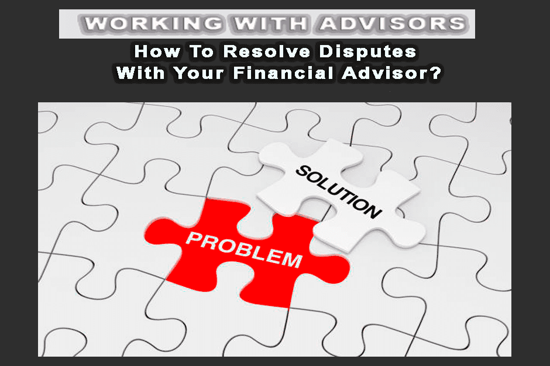

## Table of Contents

## What is dispute resolution in the context of financial advisors?

Dispute resolution in the context of financial advisors refers to the process of solving disagreements between a financial advisor and their client. These disagreements can be about many things, like investment choices, fees, or how the advisor managed the client's money. When a dispute happens, it's important to have a fair way to sort it out so both the advisor and the client feel heard and treated justly.

There are different ways to resolve disputes. One common method is mediation, where a neutral third person helps the advisor and client talk through their issues and come to an agreement. Another method is arbitration, which is more formal and where an arbitrator listens to both sides and makes a decision. Sometimes, if the dispute is very serious, it might go to court, but this is usually a last resort because it can be expensive and take a long time. The goal of dispute resolution is to find a solution that works for everyone involved.

## What are common causes of disputes between clients and financial advisors?

Disputes between clients and financial advisors often happen because of misunderstandings about investment performance. Clients might expect their investments to grow quickly and be unhappy if they don't see big returns right away. Sometimes, the advisor might have promised certain results that didn't happen, leading to disappointment and arguments. Also, if the advisor doesn't explain the risks well, clients can feel misled when things don't go as planned.

Another common cause of disputes is disagreements about fees. Clients might feel that the fees charged by the advisor are too high or that they're not getting enough value for what they're paying. If the advisor doesn't clearly explain how fees are calculated and what services are included, it can lead to frustration and disputes. Sometimes, clients might even think they're being overcharged on purpose, which can make the situation worse.

Lastly, communication problems can also lead to disputes. If the advisor doesn't keep the client updated regularly or fails to respond to their questions and concerns, trust can break down. Clients might feel ignored or that their needs aren't being taken seriously. Good communication is key to keeping a strong relationship between the client and the advisor, and when it's missing, disputes are more likely to happen.

## How can disputes with financial advisors be prevented?

Disputes with financial advisors can often be prevented by making sure both the client and the advisor understand what they're getting into from the start. This means having clear talks about what the client wants to achieve with their money, how much risk they're okay with, and what kind of returns they can expect. The advisor should explain everything in a way that's easy to understand, without using too much complicated financial talk. They should also be upfront about their fees and how they get paid, so the client knows exactly what they're paying for. If everyone is on the same page from the beginning, it helps prevent misunderstandings later on.

Another important way to prevent disputes is by keeping good communication going all the time. The advisor should check in with the client regularly to talk about how their investments are doing and if anything needs to change. They should also be quick to answer any questions or worries the client has. If the client feels like they're being kept in the loop and their concerns are being listened to, they're more likely to trust their advisor. Plus, if something goes wrong or doesn't go as planned, it's easier to talk it through and fix it before it turns into a big dispute.

## What are the initial steps to take when a dispute arises with a financial advisor?

When you first notice a problem with your financial advisor, it's a good idea to talk to them directly. You can set up a meeting or a call to discuss what's bothering you. Be honest about what you're unhappy about, whether it's how your investments are doing, the fees you're paying, or something else. It's important to listen to what your advisor has to say too. They might have a good reason for what happened or be able to fix the issue quickly. This first talk can often clear up misunderstandings and solve the problem before it gets worse.

If talking it out doesn't help, the next step is to look at any agreement or contract you have with your advisor. These documents usually explain how disputes should be handled, like through mediation or arbitration. If you're not sure what to do, you can also reach out to a financial ombudsman or a professional body that oversees financial advisors. They can give you advice on your rights and what steps to take next. The key is to stay calm and keep trying to find a solution that works for everyone.

## What are the different methods of dispute resolution available for financial advisor conflicts?

When you have a problem with your financial advisor, one way to solve it is through mediation. In mediation, a neutral person called a mediator helps you and your advisor talk things out. The mediator doesn't take sides but helps you both understand each other better. The goal is to reach an agreement that you both feel good about. Mediation is often faster and less expensive than going to court, and it can help keep your relationship with your advisor friendly.

Another way to handle disputes is through arbitration. In arbitration, a person called an arbitrator listens to both you and your advisor and then makes a decision about the problem. It's more formal than mediation but still usually quicker and cheaper than going to court. The arbitrator's decision is usually final, so it's important to be ready for that. Arbitration can be a good choice if you can't agree on a solution through talking or mediation.

If mediation and arbitration don't work, you might have to go to court. Going to court is more serious and can take a long time and cost a lot of money. It's usually the last step when other ways to solve the problem have failed. In court, a judge will listen to both sides and make a decision. This can be stressful, but it's there to make sure you get a fair outcome if nothing else works.

## How does mediation work in resolving disputes with financial advisors?

Mediation is a way to solve problems with your financial advisor by talking things out with the help of a neutral person called a mediator. The mediator doesn't take sides but helps both you and your advisor understand each other better. You'll sit down together and explain what's bothering you, whether it's about how your investments are doing, the fees you're paying, or something else. The mediator will ask questions and guide the conversation to make sure everyone gets a chance to speak and be heard. The goal is to find a solution that you both feel good about, without anyone feeling like they lost.

During the mediation, you and your advisor might come up with different ideas to fix the problem. The mediator will help you look at these ideas and see which ones could work for both of you. Sometimes, you might need to meet more than once to work things out. If you do reach an agreement, it will be written down so everyone knows what was decided. Mediation is often faster and less expensive than going to court, and it can help keep your relationship with your advisor friendly. If you can't agree, you might need to try another way to solve the problem, like arbitration or going to court.

## What role does arbitration play in disputes with financial advisors, and how is it different from mediation?

Arbitration is another way to solve problems with your financial advisor when talking it out doesn't work. In arbitration, a neutral person called an arbitrator listens to both you and your advisor and then makes a decision about the problem. This decision is usually final, so it's important to be ready for that. Arbitration is more formal than mediation but still usually quicker and cheaper than going to court. It can be a good choice if you can't agree on a solution through talking or mediation.

The main difference between arbitration and mediation is how the solution is reached. In mediation, the mediator helps you and your advisor talk and come up with your own agreement. The mediator doesn't decide for you; they just help you find a way to agree. In arbitration, the arbitrator listens to both sides and then makes the decision for you. This means you don't have as much control over the outcome as you do in mediation, but it can be helpful when you can't agree on your own. Both methods are ways to avoid going to court, but they work differently to solve the problem.

## Can disputes with financial advisors be resolved through litigation, and what are the pros and cons of this approach?

Yes, disputes with financial advisors can be resolved through litigation, which means going to court. If you and your advisor can't solve your problem through talking, mediation, or arbitration, you might need to take the issue to a judge. In court, both sides will present their case, and the judge will make a decision. This can be a good option if you feel like you've tried everything else and still can't agree. The court's decision is final and legally binding, which means everyone has to follow it.

There are some pros and cons to using litigation to solve disputes with your financial advisor. On the positive side, going to court can give you a clear and final answer to your problem. It can also be helpful if you think the advisor did something very wrong, like breaking the law. But there are downsides too. Litigation can take a long time and cost a lot of money. It can also be stressful and might damage your relationship with your advisor. Plus, you don't have as much control over the outcome as you do with mediation or arbitration, where you can work together to find a solution that works for both of you.

## What regulatory bodies oversee disputes with financial advisors, and how can they assist in resolution?

Regulatory bodies like the Financial Industry Regulatory Authority (FINRA) and the Securities and Exchange Commission (SEC) oversee disputes with financial advisors. These organizations make sure that financial advisors follow the rules and treat their clients fairly. If you have a problem with your advisor, you can file a complaint with these bodies. They will look into your complaint and might be able to help you solve the problem. They can also take action against the advisor if they find they did something wrong.

These regulatory bodies can help in different ways. For example, FINRA has a mediation and arbitration program that you can use to solve disputes without going to court. They can assign a mediator or arbitrator to help you and your advisor talk things out and reach an agreement. The SEC can also investigate complaints and take legal action if they find that the advisor broke the law. Both organizations provide guidance and support to help you understand your rights and what steps to take next.

## How should one prepare for a dispute resolution process with a financial advisor?

When you're getting ready for a dispute resolution process with your financial advisor, start by gathering all the important documents. This includes any agreements or contracts you signed, statements of your investments, and any emails or messages between you and your advisor. These papers can help show what happened and why you're not happy. It's also a good idea to write down exactly what your problem is and what you want to happen. Being clear about what you want can help you explain it better during the dispute resolution.

Next, think about how you want to solve the problem. You might want to talk to your advisor first to see if you can work things out on your own. If that doesn't work, you can try mediation, where a neutral person helps you both talk things out. If you still can't agree, arbitration might be the next step, where someone else makes the decision for you. Knowing which method you want to use can help you prepare better. Also, consider talking to a lawyer or a financial ombudsman who can give you advice on your rights and how to move forward.

## What are some advanced strategies for negotiating a settlement with a financial advisor?

When you're trying to negotiate a settlement with your financial advisor, one advanced strategy is to use data to back up your case. Collect all the numbers and facts that show why you're not happy. For example, if you're upset about how your investments are doing, show charts and graphs that prove your point. This can make your argument stronger and help the advisor see your side. Also, think about what you're willing to accept as a solution. If you know what you want, you can be clear about it during the talks. This helps keep the conversation focused and makes it easier to reach an agreement.

Another smart move is to use a professional to help you. A lawyer who knows about financial disputes can give you good advice and help you understand your rights. They can also speak for you during the talks, which can be helpful if things get tricky. Sometimes, bringing in a neutral third person, like a mediator, can make a big difference. They can help keep the conversation calm and guide both you and your advisor toward a solution. By using these advanced strategies, you can have a better chance of getting a fair settlement.

## How can one assess the effectiveness of a dispute resolution outcome with a financial advisor?

To assess the effectiveness of a dispute resolution outcome with a financial advisor, you should first look at whether the problem you had is now solved. If you were unhappy about how your investments were doing, check if the new agreement has fixed that issue. If you were worried about fees, see if the fees are now fair and clear. A good outcome should make you feel like your concerns were heard and dealt with properly. It should also leave you feeling more confident about your relationship with your advisor.

Another way to judge the effectiveness is by looking at how the resolution process went. Did it take too long, or was it quick and easy? Was it too expensive, or was it a good use of your money? Also, think about how you felt during the process. Did you feel respected and listened to, or did it make you more upset? A successful dispute resolution should not only solve the problem but also make you feel better about how things were handled. If the outcome meets these standards, it's a sign that the dispute resolution was effective.

## References & Further Reading

[1]: Bergstra, J., Bardenet, R., Bengio, Y., & Kégl, B. ("Algorithms for Hyper-Parameter Optimization.")[https://papers.nips.cc/paper_files/paper/2011/hash/86e8f7ab32cfd12577bc2619bc635690-Abstract.html] Advances in Neural Information Processing Systems 24.

[2]: ["Advances in Financial Machine Learning"](https://www.amazon.com/Advances-Financial-Machine-Learning-Marcos/dp/1119482089) by Marcos Lopez de Prado

[3]: ["Evidence-Based Technical Analysis: Applying the Scientific Method and Statistical Inference to Trading Signals"](https://books.google.com/books/about/Evidence_Based_Technical_Analysis.html?id=MeoJAQAAMAAJ) by David Aronson

[4]: ["Machine Learning for Algorithmic Trading"](https://github.com/stefan-jansen/machine-learning-for-trading) by Stefan Jansen

[5]: ["Quantitative Trading: How to Build Your Own Algorithmic Trading Business"](https://www.amazon.com/Quantitative-Trading-Build-Algorithmic-Business/dp/1119800064) by Ernest P. Chan